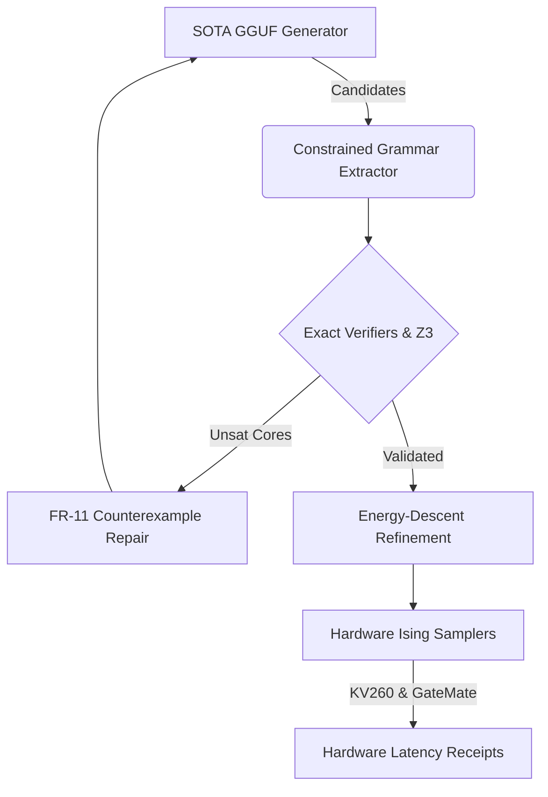

# Milestone 2026.05.310: Hardware Execution Receipts, Energy-Descent Refinement, and Deep FR-11

## 1. What Previous Milestones Proved

Milestone `.309` successfully delivered the foundational prerequisites that had blocked progress for weeks. Most importantly, it produced clean runtime receipts for local SOTA GGUF inference and enabled live model panels. It also completed the baseline diversity remediation for verifiers, established a constrained structured-output extractor, proved FR-11 nonforgetting with holdouts, and validated hardware smoke tests (KV260 MMD vs CPU and GateMate bitstream detection).

## 2. The Big Gaps

With the GGUF SOTA runtime finally unblocked, the remaining gaps between the current state and the PRD vision are:
1. **Hardware Continuity & Latency Receipts**: We have bitstreams and detected boards, but no measured per-sample latency or speedup over CPU for KV260 and GateMate on actual Ising workloads. We must record real hardware execution traces.
2. **Phase-3 Energy-Descent**: We have baseline energy-descent vs autoregressive panels, but we need to prove that verifier-guided energy-descent and structured constrained generation (like BEAVER/XGrammar) actually beat AR test-time scaling on hard verification tasks.
3. **Deep Continuous Learning (FR-11)**: FR-11 demonstrated nonforgetting, but it needs to move from simple environment-memory to persistent belief states (LogicVault-style) and counterexample-guided repair (TraceFix-style) across multiple sessions.

## 3. Architecture

## 4. Phases

### Phase 1: Hardware Execution Receipts
Convert the `.309` hardware smoke tests into actual hardware execution measurements. Read from `/dev/uio*` on the KV260 and use `dirtyJtag` on the GateMate to benchmark latency and compare against the CPU sequential Gibbs baseline.

### Phase 2: Verifier-Guided Generation & Energy-Descent
Deploy deterministic prefix-closed bounds (inspired by BEAVER) and grammar-masked constrained generation to guide the live SOTA models. Measure the exact energy-descent yield over standard autoregressive decoding.

### Phase 3: FR-11 Formal Feedback & Continuous Learning
Implement counterexample-guided repair ladders and persistent symbolic belief states to ensure that multi-turn FR-11 constraint learning repairs contradictions without introducing satisfiable drift.

### Phase 4: Capstone & Governance
Collate hardware latency logs, energy-descent vs AR deltas, and FR-11 retention metrics into a verifiable capstone.

## 5. Hardware Requirements
- **Local:** Dual RTX 3090s for SOTA GGUF generation.
- **KV260:** Reachable via `ssh kria`, `/dev/uio0` exposed.
- **GateMate A1-EVB-2M:** USB-attached, `dirtyJtag` enumerated.
