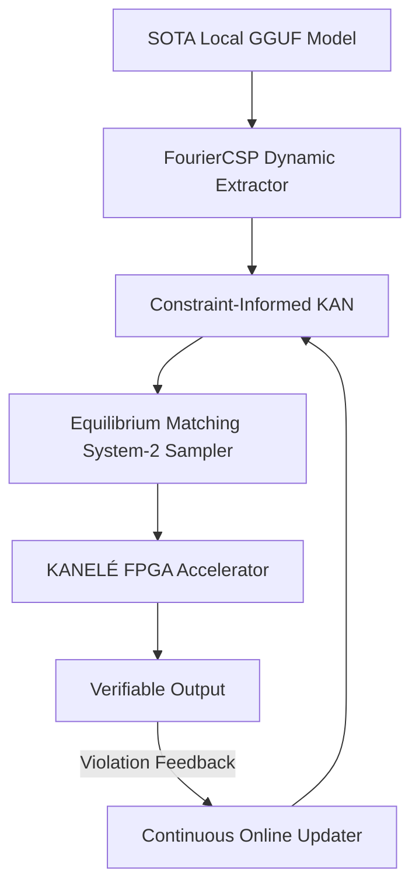

# Milestone 2026.05.133: Continuous Self-Learning, System-2 Equilibrium Matching, and KAN Hardware Acceleration

**Target Date:** 2026-05-18
**Status:** DRAFT

## 1. Context & Motivation

The previous milestone (2026.05.132) successfully integrated Dynamic Constraint Elicitation (Dynamic Eidoku) and the Energy-Guided Decoder, validating the software loop for constraint extraction and application. However, we identified three major gaps remaining between the current state and the ultimate Carnot PRD vision:
1. **Continuous Self-Learning:** Constraint violations are currently logged but not used for online fine-tuning of the models in real-time.
2. **Hardware Acceleration Scalability:** Our FPGA bring-up is promising, but large-scale verification requires adapting Kolmogorov-Arnold Networks for LUT-based hardware (KANELÉ).
3. **Deep System-2 Reasoning:** While the energy-guided decoder is functional, integrating Energy-Based Transformers (EBTs) and Equilibrium Matching (EqM) will natively support iterative, gradient-driven System-2 reasoning.

This milestone integrates recent 2025/2026 ArXiv findings (CIKAN, KANELÉ, FourierCSP, EqM) to close these gaps.

## 2. Architecture Impact

## 3. Phases & Experiments

### Phase 1: Continuous Self-Learning & FourierCSP Foundation
- **Exp 1722:** FourierCSP Extractor Prototype
- **Exp 1723:** Constraint-Informed KAN (CIKAN) Initialization
- **Exp 1724:** Continuous Online Updater Prototype
- **Exp 1725:** E2E FourierCSP + CIKAN with Feedback

### Phase 2: System-2 Sampling via Equilibrium Matching (EqM)
- **Exp 1726:** Energy-Based Transformer (EBT) Bridge
- **Exp 1727:** Equilibrium Matching (EqM) Gradient Sampler
- **Exp 1728:** System-2 Reasoning Benchmark (GSM8k & MATH)

### Phase 3: Hardware Acceleration (KANELÉ)
- **Exp 1729:** KANELÉ LUT-based Synthesis Pipeline
- **Exp 1730:** FPGA Deployment of CIKAN Verification
- **Exp 1731:** Hardware vs CPU Latency Audit

### Phase 4: Integration and Consolidation
- **Exp 1732:** Unified Self-Learning + Hardware Pipeline
- **Exp 1733:** DualGPU Live Run with SOTA Models
- **Exp 1734:** Milestone .133 Retrospective

## 4. Hardware Requirements
- Dual RTX 3090 CUDA local SOTA runtime
- Kria KV260 FPGA (for KANELÉ synthesis and deployment)

## 5. Required SOTA Models
Each experiment requiring an LLM will use at least one of:
- `unsloth/Qwen3.6-35B-A3B-GGUF`
- `unsloth/gemma-4-31B-it-GGUF`
- `unsloth/gemma-4-26B-A4B-it-GGUF`
