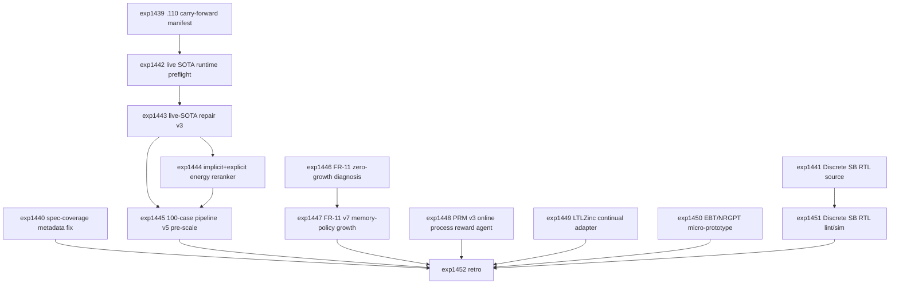

# Research Roadmap vNEXT: Milestone 2026.04.111

Planned: 2026-05-06
Status: Draft for conductor execution
Predecessor: 2026.04.110 repair v2 prototype + DVI nonforgetting + PRM v2 label completion + anchored latent repair + blocked Discrete SB RTL lint/sim
Roadmap YAML: `research-roadmap-next.yaml`

## ID Allocation Note

Milestone `.110` used `exp1425` through `exp1438`. The next 14 conductor tasks
are `exp1439` through `exp1452`.

## What Milestone .110 Proved

| Track | Evidence | Finding |
|---|---|---|
| Carry-forward discipline | `exp1425` | Mapped 6 `.109` carry-forwards and forbade an exact `exp1419` rerun without nonzero repair evidence. |
| Test debt | `exp1426` | Python collection is clean, but 71 spec-coverage traceability misses remain; next cluster is `spec_coverage_traceability_metadata`. |
| Repair rejection root cause | `exp1427` | Dominant zero-repair cause was missing output or non-JSON response; repair v2 contract is schema-first with per-candidate rejection reasons. |
| DCCD repair v2 | `exp1428` | Nonzero repairs achieved: 20 accepted, `repaired_case_success_rate=1.0`, `schema_valid_rate=1.0`, but runtime mode was prototype-injected and `live_sota_model_inference_used=false`. |
| MCMC constrained repair search | `exp1429` | Best-of-N search beat one-candidate repair (`repair_success_rate_best_of_n=1.0`, `mcmc_acceptance_rate=0.5`), but live SOTA inference did not run. |
| PRM repair selector | `exp1430` | Selector is ready and non-degrading, but `selection_improvement_pp=0.0`; raw best-of-N was already 1.0 on the prototype pool. |
| Pipeline v4 micro validation | `exp1431` | 50-case pass rate improved from 0.305 to 0.62, with `semantic_validation_pass_rate=1.0`, but `runtime_evidence_allows_headline_scaleup=false`. |
| DVI v3 nonforgetting | `exp1432` | DVI v3 deployed with `dvi_v3_auroc_delta=0.011842` and `nonforgetting_rate=1.0`. |
| FR-11 self-learning v6 | `exp1433` | DVI v3 was active, but FR-11 promoted zero new cases and stayed non-headline (`self_learning_delta_overall=0`). |
| PRM label completion | `exp1434` | Filled all 478 missing local labels, trained PRM v2 on 1508 traces, and reached `prmv2_auroc=0.851789`. |
| DPO provenance | `exp1435` | DPO must remain reranker-only until direct local adapter or conversion tooling exists. |
| Anchored latent repair | `exp1436` | Anchored dual-path repair is viable at smoke-test scale: energy decreased without accuracy loss. |
| Discrete SB RTL lint/sim | `exp1437` | Blocked because `hardware/kv260/discrete_sb_256.v` does not exist. No hardware claim allowed. |
| Retro | `exp1438` | `.110` met 12 of 14 criteria. Carry-forward priorities are live-SOTA repair scale-up, FR-11 positive growth, spec-coverage metadata, DPO provenance, and Discrete SB RTL source. |

**Critical insight from `.110`:** repair is no longer a pure algorithmic
dead-end. The schema-first and constrained-search path works in prototype form.
The credibility gap is now runtime provenance: the next milestone must prove the
same path with live mandated local SOTA GGUF inference before scaling or making
headline claims.

## Research Signals Added Before Planning

The post-.110 sweep updated `research-references.md` before this roadmap was
finalized. The near-term signals are:

- EBT / NRGPT: explicit energy-based language reasoning is now an ICLR 2026
  line of work. Carnot should run a tiny local energy-convergence baseline
  before claiming Phase-3 direction.
- ARM-as-EBM (`arXiv:2512.15605`): local autoregressive log probabilities can be
  treated as implicit sequence energy, useful for repair candidate reranking.
- ETS (`arXiv:2601.21484`): training-free energy-guided test-time scaling
  supports using verifier energy for repair selection before fine-tuning.
- SEM-CTRL, type-constrained decoding, and DCCD: semantic/type constraints
  should be added to live-SOTA repair v3 rather than only JSON schema checks.
- BEAVER: live repair scale-up artifacts should report a false-acceptance bound
  or an exact blocker.
- LTLZinc and agentic memory work (ALMA, Panini, BEHEMOTH): FR-11 zero growth
  needs a changed candidate/memory policy, not an exact rerun.
- Extropic XTR-0/Z1 and `thrml`: hardware strategy is current, but the local
  blocker is still missing KV260 Discrete SB RTL source.
- Kona 1.0 public architecture: partial/full trace energy and failure
  localization are the product-level comparison point Carnot should converge
  toward with local-first components.

## Three Biggest Gaps

1. **Repair v2 lacks live-SOTA provenance.** `.110` proved constrained repair
   can accept candidates, but the result is prototype-bound. `.111` must run
   the same repair path with mandated local GGUF models, record cache/runtime
   blockers honestly, and only then attempt a 100-case scale run.

2. **FR-11 deployed DVI but learned nothing new.** DVI v3 is now deployable and
   nonforgetting, but the self-learning loop promoted zero new cases. The next
   experiment must diagnose promotion policy, memory update policy, and
   candidate-source scarcity before rerunning FR-11.

3. **Hardware path is blocked before lint.** Discrete SB has a plausible KV260
   spec but no RTL source file. The next milestone must create
   `hardware/kv260/discrete_sb_256.v` and a testbench before rerunning lint or
   simulation.

## Architecture (4 Phases)

```
.111 Milestone Architecture
========================================================================

Phase 0 - Carry-Forward and Preflight Repair (unconditional)
  exp1439: .110 carry-forward activation manifest ---------------------.
  exp1440: Spec-coverage traceability metadata cluster fix ------------+--> Phase 1/2/3 inputs
  exp1441: Discrete SB RTL source implementation ----------------------'

Phase 1 - Live-SOTA Repair Provenance and Scale
  exp1442: Live local SOTA repair runtime preflight -------------------.
  exp1443: Live-SOTA DCCD/SEM-CTRL repair v3 (gated) ------------------+
  exp1444: ARM implicit energy + Carnot energy reranker (gated) -------+--> exp1445
  exp1445: Full pipeline v5 100-case pre-scale (gated) ----------------'

Phase 2 - Continuous Self-Learning and Process Supervision
  exp1446: FR-11 zero-growth root-cause diagnosis ---------------------.
  exp1447: FR-11 v7 memory-policy growth experiment (gated, SOTA) -----'
  exp1448: PRM v3 online process-reward repair agent ------------------.
  exp1449: LTLZinc temporal continual-learning adapter ----------------'

Phase 3 - Phase-3 Baseline, Hardware Evidence, Retro
  exp1450: EBT/NRGPT local micro-prototype audit ----------------------.
  exp1451: Discrete SB RTL lint/simulation rerun (gated) --------------+
  exp1452: Milestone .111 retrospective -------------------------------'
```

## Phase Descriptions

**Phase 0 - carry-forward and preflight repair.** `exp1439` turns the `.110`
retro into an activation manifest with same-verdict retirement rules. `exp1440`
fixes the named spec-coverage traceability metadata cluster instead of reopening
the already-fixed embedding-store tests. `exp1441` implements the missing
Discrete SB RTL source and testbench from the `.109/.110` specs, because
`exp1437` proved lint/sim cannot run without source.

**Phase 1 - live-SOTA repair provenance and scale.** `exp1442` is a runtime
preflight for the mandated local SOTA GGUF models and emits a terminal blocker
if the host cannot perform live inference. `exp1443` runs repair v3 with live
SOTA inference plus DCCD, semantic constraints, and type/schema checks.
`exp1444` ranks repair candidates using both implicit ARM energy and Carnot's
explicit verifier energy. `exp1445` performs a 100-case pre-scale only after
nonzero live repair and reranker readiness exist.

**Phase 2 - continuous self-learning and process supervision.** `exp1446`
diagnoses why DVI v3 produced zero FR-11 growth. `exp1447` is the mandatory
continuous self-learning experiment: it changes promotion thresholds, candidate
generation, and memory policy before rerunning FR-11. `exp1448` upgrades the
non-improving PRM selector into an online process-reward agent using PRM v2
labels. `exp1449` creates a small LTLZinc-style temporal continual-learning
adapter so FR-11 has a durable constraint-growth benchmark.

**Phase 3 - Phase-3 baseline, hardware evidence, and retro.** `exp1450` tests a
tiny EBT/NRGPT-style energy-convergence baseline against Carnot traces, guarding
Phase-3 claims with empirical evidence. `exp1451` reruns Discrete SB lint/sim
only after `exp1441` creates source. `exp1452` closes the milestone and records
carry-forward rules.

## Dependency Graph



Structured conductor gates:

- `exp1443` requires `exp1442.local_sota_runtime_ready == true`.
- `exp1444` requires `exp1443.live_repair_candidate_pool_ready == true`.
- `exp1445` requires `exp1443.live_repair_success_rate > 0.0` and
  `exp1444.energy_reranker_ready == true`.
- `exp1447` requires `exp1446.fr11_zero_growth_root_cause_identified == true`.
- `exp1451` requires `exp1441.rtl_source_created == true`.

## Hardware Requirements

| Task | Hardware | Notes |
|---|---|---|
| `exp1439`, `exp1440`, `exp1446`, `exp1448`, `exp1449`, `exp1450`, `exp1452` | CPU | Diagnostics, metadata fixes, small PRM/self-learning/latent probes. |
| `exp1441`, `exp1451` | CPU plus optional FPGA tooling | Verilog/RTL work may use yosys, verilator, iverilog, or Vivado if present. No board claim unless actual KV260 commands run. |
| `exp1442`, `exp1443`, `exp1444`, `exp1445`, `exp1447` | Dual RTX 3090 preferred | LLM-bearing tasks must include mandated local SOTA GGUF `MODEL_SPECS`; legacy small models are smoke tests only. |

Mandated local SOTA GGUF models for every LLM-bearing experiment:

- `unsloth/Qwen3.6-35B-A3B-GGUF`
- `unsloth/gemma-4-31B-it-GGUF`
- `unsloth/gemma-4-26B-A4B-it-GGUF`

Legacy small models such as Qwen3.5-0.8B or gemma-4-E4B-it may be used only as
fast CPU smoke tests. They must not be reported as headline models.

## Success Criteria

| Criterion | Target |
|---|---|
| Carry-forward manifest | `exp1439.carryforward_manifest_complete=true` and `.110` carry-forwards have addressed-by tasks. |
| Spec coverage cluster | `exp1440.spec_coverage_metadata_cluster_fixed=true` or an exact residual blocker ledger exists. |
| Discrete SB RTL source | `exp1441.rtl_source_created=true` and `hardware/kv260/discrete_sb_256.v` plus a testbench exist. |
| Live SOTA runtime | `exp1442.local_sota_runtime_ready=true` or precise cache/GPU blockers are recorded. |
| Live repair v3 | `exp1443.live_sota_inference_used=true` and `live_repair_success_rate > 0.0`. |
| Energy reranker | `exp1444.energy_reranker_ready=true` and false-acceptance rate does not increase. |
| Pipeline pre-scale | `exp1445.full_pipeline_pass_rate > 0.62` or an honest blocker prevents scale-up. |
| FR-11 diagnosis | `exp1446.fr11_zero_growth_root_cause_identified=true`. |
| Continuous self-learning | `exp1447.self_learning_delta_overall > 0` with nonforgetting preserved, or the variant self-retires with root cause. |
| PRM process agent | `exp1448.pra_selector_ready=true` and `selection_improvement_pp > 0` or decisive no-improvement evidence. |
| LTLZinc adapter | `exp1449.ltlzinc_adapter_ready=true` and at least 20 temporal constraint cases generated. |
| EBT/NRGPT micro baseline | `exp1450.energy_convergence_probe_complete=true` with a scale/no-scale recommendation. |
| RTL lint/sim | `exp1451.rtl_lint_complete=true` or precise missing-tool blockers; `hardware_claim_allowed=false` unless hardware actually ran. |
| Retro | `exp1452.criteria_total=14` and honest carry-forward rules are recorded. |

Milestone threshold: 11 of 14 criteria met is a successful milestone. Honest
gate-blocks caused by upstream negative evidence count as scientific evidence,
not silent success.

## Prior Failure Summary

| Carry-forward | Prior evidence | `.111` response |
|---|---|---|
| Repair v2 prototype-bound | `exp1428`, `exp1429`, and `exp1431` all reported prototype/no-live-SOTA/no-headline limitations | `exp1442` runtime preflight, `exp1443` live-SOTA repair v3, `exp1444` energy reranker, `exp1445` 100-case pre-scale. |
| PRM selector no improvement | `exp1430.selection_improvement_pp=0.0` | `exp1448` uses PRM v2 labels and online PRA-style stepwise scoring; exact PRM v1 selector rerun is retired. |
| FR-11 zero growth | `exp1433.self_learning_delta_overall=0` with DVI active | `exp1446` diagnoses root cause; `exp1447` changes promotion/memory policy before rerun and self-retires if same verdict. |
| Spec coverage metadata debt | `exp1426.spec_coverage_debt_count=71` | `exp1440` fixes the named metadata cluster first. |
| DPO headline unsupported | `exp1435.direct_gguf_finetune_supported=false` | No DPO headline training task in `.111`; keep reranker-only unless tooling changes. |
| Missing Discrete SB RTL source | `exp1437.blocked_missing_discrete_sb_rtl_source` | `exp1441` creates source; `exp1451` reruns lint/sim only if source exists. |
| Phase-3 energy claims need baseline | `exp1436` is positive but smoke-scale only | `exp1450` adds EBT/NRGPT local micro-baseline before scale-up. |

## Decentralization Implications

`.111` preserves Carnot's local-first mandate. Live repair tasks use mandated
local GGUF models and record cache/runtime blockers instead of depending on
closed hosted APIs. DPO remains explicitly non-headline until local adapter or
conversion tooling exists. Hardware work advances a portable KV260 path while
refusing hardware claims without real board execution. External papers, Kona,
OpenReview, HuggingFace, and Extropic sources inform experiment design only;
they do not become runtime dependencies in the core verifier.

## Codex Default Audit

All `.111` tasks route to `agent_type: codex`, `model: gpt-5.5` in
`research-roadmap-next.yaml`. No task is marked `requires_claude: true`.
Formulaic code tasks such as spec metadata repair and Verilog/RTL source work
are intentionally routed to Codex. LLM-bearing prompts include mandated SOTA
GGUF model specs and require the `cached_sota_pair()` pattern where applicable.
