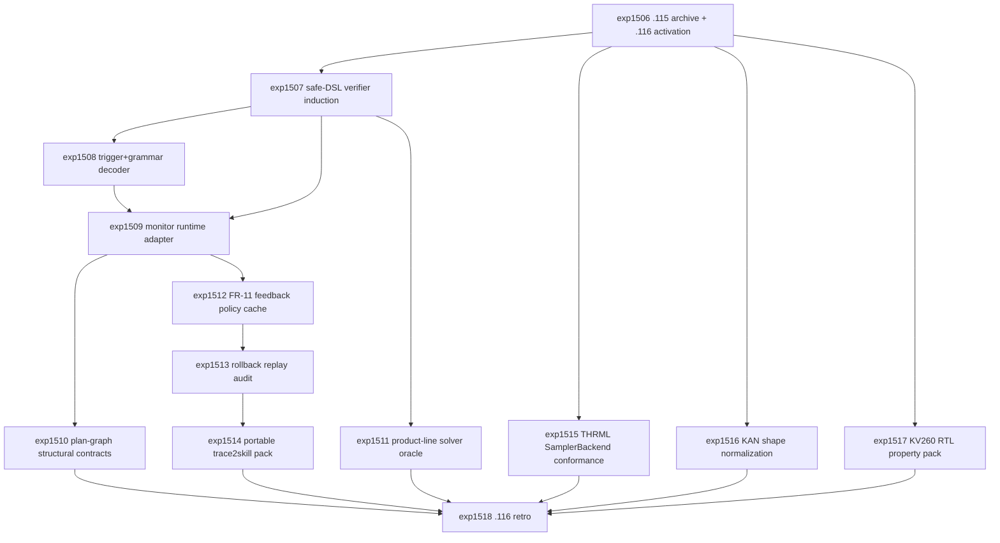

# Research Roadmap vNEXT: Milestone 2026.04.116

**Planned:** 2026-05-07
**Status:** Ready for conductor activation
**Predecessor:** Milestone 2026.04.115 completed 2026-05-07
**Roadmap YAML:** `research-roadmap-next.yaml`

## ID Allocation Note

Milestone `.115` used `exp1492` through `exp1505`. Milestone `.116`
therefore allocates `exp1506` through `exp1518`. The active execution file
`research-roadmap.yaml` is not modified by this plan.

## What Milestone 2026.04.115 Proved

| Finding | Evidence | Impact on .116 |
| --- | --- | --- |
| Executable certificates and safe validators now exist, but they are still separate artifacts. | `exp1493` exported trigger-token certificates on live local SOTA GGUF rows; `exp1494` safely compiled bounded prompt-derived validators; `exp1495` replayed interwhen monitor events; `exp1496` improved matched validator pass rate with zero false accepts. | Integrate verifier induction, trigger+grammar decoding, monitor wiring, and pre-execution contracts into one runtime surface. |
| FR-11 self-learning has hygiene evidence, not a closed feedback loop. | `exp1497` wrote daily trace2skill evaluation with zero soundness mistakes; `exp1498` confirmed artifact reachability. | The next self-learning task must learn from verifier events under replay, then prove rollback before promotion. |
| Deterministic verifier discipline is strong enough to be a planning constraint. | `exp1499` reported `k_effective=3.00`; `exp1500` wrote latent-vs-deterministic discipline gates. | LLM/log-prob/entropy signals remain auxiliary unless deterministic validators and false-accept checks pass. |
| Plan-graph energy has a useful injected-fault signal. | `exp1501` localized injected CCTU dependency faults and beat random/length baselines. | Move from post-hoc fault localization to pre-execution structural dependency contracts. |
| Hardware/substrate evidence is ready only at the software-conformance layer. | `exp1502` produced no-synthesis KAN accounting; `exp1503` made THRML import ready; `exp1504` passed THRML/Carnot simulator parity with no hardware claim. | Build conformance packs for THRML, KAN shape accounting, and KV260 RTL properties while preserving no-board/no-TSU claim boundaries. |
| `.115` met all planned success criteria. | `exp1505` archived 12 of 12 criteria as met, with retirements and claim boundaries preserved. | `.116` can be integration-heavy rather than rescue-heavy. |

## Research Signals Added Before Planning

The 2026-05-07 literature sweep was appended to `research-references.md` before
this design. Signals that materially shape `.116`:

- **AutoPyVerifier** (`arXiv:2604.22937`): automatically induce compact
  executable verifier sets, but Carnot should place the idea inside safe-DSL
  compilation and false-accept accounting.
- **Structural Verification for Reliable EDA Code Generation**
  (`arXiv:2604.18834`): enforce structural dependency contracts before tool
  execution rather than debugging by repeated tool calls.
- **Thinking Before Constraining** (`arXiv:2601.07525`): `.115` already proved
  trigger-token certificates; `.116` should test trigger+grammar decoding as a
  runtime path.
- **Early-Stage Product Line Validation Using LLMs** (`arXiv:2604.20523`) and
  **ConstraintBench** (`arXiv:2602.22465`): solver-backed feature/optimization
  tasks expose structural parsing and feasibility failures that CCTU alone does
  not cover.
- **Once-More** (ICLR 2026 OpenReview): verifier-feedback self-correction is
  relevant only if Carnot keeps an external verifier authority boundary and
  rollback discipline.
- **Hugging Face hallucination/entropy-production papers**: token-level entropy
  can be a monitor feature, not headline evidence.
- **Extropic/THRML current docs**: THRML is a software/simulation target for
  block Gibbs and PGM sampling; no TSU hardware claim is justified locally.
- **Logical Intelligence/Kona public materials**: Kona is a comparator and
  claim-boundary reference, not a source of internal implementation claims.

## Three Biggest Gaps

1. **Verifier components are not yet a unified runtime.** `.115` proved
   certificates, validator compilation, monitor replay, and safe-prefix
   continuation independently. The PRD vision needs a generation-time contract
   layer with induced verifiers, grammar-bounded certificates, replayable
   monitor events, and structural pre-execution gates.

2. **Self-learning still stops before adaptation.** FR-11 has daily evaluation
   and reachability checks, but it does not yet use verifier events to update a
   bounded query-time policy, nor does it prove rollback on counterfactual
   replay.

3. **Substrate portability lacks conformance contracts.** THRML simulator
   parity, KAN accounting, and KV260 RTL/source checks are fragmented. Carnot
   needs adapter-level conformance packs before any hardware acceleration,
   TSU, FPGA board, or Kona-parity comparison can be credible.

## Architecture

```text
                 Milestone 2026.04.116 Research Stack

   local SOTA GGUFs
   Qwen3.6-35B-A3B | gemma-4-31B-it | gemma-4-26B-A4B-it
           |
           v
   verifier induction over labeled rows
   AutoPyVerifier idea -> safe DSL -> deterministic compiler
           |
           v
   trigger token -> grammar/GBNF certificate decoder -> parser/validator
           |
           v
   executable monitor runtime
   certificate events | validator events | safe-prefix continuation hooks
           |
           v
   pre-execution structural contracts
   plan graph prerequisites | feature-model solver oracle | no false accepts
           |
           v
   FR-11 verifier-feedback policy cache
   bounded update -> counterfactual replay -> rollback/provenance pack
           |
           v
   substrate conformance layer
   THRML SamplerBackend | KAN shape accounting | KV260 RTL properties
           |
           v
   .116 retro: claim boundaries, ops reconciliation, .117 gates
```

## Phase Descriptions

### Phase 0 - Archive and Activation

`exp1506` writes the `.115` completion archive and `.116` activation manifest.
It records the exact carry-forward evidence from `.115`: trigger certificates,
safe validator compilation, monitor replay, safe-prefix continuation, FR-11
daily eval, verifier orthogonality, plan-graph energy, KAN accounting, and
THRML simulator parity. It also creates same-roadmap gate fields for downstream
THRML/KAN tasks so the conductor does not need to gate on prior-milestone task
IDs.

### Phase 1 - Runtime Verifier Contracts

`exp1507` builds an AutoPyVerifier-inspired safe-DSL induction pack over
existing CCTU/certificate rows. `exp1508` is gated on that verifier pack and
tests trigger-token plus grammar/GBNF certificate decoding on mandated local
SOTA GGUF models. `exp1509` is gated on both and wires an executable monitor
runtime adapter with replayable events. `exp1510` adds pre-execution
plan-graph structural contracts. `exp1511` expands beyond CCTU into
feature-model/product-line constraints with a deterministic solver oracle.

### Phase 2 - FR-11 Self-Learning Feedback Loop

`exp1512` is the required continuous self-learning experiment. It converts
verifier/monitor events into a bounded query-time policy cache without model
weight updates. `exp1513` is gated on that cache and performs counterfactual
rollback replay to prove that promoted policies do not create false accepts.
`exp1514` promotes only rollback-passing trace2skill entries into a portable
skill/provenance pack.

### Phase 3 - Substrate Conformance Gates

`exp1515` is gated on the `.115` THRML parity signal recorded by `exp1506` and
builds a `SamplerBackend` conformance pack with no TSU hardware claim.
`exp1516` normalizes KAN/KAEM shape accounting so future synthesis experiments
do not compare proxy shapes to hardware shapes. `exp1517` expands KV260
Discrete SB source-level RTL property tests without board execution.

### Phase 4 - Retrospective and Claim Boundaries

`exp1518` closes `.116` with criteria accounting, failed/gated task analysis,
ops reconciliation, retirements, and proposed `.117` gates.

## Dependency Graph



## Hardware Requirements

| Task range | Hardware | Requirement boundary |
| --- | --- | --- |
| `exp1507`, `exp1508`, `exp1511` | Dual RTX 3090 local workstation preferred | LLM-bearing tasks must use at least one mandated local SOTA GGUF headline model: `unsloth/Qwen3.6-35B-A3B-GGUF`, `unsloth/gemma-4-31B-it-GGUF`, or `unsloth/gemma-4-26B-A4B-it-GGUF`. Legacy small models are smoke tests only. |
| `exp1506`, `exp1509`, `exp1510`, `exp1512`, `exp1513`, `exp1514`, `exp1516`, `exp1517`, `exp1518` | CPU acceptable | Deterministic archive, adapter, replay, solver, provenance, RTL/source, and retrospective work. |
| `exp1515` | CPU acceptable unless local THRML/JAX configuration chooses accelerator libraries | Simulator/software conformance only. No Extropic TSU hardware claim. |
| Future hardware tracks | KV260 board, AMD XDNA, Extropic TSU, larger FPGA, D-Wave | Remain deferred unless readiness artifacts are created in a later milestone. |

## Success Criteria

| Criterion | Acceptance |
| --- | --- |
| Activation | `exp1506.activation_manifest_complete=true` and `.115` outcomes are archived without touching `research-roadmap.yaml`. |
| Verifier induction | `exp1507.verifier_induction_ready=true` with compile, coverage, and false-accept metrics. |
| Grammar certificate decoder | `exp1508.certificate_decoder_ready=true` with live local SOTA headline rows and parser/validator rates. |
| Monitor runtime | `exp1509.monitor_runtime_ready=true` with replayable events and zero new false accepts. |
| Structural contracts | `exp1510.structural_contract_gate_ready=true` or an honest no-signal terminal artifact against random/length baselines. |
| Feature-model oracle | `exp1511.product_line_benchmark_ready=true` with solver-oracle feasibility and false-accept rates. |
| Continuous self-learning | `exp1512.policy_cache_ready=true`, `continuous_self_learning_task=true`, and no model-weight mutation. |
| Rollback replay | `exp1513.rollback_audit_passed=true` before any learned policy is promoted. |
| Portable skill pack | `exp1514.portable_skill_pack_ready=true` only for rollback-passing entries. |
| THRML conformance | `exp1515.thrml_samplerbackend_conformance_ready=true` or an honest simulator-only blocker, with no hardware claim. |
| KAN shape accounting | `exp1516.kan_shape_manifest_ready=true` and no synthesis/board claim. |
| KV260 source properties | `exp1517.kv260_property_pack_ready=true` with source-level RTL tests only. |
| Retrospective | `exp1518.criteria_met` and `criteria_total` summarize `.116` with carry-forward decisions. |

Target threshold: at least 11 of 13 tasks complete or honestly terminal
gate-blocked, with no task modifying `research-roadmap.yaml` or
`scripts/research_conductor.py`.

## Prior Failure and Retirement Rules

- Semantic Energy/logit telemetry and V_1 pairwise self-verification remain
  retired as headline signals. Entropy/perplexity features may appear only as
  auxiliary monitor signals below deterministic validators.
- LLM-generated verifier code is not trusted directly. `exp1507` must route
  induction through safe DSL compilation or explicitly report a blocker.
- THRML work remains simulator/software conformance only. No TSU hardware claim.
- KAN/KAEM work remains accounting and shape-normalization only. No synthesis
  or board claim.
- KV260 work remains source-level RTL/property testing only. No board execution
  or bitstream claim.
- Any task using local LLMs must list the mandated SOTA GGUF `MODEL_SPECS` and
  must not use `Qwen3.5-0.8B` or `gemma-4-E4B-it` as headline evidence.
- Gated tasks in `research-roadmap-next.yaml` have structured `gated_on`
  entries that reference same-roadmap upstream fields.
- Every artifact must use a terminal `honest_verdict` prefix recognized by the
  conductor: `complete:`, `complete_`, `success:`, `success_`, `passed:`,
  `passed_`, `shipped:`, or `shipped_`.

## Decentralization and Local-First Implications

This milestone keeps Carnot local-first and verifier-first. The headline LLM
rows use local GGUFs, verifier authority comes from deterministic executable
contracts, learned policy updates are replayable and rollback-gated, and
hardware-adjacent work remains portable conformance evidence rather than
vendor-dependent claims.

## Expected Outputs

- `results/experiment_1506_115_completion_archive_116_activation.json`
- `ops/milestone_116_activation_manifest.md`
- `results/experiment_1507_autopyverifier_safe_dsl_induction_pack.json`
- `results/safe_dsl_verifier_induction_1507.jsonl`
- `results/experiment_1508_trigger_grammar_certificate_decoder_audit.json`
- `results/trigger_grammar_certificates_1508.jsonl`
- `results/experiment_1509_executable_monitor_runtime_adapter.json`
- `results/executable_monitor_events_1509.jsonl`
- `results/experiment_1510_plan_graph_structural_contract_gate.json`
- `results/plan_graph_structural_contracts_1510.jsonl`
- `results/experiment_1511_product_line_solver_oracle_benchmark.json`
- `results/product_line_solver_oracle_1511.jsonl`
- `results/experiment_1512_fr11_verifier_feedback_policy_cache_v11.json`
- `results/fr11_policy_cache_events_1512.jsonl`
- `results/experiment_1513_fr11_policy_rollback_replay_audit.json`
- `results/fr11_policy_rollback_replay_1513.jsonl`
- `results/experiment_1514_trace2skill_portable_skill_pack_v2.json`
- `ops/trace2skill_portable_skill_pack_1514.md`
- `results/experiment_1515_thrml_samplerbackend_conformance_pack.json`
- `results/thrml_samplerbackend_conformance_1515.jsonl`
- `results/experiment_1516_kan_shape_normalization_preflight.json`
- `results/kan_shape_normalization_manifest_1516.json`
- `results/experiment_1517_kv260_discrete_sb_rtl_property_pack_v2.json`
- `results/kv260_discrete_sb_property_manifest_1517.json`
- `results/experiment_1518_milestone_116_retro.json`
