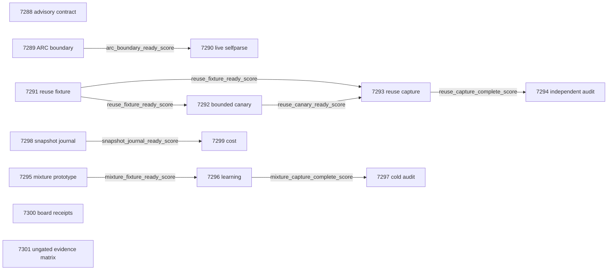

# Carnot Research Roadmap V641: Fresh source reuse, delayed-feedback constraint learning, and durable snapshot efficiency

**Created:** 2026-09-14 UTC (2026-09-13 operator local date)
**Milestone:** 2026.09.641
**Status:** Planned; activation-refusal repair, awaiting the unchanged guard
**Supersedes:** Completed milestone 2026.09.640, experiments 7274–7287
**Informed by:** V640 terminal artifacts, completion archive, conductor log, and the V641 research refresh

## Activation Refusal and Repair Scope

The guard refused `exp7300-board-continuity` because two scope-matched failures
had no `prior_failures` entries. The repaired YAML adds both exact ledger IDs
and observed verdicts. Each entry includes `addressed_by` and
`retire_if_same_verdict: true`. No operator override is claimed.

- `exp5166-hardware-continuity-board-timing-v473` encountered blocked GateMate DirtyJTAG IDCODE timing.
- `exp5179-hardware-continuity-board-timing-v474` retained unresolved GateMate IDCODE diagnostics despite reachable KV260 and PolarFire.

The changed prerequisite is Exp7286's authenticated three-board disposition.
Exp7300 reads existing evidence and records the next physical-state condition.
It issues zero hardware operations. GateMate remains blocked unless a dated
operator receipt establishes changed physical state. Even then, this task
only records eligibility for a later integration task. Repeating a prior
verdict activates the declared retirement rule.

The refused proposal is preserved at
`ops/roadmap-quarantine/roadmap-2026.09.641-refusal1.yaml`. Its fourteen tasks,
order, prompts, gates, budgets, titles and deliverables are unchanged. This
repair also replaces the stale V636 design with their exact V641 contract,
as required by the operator. The identical old design is already preserved
at `openspec/change-proposals/research-roadmap-v636.md`.

## What V640 Proved

Conductor completion is not a scientific acceptance result. The completion
archive ends at V640; the following findings come from its terminal artifacts.

| Evidence | Finding | Consequence |
|---|---|---|
| Exp7274 source contract | Disqualified: the declared document still described V636. | Bind the full V641 Markdown and YAML before handoff. Keep Exp7288 advisory. |
| Exp7275 replay and Exp7277 canary | Replay diagnosed the old measurement defect; the new comparator transport passed a mechanics gate. | Reuse the shipped parser and authenticated GGUF transport. |
| Exp7278 capture and Exp7279 audit | Direct comparison was already correct on all 64 source units. Source-verifier value did not pass. | Test amortized source materialization and freshness against warm direct generation, with no accuracy-superiority rerun. |
| Exp7276 identity and Exp7280 live ARC | Identity handoff passed its mechanics controls. Exp7280 was quarantined for inference-provenance contradiction and substrate mismatch. | Persist load/generation events at call boundaries, then run one actual selfparse session. Preserve the quarantine. |
| Exp7281–7283 admission learning | The prototype passed mechanics. Future-error, false-accept and recurrence value gates failed; the independent audit retained the null. | Replace binary update admission with a bounded hypothesis mixture and shared delayed labels. |
| Exp7284/7285 durable state | Group acknowledgment passed protocol controls; the measured deployment frontier missed its joint gate. | Hold grouping fixed and change the full-snapshot storage mechanism. |
| Exp7286 board state | KV260 graduation and PolarFire CPU dispatch remained authenticated. GateMate lacked changed-state evidence. Zero hardware operations were issued. | Carry forward evidence and exact next conditions; no repeated physical diagnostics. |
| Exp7287 capstone | All fourteen dispositions were recorded; required ARC evidence remained quarantined. Source, ARC, admission and acknowledgment value scores were zero. | Separate evidence closure from scientific value. External blocks are terminal `blocked`. |

## Three Largest Gaps to the PRD Vision

1. **Faithful verification with useful total cost (FR-12).** Exact constraint
   execution cannot certify a mistaken extraction. The recent direct baseline
   has no observed accuracy headroom. Measure source freshness, semantic parity,
   coverage, false accepts and amortized cost together.
2. **Continuous learning that survives recurrence (FR-11).** A causal update
   can still harm later predictions. Test mixtures over archived hypotheses
   with equal revealed-label and byte budgets. Keep recurrence strata separate.
3. **Live reasoning with deployable computation (FR-05/07/08, NFR-01).**
   Correct wrappers and native transitions do not prove useful live induction
   or faster durable updates. Measure actual policy consumption and the whole
   acknowledgment path, including initialization and recovery.

## Research Inputs and Selection

The V641 refresh and its refusal-recheck addendum in `research-references.md`
precede this design. All eight requested arXiv themes and all six secondary
channels were checked. The sources motivate bounded adaptations, not local
scientific claims.

| Source | Use in this milestone | Boundary |
|---|---|---|
| [GroundedCache](https://arxiv.org/abs/2605.27494) and [CacheWeaver](https://arxiv.org/abs/2606.19667) | Exp7291–7294 test versioned source compilations and a warm-prefix comparator. | Answer caching and a different serving stack do not prove Carnot cache value. |
| [Symbolic grounding](https://arxiv.org/abs/2609.05025) and [Beyond Document Grounding](https://arxiv.org/abs/2607.00895) | Preserve source spans, provenance and unsupported claims. | Structured extraction remains fallible; every failed unit stays in the denominator. |
| [When Validation Stops Learning](https://arxiv.org/abs/2609.10873) and [interactive constraint refinement](https://arxiv.org/abs/2509.24489) | Exp7295–7297 replace failed admission with delayed-feedback hypothesis mixtures. | Fixed-share voting is a local adaptation, not a claimed theorem for drifting streams. |
| [SQLite atomic commit](https://www.sqlite.org/atomiccommit.html) and [persistent journal mode](https://www.sqlite.org/pragma.html#pragma_journal_mode) | Exp7298/7299 test complete snapshots in PERSIST/FULL transactions. | Process-kill recovery cannot establish physical power-loss behavior. |
| [KAC](https://arxiv.org/abs/2503.21076), SparseKAN, HardNet++, ETS, and Ising FPGA work in the refresh | Retain future classifier, constraint and hardware ideas. | No new neural training or board integration branch is added during this repair. |
| [Extropic Z1T](https://extropic.ai/writing/z1t) and [Kona](https://logicalintelligence.com/kona-ebms-energy-based-models) | Track host/companion costs and hardware availability. | No local TSU access or compatible Kona checkpoint is established. |

The EBT/ARM–EBM citation checks retrieved 35 and eight records respectively,
without next-page tokens; these are not exhaustive citation counts. OpenReview
returned a browser challenge in this pass. Hugging Face grounding, GitHub weekly
Python, Extropic and Kona pages were checked. No trending rank is inferred.
Retired external-text scorers, energy-generation variants, hand-built game
solvers and unchanged GateMate probes remain outside this plan.

## Architecture

```text
 public source/version -> Qwen3.8 source extraction -> hashed compilation cache
            |                         |                        |
      distinct claim -> query extraction -> exact constraint verification
            |                                                  |
      warm direct comparator -----------------> independent parity/cost audit
                                                               |
                                                  bounded source-reuse verdict

 public event -> weighted archived hypotheses -> pre-label prediction receipt
                                                       |
 evaluator releases only scheduled delayed feedback ----+
            |
      bounded fixed-share update -> future prediction -> cold causality audit

 native controller -> complete state snapshot -> SQLite PERSIST/FULL commit
                                                   |
                                             acknowledgment
                                                   |
                                      kill/reopen -> exact state parity

 Qwen3.8 GGUF -> actual E3AgentPolicy -> own runtime induction/tool use
                          |                        |
                 persisted call events       environment feedback
                          +------ current-session receipt

 existing board receipts -> three dispositions -> changed-state prerequisites

 all fourteen dispositions -> independent capstone + stable publication gate
```

The model remains `unsloth/Qwen3.8-27B-GGUF`. The model's embedded tokenizer
is loaded through the shipped llama.cpp path. Each LLM task declares it in
`MODEL_SPECS`. CPU fixture/replay work has no current model invocation.
Learning uses CPU counters, bounded vectors and system memory. Batch expert
scoring has a GPU/NPU path; compact table operations could map to FPGA later.
Hardware gains, including the program's 100x aspiration, require measurement.
No source cache, mixture or storage adapter changes a production default.

## Exact Task Contract

There are **14 tasks**, **exp7288 through exp7301**, in this exact order.
The table is the literal contract with `research-roadmap-next.yaml`.
Each gate field is declared at top level in its upstream task's REQUIRED
ARTIFACT FIELDS. Phase numbers match the prompts.

| Order | Task ID | Exact title | Deliverable | Phase | Structured gate |
|---|---|---|---|---|---|
| 1 | exp7288-source-contract | V641 source ingestion and exact fourteen-task contract | results/experiment_7288_v641_source_contract.json | 1 | None |
| 2 | exp7289-arc-boundary | Preserve live ARC invocation evidence across timeout boundaries | results/experiment_7289_v641_arc_boundary.json | 1 | None |
| 3 | exp7290-arc-selfparse | Accumulate one authentic adapter-withheld live selfparse session | results/experiment_7290_v641_arc_selfparse.json | 1 | exp7289-arc-boundary.arc_boundary_ready_score == 1 |
| 4 | exp7291-reuse-fixture | Build a versioned source-compilation reuse fixture | results/experiment_7291_v641_reuse_fixture.json | 2 | None |
| 5 | exp7292-reuse-canary | Canary Qwen3.8 source reuse and warm-prefix comparators | results/experiment_7292_v641_reuse_canary.json | 2 | exp7291-reuse-fixture.reuse_fixture_ready_score == 1 |
| 6 | exp7293-reuse-measurement | Measure fresh-source reuse parity and end-to-end cost | results/experiment_7293_v641_reuse_measurement.json | 2 | exp7291-reuse-fixture.reuse_fixture_ready_score == 1; exp7292-reuse-canary.reuse_canary_ready_score == 1 |
| 7 | exp7294-reuse-audit | Independently audit source reuse safety and amortization | results/experiment_7294_v641_reuse_audit.json | 2 | exp7293-reuse-measurement.reuse_capture_complete_score == 1 |
| 8 | exp7295-mixture-prototype | Prototype bounded delayed-feedback hypothesis mixtures | results/experiment_7295_v641_mixture_prototype.json | 3 | None |
| 9 | exp7296-mixture-learning | Evaluate prospective self-learning under delayed labels | results/experiment_7296_v641_mixture_learning.json | 3 | exp7295-mixture-prototype.mixture_fixture_ready_score == 1 |
| 10 | exp7297-mixture-audit | Audit feedback causality and recurrence safety independently | results/experiment_7297_v641_mixture_audit.json | 3 | exp7296-mixture-learning.mixture_capture_complete_score == 1 |
| 11 | exp7298-snapshot-journal | Prototype persistent-journal full-snapshot acknowledgments | results/experiment_7298_v641_snapshot_journal.json | 4 | None |
| 12 | exp7299-snapshot-cost | Measure persistent-journal latency and durable throughput | results/experiment_7299_v641_snapshot_cost.json | 4 | exp7298-snapshot-journal.snapshot_journal_ready_score == 1 |
| 13 | exp7300-board-continuity | Record board continuity and changed-state prerequisites | results/experiment_7300_v641_board_continuity.json | 4 | None |
| 14 | exp7301-capstone | Reconcile fourteen V641 dispositions and bounded research claims | results/experiment_7301_v641_capstone.json | 4 | None |

## Phase 1: Execution Contract and Live Self-Discovery (Exp7288–7290)

Exp7288 checks literal contract parity, prompt paths, prior failures, gates and
source dispositions. It gates no science. Its control cases include missing,
false and quarantined upstream artifacts plus mutated contract fields.

Exp7289 diagnoses the quarantined live attempt and persists event receipts at
actual model call boundaries. Injected CPU children exercise pre-load failure,
load-only success, in-flight timeout, unusable output, duplicate events and
cleanup. Current model counters remain zero for this CPU diagnostic. A passing
handoff requires the real live caller to use the lossless ledger.

Exp7290 follows that structured readiness gate. It uses the actual
`E3AgentPolicy` selfparse path on one runtime-selected, adapter-withheld target.
Registry checks precede target selection. The inherited session cap is 3000
seconds including load, at most 192 actions, two completions and 4096 generated
tokens. The load timeout is at most 600 seconds. Lower runtime limits still
apply. One or two new inductions are plausible; ten is a cumulative evidence
target, not a promise from one session. Hash-authenticated historical inductions
remain separate from current calls. Policy consumption and runtime feedback
establish method use; they do not establish broad efficacy or a hidden score.
Any incidental solve requires `solve_provenance=live_agent_self_discovery` and
registry novelty. The task does not submit or promote a registry entry.

## Phase 2: Versioned Source Reuse (Exp7291–7294)

Exp7291 builds an opt-in cache of source compilations, never labels or answers.
Keys bind content, source version, parser/schema and model configuration.
Source changes invalidate the whole dependent compilation. Every distinct
claim still receives query extraction and verification. Eight development
groups are separate from sixteen evaluation groups. Each evaluation group
has eight distinct claims and a revision before claim five: 128 claim units.
The private construction oracle cannot feed extractor prompts or the cache.

The three arms are warm-prefix direct generation with two draws, fresh
source/claim verification, and versioned source reuse with per-claim extraction.
Exp7292 runs two development groups and eight claims: at most 44 generation
calls, 128 output tokens per call, and 900 seconds including load. It qualifies
freshness, parsing, receipts and a fair warm comparator. Failed readiness
blocks measurement without another tuning canary.

Exp7293 runs the frozen sixteen groups. The call ceiling is 256 direct, 256
fresh-verifier and 160 reuse calls: 672 total, each capped at 128 output tokens.
Capture is bounded to 2700 seconds including load. Incomplete groups remain
censored across arms. Initialization, prefill, compilation, lookup, invalidation,
verification and failed calls enter the complete cost. Report amortization at
one, two, four and eight claims, with cold and steady totals separately.

Exp7294 independently reconstructs raw decisions and resamples source groups
with 10000 paired bootstrap draws. The joint gate requires zero cached/fresh
semantic mismatches or stale serves; one-sided 95% accuracy and coverage lower
differences versus direct of at least -0.02; no larger empirical false-accept
count; and a full-cost speedup lower bound of at least 1.5 at eight claims.
Cold initialization costs must pass too. Sixteen groups cannot certify rare-error
safety. The complete audit runs even when preliminary scientific value is null.

## Phase 3: Continuous Delayed-Feedback Learning (Exp7295–7297)

Exp7295 implements fixed-share voting over at most four archived complete
hypotheses plus a protected reset expert. After each revealed label, multiply
weights by `exp(-0.5 * binary_error)`, normalize, then share 0.02 uniformly.
Ties abstain. Nominate from already revealed labels every sixteen new labels;
evict the lowest-weight archived expert, oldest on a tie. The V640 serialized
archive/controller byte cap stays fixed. Reduce expert count if needed.

Freeze eight development streams and 24 evaluation streams of 1024 steps:
twelve separated and twelve overlapping recurrence streams. Warmup uses 128
steps. Reveal 128 later labels at positions `128+7*j`, `j=0..127`, each delayed
four steps. All arms get the same allowed schedule and nominees. Seven arms
include fixed-share, frozen uniform voting, reset, unconditional recognition,
shuffled-feedback fixed-share, an explicitly larger unbounded reference, and
frozen warmup. Only bounded arms qualify for deployment comparisons.

Exp7296 persists each prediction before label release and measures future
outcomes, including the non-feedback subset. It records weights, expert births,
evictions, labels, state hashes, bytes, latency and per-step metrics. Execution
is capped at 1800 seconds; incomplete streams remain in the record.

The frozen efficacy gate requires paired future-error upper deltas below zero
versus reset and unconditional recognition; recurrence upper deltas versus
frozen warmup at most 0.01 in both strata; false-accept upper deltas at most
0.01 against each baseline; coverage lower deltas at least -0.02; and better
true-feedback error than shuffled feedback. At least 24 later predictions must
differ from frozen voting after changed weights. No chronology or byte violation
is allowed. Exp7297 reconstructs all arms in a cold process and tests update,
label, timestamp, memory and seed interventions. Same-step fitting cannot count
as continuous learning. FR-11 remains open unless future outcomes pass.

## Phase 4: Durable State, Board Continuity and Reconciliation (Exp7298–7301)

Exp7298 changes storage to a single-writer SQLite full-snapshot transaction,
with read-back verification of `journal_mode=PERSIST` and `synchronous=FULL`.
Use the actual PyO3 controller and charge initialization. Hold V640 grouping
at 1/4/16, maximum wait at 10 ms, and queue limits at sixteen events/65536 bytes.
Acknowledge only after commit. Four seeded schedules test every exposed restart
boundary, kill-during-commit, corrupt checksums, duplicate sequences and overflow.
No missing acknowledged event, exact state parity and idempotent recovery are
required for the readiness gate. Process kills do not prove power-loss safety.

Exp7299 compares the old atomic replacement and new journal writers with eight
seeds, identical groups and 256 events under burst, steady and interactive
arrivals. The benchmark cap is 1800 seconds. The fixed group-16 candidate needs
a burst throughput-ratio lower bound of at least 1.5, steady p95 acknowledgment
at most 50 ms, and interactive-latency-ratio upper bound at most 1.05. It also
needs exact state parity, queue compliance and zero missing acknowledged events.
Use 10000 seed-cluster bootstrap draws. Cold costs and recovery are included;
group 1/4 are sensitivity checks. NFR-01's original 10x target is reported
separately and is not replaced by the pilot's 1.5x gate.

Exp7300 performs the read-only, three-board audit described in the refusal
repair. Its completeness score means three authenticated dispositions, not
three ready boards. Missing evidence authenticity blocks the task once.

Exp7301 reads thirteen outcomes plus its own disposition without structured
gates. It independently reduces branch rows, preserves quarantines and nulls,
records exact changed-prerequisite decisions, and computes the stable G1–G4
publication gate. Evidence closure and scientific value remain separate fields.
An absent or quarantined required branch is terminal `blocked`, never repeated
`partial`. No external publication is part of this milestone.

## Dependency Graph

Arrows are the exact structured field gates. Historical artifacts are diagnostic
inputs, not `requires` dependencies. The contract, board audit and capstone have
no structured gates.



There are eight gate edges. Consumers independently authenticate upstream
artifacts and reject quarantine. No gate references a retired experiment.
Every task retains `per_unit_rows: true`, the closed `verdict_class` enum, and
`gate_check_summary`. Every declared prior-failure entry has all four fields.

## Hardware and Runtime Requirements

| Work | Required substrate | Measured-work budget |
|---|---|---|
| Exp7290 live selfparse | Existing leased RTX 3090 and cached Qwen3.8-27B GGUF, approximately 16 GB plus measured KV headroom | 3000 s session including load; full generation class, 60 s floor |
| Exp7292 canary | Same mandated GGUF and native loader; authenticate actual GPU offload | 900 s including load; bounded generation class, 10 s floor |
| Exp7293 source capture | Same leased GPU and frozen model/configuration | 2700 s including load; full generation class, 60 s floor |
| Exp7289 lifecycle fixtures | CPU and owned child processes with injected call events | No current model invocation; 45-minute task estimate |
| Exp7295–7297 learning | CPU, system RAM, bounded archive and raw sidecar disk | 1800 s learning run; 40–50-minute task estimates |
| Exp7298/7299 durability | Installed Rust/PyO3 toolchain, native controller, sqlite3 and local filesystem | 1800 s timing run; 50-minute task estimates |
| Exp7300 boards | Existing authenticated KV260, PolarFire and GateMate receipts | 15-minute estimate; zero hardware commands |
| Contract, fixture and reducers | CPU, Python environment, hash-bound inputs | Existing YAML estimates; no model dependency |

The inventory provides two RTX 3090s, 48 GB total. Each run must check current
occupancy and ownership; total inventory is not a free shared allocation.
One leased GPU suffices when the actual quantization and KV footprint fit.
The wishlist's NPU, TSU and future-board entries supply no guaranteed capacity.
No purchase or vendor contact is required. PolarFire CPU dispatch is not FPGA
sampling, and a host snapshot benchmark is not hardware sampler acceleration.

All fourteen prompts include a numbered flushed-progress step. Print at every
phase boundary and before/after model load, generation, benchmark and subprocess
calls. Print completed units and monotonic elapsed time inside long loops at
least every 60 seconds. Blocking calls need truthful outstanding-call heartbeats.
Every output gap stays below 600 seconds, including authoring and tests. Silence
can kill at 1200 seconds; progress permits the 4800-second hard cap but never
extends it. Do not sleep to satisfy a floor.

Actual execution determines substrate class. Load-only work uses
`model_load_no_generation` (2 s); bounded generation uses
`model_bounded_generation` (10 s); real corpus/agent generation uses
`model_full_generation` (60 s). CPU execution uses
`cpu_exact_solver_or_simulator`; a read-only reducer uses `aggregation` with
`aggregation_from_upstream_artifacts`. Preserve attempted loads and generation
on failure. Historical receipts are sidecars, not current calls.

## Verification, Reconciliation and Stop Rules

Each implementation task first writes the relevant REQ and meaningful failing
tests. Prompts require focused unit/coverage, Ruff, changed-module mypy and
spec-coverage checks, then independent artifact and row validation. They require
applicable E2E-009/010 ARC transport and memory checks, adapted E2E-007 delayed
learning/rollback checks, E2E-003/004 native serialization, and source-to-verdict
reconstruction. Use private temporary paths and preserve previous evidence.

For this planning-only repair, validate the real YAML schema, failure ledger,
exclusion lint, ARC floor, prompt paths and declared gate fields. Independently
compare all Markdown contract rows with YAML. Exercise actual `evaluate_gates`
using temporary pass/false/missing/quarantined artifacts. Run the existing scoped
validator tests and their spec coverage. Full GPU, board and scientific runs
belong to the execution tasks; this plan does not claim their results.

Record the repair and validation in `_bmad/traceability.md`, `ops/status.md`,
`ops/changelog.md` and the session metrics. The active roadmap, exclusion manifest
and `scripts/research_conductor.py` are unchanged. No push is authorized.

A completed failed scientific gate is `null`; a shared-authority mechanics result
is `circular_positive`. External absent, gate-blocked or quarantined prerequisites
are terminal `blocked` with exact observed checks. Only unfinished work owned by
the current task is `partial`. No repeat can silently weaken an acceptance gate,
raise an inherited budget, reopen a retired chain or replace negative evidence.
