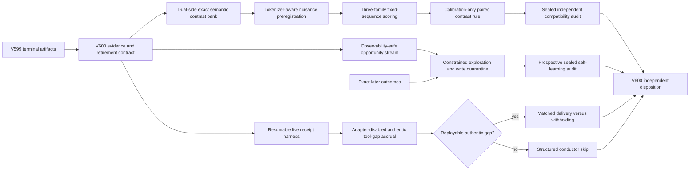
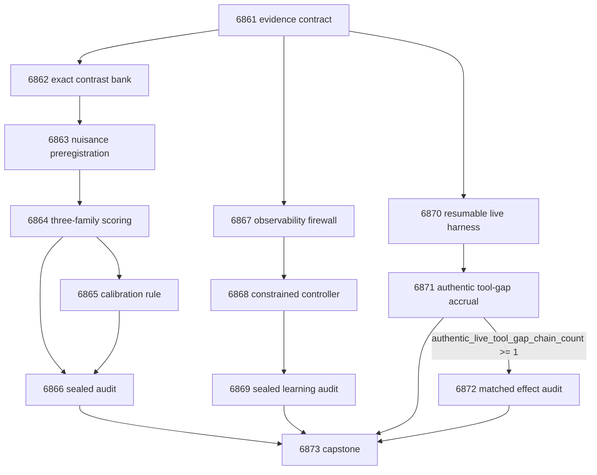

# Research Roadmap V600: Nuisance-Controlled Semantic Energy, Observability-Safe Learning, and Authentic Live Tool Credit

**Milestone:** 2026.09.600
**Planned:** 2026-09-01
**Experiments:** Exp6861-Exp6873
**North star:** A live agent learns useful constraints from its own outcomes. Exact external checks remain truth authority. Learned energy selects, routes, and abstains without becoming its own oracle.

## Executive Summary

V599 completed every task and closed all four scientific branches without a new headline result.
The typed-program authority and the three-family local scoring path now work. The model signal did
not survive nuisance and isomorphic controls. The self-learning controller had a positive pooled
held-future effect, but its sealed audit found a degenerate 100% abstention rate and 13 harmful
writes. The dynamic ARC router found no supervisor headroom, so that unchanged supervisor branch
is retired. The first-party tool-gap receipt contract works on fixtures, but no authentic live
receipt chain exists.

V600 changes the scientific mechanisms. Its Phase-D majority replaces raw sequence likelihood
with an exact, dual-side, nuisance-matched semantic contrast. Structure and solution checkers must
agree before a row can enter scoring. All three mandated GGUF families then score frozen sequences.
A deterministic paired contrast is calibrated on one split and audited on a sealed split.

The self-learning phase implements an observability firewall. Decision-time features are separated
from outcome-only supervision. A bounded controller gets explicit exploration, no-memory,
read-only, verified-write, and abstain actions. It must reduce harmful writes without collapsing to
always abstain.

The ARC phase improves the live evidence path. It adds durable per-action checkpoints, uses the
adapter-disabled scored agent for the standing generalization floor, and seeks an authentic
first-party tool-gap chain. A matched delivery-versus-withholding effect audit runs only when a
replayable pre-action opportunity exists. No task claims a game-level solve.

## What V599 Proved

1. **Typed exact authority is usable.** Exp6849 rebuilt the typed program with unique identities,
   exact compile parity, and isomorphic transforms. Both authority readiness fields were `1`.
   This closes the producer-auditor dispute from V598.

2. **All three mandated GGUF families can run locally.** Exp6850 passed task-owned resource
   admission. Exp6851 produced 168 fixed-sequence rows across Qwen3.6-35B-A3B, Gemma-4-31B, and
   Gemma-4-26B-A4B. Resource access is not the current scientific blocker.

3. **Raw fixed-sequence compatibility is not identifiable.** Exp6852 found that model family,
   model scale, normalization, row order, label position, and other controls could equal or exceed
   the semantic margin. Its `compatibility_claim_eligible_score` was `0`. The V599 capstone
   prescribed a pre-registered nuisance-controlled semantic contrast.

4. **The memory mechanics work, but the policy is unsafe and degenerate.** Exp6854 reported a
   held-future effect of `+0.054901960784` with bounded persistence. Exp6856 then found an overall
   abstention rate of `1.0` and 13 supported harmful writes. The capstone disqualified the
   self-learning claim and prescribed constrained exploration plus a harmful-write admission block.

5. **The supervisor branch has no eligible causal row.** Exp6857 found
   `supervisor_headroom_ready_score=0`. Exp6858 correctly stopped at its structured gate. Exp6860
   retired an unchanged supervisor rerun. V600 does not reopen it.

6. **The first-party tool-gap schema is ready but has no live effect evidence.** Exp6859 linked gap
   detection, request, tool response, agent delivery, next action, and exact outcome under one
   immutable identity. It launched no live rollout and had no authentic live chain. Transport
   readiness is not utility.

7. **The milestone disposition was procedural, not scientific.** Exp6860 preserved every null,
   blocked, partial, and disqualified state. Its positive class referred to disposition
   completeness. It reported no scientific branch advance.

## Three Biggest Gaps to the PRD Vision

### Gap 1: Carnot lacks an identifiable model-derived semantic energy

FR12 needs constraint reasoning that maps rules to checkable structures. Exact typed authority now
exists, and local model scoring now executes. The remaining gap is identification. A raw
likelihood difference can reflect syntax, tokenization, order, normalization, model family, or
scale instead of semantics.

V600 builds matched semantic contrast groups. A structure-side checker proves that the typed
obligation changed in the intended way. A solution-side checker proves the exact validity label.
Identifier, length, token count, label position, row order, and surface-form controls are frozen
before scoring. Only a sealed within-group effect can support a compatibility claim.

### Gap 2: Continuous self-learning is not safely actionable

FR11 requires bounded online updates, persistence, validation, and rollback. Carnot has those
mechanics. It does not yet have a policy that acts often enough to learn while avoiding harmful
writes. V599 also mixed decision-time fields with facts that were known only after an outcome.

V600 separates online-observable features from offline supervision. It adds constrained
exploration and a harmful-write quarantine. The final audit is chronological and prospective. A
positive class requires nondegenerate action use, held-future benefit, bounded false-positive
injection, durability, rollback, delayed correction, and no leakage.

### Gap 3: Live ARC mechanisms lack authentic causal effect evidence

The live agent can carry supervisor and tool-gap receipts. The current supervisor evidence has no
headroom, and the tool-gap evidence is fixture-only. Long live runs also lack durable per-action
artifacts before completion.

V600 first makes the canonical scored harness resumable and receipt-complete. It then runs the
adapter-disabled live path with a mandated SOTA local model. If an authentic first-party tool gap
appears, a matched replay tests delivery versus withholding from the same pre-action state. Exact
later outcomes determine direction. No offline solver, source read, hand adapter, or registry
trajectory can enter the live decision.

## Research Findings That Change the Design

The full source notes are in `research-references.md`, section **V600 Planner Refresh -
2026-09-01**.

- [Learning What to Remember](https://arxiv.org/abs/2606.10616) separates online-observable
  retention features from offline supervision. V600 turns that separation into a fail-closed
  observability firewall for every memory decision.
- [Opt-Verifier](https://arxiv.org/abs/2605.29556) checks both the optimization structure and its
  candidate solution. V600 applies the pattern to typed semantic contrasts before any model score
  is interpreted.
- [From Reasoning to Agentic Credit Assignment](https://arxiv.org/abs/2604.09459) distinguishes
  token credit from partially observed turn-level credit. V600 freezes memory and tool-gap credit
  at the action receipt and requires valid pre-action alternatives.
- [Harness the Memory](https://arxiv.org/abs/2608.15008) finds that no memory substrate dominates
  and that broad retrieval can hurt sequential decisions. V600 compares verified-write,
  read-only, no-memory, and abstain arms on the same chronological opportunities.
- HSRM remains relevant, but the local GGUF path does not expose its intermediate step-boundary
  states. V600 does not reopen a hidden-state probe. It tests the cheaper changed mechanism named
  by the V599 capstone.

The secondary sweep found no execution-ready dependency. Semantic Scholar exposed 35 visible EBT
citations and eight ARM-EBM citations, but no matching-base verifier checkpoint. OpenReview added
dual-side verification. Hugging Face added a controlled memory-substrate study. GitHub supplied no
dependency worth adopting. Extropic still targets 2027 Z1 access. Logical Intelligence still
publishes no Kona weights or local runner.

## Target Architecture

Exact structure checks, exact solution checks, exact memory outcomes, and exact ARC transitions
remain outside learned or model-derived mechanisms. They supply labels and release authority.
Model margins and online policies are tested signals. They cannot validate themselves.

## Model Contract

Exp6863 and Exp6864 declare all three mandated local models:

- `unsloth/Qwen3.6-35B-A3B-GGUF`
- `unsloth/gemma-4-31B-it-GGUF`
- `unsloth/gemma-4-26B-A4B-it-GGUF`

Exp6871 and Exp6872 declare `unsloth/Qwen3.6-35B-A3B-GGUF` for the live agent. Every LLM task uses
the `cached_sota_pair()` pattern and records exact model, tokenizer, quantization, process, and GPU
receipts. Legacy small models may run CPU smoke tests only. They cannot support a headline result.

The three-family scoring task runs one model process at a time and tears down only its owned
processes. The live ARC tasks do not overlap the three-family task. A missing required model cell
produces an honest blocked artifact. It never triggers substitution with a legacy model.

## Phase 1: Evidence and Semantic-Contrast Preregistration

### Exp6861: V600 branch retirement and evidence contract

Freeze the V599 terminal artifacts and conductor gate records. Recompute the branch dispositions.
Retire raw fixed-sequence margins, the unchanged supervisor rerun, and the degenerate V599 memory
policy as claim mechanisms. Preserve the typed authority, three-family inference, memory
transaction, and tool-gap receipt infrastructure. Define exact source hashes, split boundaries,
gate fields, and changed-mechanism tests for V600.

### Exp6862: Dual-side exact semantic contrast bank

Build at least 96 semantic contrast groups from the typed obligation program. Each group has a
valid and invalid candidate plus semantics-preserving control transforms. A fresh structure-side
checker validates variables, obligations, and intended mutations. A separate solution-side checker
validates the exact outcome. Reject any group with identity collisions, ambiguous semantics, or
checker disagreement. Do not invoke an LLM.

### Exp6863: Tokenizer-aware nuisance and split preregistration

Tokenize every frozen sequence with all three required GGUF tokenizers without running inference.
Keep only model-specific contrast cells with matched candidate token counts and declared prompt
counts. Freeze label position, identifier, order, normalization, and surface controls. Create
disjoint calibration and sealed held groups before any token score exists. Require at least 20
calibration and 20 held contrast groups per model or stop with an honest null.

## Phase 2: Nuisance-Controlled Semantic Energy

### Exp6864: Three-family semantic contrast scoring stream

Run forced-sequence token scoring on every eligible frozen cell for all three mandated GGUF
families. Store raw token receipts and group identities. Generate no answers, labels, repairs, or
self-judgments. Scientific labels remain sealed from the model process. The task reports stream
completeness, not a semantic compatibility claim.

### Exp6865: Calibration-only paired semantic contrast rule

Use only the calibration split. Apply the pre-registered within-group paired contrast and
difference-in-differences controls. Freeze orientation, normalization, missing-cell handling,
family aggregation, confidence intervals, and failure thresholds. Fit no text scorer and inspect no
held label. Emit a rule-ready field only when the calibration effect exceeds every matched nuisance
control without relying on model identity.

### Exp6866: Sealed independent semantic compatibility audit

Use a fresh reducer. Verify the frozen rule and split hashes, then open the held labels once. Test
each model, model family, typed obligation family, transform, and nuisance attack. A positive class
requires a held paired effect in the pre-registered direction, a confidence interval above zero,
agreement across both model families, and no matched nuisance effect of equal or greater size. A
null retires this semantic-contrast construction.

## Phase 3: Observability-Safe Continuous Self-Learning

### Exp6867: Decision-time observability firewall and opportunity stream

Rebuild the memory opportunity stream from primary transaction and exact-outcome receipts. Do not
trust the flagged V599 aggregate artifacts. Mark every feature as online-observable or
outcome-only. Fail closed if a policy input depends on future reward, counterfactual effect, held
family, outcome label, row identity, or another post-decision field. Freeze chronological
calibration and held-future partitions with helpful, harmful, and no-headroom opportunities.

### Exp6868: Constrained exploration and harmful-write quarantine controller

Implement a bounded controller over verified-write, read-only, no-memory, and abstain. Force a
small pre-registered exploration floor so the policy cannot pass by always abstaining. Use only
decision-time observable features. Later exact outcomes update bounded statistics. Quarantine
writes whose pessimistic benefit bound does not clear the harm cost. Compare the controller with
always-memory, read-only, no-memory, and always-abstain controls on the calibration stream.

### Exp6869: Prospective sealed self-learning durability and portability audit

Freeze the controller before opening the held-future stream. Run actions prospectively and reveal
each exact later outcome only after commitment. Test restart, rollback, capacity, delayed
correction, stale tombstones, poison, placebo context, leave-one-family-out, and
leave-one-order-out portability. A positive class requires nondegenerate action use, positive
held-future effect, bounded false-positive injection, fewer harmful writes than always-memory,
durability, and zero leakage.

This phase directly targets the research program's **Continuous Self-Learning** priority. It learns
from exact later outcomes while keeping GGUF weights frozen and exact authority external.

## Phase 4: Live ARC Generalization and Independent Disposition

### Exp6870: Resumable live ARC receipt checkpoint harness

Add atomic per-action and per-game checkpoints to the canonical adapter-disabled scored path.
Preserve first-party tool-gap hops and exact transition outcomes across interruption and restart.
Test receipt joins, duplicate suppression, source hashes, process ownership, and partial-run
recovery on fixtures. Keep the feature default-off. This infrastructure task also prepares the
standing ARC generalization floor without claiming a level solve.

### Exp6871: Authentic adapter-disabled tool-gap opportunity accrual

Run bounded adapter-disabled live generalization cells with Qwen3.6-35B-A3B. Use the canonical
`make_carnot_agent` or `E3AgentPolicy` path. Do not read game source, prior-game trajectories,
registry solutions, hidden state, offline BFS, or hand adapters. Preserve every live receipt even
when no tool gap appears. Report authentic chain count and replay eligibility. Make no solve or
utility claim.

### Exp6872: Matched live tool delivery versus withholding audit

Run only if Exp6871 has at least one replayable authentic gap chain. Reproduce the exact pre-gap
prefix and require the same state hash before bifurcation. Compare first-party tool delivery with a
matched withheld control under the same model, prompt, budget, and seed. Exact next transition and
bounded later outcomes determine direction. Reject nondeterministic or unmatched replays. Do not
pool games or claim a level solve.

### Exp6873: V600 independent adversarial capstone

Read every terminal artifact and conductor skip that exists. Recompute Phase-D, self-learning, and
ARC dispositions with fresh code. Preserve blocked, null, disqualified, partial, and circular
states. Distinguish infrastructure readiness from scientific effect. Retire any changed mechanism
that repeats its prior terminal verdict under the registered retirement rule.

## Conductor Execution Order

1. Exp6861 - freeze evidence and retirement rules.
2. Exp6862 - build the exact semantic contrast bank.
3. Exp6863 - freeze tokenizer-aware nuisances and splits.
4. Exp6864 - run the three-family scoring stream.
5. Exp6865 - freeze the calibration-only contrast rule.
6. Exp6866 - run the sealed compatibility audit.
7. Exp6867 - build the observability-safe opportunity stream.
8. Exp6868 - implement and calibrate the constrained controller.
9. Exp6869 - run the prospective sealed learning audit.
10. Exp6870 - ship resumable live receipt checkpoints.
11. Exp6871 - acquire authentic adapter-disabled tool-gap chains.
12. Exp6872 - audit matched live tool effect if the authentic-chain gate passes.
13. Exp6873 - reconcile all terminal states without a gate.

This order gives Phase D the largest scientific allocation, reserves Exp6861 and Exp6870 as the two
infrastructure slots, and satisfies the one-task ARC generalization floor. This milestone continues
existing research tracks, so the planning-time V600 literature refresh fulfills the optional SOTA
ingestion role. It does not add a redundant autonomous ingestion task.

## Dependency Graph

Only Exp6872 has a scientific fail-fast gate that may legitimately skip the task call. Exp6873 is
ungated and reads the conductor skip record when that happens. Other gates enforce prerequisite
artifact contracts, not positive-result selection.

## Hardware Requirements

### Required

- **Two RTX 3090 GPUs:** Exp6864 uses task-owned CUDA scoring. Exp6871 and Exp6872 use local live
  inference. Schedule these tasks sequentially. Record GPU UUID, free VRAM, offload layers, process
  ownership, and teardown.
- **Cached GGUF artifacts:** all three mandated repositories for Exp6863-Exp6864 and the Qwen3.6
  repository for Exp6871-Exp6872. Preserve embedded-tokenizer and file-hash receipts.
- **Host CPU, RAM, and disk:** exact checkers, tokenizer passes, chronological reducers,
  checkpoints, raw token sidecars, and live receipt logs. Write checkpoints atomically.

### Not required

- **KV260, GateMate, and PolarFire:** all three boards have graduated their mandatory terminal-state
  gates. Current continuity limitations remain opportunistic. V600 makes no FPGA latency,
  throughput, energy, or speedup claim.
- **Extropic TSU:** there is no authenticated device or API. Torx and Thermalizers remain planning
  references only.
- **Cloud model APIs:** every model-dependent task uses the mandated local GGUF path.

## Evidence and Claim Rules

1. Every artifact declares `verdict_class` as one of `positive`, `circular_positive`, `null`,
   `blocked`, `disqualified`, or `partial` next to a free-text `honest_verdict`.
2. Every comparative task emits one `rows` or `per_game_results` record per contrast group,
   decision, seed, game, arm, and condition needed to reproduce its aggregate.
3. Every blocked verdict emits `gate_check_summary` with the exact failed check and observed value.
4. Every structured gate field appears verbatim in the upstream task's required artifact fields.
5. The exact structure checker, exact solution checker, exact later memory outcome, and exact ARC
   transition remain authority. Model scores and learned policies set `verifier_is_oracle=false`.
6. Calibration and held splits are frozen before scoring. No held label can enter calibration,
   model prompts, tokenizer filtering, controller fitting, or routing.
7. Raw fixed-sequence likelihood, unchanged V599 risk-sensitive policy, and supervisor credit
   without headroom are retired mechanisms. Their changed attempts carry complete
   `prior_failures` entries.
8. ARC tasks make `solve_claimed=false` and `game_level_solve_count=0`. They do not update the solve
   registry and do not use game source, offline BFS, per-game adapters, hidden state, or prior-game
   solution traces.
9. Legacy small models may run smoke tests only. A missing mandated model cell blocks the headline
   branch.
10. Flagged or duration-implausible artifacts cannot support a claim. Exp6867 rebuilds from primary
    receipts instead of trusting V599's flagged aggregate artifacts.

## Completion Contract

V600 is complete when all 13 tasks have either a terminal artifact or a structured conductor skip,
and Exp6873 has independently reconciled them. Completion does not require a positive result.

A scientific advance requires at least one of:

- a sealed nuisance-controlled semantic compatibility effect that passes both exact authority
  sides and every pre-registered nuisance attack;
- a prospective observability-safe memory policy with nondegenerate actions, positive held-future
  effect, bounded harm, durability, and portability; or
- a replayable authentic live tool-gap effect whose exact outcome improves under delivery versus
  withholding.

If none occurs, the milestone still succeeds operationally by retiring failed constructions,
preserving clean infrastructure, and naming one genuinely changed next mechanism per open PRD gap.
