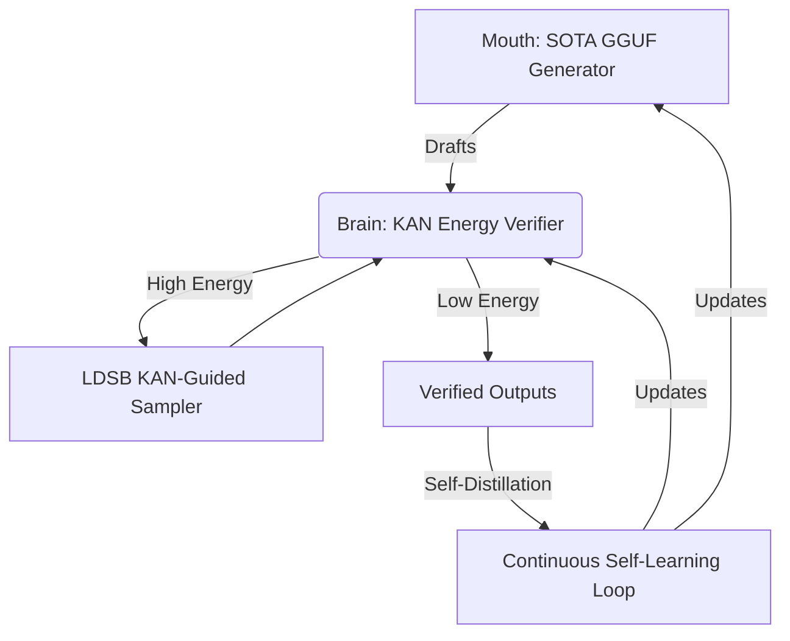

# Change Proposal: Research Roadmap v162
**Date:** 2026-05-13
**Milestone:** 2026.05.162
**Status:** PROPOSED

## 1. Context & Motivation

Milestone 161 successfully separated the Mouth/Brain EBT architecture, proved the ARM-EBM Bijection, and verified Thermodynamic Hardware Sampling. However, based on our continuous goal towards the PRD vision and recent literature findings (2025-2026), three critical gaps remain:

1. **Continuous Self-Learning**: The PRD mandates an autonomous directed self-learning capability. While we have separated the generator (Mouth) from the verifier (Brain), we lack the closed-loop continuous self-learning mechanism where the verifier adapts using self-distillation over reasoning traces.
2. **KAN Integration for Verifiable Energy Functions**: Recent work like GloroKAN and Symbolic-KAN show that Kolmogorov-Arnold Networks (KANs) with B-spline structures provide inherently verifiable and discrete symbolic structures. We must evaluate them as replacements for standard MLPs in our Energy-Based verifiers to enable formal algebraic verification.
3. **Energy-Guided Sampling Optimization**: The Local Diffusion Schrödinger Bridge (LDSB) using KANs demonstrates that sampling steps can be drastically reduced. We need to implement KAN-driven sampling optimization for constrained generation and ensure scaling on hardware.

This milestone addresses these gaps directly, advancing Carnot towards a self-learning, KAN-verified EBM framework.

## 2. Milestone Objectives

- **Phase 1: Continuous Self-Learning Foundation**
  Implement the continuous self-learning framework via nested learning and self-play distillation.
- **Phase 2: Kolmogorov-Arnold Networks (KAN) Integration**
  Scaffold the KAN architecture, incorporating GloroKAN robustness verification and Symbolic-KAN discrete embeddings for verifiable energy functions.
- **Phase 3: Energy-Guided Constrained Generation**
  Implement LDSB diffusion path optimization for energy-guided decoding and scale up constrained generation using SOTA models.
- **Phase 4: Milestone Closure**
  Execute end-to-end tests covering self-learning and KAN verifiers. Validate TSU hardware simulation parity. Complete retrospectives and update docs.

## 3. Architecture Diagram

## 4. Hardware Requirements

- **Dual RTX 3090 CUDA Local SOTA Runtime**: For running mandated GGUF models (`unsloth/Qwen3.6-35B-A3B-GGUF`, `unsloth/gemma-4-31B-it-GGUF`).
- **TSU Hardware Simulation**: Software abstraction and simulation for verifying hardware scaling parity.

## 5. Dependency Graph

- `exp2066` -> `exp2067` -> `exp2068` (Phase 1)
- `exp2069` -> `exp2070` -> `exp2071` (Phase 2)
- `exp2072` -> `exp2073` -> `exp2074` (Phase 3)
- `exp2068`, `exp2071`, `exp2074` -> `exp2075` -> `exp2076` -> `exp2077` (Phase 4)
