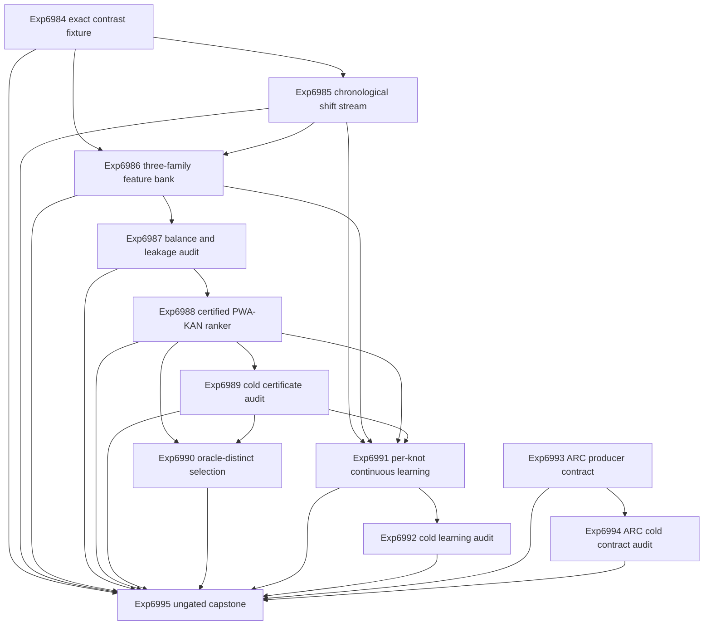

# Research Roadmap vNEXT: Balanced Constraint Energy and Anchored Learning

**Milestone:** `2026.09.612`  
**Status:** Proposed  
**Date:** 2026-09-04  
**Task contract:** 12 tasks, `exp6984` through `exp6995`, in the exact order below.

## Purpose

V611 exposed one sharp scientific blocker. Its calibration candidates all had
the same exact label. The learned PWA-KAN energy could not train or certify.
This milestone creates balanced semantic contrasts before fitting a ranker.

The milestone then tests three claims in order:

1. Frozen GGUF likelihood features contain oracle-distinct semantic signal.
2. A certified PWA-KAN can rank exact mappings without seeing exact labels.
3. Per-knot online updates improve future ranking without erasing prior skill.

The ARC branch repairs evidence production at the live agent boundary. It does
not run a public-game solve or update the solve registry.

## What V611 Proved

V611 completed its 12-task execution contract.

- Exp6973 proved sequential CUDA use for all three required GGUF families.
- Exp6974 repaired claim-provenance duration classification for reducers.
- Exp6975 froze 108 live candidate attempts across three decoding schedules.
- Exp6976 exactly certified every candidate with two agreeing authorities.
- Only two held-out candidates were exact. Calibration had zero exact successes.
- Exp6977 therefore blocked before PWA-KAN training.
- Exp6978 completed 72 chronological arm rows. Every arm tied at six successes.
- Exp6979 reproduced that null, but its substrate name triggered a duration flag.
- Exp6980 retired Spilled Energy after it tied the entropy control.
- Exp6981 found no eligible ARC engine with complete immutable provenance.
- Exp6982 gate-blocked because the PWA-KAN never became ready.
- Exp6983 reconciled the milestone as a terminal scientific null.

V611 also proved what not to repeat. Another prompt schedule cannot create a
learnable boundary from one-class labels. Another ARC reducer cannot infer
provenance that the live producer never wrote.

## Three Biggest Gaps to the PRD Vision

### Gap 1: Constraint evidence is not learnable yet

Carnot can certify a mapping after generation. It still lacks a balanced,
source-grouped corpus for learning semantic error energy. The PRD requires real
constraint extraction, not parser success or a constant negative classifier.

### Gap 2: The verifier moat remains execution-grounded

Exact Z3 and bounded enumeration work, but they are the evaluation oracle.
Carnot has not shown that a learned energy ranks candidates better than matched
non-oracle controls. The north-star document calls this the open moat.

### Gap 3: Learning does not yet change future behavior safely

The V611 memory wrote transactions without changing decisions. Older KAN-CL
work lacked a complete PWA-MILP certificate boundary. ARC engine artifacts also
omit the hashes needed to prove live reachability. The PRD requires a closed,
auditable improvement loop.

## Research Inputs

The current source sweep is recorded in `research-references.md` under
`V612 Planner Refresh - 2026-09-04`.

- KAN-CL motivates per-knot importance anchoring.
- FlowBalance motivates exact group-advantage release rules.
- Verifier-induced support reshaping requires future-support measurements.
- Sol-Ver motivates explicit output diversity and nonconstant labels.
- Verifier-backed hard generation motivates separate proposal and authority.
- FSNet keeps feasibility outside learned objective quality.
- Explorative Modeling motivates frozen multi-candidate contrasts.

These papers do not supply a drop-in Carnot model. V612 adapts their mechanisms
to small local components with exact external evaluation.

## Architecture

The capstone has no structured gate. It reconciles completed, blocked, null,
disqualified, and missing branches without retrying external blocks.

## Phase 1: Balanced Evidence

### Exp6984: Source-grouped exact mapping contrast fixture

Build 36 source-disjoint mapping pairs. Each pair contains one exact positive
and one single-fault negative. Use Z3 and bounded enumeration as authorities.
Freeze 18 train, six calibration, and 12 held-out pairs.

The task must blind serialization and alpha-rename identifiers. It must not
claim that deterministic contrasts measure live extraction quality.

### Exp6985: Sealed chronological constraint-shift stream

Build 24 new chronological events from unseen source groups. Include 16
positive-negative headroom events, four all-valid controls, and four all-invalid
controls. Freeze four ordered shift blocks and all held-future checkpoints.

This fixture gives continuous learning a real decision stream. No online task
may alter its order, features, labels, or support sets.

### Exp6986: Three-family contrast feature bank

Score every frozen contrast, stream candidate, and parseable V611 transfer row.
Use all three required local GGUF families. Run them sequentially under the
lease-aware CUDA path from Exp6973.

This task performs teacher-forced scoring only. Exact labels stay outside the
model process. The expected total is 414 candidate-model rows.

### Exp6987: Independent contrast balance and leakage audit

Rebuild label balance and source splits in a fresh process. Confirm the feature
writer never saw exact labels. Probe length, serialization, source, mutation,
and model-identity shortcuts.

PWA training may start only when this audit emits the exact readiness field in
the task contract.

## Phase 2: Certified Oracle-Distinct Energy

### Exp6988: Certified PWA-KAN constraint ranker

Train a small KAN on train rows only. Use calibration rows once for selection.
Keep held-out contrasts, the chronological stream, and V611 transfer labels
sealed until the model and certificate hashes are frozen.

Build a piecewise-affine abstraction. Use a real MILP solver to prove bounds,
irrelevant-field invariance, and the declared local Lipschitz limits. Compare
constant, likelihood, logistic, and size-matched MLP controls.

### Exp6989: Fresh-process PWA-KAN certificate audit

Load the frozen ranker read-only. Recompute every PWA bound and MILP query.
Recompute held-out metrics from per-candidate rows. A reproduced null is a valid
audit result.

### Exp6990: Oracle-distinct constraint selection comparison

Compare fixed order, mean normalized likelihood, logistic, MLP, and PWA-KAN on
the 12 held-out contrast pairs. Then report transfer on the untouched V611
headroom groups. Use exact labels only after every selection is durable.

The exact oracle is a ceiling and evaluator. It is not an eligible selection
arm. Any positive claim stays limited to the frozen controlled fixture.

## Phase 3: Continuous Self-Learning

### Exp6991: Verifier-grounded per-knot continuous self-learning

Run four arms on the 24-event sealed stream: frozen, unrestricted online,
uniform-anchor, and per-knot-anchor. Score before revealing each exact outcome.

The per-knot arm may update only active spline support. It must use exact group
advantage, no-op on tied groups, journal each update, and roll back unsafe
changes. GGUF weights remain frozen and unloaded.

This task satisfies the milestone's continuous self-learning requirement. It
tests Tier 1 online constraint weights and Tier 4 local structural adaptation.

### Exp6992: Fresh-process self-learning and support audit

Replay all four arms without writes. Recompute chronology, active knots,
importance, updates, rollbacks, future support, and forgetting. Confirm that no
future label entered an earlier decision.

The audit runs after any completed learning result. It does not require a
positive learning verdict.

## Phase 4: ARC Evidence and Reconciliation

### Exp6993: ARC live producer evidence contract

Make the live engine producer write prompt, transition, engine, environment,
policy, and run-manifest hashes at creation time. Exercise the contract through
`make_carnot_agent` and `E3AgentPolicy` with deterministic fixtures.

This task does not contact the ARC service. It does not inspect game source,
claim a level, or modify the solve registry.

### Exp6994: Fresh-process ARC producer contract audit

Replay the new evidence envelope in a restricted process. Trace one fixture
engine through the real agent factory and routing seam. Confirm every hash and
prove that the fixture can influence a candidate action.

This is a contract and reachability audit. It is not a world-model quality or
game-solve experiment.

### Exp6995: V612 independent evidence capstone and V613 handoff

Reconcile all 12 task slots. Recompute every headline from per-unit rows. Report
the three branches separately: learned energy, continuous learning, and ARC
producer reachability.

Use the stable G1-G4 publication gate. Do not count blockers as publication
progress. Recommend V613 from the first causal boundary, not the longest blocked
chain.

## Exact Task Contract

This table is the execution contract for `research-roadmap-next.yaml`.

| Order | Task ID | Exact title | Deliverable | Structured gates |
|---:|---|---|---|---|
| 1 | `exp6984-exact-contrast-fixture` | Source-grouped exact mapping contrast fixture | `results/experiment_6984_exact_contrast_fixture.json` | None |
| 2 | `exp6985-chronological-constraint-stream` | Sealed chronological constraint-shift stream | `results/experiment_6985_chronological_constraint_stream.json` | `exp6984-exact-contrast-fixture.contrast_fixture_complete_score == 1` |
| 3 | `exp6986-three-family-contrast-features` | Three-family contrast feature bank | `results/experiment_6986_three_family_contrast_features.json` | `exp6984-exact-contrast-fixture.contrast_fixture_complete_score == 1`; `exp6984-exact-contrast-fixture.label_balance_ready_score == 1`; `exp6985-chronological-constraint-stream.chronological_stream_ready_score == 1` |
| 4 | `exp6987-contrast-feature-audit` | Independent contrast balance and leakage audit | `results/experiment_6987_contrast_feature_audit.json` | `exp6986-three-family-contrast-features.three_family_feature_bank_complete_score == 1` |
| 5 | `exp6988-certified-pwa-kan-ranker` | Certified PWA-KAN constraint ranker | `results/experiment_6988_certified_pwa_kan_ranker.json` | `exp6987-contrast-feature-audit.contrast_feature_bank_ready_score == 1` |
| 6 | `exp6989-pwa-certificate-cold-audit` | Fresh-process PWA-KAN certificate audit | `results/experiment_6989_pwa_certificate_cold_audit.json` | `exp6988-certified-pwa-kan-ranker.pwa_model_ready_score == 1` |
| 7 | `exp6990-oracle-distinct-selection` | Oracle-distinct constraint selection comparison | `results/experiment_6990_oracle_distinct_selection.json` | `exp6988-certified-pwa-kan-ranker.pwa_model_ready_score == 1`; `exp6989-pwa-certificate-cold-audit.pwa_certificate_confirmed_score == 1` |
| 8 | `exp6991-per-knot-continuous-learning` | Verifier-grounded per-knot continuous self-learning | `results/experiment_6991_per_knot_continuous_learning.json` | `exp6985-chronological-constraint-stream.chronological_stream_ready_score == 1`; `exp6986-three-family-contrast-features.three_family_feature_bank_complete_score == 1`; `exp6988-certified-pwa-kan-ranker.pwa_model_ready_score == 1`; `exp6989-pwa-certificate-cold-audit.pwa_certificate_confirmed_score == 1` |
| 9 | `exp6992-self-learning-support-audit` | Fresh-process self-learning and support audit | `results/experiment_6992_self_learning_support_audit.json` | `exp6991-per-knot-continuous-learning.self_learning_run_complete_score == 1` |
| 10 | `exp6993-arc-producer-evidence-contract` | ARC live producer evidence contract | `results/experiment_6993_arc_producer_evidence_contract.json` | None |
| 11 | `exp6994-arc-producer-cold-audit` | Fresh-process ARC producer contract audit | `results/experiment_6994_arc_producer_cold_audit.json` | `exp6993-arc-producer-evidence-contract.arc_producer_contract_complete_score == 1`; `exp6993-arc-producer-evidence-contract.arc_live_path_fixture_ready_score == 1` |
| 12 | `exp6995-v612-capstone` | V612 independent evidence capstone and V613 handoff | `results/experiment_6995_v612_capstone.json` | None |

No task may add an undeclared gate during implementation. An experiment may
perform internal checks, but those checks must not change conductor order.

## Dependency Graph

- Exp6984 starts the main science branch.
- Exp6985 depends only on Exp6984 completion.
- Exp6986 depends on valid balanced contrasts and the sealed stream.
- Exp6987 audits Exp6986 before training.
- Exp6988 depends on the audited feature bank.
- Exp6989 audits any completed Exp6988 result, including a null.
- Exp6990 depends on a ready model and confirmed certificate.
- Exp6991 uses the ready model, frozen stream, and confirmed certificate.
- Exp6992 audits any completed Exp6991 run.
- Exp6993 is an independent ARC root.
- Exp6994 depends only on Exp6993's two bare readiness fields.
- Exp6995 is ungated and reads every available artifact.

## Hardware Requirements

| Resource | Tasks | Requirement |
|---|---|---|
| Two RTX 3090 GPUs | Exp6986 | Task-owned lease, sequential family loads, CUDA offload, teardown, and VRAM return receipts |
| Required GGUFs | Exp6986 | Qwen3.6-35B-A3B, Gemma-4-31B, and Gemma-4-26B-A4B |
| CPU and RAM | All tasks | Z3, bounded enumeration, small KAN training, MILP, and fresh-process audits |
| Local disk | Exp6984-Exp6992 | Immutable JSONL rows, model hashes, PWA coefficients, journals, and checkpoints |
| ARC service | None | V612 uses deterministic producer fixtures only |
| FPGA boards | None | KV260, GateMate, and PolarFire have no changed access or science state |
| Extropic or Kona | None | No authenticated hardware, public weights, or reproducible local runner exists |

Legacy Qwen3.5-0.8B and Gemma-4-E4B models may run smoke tests only. They may
not enter any comparison, readiness field, or headline.

## Evidence and Stop Rules

- Every comparative task emits per-unit rows.
- Every blocked verdict emits `gate_check_summary`.
- Every task emits the closed `verdict_class` enum.
- Every no-LLM task uses an `inference_substrate` ending in `_no_llm`.
- Every gate reads a bare field declared by its producer.
- Exact labels never enter model features or pre-selection state.
- Exact authorities may evaluate learned ranking, but may not perform it.
- Positive PWA claims require held-out paired improvement over matched controls.
- Positive learning claims require future gain, no lost prior successes, and no support shrinkage.
- ARC tasks emit `solve_claimed=false`, `level_claimed=false`, and `registry_updated=false`.
- External absence is `blocked`, not `partial`.
- The capstone remains runnable after any upstream block.

## Milestone Exit

V612 completes when Exp6995 writes a terminal artifact and reconciles all 12
contract rows. Scientific success is optional. Contract honesty is mandatory.
