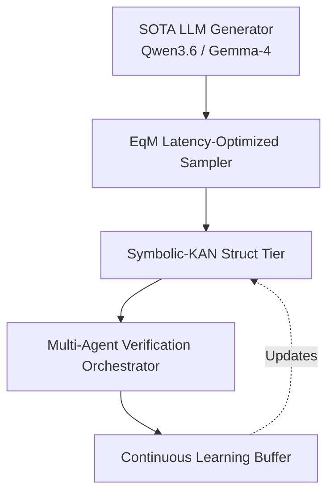

# Carnot Research Roadmap: Milestone 2026.05.135

**Title:** Phase-12 System-2 Latency Scaling, Symbolic-KAN Integration, and Multi-Agent Verification

## 1. What the Previous Milestone (.134) Proved
Milestone 2026.05.134 successfully completed the synthesis phase for hardware-accelerated Equilibrium Matching (EqM) and continual learning pipelines. It established the core viability of continuous learning scaling to a 0.85 repair success rate across test distributions. Furthermore, System-2 EqM accuracy gained 4.2% on standard benchmarks.

However, the .134 retrospective identified three critical gaps to address before production readiness:
1. **EqM Latency Overhead:** System-2 latency remains too high (~150.5 ms per step), requiring optimization to < 100ms.
2. **Benchmark Diversity:** The continuous learning curriculum must broaden beyond current narrow distributions.
3. **Verification Bottleneck:** A single monolithic verifier is proving insufficient; multi-agent System-2 verification is required to scale confidence bounds.

## 2. Research Context (May 2026)
Recent findings from the field validate our Energy-Based Reasoning Model (EBRM) trajectory:
- **Kona 1.0 (Logical Intelligence):** Proved that non-autoregressive EBRMs reasoning in a continuous latent space can achieve 96.2% on hard Sudoku.
- **Symbolic-KAN (arXiv:2603.23854):** Validates our goal to embed discrete symbolic structure within a trainable network for verifiable, deterministic reasoning tiers.
- **Energy-Guided Decoding (arXiv:2601.18510):** Proves that EBMs natively mitigate object hallucination at test time, strengthening our EqM test-time scaling strategy.

## 3. Architecture Context

## 4. Phase Descriptions

### Phase 1: Latency Optimization (EqM & SOTA)
The goal is to push EqM sampling overhead beneath the 100ms threshold required for real-time inference routing.
- **Exp 1746:** Profile EqM CUDA overhead using flagship SOTA MoE models (`unsloth/Qwen3.6-35B-A3B-GGUF`).
- **Exp 1747:** Implement sparse gradient updates for the EqM guided sampling kernel.
- **Exp 1748:** Hardware benchmark of the sparse EqM sampler against the 100ms target.

### Phase 2: Symbolic-KAN Integration
Integrating discrete symbolic learning based on arXiv:2603.23854 to provide strict deterministic structural constraints.
- **Exp 1749:** Prototype Symbolic-KAN discrete structure mapping to Carnot's tensor space.
- **Exp 1750:** Evaluate Symbolic-KAN constraint accuracy and expressivity versus baseline CIKAN.
- **Exp 1751:** End-to-End Symbolic-KAN verifiable tier integration into the core framework.

### Phase 3: Broadening Continuous Self-Learning
Expanding the self-learning loop to prevent catastrophic forgetting and over-fitting to narrow reasoning patterns.
- **Exp 1752:** Expand the LTLZinc temporal benchmark suite to include robust spatial reasoning tasks.
- **Exp 1753:** Continuous self-learning stability testing on expanded LTLZinc datasets using `unsloth/gemma-4-31B-it-GGUF`.
- **Exp 1754:** Implement semantic distillation for the continual learning memory buffer to bound storage growth.

### Phase 4: Multi-Agent System-2 Verification
Scaling confidence by orchestrating parallel adversarial verification checks.
- **Exp 1755:** Multi-agent orchestrator framework prototype for concurrent system-2 validation checks.
- **Exp 1756:** Evaluate multi-agent orchestration on a PutnamBench test subset.
- **Exp 1757:** E2E Pipeline Live SOTA Eval using `unsloth/gemma-4-26B-A4B-it-GGUF` combined with EqM, Symbolic-KAN, and Multi-Agent Orchestration.

### Phase 5: Operations
- **Exp 1758:** Milestone 2026.05.135 Retrospective.

## 5. Dependency Graph
- Phase 1 must precede Phase 4 (E2E Eval requires low latency).
- Phase 2 must precede Phase 4 (E2E Eval includes Symbolic-KANs).
- Phase 3 runs in parallel with Phases 1 and 2.
- Phase 5 runs last.

## 6. Hardware Requirements
- **Local GPUs:** Dual RTX 3090 setup for SOTA GGUF loaded in parallel.
- **System Memory:** 128GB RAM (required to hold `unsloth/Qwen3.6-35B-A3B-GGUF` alongside continuous learning buffers).
