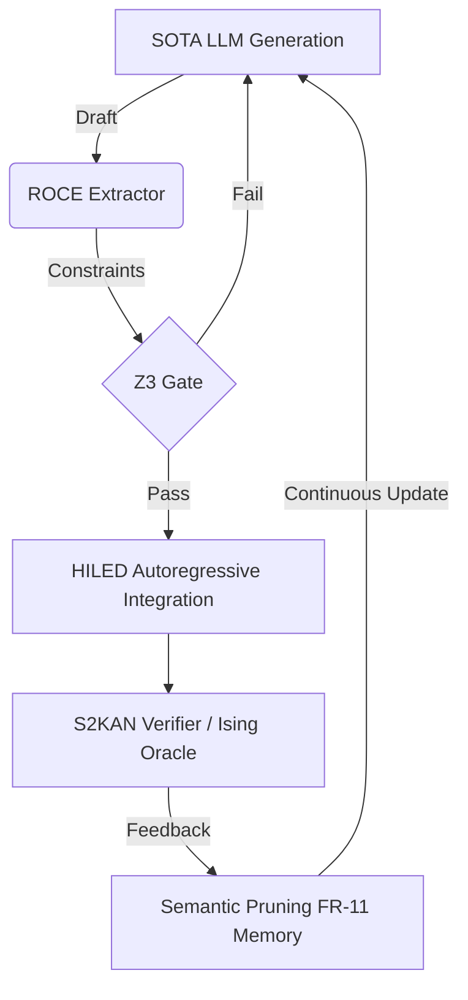

# Carnot Research Roadmap: Milestone 2026.05.146
**Status:** PROPOSED  
**Doc Version:** vNEXT  
**Target:** Continuous Self-Learning Scale, Constraint Elicitation, and Hardware Integration

## 1. What Previous Milestones Proved
Milestone 2026.05.145 successfully established the Verification Learning (VL) proxy, enabling constraint satisfaction scoring natively without labeled targets. It also integrated Softly Symbolified KANs (S2KAN) with Z3 formal verification over bounded domains, and validated these on the mandated local SOTA models.

## 2. Gaps and Objectives
The three biggest gaps between the current state and the PRD vision are:
1. **Dynamic Open Constraint Elicitation (ROCE):** Bridging natural language user instructions to rigorous Carnot constraints automatically at runtime.
2. **Robust Semantic Continual Learning:** The FR-11 loop runs, but we lack latent semantic pruning to ensure catastrophic forgetting is strictly prevented at SOTA MoE scales.
3. **Hardware-In-The-Loop Energy Decoding (HILED):** Using our simulation and KV260 hardware targets natively in the autoregressive decoding loop for continuous optimization.

## 3. Architecture Overview

## 4. Phases
### Phase 1: Reasoning-Time Open Constraint Elicitation (ROCE)
Extracting verifiable constraints directly from unconstrained generation using SOTA GGUFs, bridging the natural language gap.

### Phase 2: Scalable Continuous Self-Learning & Semantic Pruning
Deploying Latent Energy Optimization to filter and semantically prune memory traces, ensuring zero-forgetting in FR-11 self-learning loops.

### Phase 3: Hardware-in-the-Loop Energy Decoding & Ising Consensus
Integrating simulated HILED within the generation process and using Ising models as an oracle for multi-agent consensus.

### Phase 4: Cross-Language E2E Verification
Formalizing the S2KAN implementation in Rust and running the full cascade test suite to ensure architectural parity and stability.

## 5. Hardware Requirements
- **Local SOTA Runtime:** Dual RTX 3090 GPUs (for `unsloth/Qwen3.6-35B-A3B-GGUF` and `unsloth/gemma-4-31B-it-GGUF`).
- **Hardware Integration:** Simulator CPU execution required for HILED prototyping; no actual KV260 execution claims in this milestone.
