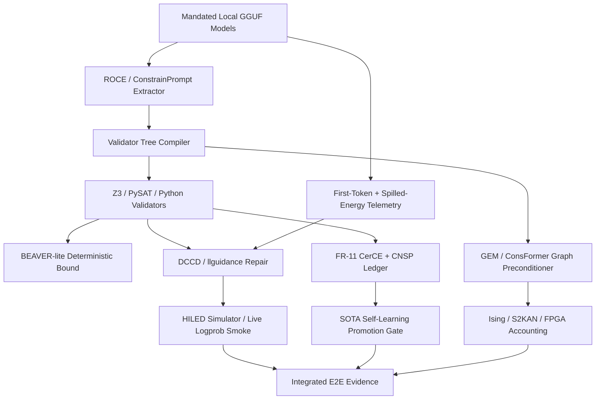
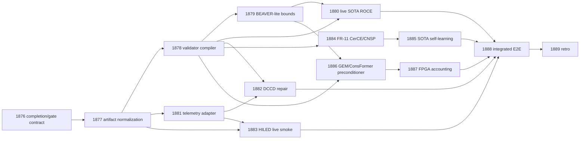

# Carnot Research Roadmap: Milestone 2026.05.147

**Status:** PROPOSED  
**Doc Version:** vNEXT  
**Target:** Prompt-to-validator contracts, low-cost SOTA telemetry, continuous self-learning, and hardware-accounted constraint graphs
**Supersedes:** Milestone 2026.05.146
**Execution queue:** `research-roadmap-next.yaml`

## What Milestone 2026.05.146 Proved

| Area | Experiments | Finding |
|---|---:|---|
| ROCE | 1864, 1865 | ROCE can extract simple dynamic constraints (`success_rate=0.80`) but the artifact missed standard result fields, so downstream gates read `status=None` and skipped ROCE/Z3 validation. |
| Continuous learning | 1866, 1868 | LTLZinc replay retained prior constraints with `nonforgetting_rate=1.0`; latent semantic pruning was blocked by doomed-rerun discipline and needs a changed root-cause plan. |
| HILED | 1869, 1870 | CPU HILED simulation produced `constraint_enforcement_rate=1.0`, but the live inference gate failed on missing artifact fields, not on the method itself. |
| S2KAN | 1871 | Rust S2KAN fast evaluation landed with a complete artifact and gives the next milestone a stable KAN verifier substrate. |
| Consensus | 1872 | Ising consensus found a minimum-energy agreement over five synthetic agent answers, proving the oracle pattern at toy scale. |
| Energy Matching | 1873 | Generic Energy Matching generation reruns were correctly blocked as insufficiently changed from prior failed scope. |

**Operational lesson:** `.146` did not mainly fail on math. It failed on evidence contracts. The next milestone must repair artifact contracts before attempting live SOTA or downstream-gated claims.

## Three Biggest Gaps to PRD Vision

1. **Prompt-to-validator gap:** PRD FR-12 requires deterministic verification of reasoning outputs, but `.146` ROCE only extracted toy constraints. Carnot needs a compiler from prompt/user constraints to executable validator trees with zero false accepts.
2. **Trustworthy continuous self-learning gap:** FR-11 requires autonomous improvement without forgetting. Current LTLZinc/CerCE checks prove retention on small ledgers, but policy promotion is not yet connected to live SOTA verifier telemetry and bounded utility.
3. **Hardware-accounted energy reasoning gap:** Phase 2/3 requires hardware-portable sampling. Carnot has S2KAN/Ising simulation and Rust paths, but no per-constraint graph resource accounting for KV260/TSU-style execution and no live HILED evidence with standard provenance.

## External Findings Incorporated

- **First Token Knows + Spilled Energy:** add low-cost logit telemetry to `VerdictRecord`, but keep deterministic validators as acceptance authority.
- **ConstrainPrompt / NSVIF / BEAVER / DCCD:** compile natural-language constraints into executable validator trees, attach deterministic bound rows, and only then use structured repair.
- **Glauber text diffusion / DINGO / CFG-constrained diffusion:** keep Carnot constraint adapters non-autoregressive-ready by exposing automata and validator metadata.
- **EBT and ARM-as-EBM citation watch:** Planning as Descent, Graph Energy Matching, False First Steps, and Ontology-Constrained Reasoning all point toward whole-trace energy descent plus explicit grounding constraints.
- **KAN and Ising hardware papers:** KAN PWA/MILP verification, hardware complexity metrics, analog KANs, BiKA, and FPGA Ising decomposition motivate no-synthesis resource accounting over actual ROCE/S2KAN graphs.
- **Extropic/Kona status:** use public THRML/Kona materials as architecture comparators only. No Z1/XTR-0, KV260 board, or Kona-equivalent performance claim without authenticated evidence.

## Architecture

## Phase Plan

### Phase 0: Evidence Contract Repair

Experiments 1876-1877 archive `.146`, normalize malformed ROCE/HILED artifacts into standard schema wrappers, and create explicit gate fields for downstream tasks. This phase is intentionally first because `.146` demonstrated that good local artifacts are not enough if the conductor cannot read them.

### Phase 1: Prompt-to-Validator Compilation

Experiments 1878-1880 turn ROCE into a ConstrainPrompt-style validator tree, add BEAVER-lite deterministic bound rows, and run live SOTA ROCE validation across all mandated local GGUFs. The acceptance rule is zero false accepts; soft energy/logit signals remain advisory.

### Phase 2: Low-Cost Telemetry, Structured Repair, and HILED

Experiments 1881-1883 add first-token and spilled-energy telemetry, run DCCD/llguidance repair conditioned on compiled validators, and re-attempt HILED live inference only after `.146` artifact-field failures are addressed.

### Phase 3: Continuous Self-Learning and Hardware-Accounted Constraint Graphs

Experiments 1884-1887 connect validator-tree outcomes to CerCE/CNSP non-forgetting certificates, run a SOTA FR-11 promotion gate, test GEM/ConsFormer-style preconditioning for Ising convergence, and estimate FPGA/KAN/Ising resource costs without making synthesis or board claims.

### Phase 4: Integrated Evidence and Retro

Experiments 1888-1889 run the tri-model E2E smoke and file a compact retrospective focused on what can safely advance to the next milestone.

## Dependency Graph

## Experiment Summary

| Exp | Title | Deliverable | Primary gate |
|---:|---|---|---|
| 1876 | `.146` Completion Ledger and `.147` Gate Field Contract | `results/experiment_1876_146_completion_147_gate_contract.json` | none |
| 1877 | ROCE/HILED Artifact Contract Normalization | `results/experiment_1877_artifact_contract_normalization.json` | 1876 |
| 1878 | ROCE-to-Validator Tree Compiler | `results/experiment_1878_roce_validator_tree.json` | 1877 |
| 1879 | BEAVER-lite Deterministic Bounds | `results/experiment_1879_beaver_lite_bounds.json` | 1878 |
| 1880 | Live SOTA ROCE Validator Evaluation | `results/experiment_1880_sota_roce_validator_eval.json` | 1878, 1879 |
| 1881 | First-Token + Spilled-Energy Telemetry | `results/experiment_1881_low_cost_hallucination_telemetry.json` | 1877 |
| 1882 | DCCD/llguidance Repair with ROCE Validators | `results/experiment_1882_dccd_roce_repair.json` | 1878, 1881 |
| 1883 | HILED Live Logprob Smoke | `results/experiment_1883_hiled_live_logprob_smoke.json` | 1877, 1881 |
| 1884 | FR-11 CerCE/CNSP Validator-Tree Ledger | `results/experiment_1884_fr11_cerce_cnsp_ledger.json` | 1878 |
| 1885 | SOTA FR-11 Self-Learning Promotion Gate | `results/experiment_1885_sota_fr11_promotion_gate.json` | 1884 |
| 1886 | GEM/ConsFormer Ising Preconditioner | `results/experiment_1886_gem_consformer_preconditioner.json` | 1878, 1879 |
| 1887 | FPGA/S2KAN/Ising Resource Accounting | `results/experiment_1887_fpga_s2kan_ising_accounting.json` | 1886 |
| 1888 | Integrated Tri-Model E2E Evidence | `results/experiment_1888_integrated_trisota_e2e.json` | 1880, 1882, 1883, 1885, 1887 |
| 1889 | Milestone `.147` Retrospective | `results/experiment_1889_milestone_147_retro.json` | none |

## Hardware Requirements

| Requirement | Used by | Boundary |
|---|---|---|
| Dual RTX 3090 local GGUF runtime | 1880, 1881, 1882, 1883, 1885, 1888 | Required for headline SOTA rows. If unavailable, artifact must block loudly and record no headline result. |
| CPU/JAX/PySAT/Z3 | 1878, 1879, 1884, 1886 | Sufficient for validator compilation, deterministic bounds, and graph preconditioning. |
| Rust/PyO3 toolchain | 1877, 1887 | Needed for schema wrapper and S2KAN accounting checks. |
| KV260/Vivado | none | No Vivado synthesis, bitfile, or board-execution claim in this milestone. Only no-synthesis resource estimates are allowed. |
| THRML/Extropic | 1887 optional read-only comparison | THRML simulator status may inform accounting; no Z1/XTR-0 execution claim. |

## Acceptance Gates

- Every artifact used as an upstream gate must contain the exact field named by `gated_on`.
- Every LLM-bearing experiment must list the mandated local GGUFs in `MODEL_SPECS`: `unsloth/Qwen3.6-35B-A3B-GGUF`, `unsloth/gemma-4-31B-it-GGUF`, and `unsloth/gemma-4-26B-A4B-it-GGUF`.
- Deterministic validators remain the only acceptance authority; first-token confidence and spilled energy are advisory telemetry.
- Continuous self-learning task requirement is satisfied by Exp 1884 and promoted at SOTA scale only through Exp 1885 if `utility_delta > 0` and `promotion_gate_passed=true`.
- Hardware claims are simulator/accounting-only unless the artifact contains authenticated device, bitfile, command transcript, and latency provenance.

## Decentralization Implications

The milestone preserves local-first execution: all headline LLM tasks use local open-weight GGUF models, all validators run locally, closed providers are not required, and hardware work remains portable CPU/GPU/FPGA/TSU accounting rather than vendor-locked integration.
