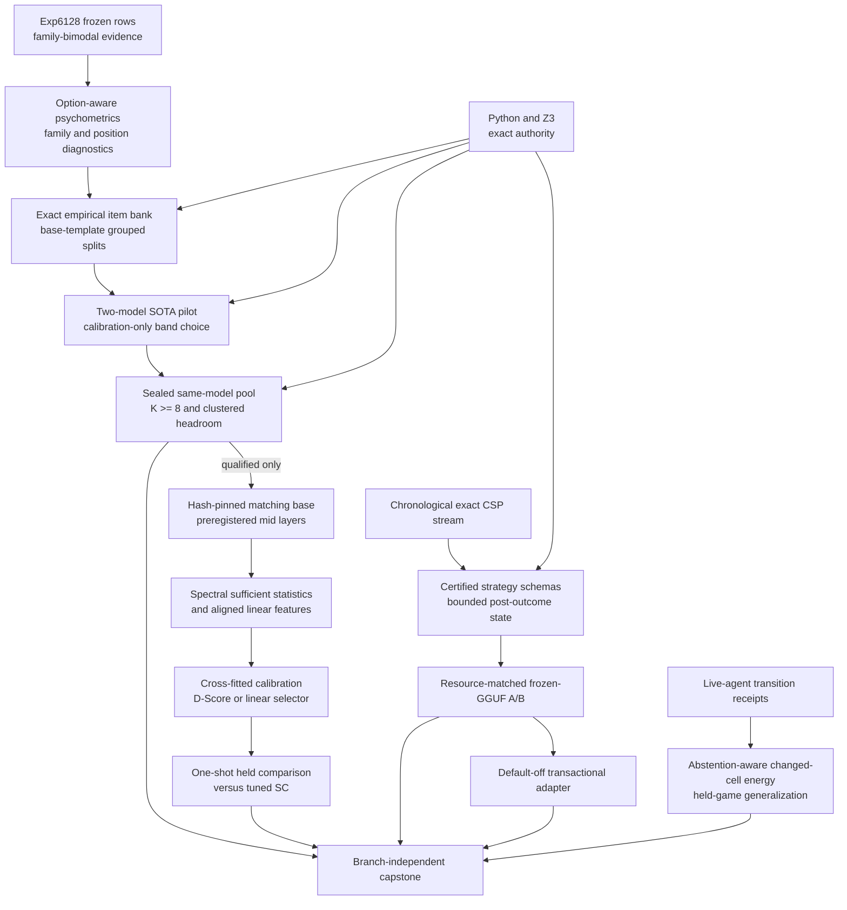

# Research Roadmap vNEXT — Milestone 2026.08.532

**Milestone title:** Empirically Calibrated Phase-D Verification, Certified
Strategy Memory, and ARC Change Fidelity

**Status:** Planned after terminal milestone `2026.08.531`

**Experiment range:** Exp6138-Exp6151

**Architecture freshness note:** `_bmad/architecture.md` was last reconciled on
2026-07-03 and is stale relative to the `.531` transport and calibration
artifacts. It is historical evidence, not proof that proposal-only `.531`
self-learning, ARC, or capstone components shipped. Exp6151 must reconcile it
only against delivered `.532` artifacts.

**Primary question:** Can Carnot replace Phase D's misleading family-average
difficulty with an empirically calibrated same-model candidate domain, test a
training-free spectral or linear internal-state verifier against tuned
self-consistency, and turn compact outcome memory into a verifier-certified
continuous learner while improving the live ARC world-model verifier's
cross-game change fidelity?

## What milestone 2026.08.531 proved

| Evidence | Terminal result | Consequence for `.532` |
|---|---|---|
| Exp6124 transition | `complete`; exactly the activated `.530` identities were archived and the collision count stayed zero | Use Exp6138 for the same exact-ledger handoff; proposal-only Exp6133-Exp6137 are not completed experiments |
| Exp6125 source delta | Failed three attempts before artifact emission because the configured Gemini model metadata was unavailable | Keep the required SOTA slot, but use the reliable default Claude path and a post-V532 marker window |
| Exp6126 forensics | `complete_ready`; immutable Exp6115 evidence justified one label-blind model-native transport change | The transport diagnosis is closed; do not rerun raw-completion/newline-stop forensics |
| Exp6127 native-chat canary | `complete_ready`; the task-owned 26B MoE path reached non-empty, terminal, parseable answers | Model-native transport is usable, but artifact methodology must expose bare top-level `model_specs` as well as file hashes |
| Exp6128 calibration pool v2 | `complete_null`; 720 rows, 90 questions, effective `K=7.9889`, parseability/method validity `1.0`, all-wrong `0.10`, oracle@K `0.90`, tuned SC `0.6889`, and headroom `0.2111`; the only aggregate failure was accuracy `0.7236 > 0.70` | Transport and diversity are no longer the bottleneck; empirical difficulty calibration is |
| Exp6128 family strata | Scheduling and logic-grid accuracy were `1.0`, while `typed_finite_choice` was `0.1708`, below its enumerated `0.25` floor, with all-wrong `0.30` | The aggregate middle band is a mixture of saturated and below-floor families. Never average those families into readiness again |
| Exp6129-Exp6132 | Correctly gate-blocked or skipped after Exp6128 readiness stayed zero | Rebuild the domain before hidden-state extraction; do not bypass the chain |
| `.531` operational receipts | The long calibration run exposed task-lifecycle/zombie-server VRAM retention and methodology warnings for missing top-level model specifications | Every live-model task owns load/decode/release, records readiness-phase timing, and emits bare `model_specs` |
| Missing active `.531` tasks | The activated YAML ended at Exp6132, so the proposal's idempotent CSL, ARC, and capstone tasks never entered conductor execution | Restore continuous self-learning and the standing ARC floor under new collision-free IDs rather than treating them as failed experiments |

## The three largest gaps to the PRD vision

### Gap 1 — Phase D has headroom but no authentic difficulty band

PRD FR12 needs a generator whose plausible alternatives leave room for an
oracle-distinct verifier. Exp6128 finally established natural same-model
diversity and aggregate oracle headroom, but its nominal difficulty strata hid
a severe family mixture: two families were solved perfectly and one was below
chance. A verifier trained or evaluated on that mixture could win through
family identity, option position, or fallback behavior rather than reasoning
quality.

`.532` first audits the frozen rows with option-aware response diagnostics,
family-conditional intervals, position/permutation controls, and empirical
information estimates. A deterministic builder then produces exact-labeled,
base-template-grouped transformations without running an LLM. A two-model SOTA
pilot chooses one generator and one competent-but-unsaturated band using only
calibration outcomes. Only then may a sealed same-model `K>=8` held pool run.

### Gap 2 — the learned verifier still has no decision-grade internal surface

Carnot's prior MMLU final-layer probe did not beat all controls, and `.531`'s
mid-layer tasks never ran. Exp6128 nevertheless shows that a valid Phase-D
selection question may exist once the item distribution is repaired. Recent
work adds a training-free spectral hypothesis: hidden trajectories that encode
assertion and counter-evidence may spread over more near-leading singular
directions.

`.532` gates all activation work on a qualified held pool, proves matching-base
layer and token alignment, and caches immutable sufficient statistics for a
preregistered mid-layer band. Calibration compares D-Score with one simple
linear probe and final-layer/norm/length/answer-label/shuffled controls. A
one-shot held evaluation tests the selected method against tuned
self-consistency. Exact labels remain the oracle; the verifier is explicitly
oracle-distinct.

### Gap 3 — continuous learning and ARC verification are not live-qualified

PRD FR11 requires improvement from verified experience. Exp6120 proved only
that a bounded outcome-committed utility state can tie eventual utility with a
smaller representation; it did not improve the frozen model's future reasoning
through certified reusable strategies, and `.531` never ran the planned retry
stress. Separately, ARC's live world-model gate has a measured changed-cell
recall floor near zero, while its `change_accuracy` denominator drops raised
rows and can inflate the first future positive.

`.532` adds a verifier-certified strategy-schema bank around a frozen SOTA GGUF:
read-only decision snapshots, post-outcome commits, exact replay, idempotent
duplicate delivery, poison quarantine, rollback, bounded memory, and immutable
weights. The single ARC floor task fixes the abstention denominator and tests a
generic changed-cell energy across held games using only the live agent's own
transition evidence. It makes no solve claim.

## Research findings incorporated

| Source | Finding | `.532` use |
|---|---|---|
| Every Wrong Answer Counts, arXiv:2608.02966 | Wrong-option identity exposes position, calibration, and fallback behavior lost by binary accuracy | Exp6140 diagnoses Exp6128's `typed_finite_choice` floor and saturated-family perturbations before generation |
| Laplace-PSN-IRT, arXiv:2607.25257 | Item difficulty and information estimates require uncertainty, not point ranks | Exp6140-Exp6142 use question-clustered uncertainty and calibration-only empirical item selection |
| D-Score, arXiv:2607.24586 | A single-forward-pass spectral statistic over hidden activations can signal unsupported content | Exp6144-Exp6146 compare a faithful spectral construction with a linear mid-layer probe and zero-training controls |
| ISM, arXiv:2606.31191 | A frozen LLM can improve under episodic resets with compact, actively maintained, symbolically certified strategy memory | Exp6147-Exp6149 build, test, and shadow-wire verifier-certified strategy schemas without weight mutation |
| AudioRubrics, arXiv:2608.02831 | Static criteria saturate as capability changes | Used only to motivate empirical requalification; model-generated rubrics never replace exact Python/Z3 labels |
| Semantic Scholar refresh | The 2026-08-05 API showed 32 visible EBT citations and eight ARM-EBM citations, with no newly superior executable path | Counts remain discovery receipts, not evidence or a comparator |
| Extropic official hardware | Z1 Stick and Card remain early access 2027 | No TSU execution, speed, power, or availability task is eligible |
| Logical Intelligence Kona | Public material still describes a constraint layer without weights or a documented local API | Retain the generator/verifier boundary as context only |

The dated URLs, dispositions, secondary-source checks, and GitHub/hardware
negative receipts are recorded before this design in `research-references.md`
under `V532 Planner Refresh - 20260805`.

## Target architecture



Load-bearing boundaries:

- Exact Python/Z3 validators label candidate answers and certify strategy
  records. D-Score, probes, model confidence, memory utility, and ARC change
  energy are never oracles.
- Exp6140 and Exp6141 read only frozen calibration evidence. They cannot alter
  sealed held questions using held labels.
- Base-template groups, including every derived permutation/paraphrase, remain
  wholly inside one split. Surface variants cannot cross calibration/held.
- Two-model pilot results choose one generator and one item band before held
  generation. The held pool is same-model; cross-model votes are forbidden.
- Family readiness is conjunctive. A saturated family cannot cancel a
  below-floor family in an aggregate mean.
- GGUF generation and matching-base activation extraction are distinct
  substrates. Model revision, file hash, tokenizer, template, precision,
  device map, token alignment, and lifecycle receipts are explicit.
- The internal verifier consumes immutable cached activation statistics.
  External generated-text/logprob scorers and the retired MMLU final-embedding
  construction are not reopened.
- Continuous learning reads a frozen memory snapshot during a decision and
  commits only after an exact external outcome. Model weights are hash-pinned
  and immutable. Replayed outcomes are idempotent.
- ARC evidence comes from `E3AgentPolicy`/`make_carnot_agent` transitions. No
  game source, exhaustive ground-truth BFS, hand GameAdapter solve, public-level
  re-credit, or hidden-game claim is eligible.

## Reservation and majority accounting

| Class | Tasks | Count |
|---|---|---:|
| Infrastructure | Exp6138 transition, Exp6151 capstone | 2 |
| Phase-D evidence ingestion | Exp6139 | 1 |
| Phase-D claim production | Exp6140-Exp6146 | 7 |
| Continuous self-learning | Exp6147-Exp6149 | 3 |
| ARC generalization floor | Exp6150 | 1 |
| **Total** | Exp6138-Exp6151 | **14** |

Eight of fourteen tasks are Phase-D evidence or execution, preserving the
standing Phase-D majority. The two infrastructure reservations and one SOTA
ingestion reservation are explicit. ARC receives exactly one generalization
slot because the local induction, search-ordering, and public-solving lines are
closed or down-weighted.

## Phase 0 — exact transition and execution-time source delta

### Exp6138 — exact transition into `.532`

Archive only the nine activated `.531` task identities and their actual
terminal states. Record Exp6125's no-artifact backend failure, Exp6128's family
bimodality, all downstream gate skips, and the difference between active YAML
and proposal-only prose. Activate `.532` and prove Exp6138-Exp6151 collision
free.

**Deliverable:** `results/experiment_6138_transition_v532.json`

### Exp6139 — post-V532 source-delta ingestion

Search only after `V532-PLANNER-REFRESH-20260805-END`, using the reliable
low-concurrency source path. Map every accepted or rejected delta to an
existing `.532` task or defer it; task identities and gates are immutable.
Zero accepted deltas is an honest complete-null result.

**Deliverable:** `results/experiment_6139_v532_source_delta_ingestion.json`

## Phase A — empirically calibrated Phase-D domain

### Exp6140 — frozen Exp6128 option-psychometric and mixture audit

Recompute all question/family/stratum metrics from immutable Exp6128 rows.
Estimate answer-position effects, wrong-option modes, fallback clusters,
family-conditional accuracy/headroom, permutation consistency, and
question-clustered empirical information with uncertainty. Produce a
label-blind transformation specification or retire this source pool.

**Deliverable:** `results/experiment_6140_phase_d_exp6128_option_psychometrics.json`

### Exp6141 — gated exact empirical item bank

Build deterministic, exact-labeled calibration and sealed-held item variants
from base templates. Candidate transformations include balanced option
positions, typed-choice normalization, constraint-composition depth, controlled
distractors, proof-preserving relabeling, and templated paraphrase. Split by
base template before transformation and validate every answer independently.

**Gate:** Exp6140 `empirical_item_bank_design_ready_score == 1.0`

**Deliverable:** `results/experiment_6141_phase_d_empirical_item_bank.json`

### Exp6142 — gated two-model empirical-difficulty pilot

Sequentially run `unsloth/Qwen3.6-35B-A3B-GGUF` and
`unsloth/gemma-4-26B-A4B-it-GGUF` on a frozen calibration-only subset. Use
natural independent draws and identical compute policies. Choose one generator
and preregister one eligible item band only if method validity, effective K,
chance-floor, non-saturation, option balance, and empirical-information gates
hold within that model; cross-model averaging is forbidden.

**Gate:** Exp6141 `empirical_item_bank_ready_score == 1.0`

**Deliverable:** `results/experiment_6142_phase_d_two_model_irt_pilot.json`

### Exp6143 — gated sealed same-model held pool v3

Freeze Exp6142's generator, template, decode policy, transformation families,
and eligibility rule. Generate `K>=8` natural draws on at least 120 sealed-held
questions. Require family-conditional competence, non-saturation, effective K,
method validity, bounded all-wrong rate, and question-clustered
`oracle@K - tuned_SC` headroom. Persist raw rows and task-owned GPU lifecycle
receipts.

**Gate:** Exp6142 `phase_d_pilot_ready_score == 1.0`

**Deliverable:** `results/experiment_6143_phase_d_held_pool_v3.json`

## Phase B — authenticated spectral/internal-state verifier

### Exp6144 — gated matching-base spectral surface

Resolve the exact base corresponding to the selected GGUF, prove tokenizer and
pre-answer-marker alignment, and stream a preregistered mid-layer band on
calibration and held candidates. Cache immutable activation-matrix spectral
sufficient statistics and aligned linear features, with final-layer/norm/length
controls. Fail closed on ambiguity, unsupported layers, memory pressure, or
model mismatch.

**Gate:** Exp6143 `phase_d_headroom_ready_score == 1.0`

**Deliverable:** `results/experiment_6144_phase_d_spectral_surface.json`

### Exp6145 — gated cross-fitted selector calibration

Using calibration groups only, compare faithful D-Score thresholds with one
regularized linear mid-layer probe and preregistered zero-training controls.
Select at most one immutable selector. Require non-degeneracy, group-isolated
cross-fitting, enough oracle-recoverable questions, and a calibration gain that
cannot be explained by family, position, norm, length, or answer label.

**Gate:** Exp6144 `spectral_surface_ready_score == 1.0`

**Deliverable:** `results/experiment_6145_phase_d_selector_calibration.json`

### Exp6146 — gated one-shot held selector evaluation and adversarial check

Apply the frozen selector once to sealed held candidates. Compare paired
question accuracy, exact utility, abstention, latency, and compute against
tuned self-consistency and all controls. The adversarial pass must attempt
family leakage, option-position shortcuts, answer-label prediction, duplicate
contamination, held-selection leakage, and model-identity shortcuts. A positive
requires the paired lower interval above zero and no exact-utility regression.

**Gate:** Exp6145 `selector_calibration_ready_score == 1.0`

**Deliverable:** `results/experiment_6146_phase_d_selector_held_eval.json`

## Phase C — certified self-learning, ARC change fidelity, and reconciliation

### Exp6147 — deterministic certified-strategy/idempotence fixture

Build a chronological exact-CSP fixture with reusable strategy families,
successful and failed episodes, delayed outcomes, exact duplicates, reordered
retries, poison, rollback checkpoints, and protected-prefix sentinels. Define a
bounded strategy-schema record whose admission requires exact certificate
evidence, and establish Python/Rust/PyO3 parity before live inference.

**Deliverable:** `results/experiment_6147_csl_certified_strategy_fixture.json`

### Exp6148 — gated frozen-GGUF continuous self-learning A/B

Run `unsloth/Qwen3.6-35B-A3B-GGUF` with immutable weights on the chronological
stream. Compare certified strategy schemas plus reduced-order utility against
utility-only, equal-byte write-through, shuffled-schema, and no-memory arms.
Memory is read-only during decisions and committed after exact outcomes.
Measure future-event accuracy/utility, online AUC, recovery, retention,
idempotence, poison, rollback, bytes, latency, and weight hashes.

**Gate:** Exp6147 `csl_schema_fixture_ready_score == 1.0`

**Deliverable:** `results/experiment_6148_csl_verified_strategy_memory_ab.json`

### Exp6149 — gated default-off certified-strategy shadow adapter

Only after every scientific and safety gate passes, add a default-off adapter
that reads and writes certified strategy records through the existing
transactional store. Shadow decisions cannot alter production selection or
verifier authority. Test disabled parity, replay, duplicates, rollback, poison
quarantine, protected-prefix retention, fixed-width ABI parity, and immutable
weights.

**Gate:** Exp6148 `verified_strategy_memory_ready_score == 1.0`

**Deliverable:** `results/experiment_6149_csl_verified_strategy_shadow_adapter.json`

### Exp6150 — ARC abstention-aware changed-cell verifier generalization

Use the live agent's own recorded transitions to repair the
engine-dependent `change_accuracy` denominator, report raises explicitly, and
build a generic change-fidelity energy that distinguishes no-op engines,
runaway writers, honest partial engines, identity, and visible-lookup attack
controls. Fit only on development games and evaluate leave-one-game-out/held
games through the live `E3AgentPolicy` surface. Any integration stays
default-off. No level solve or public-level credit is claimed.

**Deliverable:** `results/experiment_6150_arc_abstention_aware_change_verifier.json`

### Exp6151 — branch-independent capstone and reconciliation

Reconcile all terminal artifacts, including absent and gate-skipped branches.
Update operations/spec/traceability/architecture documents only for shipped
surfaces, run applicable checks, exclude adversarially flagged artifacts, and
state which Phase-D, CSL, and ARC claims are supported, null, retired, or
blocked.

**Deliverable:** `results/experiment_6151_v532_capstone_reconciliation.json`

## Dependency graph and conductor order

```text
Exp6138 transition
  ├── Exp6139 source delta (independent evidence branch)
  ├── Exp6140 cached psychometric audit
  │     └──[design=1] Exp6141 exact item bank
  │           └──[bank=1] Exp6142 two-model pilot
  │                 └──[pilot=1] Exp6143 held pool
  │                       └──[headroom=1] Exp6144 spectral surface
  │                             └──[surface=1] Exp6145 calibration
  │                                   └──[selector=1] Exp6146 held eval
  ├── Exp6147 CSL fixture
  │     └──[fixture=1] Exp6148 live CSL A/B
  │           └──[ready=1] Exp6149 shadow adapter
  └── Exp6150 ARC change verifier

Exp6139 + every terminal Phase-D/CSL/ARC branch ──> Exp6151 capstone
```

Conductor order is exactly Exp6138 through Exp6151. Structured gates skip the
agent call when an upstream score is not `1.0`; capstone remains ungated so it
can reconcile honest nulls and skips.

## Hardware and model requirements

| Resource | Tasks | Requirement |
|---|---|---|
| Dual RTX 3090, 24 GiB each | Exp6142-Exp6144, Exp6148 | Task-owned lease; CUDA-enabled `llama_cpp`; sequential model eviction; `nvidia-smi` engagement; explicit load/readiness/decode/release timing; no inherited server PID |
| Qwen flagship MoE | Exp6142, Exp6148 | `unsloth/Qwen3.6-35B-A3B-GGUF`, exact cached file hash, embedded GGUF tokenizer through llama.cpp |
| Gemma middle MoE | Exp6142 and possible Exp6143/Exp6144 selected path | `unsloth/gemma-4-26B-A4B-it-GGUF`, exact cached file hash, model-native template |
| Matching base transformer | Exp6144 | Explicit non-GGUF base revision/tokenizer, declared quantization/precision and device map; never call `AutoTokenizer` on the GGUF repo ID |
| CPU/Rust/PyO3 | Exp6140-Exp6141, Exp6145-Exp6147, Exp6149-Exp6151 | Deterministic exact validation, cached aggregation, tests, fixed-width ABI parity |
| KV260/GateMate/PolarFire/Extropic | None | KV260 is terminal, GateMate has no changed physical receipt, PolarFire is opportunistic, and Extropic access is 2027; requirements/context only |

Legacy Qwen3.5-0.8B and Gemma4-E4B may be used only for CPU smoke tests.
They cannot contribute calibration, held, CSL, or headline rows.

## Preregistered gates and kill rules

1. **Psychometric design:** Exp6140 passes only if row conservation, split
   provenance, option/family diagnostics, and at least one exact transformation
   family with nonzero calibration information are established. Otherwise
   retire the Exp6128 source-domain recovery.
2. **Item-bank integrity:** Exp6141 passes only if all variants validate exactly,
   base-template split overlap is zero, position balance holds, and held labels
   never enter construction or selection.
3. **Pilot qualification:** Exp6142 passes only for one model-specific band
   with method validity `>=0.90`, parseability `>=0.95`, effective `K>=3.5` for
   `K=4`, per-candidate accuracy in `[0.35,0.75]`, lower interval above the
   enumerated chance floor, and at least 24 information-bearing questions. All
   conditions hold within the selected model and family set.
4. **Held headroom:** Exp6143 requires at least 120 independent held questions,
   `K>=8`, effective `K>=7.0`, parseability `>=0.95`, method validity `>=0.90`,
   all-wrong `<=0.15`, each included family above chance and below `0.85`,
   `oracle@K-tuned_SC >=0.10` with a question-clustered lower interval above
   zero, and at least 30 oracle-recoverable SC misses.
5. **Surface authenticity:** Exp6144 fails closed on model/tokenizer mismatch,
   ambiguous answer anchoring, inaccessible layers, non-finite statistics,
   cache-row mismatch, or unavailable authenticated GPU execution.
6. **Selector calibration:** Exp6145 chooses at most one method and passes only
   if cross-fitted calibration gain is at least `0.05`, its lower interval is
   above zero, recoverable-question coverage is adequate, and family/position/
   answer/norm/length controls do not explain the signal.
7. **Held verifier claim:** Exp6146 is positive only if paired accuracy delta
   over tuned SC has a lower 95% interval above zero, exact utility does not
   regress, no leakage/shortcut attack succeeds, and `verifier_is_oracle=false`.
   The same no-win verdict as the prior hidden-state lineage retires this exact
   Phase-D spectral/mid-layer construction.
8. **Continuous learning:** Exp6148 requires positive paired future-event
   utility over utility-only, no protected-prefix regression, zero uncertified
   commits, zero poison acceptance, exact duplicate/retry state delta zero,
   successful rollback, bounded bytes, and unchanged GGUF hashes. Eventual
   equality alone is not readiness.
9. **ARC:** Exp6150 requires denominator correctness, raise accounting,
   development/held game separation, attack-control rejection, held change-
   fidelity improvement with no safety regression, live-path reachability, and
   no solve claim. A null keeps integration off and records the missing
   discriminator.
10. **Lifecycle:** Any live-model task blocks rather than falling back if CUDA
    offload, task-owned PID, model hash, GPU engagement, or cleanup receipts are
    missing.

## Explicit exclusions

- No Phase-D external generated-text/logprob/LoRA/reward scorer.
- No rerun of raw-completion/newline-stop, finite-ID grammar, parser-repair, or
  hidden-label retry transport.
- No solver-hardness proxy for model difficulty and no aggregate family mean
  that masks a failed family.
- No held-label item selection, layer selection, threshold fitting, prompt
  repair, retry, or row inclusion.
- No cross-model voting in the same-model held selection claim.
- No model-authored confidence or LLM judge as exact authority.
- No weight-mutating continual learning, same-decision memory writes,
  uncertified schema commits, or self-editing conductor/harness.
- No public ARC re-solve, game-source read, exhaustive offline BFS, per-game
  adapter solve, inert-click/search-order/induction rerun, or hidden-game claim.
- No GateMate repetition without changed physical state; no KV260 revalidation;
  no Extropic simulation presented as hardware.
- No modification of `scripts/research_conductor.py` and no push.

## Milestone success criteria

The milestone is successful if it produces honest decision-grade closure, not
only positive results:

1. Exp6128's bimodality receives a conserved, option-aware diagnosis and either
   a split-safe empirical bank or a terminal retirement.
2. A model-specific held pool either passes every family/headroom gate or stops
   before activation work.
3. The spectral/mid-layer verifier receives one leakage-controlled held test
   against tuned self-consistency, or its exact construction retires after a
   repeated null.
4. Continuous self-learning runs on a frozen mandated SOTA GGUF and reports
   chronological improvement, certificates, retries, rollback, poison,
   retention, bytes, and immutable-weight evidence.
5. ARC's changed-cell verifier reports an abstention-correct held-game result
   through the live path with `solve_provenance=live_agent_self_discovery` and
   no level-solve credit.
6. Every gated skip, null, retirement, missing artifact, model provenance,
   hardware lifecycle, and adversarial finding is reconciled without changing
   the protected conductor or active roadmap during planning.
