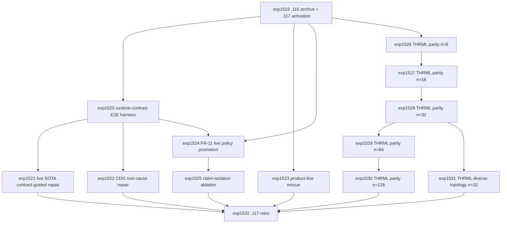

# Research Roadmap vNEXT: Milestone 2026.04.117

**Planned:** 2026-05-08
**Status:** Ready for conductor activation
**Predecessor:** Milestone 2026.04.116 completed 2026-05-08
**Roadmap YAML:** `research-roadmap-next.yaml`

## ID Allocation Note

Milestone `.116` used `exp1506` through `exp1518`. Milestone `.117`
therefore allocates `exp1519` through `exp1532`. The active execution file
`research-roadmap.yaml` is not modified by this plan.

## What Milestone 2026.04.116 Proved

| Finding | Evidence | Impact on .117 |
| --- | --- | --- |
| Bounded safe-DSL verifier induction is viable under local SOTA GGUFs. | `exp1507` loaded 70 labeled rows, proposed 2 bounded verifiers, compiled 2, and reported `false_accept_rate=0.0`. | Use the induced verifier pack as one component of a runtime-contract E2E harness rather than another isolated compiler audit. |
| Trigger+grammar certificate decoding is stronger than schema-only parsing. | `exp1508` reported `grammar_parse_rate=1.0`, `schema_only_parse_rate=0.5`, and zero false accepts. | Test draft-first and grammar-bounded repair under the full contract stack. |
| Executable monitor and structural contracts are ready for integration. | `exp1509` normalized 60 monitor events with zero false accepts; `exp1510` detected 60 of 60 injected plan-graph violations with zero false accepts. | Combine monitors, certificates, safe DSL validators, and structural contracts into a single E2E acceptance surface. |
| Product-line validation is the weak runtime-contract branch. | `exp1511` built the benchmark but reached only `parse_rate=0.333333`, `feasibility_rate=0.0`, and `oracle_agreement_rate=0.0`. | Run one targeted parser/feasibility rescue, then retire the branch if it still does not produce useful solver-oracle signal. |
| FR-11 query-time self-learning can update and replay without soundness mistakes. | `exp1512` proposed and accepted 84 policy updates with `false_accept_rate=0.0`; `exp1513` replayed 84 counterfactual sessions with `soundness_mistakes=0` and positive utility delta; `exp1514` packaged rollback-passing skills. | Promote only rollback-passing policy updates into a live query-time policy experiment. No model-weight mutation. |
| THRML/KAN/KV260 evidence is honest but still pre-hardware. | `exp1515` passed simulator-only THRML conformance; `exp1516` normalized KAN shapes without synthesis; `exp1517` passed source-level RTL/property checks without board execution. | Scale THRML/Carnot parity in software before any TSU, synthesis, bitstream, or board claim. Keep KAN/KV260 claims bounded. |
| `.116` met every planned criterion. | `exp1518.criteria_met=13`, `criteria_total=13`, with carry-forward gates recorded. | `.117` can focus on integration and scale rather than rescue bookkeeping. |

## Research Signals Added Before Planning

The 2026-05-08 literature sweep was appended to `research-references.md` before
this design. Signals that materially shape `.117`:

- **AeroTherm-GPT** (`arXiv:2604.01738`) motivates a Constraint Dependency
  Graph for root-cause repair across contract categories.
- **TerraFormer** (`arXiv:2601.08734`) motivates staged syntax, feasibility,
  deployability, and policy feedback for the weak product-line branch.
- **Draft-Conditioned Constrained Decoding** (`arXiv:2603.03305`) motivates
  draft-first, grammar-bounded structured repair rather than hard constraints
  from token 1.
- **MARCH** (`arXiv:2603.24579`) motivates claim-isolated checking to reduce
  verifier confirmation bias, with deterministic Carnot validators as final
  authority.
- **Verify When Uncertain** (`arXiv:2502.15845`) motivates budgeted escalation
  to heavier verifier/model calls only on uncertain cases.
- **Spilled Energy in LLMs** (`arXiv:2602.18671`) remains an auxiliary monitor
  or routing signal, not headline evidence.
- **GRAD** (`arXiv:2511.03900`) reinforces graph-guided decoding, but `.117`
  should encode verifier dependencies first rather than external RAG graphs.
- **Difference-of-Convex Energy-Based Iterative Reasoning** (OpenReview
  `QvsDTpf4yF`) is a future continuous-reasoning candidate, deferred until
  runtime-contract E2E and THRML scaling are stable.
- **Probabilistic hardware for diffusion-like models** (`arXiv:2510.23972`)
  supports the long-term p-bit/thermodynamic direction, but local evidence
  remains THRML software only.
- **THRML/Extropic docs** and `ops/known-issues.md` make THRML/Carnot parity
  scaling the main `.117` substrate priority.

## Three Biggest Gaps

1. **Runtime-contract pieces are still not one acceptance path.** `.116`
   proved safe-DSL induction, grammar certificates, monitor replay, and
   structural contracts independently. The PRD vision needs one generation-time
   surface that rejects false accepts across all of them.

2. **Self-learning has replay evidence but no live promotion test.** FR-11 can
   propose and roll back query-time policies, but `.117` must prove that only
   rollback-passing policies improve live contract-guided evaluation without
   mutating model weights.

3. **Substrate conformance stops at smoke-scale THRML.** THRML import and small
   conformance passed, but the hardware path is not credible until Carnot and
   THRML agree across larger Ising sizes and diverse topologies in software.

## Architecture

```text
                 Milestone 2026.04.117 Research Stack

   .116 completion archive and activation gates
       |
       v
   runtime-contract E2E harness
   safe DSL validators | grammar certificates | monitor events | plan contracts
       |
       v
   mandated local SOTA GGUF repair/evaluation
   Qwen3.6-35B-A3B | gemma-4-31B-it | gemma-4-26B-A4B-it
       |
       +-----------------------------+
       |                             |
       v                             v
   CDG root-cause repair       product-line rescue or retirement
   verifier dependency graph   staged syntax/feasibility/oracle feedback
       |
       v
   FR-11 live query-time policy promotion
   rollback-passing updates only | no model-weight mutation
       |
       v
   asymmetric claim-isolation ablation
   isolated propositions | deterministic validators | budgeted escalation
       |
       v
   THRML/Carnot parity scaling
   n=8 exact -> n=16 exact -> n=32/64/128 sampled -> diverse topologies
       |
       v
   .117 retro: claim boundaries, retirements, .118 gates
```

## Phase Descriptions

### Phase 0 - Archive and Activation

`exp1519` writes the `.116` completion archive and `.117` activation manifest.
It records the runtime-contract, FR-11 rollback, product-line, THRML, KAN, and
KV260 carry-forward fields that downstream tasks gate on. It also checks
whether `research-complete.yaml` has already archived `.116`, since `exp1518`
reported that reconciliation was still pending.

### Phase 1 - Runtime-Contract E2E Closure

`exp1520` builds the integrated runtime-contract E2E harness from `.116`
artifacts. `exp1521` is gated on that harness and runs live local SOTA
contract-guided repair, including a draft-conditioned constrained-decoding
variant. `exp1522` adds a Constraint Dependency Graph to localize upstream
root causes across validator, certificate, monitor, and structural-contract
failures. `exp1523` targets the known weak product-line solver branch with a
staged TerraFormer-style feedback rescue and a hard retirement rule if the
branch remains uninformative.

### Phase 2 - Continuous Self-Learning and Asymmetric Verification

`exp1524` is the required continuous self-learning experiment. It promotes
only rollback-passing FR-11 query-time policies into live contract-guided
evaluation, with no model-weight mutation. `exp1525` is gated on live policy
promotion and tests whether MARCH-style claim isolation reduces confirmation
bias compared with full-context verifier feedback, again using deterministic
validators as the acceptance authority.

### Phase 3 - THRML/Carnot Parity Scaling

`exp1526` through `exp1530` run the core parity scaling sweep requested in
`ops/known-issues.md`: n=8 exact, n=16 exact, n=32 sampled, n=64 sampled, and
n=128 production-scale sampled. `exp1531` adds a diverse-topology n=32 sweep
across complete, sparse random, lattice, and scale-free graphs. Every task is
software/simulator only and must explicitly block TSU or hardware claims.

### Phase 4 - Retrospective and Claim Boundaries

`exp1532` closes `.117` with criteria accounting, gate-block analysis,
retirements, ops reconciliation needs, and `.118` carry-forward decisions.

## Dependency Graph



## Hardware Requirements

| Task range | Hardware | Requirement boundary |
| --- | --- | --- |
| `exp1521`, `exp1522`, `exp1523`, `exp1524`, `exp1525` | Dual RTX 3090 local workstation preferred | LLM-bearing tasks must use at least one mandated local SOTA GGUF headline model: `unsloth/Qwen3.6-35B-A3B-GGUF`, `unsloth/gemma-4-31B-it-GGUF`, or `unsloth/gemma-4-26B-A4B-it-GGUF`. Legacy small models are smoke tests only. |
| `exp1519`, `exp1520`, `exp1532` | CPU acceptable | Archive, deterministic E2E harness assembly, and retrospective. |
| `exp1526`-`exp1531` | CPU acceptable; local JAX/THRML accelerator libraries allowed only if already available | THRML software/simulator parity only. No Extropic TSU, Z1, XTR-0, FPGA board, synthesis, bitstream, or board-execution claim. |
| Future hardware tracks | KV260 board, Extropic TSU, larger FPGA, D-Wave, NPU | Remain deferred unless a later milestone creates authenticated readiness artifacts and transcripts. |

## Success Criteria

| Criterion | Acceptance |
| --- | --- |
| Activation | `exp1519.activation_manifest_complete=true` and `.116` outcomes are archived without touching `research-roadmap.yaml`. |
| Runtime-contract E2E | `exp1520.runtime_contract_e2e_ready=true` with all `.116` contract inputs loaded and zero false accepts. |
| Live contract repair | `exp1521.contract_guided_repair_ready=true` with at least one mandated SOTA GGUF used for headline rows. |
| CDG root cause | `exp1522.cdg_root_cause_repair_ready=true` or an honest no-signal terminal artifact, with false accepts reported. |
| Product-line rescue | `exp1523.product_line_rescue_ready=true` with improvement over `exp1511` parse/oracle metrics, or `product_line_branch_retired=true`. |
| Continuous self-learning | `exp1524.live_policy_promotion_ready=true`, `continuous_self_learning_task=true`, and `no_model_weight_mutation=true`. |
| Claim isolation | `exp1525.claim_isolation_ablation_ready=true` with deterministic validator outcomes and budget metrics. |
| THRML n=8 | `exp1526.thrml_parity_n8_passed=true` or an honest simulator-only blocker. |
| THRML n=16 | `exp1527.thrml_parity_n16_passed=true` or an honest simulator-only blocker. |
| THRML n=32 | `exp1528.thrml_parity_n32_passed=true` or an honest simulator-only blocker. |
| THRML n=64 | `exp1529.thrml_parity_n64_passed=true` or an honest simulator-only blocker. |
| THRML n=128 | `exp1530.thrml_parity_n128_passed=true` or an honest simulator-only blocker. |
| Diverse topologies | `exp1531.diverse_topology_parity_ready=true` with per-topology pass/fail metrics. |
| Retrospective | `exp1532.criteria_met` and `criteria_total` summarize `.117` with carry-forward decisions. |

Target threshold: at least 12 of 14 tasks complete or honestly terminal
gate-blocked, with no task modifying `research-roadmap.yaml` or
`scripts/research_conductor.py`.

## Prior Failure and Retirement Rules

| Lineage | Rule in .117 |
| --- | --- |
| Product-line solver oracle | One rescue attempt is allowed because `exp1511` was the only `.116` failure-shaped result. If parse/oracle signal still does not improve, retire the product-line branch until a new benchmark or parser exists. |
| Runtime-contract integration | False accepts remain fatal. Any LLM repair result is auxiliary until the deterministic contract stack accepts it. |
| FR-11 self-learning | Only rollback-passing query-time policy updates can be promoted. No model-weight mutation, finetuning, or hidden memory growth claim is allowed. |
| THRML and Extropic hardware | THRML tasks are simulator/software parity tasks only. Hardware claims require an authenticated TSU/Z1/XTR-0 transcript in a later milestone. |
| KAN and KV260 | `.117` does not reopen KAN synthesis or KV260 board execution. Existing `.116` outputs are carry-forward context only. |
| Legacy small models | Qwen3.5-0.8B and Gemma E4B are smoke-test models only and cannot support headline LLM results. |

## Local-First and Decentralization Implications

- All headline LLM-bearing results stay on local GGUF runtimes and record exact
  model IDs in `models_used`.
- Deterministic validators, solver oracles, and parity metrics remain the trust
  boundary.
- Self-learning is query-time policy adaptation with replay and rollback,
  suitable for local deployment without centralized finetuning.
- Hardware work remains reproducible software conformance until actual hardware
  transcripts exist.
