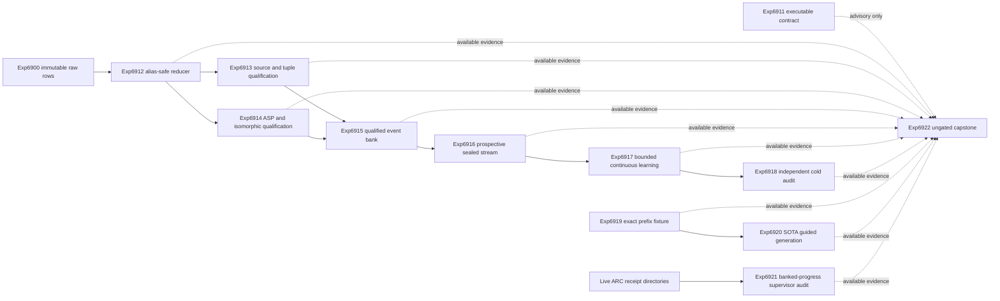

# Research Roadmap V605: Qualified Relations, Audited Self-Learning, and Exact Guidance

**Milestone:** `2026.09.605`

**Status:** Proposed

**Task contract:** 12 tasks, `exp6911` through `exp6922`, in the exact order listed below

**Executable roadmap:** `research-roadmap-next.yaml`

This document and `research-roadmap-next.yaml` define one execution contract. The YAML must contain
exactly the 12 task IDs in this document, in this order. No task in this document is aspirational.

## What Milestone 2026.09.604 Proved

Milestone `.604` ended with four artifacts and three pre-emptive skips.

- Exp6898 proved that the active V604 YAML had seven tasks while its contract expected 13. Its
  blocked verdict was correct. It also proved that task-count drift is still an execution risk.
- Exp6899 proved authentic live proposal acquisition on all three required local GGUF families.
  It recorded 60 nonempty live cells, native tokenizer receipts, CUDA process evidence, and a clean
  acquisition gate.
- Exp6900 acquired the full balanced relation corpus. The artifact contains 1,400 terminal cells
  and 665.794477 seconds of live work. The shared adversarial verifier quarantined the artifact
  because `duration_s` and `live_duration_s` were identical aliases. The rows may be recoverable;
  the positive verdict is not admissible.
- Exp6901 correctly refused the flagged Exp6900 input. It performed zero semantic scoring and set
  `model_relation_qualification_ready_score=0`.
- Exp6902 through Exp6904 did not execute their science. The conductor skipped them after Exp6901
  retired. Relation quality, prospective relation learning, and its sealed audit remain unmeasured.

The correct starting point for V605 is therefore: authentic acquisition exists; qualified model
relations do not. V605 must reduce and qualify the existing bytes before it launches learning. It
must not pay for the same model corpus a second time.

## Research Refresh

The V605 source refresh is recorded at the top of `research-references.md` before this design was
written. The findings that change this milestone are:

- Enoki (`2609.00581`) supports one immutable anchored relation record from source span through
  verification and localization.
- Cheap Verifiers, Large Blind Spots (`2609.01345`) requires independent exact authority for any
  learning claim.
- Isomorphic Perturbation Testing (`2604.15149`) supplies a direct shortcut test for learned or
  retrieved relations.
- Verifier-Induced Support Reshaping (`2608.00220`) requires future-trainability support beside
  current exact utility.
- BEAVER (`2512.05439`) motivates exact prefix viability, but not the retired schema decoder,
  repair reprompt, or finite answer-ID mechanisms.
- Parsing the Stream (`2609.01466`) supports dynamic append-only ARC receipt discovery and replay.
  CoBRA (`2609.00967`) supports paired delivery-versus-withholding margins, but the matching ARC
  run is already in flight outside the conductor and must not be duplicated here.

Extropic still places public Z1 access in 2027. Kona still has no public local runner. No hardware
or proprietary dependency enters the V605 blocking graph.

## The Three Largest Gaps to the PRD Vision

| Gap | Current evidence | PRD consequence | V605 response |
|---|---|---|---|
| 1. Constraint extraction is authentic but not semantically qualified | Exp6899 and Exp6900 produced real bytes; Exp6900 is flagged and Exp6901 scored no relations | FR-12 cannot use natural-language constraints if proposals are not source-grounded and exact-checkable | Repair evidence reduction, run two bounded exact qualification shards, and merge only replayable rows |
| 2. Continuous self-learning has no new utility result over read-only memory | Exp6873 was null; Exp6902-6904 never ran | FR-11 requires safe improvement from experience, not only a memory lifecycle | Run a prospective no-memory/read-only/update study with delayed exact feedback, isomorphic transfer, poison, rollback, and future-support checks |
| 3. Exact energy is not yet shaping generation or transferable live control | Exact solvers verify after generation; ARC supervisor credit still uses transient progress and old pinned receipts | The PRD calls for energy-guided reasoning and a live agent that improves reusable methods | Test candidate-level exact prefix guidance on local SOTA GGUFs and repair the reusable ARC supervisor evidence path |

These are larger gaps than new sampler or board work. Carnot already has several exact solvers and
attached FPGA proofs. It does not yet have a clean natural-language relation-to-learning chain.

## Target Architecture



The dashed edges into Exp6922 are evidence reads, not conductor gates. Exp6911, Exp6912, Exp6919,
Exp6921, and Exp6922 are independent roots. No science task gates on the contract task.

## Milestone-Wide Evidence Rules

- Preserve Exp6900 and all prior artifacts byte-for-byte. A fresh reducer may issue a new evidence
  receipt. It may not rewrite the source artifact or clear its flag.
- Every comparison emits one row per source, model, seed, arm, order, or condition as applicable.
  A pooled headline without its own rows is invalid.
- Every artifact declares the closed `verdict_class` enum. Any artifact with
  `verifier_is_oracle=true` may use `circular_positive`, not `positive`.
- Every blocked result emits `gate_check_summary` with the exact failed check, expected value, and
  observed value.
- Every structured gate names a field that the upstream task lists in its own required artifact
  fields. All gate upstreams exist in this roadmap.
- The relation learner receives exact outcomes only after its decision. No same-event write, held
  label, or future order may enter its state.
- The retired external text scorer, schema-supported ConstraintIR reprompt, finite answer ID,
  per-game ARC adapter, and offline ground-truth ARC solve mechanisms remain outside scope.
- A result that repeats a declared prior failure triggers `retire_if_same_verdict: true`.
- All new live model inference uses the exact required local GGUF IDs. The llama.cpp tokenizer is
  native to the selected GGUF. `AutoTokenizer.from_pretrained()` must not receive a GGUF repository.

## Phase A: Recover and Qualify Anchored Relations

### Exp6911 — V605 document-YAML execution and evidence contract

**Deliverable:** `results/experiment_6911_v605_document_yaml_evidence_contract.json`

This advisory task checks exact parity between this document and the executable YAML: 12 tasks,
IDs Exp6911-Exp6922, order, deliverables, prompts, gates, model rules, prior-failure blocks,
independent roots, and the ungated tail. It also records the admissibility state of Exp6898-Exp6904.
No science task gates on this result.

**Ready field:** `v605_execution_contract_ready_score`

### Exp6912 — Alias-safe immutable relation-corpus reducer

**Deliverable:** `results/experiment_6912_alias_safe_relation_corpus_reducer.json`

This task reads the checked-in Exp6900 bytes without running an LLM. It measures wall time and
source live time through independent derivations, names the old equality as an alias, replays all
1,400 cell identities and raw-output hashes, and emits a new clean reduction receipt. It preserves
the old flag and verdict. This is the changed technique for the flagged Exp6900 scope.

**Acceptance gate:** all cells replay; source hashes match; wall and live duration definitions are
independent; no source mutation; fresh adversarial verification has zero critical findings.

**Ready field:** `clean_relation_corpus_ready_score`

### Exp6913 — Exact source and tuple qualification shard

**Deliverable:** `results/experiment_6913_relation_source_tuple_qualification.json`

This task gates on Exp6912. It checks source offsets, span identity, parser outcomes, tuple type,
entity anchoring, relation direction, omissions, and abstentions. It scores every model, Enoki, and
rule row from immutable saved output. It does not run a model or read the ASP held sidecar.

**Acceptance gate:** complete per-cell replay, zero held-sidecar access, no aggregate-row mismatch,
and a terminal qualification decision for every arm and family.

**Ready field:** `source_tuple_shard_ready_score`

### Exp6914 — Exact ASP and isomorphic qualification shard

**Deliverable:** `results/experiment_6914_relation_asp_isomorphic_qualification.json`

This task gates on Exp6912 and is independent of Exp6913. It compiles anchored tuples into the
existing bounded ASP representation, checks stable-model parity with a second exact engine, and
applies entity-renaming, paraphrase, reversal, contradiction, and solution-space-restructuring
tests. It does not import Exp6901 aggregates.

**Acceptance gate:** complete exact rows, zero solver disagreement, zero held leakage, and a
terminal qualification decision for every arm and family.

**Ready field:** `asp_isomorphic_shard_ready_score`

### Exp6915 — Independent relation qualification merge

**Deliverable:** `results/experiment_6915_qualified_relation_event_bank.json`

This task gates on both Phase A shards. It joins by immutable cell ID, rejects missing or duplicate
rows, derives model eligibility without using rule-control success, and writes the event bank that
Phase B may consume. It reports proposal coverage separately from exact admitted correctness.

**Acceptance gate:** both shards ready, all joins one-to-one, at least 90 exact-admitted
model-produced events across all five constraint families, and zero fresh critical findings.

**Ready fields:** `qualified_relation_event_bank_ready_score`,
`qualified_model_relation_event_count`

## Phase B: Prospective Continuous Self-Learning

### Exp6916 — Isomorphic prospective relation stream

**Deliverable:** `results/experiment_6916_isomorphic_prospective_relation_stream.json`

This task gates on the qualified bank and at least 90 model-produced events. It freezes source
groups before deterministic transformations. It builds at least five chronological orders with a
commissioning prefix and sealed future outcomes. The stream contains lexical-near, paraphrased,
entity-renamed, contradiction, omission, and solution-space-restructured opportunities.

**Ready field:** `prospective_relation_stream_ready_score`

### Exp6917 — Bounded relation-memory continuous self-learning comparison

**Deliverable:** `results/experiment_6917_bounded_relation_memory_continuous_learning.json`

This is the required Continuous Self-Learning experiment. It gates on Exp6916 and compares no
memory, read-only memory, bounded update, and quarantine update in identical event orders. The
controller decides from prior state. Exact delayed feedback then authorizes an admit, revise,
quarantine, tombstone, or no-op transition. The update arm must beat read-only, not only no-memory.

**Acceptance gate:** update beats read-only asymmetric exact cost in every order; retained-family
utility and future trainability do not fall; poison, restart, rollback, capacity, and latency gates
pass. A null result is valid and retires this exact typed-relation controller shape.

**Ready fields:** `self_learning_run_complete_score`, `self_learning_utility_score`

### Exp6918 — Independent self-learning safety and support audit

**Deliverable:** `results/experiment_6918_relation_learning_cold_support_audit.json`

This task gates on protocol completion, not the learner's utility claim. A fresh process replays all
orders and computes exact costs, write credit, retention, support-at-k, future trainability, poison,
restart, and rollback from canonical rows and sealed labels.

**Ready fields:** `cold_learning_audit_complete_score`,
`independent_self_learning_utility_score`

## Phase C: Exact Energy-Guided Relation Generation

### Exp6919 — Exact prefix-viability fixture and branch-cost canary

**Deliverable:** `results/experiment_6919_exact_prefix_viability_fixture.json`

This independent root builds a small dynamic relation-program fixture with prefix-closed
extendability labels. One exact engine supplies in-loop feasibility. A separate exact engine supplies
final outcome labels. The task proves positive, negative, late-failure, ambiguous, and no-headroom
cases before model inference begins.

**Ready field:** `prefix_viability_canary_ready_score`

### Exp6920 — SOTA plain-text relation generation with exact guidance

**Deliverable:** `results/experiment_6920_sota_exact_guided_relation_generation.json`

This task gates on Exp6919 and runs all three required GGUF families. It compares direct generation,
unguided best-of-k, and candidate-level exact-prefix frontier search. Models emit plain relation
lines. The method uses no grammar, schema decoder, repair reprompt, finite answer ID, or external
text scorer. The in-loop feasibility engine and final exact evaluator are different implementations.

**Acceptance gate:** at least 30 complete source-model-arm cells per model, positive final-validity
gain over matched unguided best-of-k on two of three families, no family regression above two
percentage points, no greater parse failure, and a reported cost/latency Pareto. Exact final
validity, not format success, is the headline.

**Ready fields:** `guided_generation_run_complete_score`, `exact_guidance_utility_score`

## Phase D: Live ARC Generalization Evidence and Cold Disposition

### Exp6921 — ARC dynamic supervisor receipt and banked-progress audit

**Deliverable:** `results/experiment_6921_arc_dynamic_supervisor_banked_credit.json`

This is the required ARC-AGI-3 generalization slot. It does not re-solve a public game and does not
launch the tools-on/off run that is already in flight. It hardens the reusable live supervisor path:
discover all new applied receipts dynamically, preserve append-only provenance, replace transient
`level_progress` credit with banked level/action-to-progress credit, and run the existing human-only
refinement policy. If the live ledger has no new eligible rows, the honest result is blocked or
insufficient evidence; no policy change is required.

Any reported existing level outcome must declare
`solve_provenance=live_agent_self_discovery`. No development proxy or outer-loop solve may become a
headline.

**Ready fields:** `arc_supervisor_audit_complete_score`, `banked_credit_eligible_score`

### Exp6922 — Ungated V605 independent capstone

**Deliverable:** `results/experiment_6922_v605_independent_capstone.json`

This task is deliberately ungated. It reads every artifact that exists, recomputes contract parity,
propagates flagged and blocked evidence, separates missing from null, and writes a branch-by-branch
adopt, continue, retire, or block decision. It may not turn a circular or unavailable result into a
positive milestone claim.

**Ready field:** `v605_capstone_complete_score`

## Exact Execution Order

| Order | Task ID | Title | Phase | Structured gate |
|---:|---|---|---|---|
| 1 | `exp6911-v605-document-yaml-evidence-contract` | V605 document-YAML execution and evidence contract | A | none |
| 2 | `exp6912-alias-safe-relation-corpus-reducer` | Alias-safe immutable relation-corpus reducer | A | none |
| 3 | `exp6913-relation-source-tuple-qualification` | Exact relation source and tuple qualification shard | A | Exp6912 ready = 1 |
| 4 | `exp6914-relation-asp-isomorphic-qualification` | Exact relation ASP and isomorphic qualification shard | A | Exp6912 ready = 1 |
| 5 | `exp6915-qualified-relation-event-bank` | Independent qualified relation event-bank merge | A | Exp6913 ready = 1 and Exp6914 ready = 1 |
| 6 | `exp6916-isomorphic-prospective-relation-stream` | Isomorphic prospective relation learning stream | B | Exp6915 ready = 1 and event count >= 90 |
| 7 | `exp6917-bounded-relation-memory-continuous-learning` | Bounded relation-memory continuous self-learning comparison | B | Exp6916 ready = 1 |
| 8 | `exp6918-relation-learning-cold-support-audit` | Independent relation-learning safety and support audit | B | Exp6917 run complete = 1 |
| 9 | `exp6919-exact-prefix-viability-fixture` | Exact prefix-viability fixture and branch-cost canary | C | none |
| 10 | `exp6920-sota-exact-guided-relation-generation` | SOTA plain-text relation generation with exact prefix guidance | C | Exp6919 ready = 1 |
| 11 | `exp6921-arc-dynamic-supervisor-banked-credit` | ARC dynamic supervisor receipt and banked-progress audit | D | none |
| 12 | `exp6922-v605-independent-capstone` | V605 independent evidence capstone and branch disposition | D | none |

## Dependency Graph

```text
exp6911  (advisory root)

exp6912
  +-- exp6913 --+
  +-- exp6914 --+--> exp6915 --> exp6916 --> exp6917 --> exp6918

exp6919 --> exp6920

exp6921  (ARC generalization root)

exp6922  (ungated; reads all available evidence)
```

The longest blocking chain is six tasks: Exp6912 -> Exp6913 or Exp6914 -> Exp6915 -> Exp6916 ->
Exp6917 -> Exp6918. The exact-guidance and ARC branches remain executable if relation qualification
fails.

## Hardware Requirements

| Resource | Tasks | Requirement |
|---|---|---|
| CPU and RAM | Exp6911-Exp6919, Exp6921-Exp6922 | Local Python, ASP, Z3 or independent enumeration, enough RAM to stream the 30.8 MB Exp6900 artifact without loading duplicate copies |
| RTX 3090 GPU 0 or 1 | Exp6920 | One task-owned lease at a time, authenticated CUDA process receipts, zero CPU fallback, native GGUF tokenizer |
| Local GGUF cache | Exp6920 | `unsloth/Qwen3.6-35B-A3B-GGUF`, `unsloth/gemma-4-31B-it-GGUF`, `unsloth/gemma-4-26B-A4B-it-GGUF` |
| Existing ARC artifacts | Exp6921 | Read-only access to live scored-path and lever-harness receipt directories plus the durable refinement ledger |
| KV260, GateMate, PolarFire | none | Keep physically attached state unchanged; no continuity or performance claim |
| Extropic Z1 or XTR-0 | none | No authenticated device route; 2027 watch item only |

Exp6920 must not overlap an outside live ARC job on the same GPU. It must use the repository lease
and stop-authority rules. CPU tasks must not claim GPU, FPGA, or TSU execution.

## Stop and Promotion Rules

- If Exp6912 cannot issue a clean reducer receipt without changing Exp6900, retire the source and do
  not reacquire it inside V605.
- If either qualification shard blocks, Exp6915 and Phase B stop. Phase C, Exp6921, and Exp6922 still
  run.
- If fewer than 90 model-produced events qualify, report the exact family and arm shortfall. Do not
  fill the bank with rule-control rows.
- If bounded update does not beat read-only in every order, the learning verdict is null. Safety
  alone is not utility.
- If exact guidance only repairs syntax, or only beats direct generation but not matched best-of-k,
  do not promote it.
- If Exp6921 finds no new banked-progress evidence, record insufficient evidence. Do not infer
  supervisor benefit from transient `helped` counters.
- Exp6922 must state the next executable prerequisite for each blocked branch and retire any exact
  mechanism that repeats its declared prior verdict.

## Completion Contract

V605 is complete when all 12 task IDs have terminal conductor outcomes, including structured
pre-emptive skips, and Exp6922 records the final disposition. Scientific success is not required.
The document/YAML task count, task IDs, order, and deliverables must remain identical throughout
activation and execution.
