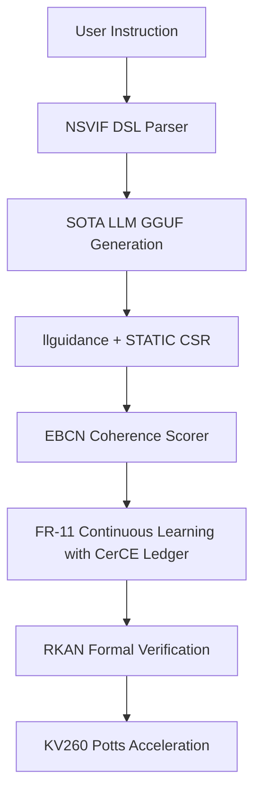

# Research Roadmap: Milestone 2026.05.126

**Title:** Phase-4 Structured Verdict Scaling, CerCE Continual Learning, and Formal KAN Verification
**Target Date:** 2026-05-18

## 1. What the Previous Milestone Proved

Milestone 2026.05.125 achieved key breakthroughs:
- Nabla-Reasoner latent trace scoring effectively optimized trajectories.
- LTLZinc temporal constraint benchmarking established baseline FR-11 retention limits.
- SMGI certified updates safely promoted policies during query-time self-learning.
- Pi-net and ConsFormer projection mechanisms were prototyped for constraint refinement.
- Energy-Guided Decoding directly integrated hallucination mitigations into SOTA generation.

However, the three biggest gaps to the PRD vision remain:
1. **Constraint Extraction:** Turning natural language into a robust DSL (NSVIF).
2. **Structured Repair Scale:** Validating robust external structured-verdict adapter paths like DCCD and llguidance.
3. **Formal Verification of Architectures:** Ensuring KANs are formally verifiable (RKAN/Lean 4) and extending hardware acceleration via KV260 Potts machine synthesis.

## 2. Milestone 2026.05.126 Objectives

This milestone focuses on:
- **Phase 1: Constraint Extraction and Scaling.** Implementing an NSVIF-style DSL and `llguidance` adapter to solidify Carnot's external constraint API and latency using local SOTA models.
- **Phase 2: CerCE Continual Learning.** Adding a CerCE-style certificate ledger with bounds-checking to FR-11 continuous self-learning to eliminate catastrophic forgetting.
- **Phase 3: Formal Verification and Architecture.** Prototyping Energy-Based Constraint Networks (EBCNs) and Exact-Rational KANs (RKANs) to make Carnot's constraint tiers formally certifiable.
- **Phase 4: Hardware Target Preflight.** Resuming hardware acceleration by targeting Vivado synthesis for a q=3 Potts machine on the KV260, aiming for true hardware bring-up if synthesis passes.

## 3. Architecture Context

## 4. Phase Descriptions

### Phase 1: Structured Verdicts & Constraint Extraction (Exps 1640-1643)
Tackles the instruction-to-constraint gap using the NSVIF framework and an `llguidance` integration. The local SOTA models (`unsloth/Qwen3.6-35B-A3B-GGUF` and `unsloth/gemma-4-31B-it-GGUF`) will act as the generation testbeds to confirm zero false accepts.

### Phase 2: Verifier Certification and Self-Learning (Exps 1644-1646)
Addresses continuous self-learning by wrapping FR-11 in a CerCE bounds-checking ledger. This guarantees monotonic utility non-forgetting. EBCNs are also introduced to verify structural coherence across multi-turn latent traces. We will use `unsloth/gemma-4-26B-A4B-it-GGUF` for the self-learning loop.

### Phase 3: Formal KAN Verification (Exps 1647-1648)
Brings formal specifications into the Carnot stack by mapping KAN layers to Exact-Rational KANs (RKANs) suitable for Lean 4 analysis, alongside spectral constraints for sparse manifold compression.

### Phase 4: Hardware and Retrospective (Exps 1649-1651)
Unblocks the hardware execution path by performing a focused Vivado synthesis of the Potts machine (q=3) and subsequent board bring-up. The milestone completes with an automated retrospective.

## 5. Hardware Requirements

- **GPU:** Dual RTX 3090 (or equivalent VRAM) required to cache and infer the mandated SOTA GGUF models.
- **FPGA:** AMD/Xilinx Kria KV260, with Xilinx Vivado 2023.2 installed on the host for the synthesis step.

## 6. Dependency Graph

- **1640** -> **1641** (Parser -> SOTA Validate)
- **1642** -> **1643** (Adapter -> CSR Mask)
- **1644** -> **1645** (CerCE Ledger -> FR11 Loop)
- **1649** -> **1650** (Vivado Synthesis -> KV260 Bringup)