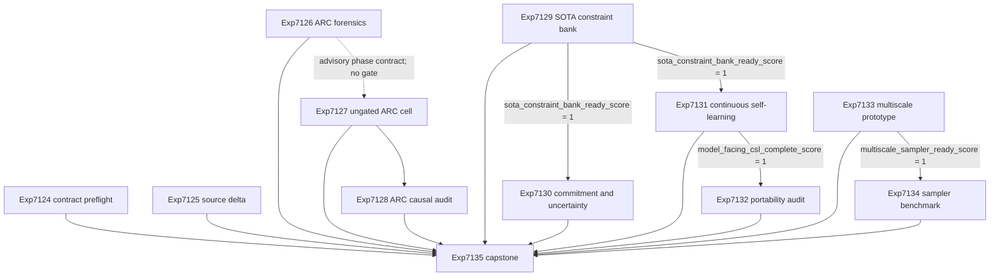

# Research Roadmap vNEXT: V626

**Milestone:** `2026.09.626`  
**Title:** Held-out ARC measurement, exact SOTA self-learning, and corrected multiscale sampling  
**Status:** Pre-staged next milestone  
**Task contract:** Exactly 12 tasks, `exp7124` through `exp7135`, in the order below.

## What V625 proved

Milestone `2026.09.625` completed its activated three-task run. Its scientific
outcomes are narrower than the old 13-task design document.

| Task | Evidence | Meaning for V626 |
|---|---|---|
| Exp7121 | The Markdown document named 13 tasks. The active YAML held three. The artifact was correctly disqualified. | V626 needs one literal 12-row contract in both files. The check stays advisory. |
| Exp7122 | All three mandated GGUF repositories and cached Q4_K_M files were resolved and hashed. The requested source classes were checked. | V626 can use the local SOTA models without a download task. It still performs execution-time cache checks. |
| Exp7123 | The artifact was created and registry eligibility rank one was frozen. No arm started. The terminal artifact contains zero attempt rows. | This is not an ARC value measurement. V626 first localizes the phase loss, then runs one smaller ungated cell with hard phase caps. |

V623 also remains relevant. Exp7105 produced a sealed exact 144-event stream.
Exp7106 found positive later value from delayed procedural memory on that
abstract stream. Exp7107 independently retained that result. Those experiments
did not place current SOTA GGUF outputs inside the learning loop.

## Three largest gaps to the PRD vision

1. **Generalization is not measured.** Carnot clears the public ARC registry
   with per-game adapters. It still lacks one citable adapter-withheld level
   result from the scored E3 path. V625 completed zero arms.
2. **The autonomous learning loop is not model-facing.** Exact verification,
   transactional memory, and delayed abstract learning exist. The project has
   not shown that current local generators create a usable exact action stream,
   benefit from delayed verified memory, or carry that memory across model
   families.
3. **Sampling has no validated scalable bridge.** The exact Ising and sampler
   foundations are mature. The frustrated spectral scale attempt was blocked.
   No corrected multiscale proposal has passed finite-distribution parity, and
   no attached TSU is available.

## Research basis

The dated V626 refresh in `research-references.md` records the full sweep.
These findings change experiments in this milestone:

- arXiv:2607.17047 motivates matched structural strata and proof-preserving
  relabels. Solver effort is recorded but is not treated as model difficulty.
- arXiv:2605.18871 motivates separate exact penalties, ensemble uncertainty,
  abstention, and explicit model-family confound rows.
- arXiv:2609.04773 motivates exact commitment before a generated action reaches
  execution.
- arXiv:2609.05339 motivates directional fixed-schema memory portability with
  source-backed recovery.
- arXiv:2608.31114 motivates a corrected, software-only coarse-to-fine sampler.

The ICML 2026 symbolic-integration position paper reinforces an existing
boundary: learned energy and model confidence may route work, but exact
instance-level execution remains the authority. Current KAN work does not
reopen the retired PWA-KAN or within-chain adaptation lineages. Extropic's Z1T
figures remain vendor projections for unattached hardware. Kona remains a
non-reproducible product comparator.

## Target architecture

```text
                                  exact-authority boundary
                                           |
  mandated local GGUFs                    v
  Qwen3.6 MoE --------------------> structured action ----> exact checker
  Gemma-4 31B dense --------------> candidate bank         | pass / fail
  Gemma-4 26B-A4B MoE ------------> + surface variants      v
                                                  uncertainty router
                                               accept / retry / abstain
                                                          |
                                      delayed verified memory transaction
                                                          |
                                               future held-out episodes

  ARC registry --> adapter-withheld E3 policy --> executed environment action
                         |                                |
                   hard phase caps                 transition receipts
                         |                                |
                         +---- removal/provenance audit <-+

  frustrated Ising energy --> coarse-to-fine proposal --> MH correction
             |                         |                       |
       sealed finite law <-------------+-------------- parity and mixing
                                                               |
                                               future Rust / FPGA / TSU work
```

The generator proposes. Learned energy ranks and routes. Exact verifiers decide
whether an action is admissible. Transactional memory writes only after exact
feedback. The ARC development proxy never becomes a live hidden-game solve.

## Exact task contract

| Order | Task ID | Title | Deliverable | Structured gate |
|---:|---|---|---|---|
| 1 | `exp7124-v626-contract-preflight` | V626 Markdown and YAML task-contract preflight | `results/experiment_7124_v626_contract_preflight.json` | none |
| 2 | `exp7125-v626-source-delta` | V626 execution-time SOTA source and model delta | `results/experiment_7125_v626_source_delta.json` | none |
| 3 | `exp7126-arc-loo-phase-receipt-forensics` | ARC leave-one-game-out phase and receipt forensics | `results/experiment_7126_v626_arc_loo_phase_receipts.json` | none |
| 4 | `exp7127-adapter-withheld-arc-loo-cell` | Ungated adapter-withheld ARC leave-one-game-out cell | `results/experiment_7127_v626_adapter_withheld_arc_loo.json` | none |
| 5 | `exp7128-arc-loo-causal-provenance-audit` | ARC leave-one-game-out causal provenance audit | `results/experiment_7128_v626_arc_loo_causal_audit.json` | none |
| 6 | `exp7129-hardness-controlled-sota-constraint-bank` | Hardness-controlled three-family SOTA constraint bank | `results/experiment_7129_v626_sota_constraint_bank.json` | none |
| 7 | `exp7130-verifier-committed-uncertainty-routing` | Verifier-committed uncertainty routing, gated on Exp7129 bank | `results/experiment_7130_v626_verifier_committed_routing.json` | `exp7129-hardness-controlled-sota-constraint-bank.sota_constraint_bank_ready_score == 1` |
| 8 | `exp7131-model-facing-fixed-schema-csl` | Model-facing fixed-schema continuous self-learning, gated on Exp7129 bank | `results/experiment_7131_v626_model_facing_csl.json` | `exp7129-hardness-controlled-sota-constraint-bank.sota_constraint_bank_ready_score == 1` |
| 9 | `exp7132-directional-memory-portability-audit` | Directional memory portability audit, gated on Exp7131 learning | `results/experiment_7132_v626_memory_portability_audit.json` | `exp7131-model-facing-fixed-schema-csl.model_facing_csl_complete_score == 1` |
| 10 | `exp7133-wcrg-multiscale-sampler-prototype` | WCRG-inspired corrected multiscale sampler prototype | `results/experiment_7133_v626_multiscale_sampler_prototype.json` | none |
| 11 | `exp7134-frustrated-ising-sampler-benchmark` | Frustrated-Ising sampler benchmark, gated on Exp7133 prototype | `results/experiment_7134_v626_multiscale_sampler_benchmark.json` | `exp7133-wcrg-multiscale-sampler-prototype.multiscale_sampler_ready_score == 1` |
| 12 | `exp7135-v626-capstone` | V626 independent evidence matrix and branch disposition | `results/experiment_7135_v626_capstone.json` | none |

No other task belongs to V626. The YAML must contain these 12 full IDs, titles,
deliverables, and gates in this exact order.

## Phase 0: Contract, source state, and ARC failure localization

### Exp7124: V626 Markdown and YAML task-contract preflight

Parse the Markdown and YAML independently. Compare exactly 12 complete rows.
Validate order, titles, deliverables, gates, producer fields, rerun records,
model requirements, agent routing, path existence, artifact fields, and prompt
tails. Prefix the free-text substrate with
`aggregation_from_upstream_artifacts:` so a fast parser is classified correctly.
The task is advisory. No science branch gates on it.

### Exp7125: V626 execution-time SOTA source and model delta

Repeat the requested source-class checks at execution time. Verify the three
mandated repositories and cached GGUF files without downloading. Append one
idempotent dated execution delta. Map only methods that change a V626 task.
Vendor, product, community, and repository claims stay separate from primary
scientific evidence.

### Exp7126: ARC leave-one-game-out phase and receipt forensics

Reconstruct Exp7123 from its artifact, conductor timestamps, existing runtime
receipts, process logs, and filesystem evidence. Do not run an LLM. Report a
time interval for every observable phase and name the first phase whose start
receipt is absent. Define a fixed measurement budget of 5 minutes for setup,
25 minutes per arm, and 5 minutes for finalization. Produce a thin, reusable
phase-receipt contract. Do not call this task an ARC value result.

## Phase 1: One bounded ARC generalization result

### Exp7127: Ungated adapter-withheld ARC leave-one-game-out cell

This is the mandatory generalization task. It has no `gated_on` block and no
preflight dependency. Select registry eligibility rank one before outcomes are
visible. Use one cached Qwen3.6 GGUF. Run one adapter-withheld arm and one
adapter-visible control through fresh processes. Call the real
`E3AgentPolicy` and `make_carnot_agent` path. Execute proposed actions. Keep
the fixed phase caps from Exp7126, but recompute all preconditions inline.

Write the final artifact before model setup. Update it after every phase. A
complete zero-level pair is a terminal null. Runtime absence is blocked.
Leakage or malformed evidence is disqualified. This development-proxy result
does not update the solve registry and cannot receive hidden-game solve credit.

### Exp7128: ARC leave-one-game-out causal provenance audit

Read Exp7127 whether it is positive, null, blocked, or disqualified. Verify raw
hashes, process isolation, forbidden reads, action execution, registry
immutability, and `solve_provenance`. Replay removal of each credited forecast
or verifier signal when the corresponding action inputs exist. Record whether
the selected action changes. Do not invent causal credit when the upstream arm
never ran. An absent upstream artifact yields one terminal blocked artifact,
not `partial` retries.

## Phase 2: Exact SOTA verification and continuous self-learning

### Exp7129: Hardness-controlled three-family SOTA constraint bank

Create 12 base constraint instances across SAT-style logic, graph coloring,
and bounded scheduling. Pair every base instance with a proof-preserving
relabel and a verified paraphrase. Match size and density within each pair.
Record exact solver effort as a stratum, not as a truth label for model
difficulty. Run all three mandated GGUF families through their correct
llama.cpp chat templates. Freeze raw prompts, outputs, parses, exact outcomes,
model identities, and hashes. No finite answer-ID transport or
schema-supported ConstraintIR reprompt is allowed.

### Exp7130: Verifier-committed uncertainty routing

Use the frozen Exp7129 bank. Compare single shot, self-review, exact
commitment, and exact-penalty-plus-uncertainty routing. The router may accept,
retry, or abstain. It may not execute or promote an exact-rejected action.
Report model-family confounding, relabel sensitivity, paraphrase consistency,
constraint violations, useful retry rate, and abstention cost per episode.
`verifier_is_oracle` is false because the exact checker supplies outcomes and
is not the learned ranking signal.

### Exp7131: Model-facing fixed-schema continuous self-learning

This task satisfies the milestone's continuous self-learning requirement.
Process the frozen model actions in chronological source-group order. Compare
no memory, equal-budget free notes, and verifier-signed fixed-schema procedural
memory. Admit a write only after a later exact outcome. Use immutable past,
adaptation, future, and protected-retention splits. Then invoke the Qwen3.6
GGUF on a bounded future panel under all three arms. Report later value,
retention, forgetting, conflict handling, abstention, rollback, and transaction
recovery per episode. Keep model weights frozen.

### Exp7132: Directional memory portability audit

Use only memory that Exp7131 admitted. Test all six ordered writer-to-reader
pairs among Qwen3.6, Gemma-4 31B, and Gemma-4 26B-A4B. Compare fixed-schema
memory, equal-budget notes, no memory, and source-backed regeneration on a
frozen headroom panel. Keep every model, direction, representation, seed, and
episode visible. Audit negative transfer, source loss, schema drift, and
protected retention. A source model's success does not license a target model's
memory unless the target rows support it.

## Phase 3: Corrected multiscale sampling and synthesis

### Exp7133: WCRG-inspired corrected multiscale sampler prototype

Implement a small host-software coarse-to-fine proposal for frustrated Ising
lattices. Add Metropolis-Hastings correction against the exact target energy.
Use sealed enumerated finite laws for the smallest lattice only after the
proposal design is frozen. Check normalization, support, detailed balance,
stationarity, replay, and adversarial coupling mutations. This is a bounded
method probe, not a WCRG replication or hardware result.

### Exp7134: Frustrated-Ising sampler benchmark

If Exp7133 is ready, compare corrected multiscale proposals with local Gibbs
and an independent-sampling reference where enumeration is feasible. Use at
least five fixed seeds, matched energy-evaluation budgets, and multiple
frustration and temperature cells. Report effective sample size, integrated
autocorrelation, total variation on finite cells, wall time, and failure rate
per seed and cell. Do not claim logarithmic scaling, Rust parity, FPGA speed,
or TSU execution.

### Exp7135: V626 independent evidence matrix and branch disposition

Build an ungated evidence matrix across all 11 upstream tasks. Recompute every
producer gate from raw rows. Use `python/carnot/reporting/evidence_ingress.py`
to exclude artifacts with `flagged_adversarial: true` or a live critical
finding. Record every exclusion in `excluded_flagged_upstreams`. Keep
positive, circular-positive, null, blocked, disqualified, and partial classes
separate. Classify the ARC, model-facing learning, portability, and sampler
branches independently. A complete evidence matrix may be positive even when
a science branch is null or blocked.

## Dependency graph



Exp7127 has no structured gate and no `requires` chain. The dotted edge means
that it may reuse the phase vocabulary from Exp7126. It still performs and
records its own inline checks. Exp7128 and Exp7135 run even when their inputs
are terminal null, blocked, or disqualified.

## Rerun discipline

The YAML carries full four-field `prior_failures` entries for these scopes:

| New task | Prior experiment IDs | Material change |
|---|---|---|
| Exp7124 | Exp7109, Exp7121 | One literal 12-row contract, closed field checks, and a recognized aggregation prefix. |
| Exp7125 | Exp6461 | Primary pages are source receipts, not execution oracles. Local GGUF cache receipts are checked separately, and an empty source delta is terminal. |
| Exp7126 | Exp7099, Exp7113, Exp7123 | Offline phase forensics with no model run and no value claim. |
| Exp7127 | Exp7099, Exp7100, Exp7113, Exp7114, Exp7123 | No gate, one cell, direct existing E3 entrypoint, artifact first, and hard per-phase subprocess caps. |
| Exp7128 | Exp7101 | Runs after any terminal upstream class and audits raw receipts instead of gating on readiness. |
| Exp7129 | Exp7080 | Uses the proven chat transport, matched exact structural pairs, and no entrance-bank dependency. |
| Exp7130 | Exp6998, Exp7013 | Tests exact action admission and uncertainty routing, not shortcut commitment or a signed latent intervention. |
| Exp7131 | Exp6978 | Uses current live GGUF outputs, delayed exact admission, and three equal-budget memory arms. |
| Exp7132 | Exp6817, Exp6829, Exp6842 | Uses newly admitted V626 memory and all ordered writer-reader directions without an old activation bus. |
| Exp7134 | Exp6612 | Uses a corrected WCRG-inspired proposal, Python parity, fixed budgets, and no Rust or hardware claim. |
| Exp7135 | Exp6823, Exp6922 | Separates matrix completion from branch outcomes and records stable external gaps as blocked instead of retryable partial. |

Every listed entry sets `retire_if_same_verdict: true`. V626 uses no retired
experiment ID and requires no retired upstream.

## Hardware and runtime requirements

| Resource | Tasks | Requirement and boundary |
|---|---|---|
| Dual RTX 3090 GPUs | Exp7127, Exp7129-Exp7132 | Use task-owned leases and CUDA llama.cpp. Verify idle numeric zero correctly. Stop with terminal blocked evidence if the required cache, GPU, or lease is absent. |
| Cached Q4_K_M GGUFs | Exp7127, Exp7129-Exp7132 | Resolve through `cached_sota_pair()`. Use at least one mandated model in each LLM task. Never download, substitute, or use a legacy-small model for a headline cell. |
| Host CPU and RAM | All tasks; primary for Exp7124-Exp7126, Exp7128, Exp7133-Exp7135 | Run exact solvers, finite enumeration, MCMC, artifact validation, and audits. Keep every experiment below a 70-minute planned wall time. |
| Local disk | All tasks | Store bulky ARC and model traces outside top-level `results/`. Bind every external trace by path, size, and SHA-256. |
| FPGA, ROCm, NPU, TSU | None | No physical board is on the V626 critical path. No task may claim FPGA or Z1 execution, speed, energy, or power. |

## Model contract

Every LLM task declares `MODEL_SPECS`, exact model paths and hashes,
`models_used`, invocation receipts, token rows, and GPU telemetry. The permitted
headline repositories are:

- `unsloth/Qwen3.6-35B-A3B-GGUF`
- `unsloth/gemma-4-31B-it-GGUF`
- `unsloth/gemma-4-26B-A4B-it-GGUF`

Exp7127 uses Qwen3.6 for the bounded ARC cell. Exp7129, Exp7130, and Exp7132
use all three families. Exp7131 uses Qwen3.6 for the live future panel. Legacy
small models are setup smoke tests only and cannot supply reported outcomes.

## Global evidence rules

- Every artifact declares `run_date`, `inference_substrate`, the closed
  `inference_substrate_class`, `execution_venue`, `verdict_class`, and an
  `honest_verdict` consistent with that class.
- Every required field has a non-empty principle annotation.
- Every comparison emits one row per episode, arm, model, direction, seed, or
  condition as applicable. Aggregate-only claims are invalid.
- Every blocked verdict names the failed check, expected value, and observed
  value in `gate_check_summary`. External blockage is `blocked`, not `partial`.
- Every ARC level row carries `solve_provenance`. Exp7127 and Exp7128 use
  `development_proxy`, keep `offline_reproduced=false`, and never update the
  solve registry.
- A learned score is not an oracle. An exact checker may reject or admit an
  action. It never turns model confidence into proof.
- Capstone aggregation excludes flagged artifacts and records those exclusions.

## Explicit deferrals

- A second ARC shard. V626 first needs one complete paired cell.
- ARC solve credit or registry mutation from adapter-withheld public-game work.
- Weight-level continual learning. V626 tests verified external memory with
  frozen model weights.
- Neural LNS. The current milestone first establishes a valid exact SOTA bank.
- BEAVER-style sound output-space probability bounds.
- PWA-KAN, within-chain activation adaptation, external text scorers, and
  schema-supported ConstraintIR reprompting.
- Rust sampler parity, asymptotic WCRG replication, KV260 work, GateMate work,
  ROCm scaling, NPU execution, FPGA speedups, and Z1 hardware claims.
