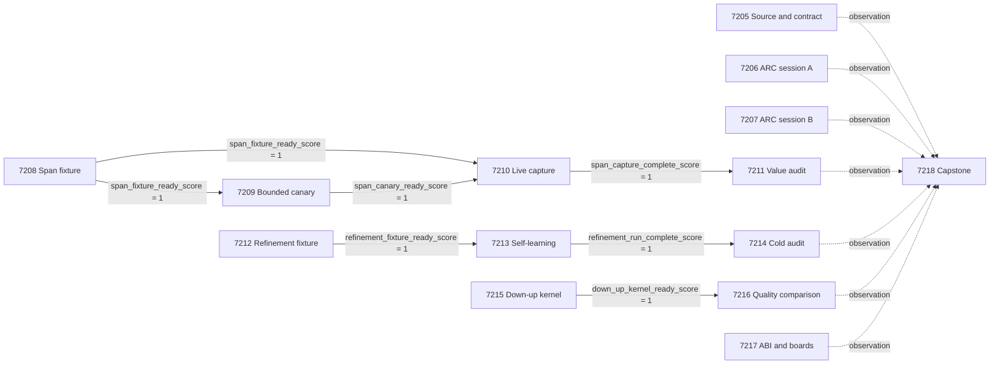

# Carnot Research Roadmap v635: Source Semantics and Causal Constraint Learning

**Created:** 2026-09-11
**Milestone:** `2026.09.635`
**Milestone title:** Source-span semantics, causal constraint memory, and cumulative live discovery
**Status:** Planned; V634 has completed. This document does not activate the next milestone.
**Task contract:** exactly 14 tasks, `exp7205` through `exp7218`, in the order below.
**Execution authority:** `research-roadmap-next.yaml` before activation; matching `research-roadmap.yaml` afterward.

This replaces the V634 design at the rolling vNEXT path. The previous design
and execution contract are preserved at
`results/raw/experiment_7192/research-roadmap-vNEXT.md` and
`results/raw/experiment_7192/selected-roadmap.yaml`. Historical findings and
retirements remain in force. No experiment is run or deployment claimed by this plan.

## What V634 Proved

All thirteen scheduled tasks reached terminal artifacts. Scientific value and
execution readiness diverged:

| Primary evidence | Actual result | Consequence for V635 |
|---|---|---|
| Exp7192 | The thirteen-task document and YAML agreed exactly. | Retain milestone-aware independent contract validation; it gates no science. |
| Exp7193/7194 | One new live selfparse induction executed six tools. Its world model failed the accuracy threshold. No missing tool was requested; banked progress was noncausal. | Collect more independent sessions as explicitly requested on 11 September. Do not revive the missing-tool explanation or claim efficacy. |
| Exp7195 | Typed execution passed exact fixtures with circular-positive readiness. | Reuse the executor; its authority does not establish extraction fidelity. |
| Exp7196 | 192/192 claim calls were truncated and invalid; 144/192 source calls were truncated and invalid. | Diagnose representation length and completion bytes; qualify a compact reference representation before a full run. |
| Exp7197 | On the 128-row audit set, direct and lexical controls both scored 128/128, while typed coverage was zero. Neither value gate passed. | Preserve the null. Use fresh matched relational counterfactuals; never report syntax recovery as an accuracy gain on a saturated baseline. |
| Exp7198/7199/7200 | The delayed-feedback stream and cold controls worked, but the primary learning gate failed. Committed singleton templates changed zero predictions and contributed zero accuracy benefit. | Move the deployed decision path to committed predicates; compare it with the existing version-space predictor and causally delete memory. |
| Exp7201/7202 | Real PyO3 execution and bridge savings were measured, but sample-quality qualification failed. Primary Python-relative speedup estimate was 7.252x, CI95 [5.625, 9.105], below NFR-01. | Do not retry the unchanged 10x claim. Test a different Markov kernel and treat ABI usability as a separate infrastructure question. |
| Exp7203 | CPU correction law/cost and board dispositions were recorded; device timing, topology, effective-sample throughput and power remained unknown. | Carry board-specific states; do not repeat unchanged physical probes or present host work as device execution. |
| Exp7204 | Complete evidence matrix; all four reported PRD-completion axes remained false. | Preserve branch retirements and independently reconstruct V635 claims. |

The evidence paths are the exact `results/experiment_7192_v634_source_contract.json`
through `results/experiment_7204_v634_capstone.json` names in the preserved V634
execution contract. The current completed ledger may lag the final artifact;
the final artifacts and conductor log establish V634 closure.

Two dated operational findings also matter. The 11 September ARC directive
requests cumulative volume across separately capped sessions. The same day's
native-binding reproduction reported `Py_GetConstantBorrowed` during import;
the preserved performance artifact is not overwritten by that failed reproduction.

## Three Largest Gaps to the PRD Vision

1. **Source semantics do not yet survive extraction (FR-12).** Exact execution
   is useful only when its representation describes the source. Phase 2 tests
   compact source-span references, typed semantics, joint premises and separate
   syntax controls. It keeps an independent authority and every failed row.
2. **Constraint memory is not yet demonstrably useful (FR-11).** A persisted
   singleton that the existing predictor already knows is not additional learning.
   Phase 3 makes committed predicates the deployed path, charges label acquisition,
   and requires prospective benefit plus causal deletion evidence.
3. **Reasoning and sampling lack demonstrated deployment value
   (FR-05/07/08, NFR-01).** ARC tool engagement has not produced validated
   generalization efficacy. Native sampler execution has not satisfied both
   quality and the 10x target. Phases 1 and 4 address live evidence volume,
   a different sampling transition, and an observed interpreter/extension mismatch.

## Research Inputs and Selection

The dated V635 refresh in `research-references.md` was written before this
design and records all requested discovery sources and limitations.

| Research input | Experiment use | Claim boundary |
|---|---|---|
| [ChopChop](https://arxiv.org/abs/2509.00360) and [symbolic source grounding](https://arxiv.org/abs/2609.05025) | Exp7208–7211: finite source-span representation and typed execution | A local adaptation; syntax/reference validity is not source truth. |
| [Premise sufficiency](https://arxiv.org/abs/2608.00585) and [model versus solver hardness](https://arxiv.org/abs/2607.17047) | Joint-support, removed-support and same-token semantic controls | No gold decomposition or outcome-selected hard subset in a headline arm. |
| [Query-driven constraint refinement](https://arxiv.org/abs/2509.24489) | Exp7212–7214: informative witnesses, committed predicates and causal memory | Controlled exact-domain learning; no claim of weight learning or universal certificates from finite support. |
| [High-magnetization down-up sampling](https://arxiv.org/abs/2609.08873) | Exp7215–7216: actual down-up transition and matched-cost quality | Finite kernel evaluation, not reproduction of the sparse-SK mixing theorem. |
| [Extropic Z1T](https://extropic.ai/writing/z1t) | Exp7217: explicit mapping and host-operation limits | Vendor projections and degree bounds are not measured topology fit or device speed. |

EBT, ARM–EBM, OpenReview EBM submissions, Semantic Scholar citation trails,
Hugging Face verification papers, GitHub discovery, KAN verification/acceleration,
FPGA decomposition and Kona were checked. The bibliography records direct
sources and blocked access. MPMMine is a promising future external constraint
benchmark; its ingestion is deferred until the causal learner earns expansion.
KAN deployment is deferred until extraction carries semantic value. Retired
generated-text rankers, repair-stack variants and public-game solving stay closed.

## Architecture

```text
 Public source + claim, sealed by base ID (7208)
          |                           independent hidden authority
          v                                        |
 Qwen3.8 bounded canary (7209)                      |
          | readiness                              |
          v                                        |
 grammar-only / span-restricted capture (7210)      |
          |                                        |
 typed executor + direct/lexical/causal controls ---+--> audit (7211)

 hidden finite constraints --> charged delayed-query interface (7212)
                                         |
                              witness-driven refinement (7213)
                                         |
                              committed predicate memory
                                         |
                               deployed future decisions
                                         |
                           cold reload / deletion / rollback (7214)

 real ARC environment --> adapter-withheld scored E3 policy
                            |                    |
                    session A (7206)     session B (7207)
                            +---- unique induction receipts ----+
                                                               |
 exact target --> down-up prototype (7215) --> quality (7216)    |
 shipped native core --> interpreter-bound ABI + boards (7217)  |
                                                               v
 source/contract receipt (7205) -----------------> evidence matrix (7218)
```

The two ARC sessions are independent roots, not each other's gates. The source
contract is advisory. Scientific audits depend on complete measurements rather
than positive outcomes, so an honest null remains observable.

## Phase 1: Cumulative live discovery and source contracts

Execute the overdue live ARC volume request with two separate wall budgets. Preserve exact source/contract agreement and authentic per-name tool receipts. Neither session promises ten inductions or a new solve.

### Exp7205: V635 source delta and exact execution contract

V634 finally had an exact thirteen-task contract. Preserve that result and independently check the new fourteen-task handoff. Read the V635 planning source refresh before checking execution-time deltas. This advisory receipt gates no science.

- **Deliverable:** `results/experiment_7205_v635_source_contract.json`
- **Entry point to create:** `scripts/experiments/experiment_7205_v635_source_contract.py`
- **Budget:** 20 minutes estimated, 100 agent turns.

1. Select the YAML whose milestone equals 2026.09.635: research-roadmap-next.yaml before activation or research-roadmap.yaml afterward. Freeze it and the design under results/raw/experiment_7205/. Parse the design contract table independently. Require exactly fourteen IDs, exp7205 through exp7218, in identical order, with identical titles, deliverables and structured gates. A readable mismatch is disqualified. Never compare this new design against V634 YAML.

2. Run the shipped schema, prior-failure, exclusion-manifest, invented-path and ARC-floor checks without changing them. Check that every gate references an earlier task in THIS roster and the producer declares the identical top-level field in REQUIRED ARTIFACT FIELDS. Confirm each prior_failures entry has all four mandatory fields, including retire_if_same_verdict=true.

3. Run the real conductor_gates.evaluate_gates on isolated /tmp fixtures for each edge: passing field, failed field, missing field and missing file. Also record its actual quarantined-input behavior: the field evaluator alone does not reject flagged_adversarial. Prompts must independently reject quarantined inputs. These are validation fixtures, never research evidence. Check execution_venue literals against host, kv260, gatemate, polarfire; hostname belongs in execution_host.

4. Read the V635 source table in research-references.md. Check up to five primary URLs for changes since planning, prioritizing arXiv:2509.00360, 2509.24489, 2609.08873 and 2608.00585 plus the Extropic Z1T release. Record access failures and no-delta findings. Add real deltas only; do not launch agent fan-out, invent paper contents, or reopen retired external-text scorers.

5. Write source_contract_complete_score=1 only after the complete structural receipt and source-method mapping exist. Retain exact input hashes, all fourteen contract rows, all gate fixture outcomes, source dates and source limitations. A source access limit does not erase locally available method evidence.

**Prior-failure discipline:**

- `exp7179-contract-receipt` — `complete_disqualified_v633_markdown_yaml_contract_mismatch`. Change: Use the already validated V634 contract method with a newly emitted complete fourteen-task record and milestone-aware source selection. `retire_if_same_verdict: true`.

### Exp7206: Live ARC adapter-withheld cumulative session A

The 2026-09-11 MANDATORY-NEXT-MILESTONE entry explicitly requests additional separately bounded selfparse sessions. Exp7193 made one authentic induction and six calls, but no missing-tool request. Three authentic inductions were known at planning. This is cumulative live generalization measurement, not a new public-game solve or a retry of the retired missing-tool explanation.

- **Deliverable:** `results/experiment_7206_v635_arc_volume_a.json`
- **Entry point to create:** `scripts/experiments/experiment_7206_v635_arc_volume_a.py`
- **Budget:** 75 minutes estimated, 50 agent turns.

1. Before launch, let the evaluator inspect the solve registry and confirm r11l is already reproduced. Keep its per-game GameAdapter, routes, solved trajectories, source, registry and historical world models unavailable to the policy. Use the actual E3AgentPolicy/make_carnot_agent path through scripts/arc_leaderboard_eval.py:run_game with a fresh isolated state. The environment may execute its own game source. Verify the policy access boundary; an offline hand-built adapter is not a substitute.

2. Set CARNOT_ARC_INDUCE_TOOL_LOOP=selfparse and leave CARNOT_ARC_SUPERVISOR_TOOL_ARM unset. Keep the validated sampler settings and 4096 completion budget. Set CARNOT_ARC_INDUCE_N_CTX=49152 before proposer construction; validate actual KV allocation and free VRAM on the task-owned GPU. Do not raise induction token budgets or alter the curated arm table.

3. Run exactly one fresh r11l session with seed 7206001, at most 4000 environment actions, a 3600-second session deadline and 2400-second induction-call deadline. Reserve 600 seconds for setup and 600 for validation within the 4800-second hard cap. The empirical induction cost is about 1500-1730 seconds. Target one or two new inductions if reached naturally; do not force ten into this task or reset repeatedly until a favorable outcome appears.

4. Preserve induction IDs, raw completion hashes, terminal outcome, model-validity errors, individual tool-call names, counts and gap events. Trace the Exp7193 per-name aggregation loss before using its receipt reducer: the call total was six but the name map was empty. Derive both counts from the same actual event stream; if a correction is needed, scope it to the experiment receipt helper with a failing regression test. Never invent unknown names from the aggregate count.

5. Merge authenticated historical receipts and all available current-milestone ARC session receipts by unique induction ID. Missing sibling output does not block this independent session. Record historical_tool_loop_inductions, new_tool_loop_inductions, cumulative_unique_inductions, evidence_target=10 and distinct session/seed counts. Do not count the same historical row twice. Ten is an operational collection target, not a statistical proof of absent tool demand. Report zero events as no observed demand, with the observed denominator and dependence limitations.

6. Record banked levels and transient level transitions separately, plus world-model nondegeneracy and actions. solve_provenance=live_agent_self_discovery; new_solve_claimed=false and paired_efficacy_reported=false. Set arc_session_complete_score=1 after the scheduled terminal receipt exists, including an honest zero-induction or timed-out null. Do not claim tool engagement without real calls. Do not submit or alter the live default. A missing external model or lease is blocked; an executed low-quality session is null.

**Prior-failure discipline:**

- `exp7186-arc-withheld-transfer` — `blocked_required_source_bytes`. Change: Use the shipped direct run_game path and the successful Exp7193 runtime; no invented runner is required. `retire_if_same_verdict: true`.

### Exp7207: Live ARC adapter-withheld cumulative session B

The 2026-09-11 MANDATORY-NEXT-MILESTONE entry explicitly requests additional separately bounded selfparse sessions. Exp7193 made one authentic induction and six calls, but no missing-tool request. Three authentic inductions were known at planning. This is cumulative live generalization measurement, not a new public-game solve or a retry of the retired missing-tool explanation.

- **Deliverable:** `results/experiment_7207_v635_arc_volume_b.json`
- **Entry point to create:** `scripts/experiments/experiment_7207_v635_arc_volume_b.py`
- **Budget:** 75 minutes estimated, 50 agent turns.

1. Before launch, let the evaluator inspect the solve registry and confirm r11l is already reproduced. Keep its per-game GameAdapter, routes, solved trajectories, source, registry and historical world models unavailable to the policy. Use the actual E3AgentPolicy/make_carnot_agent path through scripts/arc_leaderboard_eval.py:run_game with a fresh isolated state. The environment may execute its own game source. Verify the policy access boundary; an offline hand-built adapter is not a substitute.

2. Set CARNOT_ARC_INDUCE_TOOL_LOOP=selfparse and leave CARNOT_ARC_SUPERVISOR_TOOL_ARM unset. Keep the validated sampler settings and 4096 completion budget. Set CARNOT_ARC_INDUCE_N_CTX=49152 before proposer construction; validate actual KV allocation and free VRAM on the task-owned GPU. Do not raise induction token budgets or alter the curated arm table.

3. Run exactly one fresh r11l session with seed 7207001, at most 4000 environment actions, a 3600-second session deadline and 2400-second induction-call deadline. Reserve 600 seconds for setup and 600 for validation within the 4800-second hard cap. The empirical induction cost is about 1500-1730 seconds. Target one or two new inductions if reached naturally; do not force ten into this task or reset repeatedly until a favorable outcome appears.

4. Preserve induction IDs, raw completion hashes, terminal outcome, model-validity errors, individual tool-call names, counts and gap events. Trace the Exp7193 per-name aggregation loss before using its receipt reducer: the call total was six but the name map was empty. Derive both counts from the same actual event stream; if a correction is needed, scope it to the experiment receipt helper with a failing regression test. Never invent unknown names from the aggregate count.

5. Merge authenticated historical receipts and all available current-milestone ARC session receipts by unique induction ID. Missing sibling output does not block this independent session. Record historical_tool_loop_inductions, new_tool_loop_inductions, cumulative_unique_inductions, evidence_target=10 and distinct session/seed counts. Do not count the same historical row twice. Ten is an operational collection target, not a statistical proof of absent tool demand. Report zero events as no observed demand, with the observed denominator and dependence limitations.

6. Record banked levels and transient level transitions separately, plus world-model nondegeneracy and actions. solve_provenance=live_agent_self_discovery; new_solve_claimed=false and paired_efficacy_reported=false. Set arc_session_complete_score=1 after the scheduled terminal receipt exists, including an honest zero-induction or timed-out null. Do not claim tool engagement without real calls. Do not submit or alter the live default. A missing external model or lease is blocked; an executed low-quality session is null.

**Prior-failure discipline:**

- `exp7186-arc-withheld-transfer` — `blocked_required_source_bytes`. Change: Use the shipped direct run_game path and the successful Exp7193 runtime; no invented runner is required. `retire_if_same_verdict: true`.

## Phase 2: Source-span semantics before verification value

Prototype and seal the representation, qualify it in a bounded canary, capture the held-out panel, then independently score semantics and value. This splits code construction, cheap qualification, expensive inference and analysis into reviewable tasks.

### Exp7208: Source-span relation compiler and sealed semantic panel

Exp7196 truncated every claim extraction and Exp7197 had zero typed coverage; direct and lexical controls scored 128/128. ChopChop motivates distinguishing valid syntax from valid references and relations, while the premise-sufficiency paper motivates joint evidence. Build a finite auditable representation and a new panel before spending GPU time.

- **Deliverable:** `results/experiment_7208_v635_span_fixture.json`
- **Entry point to create:** `scripts/experiments/experiment_7208_v635_span_fixture.py`
- **Budget:** 45 minutes estimated, 50 agent turns.

1. Read the raw source/claim completions through Exp7196 raw_manifest and reproduce its invalid/truncated counts. Attribute format overhead, missing terminators, repeated output and semantic errors from bytes; do not assume a larger budget is the remedy. Preserve the old artifacts and the saturated panel as historical evidence.

2. Create a compact relation representation: source sentence index, subject span offsets, predicate from the executor-supported relation vocabulary, object span offsets and explicit polarity. Permit at most four source relations and one claim relation per call; unknown is an explicit outcome. Resolve offsets only against the corresponding public text. Reject out-of-range spans, cross-document references and type mismatch. Never constrain a relation to match the hidden label. Source and claim calls remain independent.

3. Implement two frozen decoding contracts over the SAME tuples: grammar-only and grammar plus input-derived span/reference restrictions. The semantic executor is separate from decoding. Both receive exactly the same source or claim bytes, token budget and model settings. Compile llama.cpp-compatible grammar from public offsets only; hash it per request. A valid reference certifies where a term came from, not whether the relation is true. This is a finite adaptation of semantic pruning, not a ChopChop reproduction.

4. Freeze 80 independent base cases, split by base ID into 8 canary, 8 development and 64 held-out test bases. Use four supported relation families, balanced across the split. For each base create four variants: supported, relation/polarity reversal with matched token multiset where possible, joint-support relation, and support-removed unknown. Add matched entity renaming as metadata-linked variants within the fixed four-row contract where possible; never silently increase the denominator. Total 320 public rows, 256 test rows. Use fresh seed 7208001 and separate seed 7208002 for label-preserving surface rendering. Keep both seeds and labels out of the model input.

5. Create public JSONL, independent authority JSONL and a manifest under results/fixtures/experiment_7208/. The authority must interpret the public controlled-language source via separately tested semantics; it cannot simply reuse the candidate executor. Audit support removal versus explicit contradiction, relational direction, negation and alpha-renaming. Check the lexical control is unable to distinguish the matched semantic pairs; freeze and report its score without deleting easy cases. No model-outcome-based test selection is allowed.

6. Write span_fixture_ready_score=1 only if all 320 rows, disjoint split hashes, compiler mutation tests, independent-label agreement and grammar serialization checks pass. Serialize minimum and maximum completion sizes with the embedded GGUF tokenizer when available without invoking the LLM; otherwise defer measured token lengths to the canary and leave them unknown. No schema readiness is a verification-value result.

**Prior-failure discipline:**

- `exp5923-sota-schema-supported-constraintir-ab` — `retired: schema-supported ConstraintIR decoding failed exact-semantic retirement gates`. Change: Introduce source-span witnesses, bounded tuple references and joint-support semantic counterfactuals; schema-only validity and the earlier ConstraintIR reprompt remain controls, not a success claim. `retire_if_same_verdict: true`.
- `exp7196-qwen-atomic-capture` — `complete_null_atomic_capture_parse_poor_bank_available_for_independent_audit`. Change: Replace verbose free-form atomic objects, whose claim calls all truncated, with bounded span-reference tuples and tokenizer-verified output budgets qualified on separate canary rows. `retire_if_same_verdict: true`.
- `exp7197-grounding-value-audit` — `complete_null_typed_grounding_value_gate_not_met`. Change: Replace the saturated lexical panel with preregistered same-token relational and joint-support edits; audit full-denominator semantic fidelity before interpreting value. `retire_if_same_verdict: true`.

### Exp7209: Qwen3.8 bounded source-span extraction canary

This is bounded generation, even if loading and setup dominate its duration. Establish that the new source-span contract can finish and preserve known canary semantics before the held-out run. Do not relabel a few short completions as a full generative benchmark.

- **Deliverable:** `results/experiment_7209_v635_span_canary.json`
- **Entry point to create:** `scripts/experiments/experiment_7209_v635_span_canary.py`
- **Budget:** 25 minutes estimated, 30 agent turns.

1. Consume Exp7208 at its declared deliverable results/experiment_7208_v635_span_fixture.json, then read only the canary split. Independently validate grammar payloads and compile token bounds with the actual embedded tokenizer. Start one task-owned native llama-server using the shipped supervisor, embedded chat template and supported non-thinking mode. Verify that reasoning is actually disabled in the response, not merely hidden in display.

2. Use eight canary bases, their supported variant only, two representation arms and separate source/claim calls: 32 fixed calls total. Freeze source budget=384 and claim budget=128 generated tokens, context=8192, temperature=0, seed=7209001. Require tokenizer-measured maximum serialized source and claim forms to fit those budgets with 20 percent headroom before any call. If they do not fit, report the diagnosed representation-size null; do not keep raising the cap.

3. Capture actual request payload, grammar hash, raw completion, token counts, finish reason, CUDA offload and per-call latency. Compare grammar-only versus span-restricted extraction on the same canary inputs. Apply the executor and separately inspect source/claim relation agreement with canary authority after capture. Never inspect development/test labels to tune the prompt. Bound model load at 240 seconds, each call at 60 seconds and the total live window at 900 seconds; stop on repeated deterministic transport faults.

4. Set span_canary_ready_score=1 only if the span-restricted arm has all 16 complete parse-valid source/claim calls, no truncation, exact references in all, and at least 7/8 correct combined canary relation interpretations. Record all failures and full denominators. Failure is a terminal null, unless an external runtime or GPU prerequisite prevented execution, when it is blocked. Successful readiness is narrow canary evidence, not held-out verifier value.

5. Freeze the tested prompts, request settings, grammar generator and tokenizer/model hashes under results/raw/experiment_7209/. Do not repair defaults or rerun additional variants in this task. Keep inference_substrate_class=model_bounded_generation throughout; minimum 10 seconds is an authenticity check, never a reason to wait.

**Prior-failure discipline:**

- `exp5923-sota-schema-supported-constraintir-ab` — `retired: schema-supported ConstraintIR decoding failed exact-semantic retirement gates`. Change: Introduce source-span witnesses, bounded tuple references and joint-support semantic counterfactuals; schema-only validity and the earlier ConstraintIR reprompt remain controls, not a success claim. `retire_if_same_verdict: true`.
- `exp7196-qwen-atomic-capture` — `complete_null_atomic_capture_parse_poor_bank_available_for_independent_audit`. Change: Replace verbose free-form atomic objects, whose claim calls all truncated, with bounded span-reference tuples and tokenizer-verified output budgets qualified on separate canary rows. `retire_if_same_verdict: true`.

### Exp7210: Qwen3.8 held-out source-span grounding capture

Use the frozen canary-qualified representation on the complete sealed panel. Capture transport, extraction and direct judgments independently of labels; a later CPU audit owns the value decision. Failed or unknown rows remain in the denominator.

- **Deliverable:** `results/experiment_7210_v635_span_capture.json`
- **Entry point to create:** `scripts/experiments/experiment_7210_v635_span_capture.py`
- **Budget:** 70 minutes estimated, 50 agent turns.

1. Read the exact Exp7208 fixture and Exp7209 canary artifacts, their declared raw paths and frozen decoding contract. Verify hashes, passed readiness fields, nonquarantine and split isolation. Do not use Exp7196 raw outputs as fresh inference. Consume only the 72 non-canary bases: 8 development and 64 held-out test, each with four variants, for 288 public rows.

2. For each public row run one direct judgment plus grammar-only source/claim and span-restricted source/claim extraction: five logical responses, 1440 total. Source caching is allowed only by exact source bytes, grammar hash, model identity and arm; record cache hits separately from actual calls. Both representation arms keep source=384 and claim=128 completion budgets from the canary. Direct judgment uses a fixed 16-token supported/contradicted/unknown grammar. Use temperature=0, seed=7210001 and one model stream.

3. Interleave arm order deterministically by base ID. Never let the direct output enter either extraction prompt or the source output enter the claim prompt. The model, grammar compiler and executor cannot read the authority sidecar. All controls use identical public text. Record prompt and completion tokens, actual finishes, host/model time, grammar size, cache costs and task-owned GPU samples.

4. Reserve at most 3300 seconds for inference, 240 seconds for model load and the remaining budget for sealing and focused checks; cap individual requests at 60 seconds. Checkpoint each completed base under results/checkpoints/experiment_7210/ and persist raw responses immediately. Freeze the processing order in advance. If the live window is exhausted, retain the scheduled denominator and censored rows; capture completion can be one with a terminal bounded measurement, but complete_panel=false forbids a positive value claim.

5. Write span_capture_complete_score=1 once all scheduled rows have either actual outputs or explicit terminal censored/error records, raw hashes and final counts. This field does not certify parse quality. Set complete_panel=true only when all 1440 logical responses were obtained. Do not score hidden labels or change the representation after outcomes. A fully measured transport result may be null; a later audit must still run.

**Prior-failure discipline:**

- `exp5923-sota-schema-supported-constraintir-ab` — `retired: schema-supported ConstraintIR decoding failed exact-semantic retirement gates`. Change: Introduce source-span witnesses, bounded tuple references and joint-support semantic counterfactuals; schema-only validity and the earlier ConstraintIR reprompt remain controls, not a success claim. `retire_if_same_verdict: true`.
- `exp7196-qwen-atomic-capture` — `complete_null_atomic_capture_parse_poor_bank_available_for_independent_audit`. Change: Replace verbose free-form atomic objects, whose claim calls all truncated, with bounded span-reference tuples and tokenizer-verified output budgets qualified on separate canary rows. `retire_if_same_verdict: true`.
- `exp7197-grounding-value-audit` — `complete_null_typed_grounding_value_gate_not_met`. Change: Replace the saturated lexical panel with preregistered same-token relational and joint-support edits; audit full-denominator semantic fidelity before interpreting value. `retire_if_same_verdict: true`.

### Exp7211: Independent source-span semantics and verifier-value audit

A compact output can still encode the wrong fact. Measure source fidelity, claim fidelity, joint-premise behavior and total verification value separately. The V634 audit panel was saturated, so it cannot establish an accuracy improvement after a formatting fix.

- **Deliverable:** `results/experiment_7211_v635_span_value_audit.json`
- **Entry point to create:** `scripts/experiments/experiment_7211_v635_span_value_audit.py`
- **Budget:** 30 minutes estimated, 50 agent turns.

1. Read the exact Exp7208 fixture and Exp7210 capture deliverables, then resolve their declared public/authority/raw paths. Recompute the capture manifest before label access. Settle the 32 development rows first under the frozen method; they permit debugging evidence only, no threshold or grammar changes. The primary test set is the 256 rows from 64 independent held-out bases.

2. Reconstruct six arms from actual rows: direct judgment, lexical overlap, grammar-only extraction plus typed execution, span-restricted extraction plus typed execution, the latter with shuffled source assignments, and a syntax-validity-only acceptance control. A grammar does not generate the final truth label. Execute source and claim relations using the exact existing relation executor; compare against the independently authored authority. Report missing support as unknown, never as a false claim.

3. Emit source/claim exact semantic accuracy, reference coverage, parse coverage, support versus contradiction versus unknown confusion, false acceptance, harmful flips, abstention, full-denominator accuracy and conditional accuracy. Count abstention as unsuccessful for full-denominator correctness but retain the unknown label as a legitimate task answer where appropriate. Keep unknown truth and policy abstention distinct. Report paired rows for every base, variant and arm, including zero-headroom cells.

4. Use 10000 paired bootstrap resamples clustered by base ID, stratified by relation family, seed=7211001. Primary scientific gate: complete_panel=true, span coverage>=0.80, independent authority disagreements=0, lower 95-percent interval for accuracy gain over BOTH direct and lexical controls >0, and upper 95-percent interval for false-accept increase over direct <=0. The test is a 64-base pilot; report intervals without a broad SOTA claim. No alternative efficiency route may rescue a failed primary gate.

5. Audit support removal and entity/relation reversal causally, then run shuffled-source and label-permutation controls. A gain reproduced after source shuffling fails the grounding claim. Disclose that exact execution on an exact labeled constraint domain is oracle-related: verifier_is_oracle=true and any successful correctness class is circular_positive. Separate source-fidelity evidence from the exact executor authority; do not call a second implementation oracle-distinct.

6. Set span_audit_complete_score=1 when the audit is complete and span_value_score=1 only for the unchanged primary gate plus causal controls. Otherwise retain null or disqualified as warranted. Report end-to-end extraction cost but do not claim production throughput or lower false acceptance merely by abstaining on all rows.

**Prior-failure discipline:**

- `exp5923-sota-schema-supported-constraintir-ab` — `retired: schema-supported ConstraintIR decoding failed exact-semantic retirement gates`. Change: Introduce source-span witnesses, bounded tuple references and joint-support semantic counterfactuals; schema-only validity and the earlier ConstraintIR reprompt remain controls, not a success claim. `retire_if_same_verdict: true`.
- `exp7197-grounding-value-audit` — `complete_null_typed_grounding_value_gate_not_met`. Change: Replace the saturated lexical panel with preregistered same-token relational and joint-support edits; audit full-denominator semantic fidelity before interpreting value. `retire_if_same_verdict: true`.

## Phase 3: Causal continuous constraint learning

Prototype an immutable stream and commit-only decision path, run the prospective learning comparison, then independently audit cold state and causal memory. All label queries, validation and hidden-authority boundaries are explicit.

### Exp7212: Query-driven constraint refinement fixture and commit-only runtime

V634 memory updates were real but committed templates changed no prediction. Adapt query-driven refinement from arXiv:2509.24489 to the shipped finite numeric predicates. Build a controlled certificate-learning experiment with a genuine committed-memory decision path, not another queue scheduler sweep.

- **Deliverable:** `results/experiment_7212_v635_refinement_fixture.json`
- **Entry point to create:** `scripts/experiments/experiment_7212_v635_refinement_fixture.py`
- **Budget:** 45 minutes estimated, 50 agent turns.

1. Reuse the four exact-label families and numeric domain 0..32 from Exp7198, but create fresh hidden parameters and seeds 7212001..7212020. Freeze 20 independent streams of 1024 prospective events with stable, drift, recurrence and poison intervals of 256 events each. Every arm receives identical warmup observations, event order, parameter changes and delayed-feedback rules. Parameter generation lives in an evaluator-only process; no hidden seed, parameter or future label enters the learner.

2. Within each stream, use the first 32 released observations as shared warmup and freeze a deployable baseline after them. Permit at most 64 additional label queries per arm, pending capacity=4 and the fixed burst-delay protocol. Reserve 16 of those 64 queries for disjoint promotion validation; 48 are fitting queries. Query-driven arms choose an x in 0..32 at which surviving hypotheses disagree, with deterministic maximally balanced splits. Random-query and passive-arrival controls pay the same query and delay costs. Validation x values are reserved before fitting and are never used to eliminate hypotheses.

3. Implement a candidate-refinement controller whose fitting state is private to acquisition. The deployed path calls only a frozen warmup fallback and currently committed exact predicates in TransactionalConstraintMemory. No majority vote over uncommitted hypotheses may leak into that arm. A singleton fitted candidate needs disjoint released validation observations and an unchanged memory transaction before commit; contradictory delayed feedback revokes that version and restores the fallback. Report inability to certify a candidate within budget as an outcome, not a reason to reveal truth.

4. Use a separate hidden audit panel of all 33 values per family and phase for scoring only. Its labels never enter fitting, validation or rollback. Runtime rollback uses only already released validation/feedback evidence. Distinguish a valid known-parameter predicate from probabilistic confidence: finite observed support alone is not a universal correctness certificate. Describe a commit as empirically validated unless all necessary finite-domain evidence was legitimately queried and charged.

5. Freeze immutable public stream, evaluator sidecar, split/feedback manifest and the controller serialization under results/streams/experiment_7212/. Add a deterministic causal seam test: committed predicate insertion and deletion must change the live query decision on a designed witness; wrong-version and poisoned transactions must be rejected. These seam fixtures are tests, not learning-benefit rows. Set refinement_fixture_ready_score=1 only with a sealed leak-free stream, charged disjoint validation and a working commit-only runtime.

**Prior-failure discipline:**

- `exp7199-bounded-acquisition` — `complete_null: bounded acquisition did not pass the frozen primary-cell gate`. Change: Old predictions used the live version space and commits were persistence-only. New witness-driven queries and compiled committed predicates are the deployed decision path; direct version-space inference is an explicit strong comparator. `retire_if_same_verdict: true`.

### Exp7213: Continuous self-learning through witnessed predicate refinement

Test whether committed constraints improve future decisions when acquisition selects informative witnesses and every query is charged. FR-11 value must beat useful controls and survive deletion of the actual memory. This is CPU constraint learning, not new LLM inference or model-weight training.

- **Deliverable:** `results/experiment_7213_v635_refinement_learning.json`
- **Entry point to create:** `scripts/experiments/experiment_7213_v635_refinement_learning.py`
- **Budget:** 45 minutes estimated, 50 agent turns.

1. Consume results/experiment_7212_v635_refinement_fixture.json and its frozen streams. Run five matched arms: warmup-frozen fallback, passive-query committed predicates, random-query committed predicates, witness-query committed predicates, and the shipped online version-space-majority predictor with the SAME witness-query schedule. The last is the strong information-matched baseline; do not weaken it to make committed memory win.

2. Predict before requesting or releasing each event label. Enforce the 64-query limit, 4 pending slots and reserved 16-query validation split. Record query value, reason, release time, version, support/validation IDs, commit/revoke events, prediction changes and every CPU cost. No future label, hidden audit result, or truth parameter may alter a live decision. Complete all 20 streams with independently initialized states.

3. Measure prospective full-denominator error, false acceptance, abstention, recurrence error, query count and actual memory/lookup/update/validation cost. Produce rows for all 20480 events per arm plus per-stream paired aggregates. On a read-only shadow copy, remove all committed templates while preserving acquisition state and replay the same next-event decisions; separately reset the entire learned state. Only the former isolates committed-template causality. Keep poison and drift outcomes visible.

4. Freeze seed 7213001 for 10000 paired stream-bootstrap resamples. Primary learning gate: upper 95-percent interval for future error change versus BOTH warmup-frozen and random-query committed baselines <0, upper false-accept increase versus warmup-frozen <=0, recurrence error increase <=0.02, no capacity or validation-access violation, and strictly positive prospective-error increase when committed templates are deleted. Report performance against passive acquisition and the stronger version-space predictor regardless of the primary result.

5. Do not claim superiority over version-space inference unless it is measured. Separately test compiled-deployment usefulness at matched accuracy: noninferiority lower accuracy CI >=-0.02 and at least 2x measured amortized throughput over version-space inference across the fixed 1024-event horizon, including all query selection, fitting, validation and commit costs. This is secondary CPU deployment evidence and cannot rescue a failed primary learning gate or satisfy NFR-01.

6. Record continuous_self_learning_task=true, no_model_weight_mutation=true and a hardware path: CPU counters/bitsets and direct compiled predicate dispatch; optional FPGA template matching only after measured usefulness. Measure lookup/update p50 and p95, memory bytes and operation counts; the old <1 microsecond update target remains a target, not a claimed result. Persist reloadable full state and raw rows. Set refinement_run_complete_score=1 on complete measurement and refinement_value_score=1 only when the primary gate passes. Exact-domain success is circular_positive with verifier_is_oracle=true.

**Prior-failure discipline:**

- `exp7199-bounded-acquisition` — `complete_null: bounded acquisition did not pass the frozen primary-cell gate`. Change: Old predictions used the live version space and commits were persistence-only. New witness-driven queries and compiled committed predicates are the deployed decision path; direct version-space inference is an explicit strong comparator. `retire_if_same_verdict: true`.

### Exp7214: Cold constraint causality and prospective-learning audit

The previous cold audit validated mechanics while producer value stayed null. Audit the new committed-predicate path independently, retaining an honest null if it adds no value. The audit runs on measurement completion, not on a positive result.

- **Deliverable:** `results/experiment_7214_v635_refinement_cold_audit.json`
- **Entry point to create:** `scripts/experiments/experiment_7214_v635_refinement_cold_audit.py`
- **Budget:** 30 minutes estimated, 50 agent turns.

1. Read results/experiment_7213_v635_refinement_learning.json and the exact fixture/checkpoint/raw paths it declares. Verify their hashes and reconstruct every primary comparison from per-event rows. Recompute query totals, chronology, reserved validation separation, pending occupancy and all 20 stream outcomes without calling the producer metric builder.

2. Cold-load full state in a fresh subprocess per selected saved boundary for each of 20 streams. Replay the next 32 frozen public events with no access to authority labels. Compare decisions before and after reload. Then delete committed templates while preserving fitting state, reset the full learned state, and remove the last changed predicate individually. Record where each intervention changes decisions; do not infer causality merely from changed hashes.

3. Repeat prospective replay with matched shuffled feedback and no-feedback controls, keeping the original query budgets and dates. Test a stale-version transaction and a poisoned validation response. Require zero illegitimate promotions, deterministic rollback to the prior snapshot and no hidden-audit label access. Audit drift/recurrence separately; an apparent gain from unequal information is disqualified.

4. Recompute primary stream-cluster intervals and the total-cost accounting independently. Set refinement_audit_complete_score=1 for a complete audit; memory_promotion_score=1 requires producer refinement_value_score=1 AND all cold/causal/chronology checks. A producer value of zero is a terminal null, not partial. External missing or quarantined inputs produce blocked with exact gate_check_summary. Do not mutate the default pipeline or publish a certificate.

**Prior-failure discipline:**

- `exp7200-acquisition-cold-audit` — `complete_null: the cold causal audit completed, but Exp7199 acquisition value was null`. Change: Audit a new commit-only causal path; preserve the prior null and gate promotion on actual producer value, not successful persistence. `retire_if_same_verdict: true`.

## Phase 4: Sampling quality, native deployment and synthesis

Prototype the literature-defined transition, compare sample quality at matched cost, recover the observed native ABI boundary, preserve attached-board states, and synthesize all fourteen results.

### Exp7215: Down-up fixed-cardinality sampler and finite-law prototype

The September 8 high-magnetization paper specifies a down-up walk, whereas Carnot tested pair-swap Metropolis. Prototype the actual elementary kernel and exact finite law. This does not reproduce the paper's low-temperature SK theorem and makes no hardware speed claim.

- **Deliverable:** `results/experiment_7215_v635_down_up_prototype.json`
- **Entry point to create:** `scripts/experiments/experiment_7215_v635_down_up_prototype.py`
- **Budget:** 40 minutes estimated, 50 agent turns.

1. Read Algorithm 1 and Remark 2 of arXiv:2609.08873v1 and freeze the method excerpt location, source version and energy convention. Represent a state as a k-subset S. Uniformly remove i from S to make T; sample j outside T, including the removed i, with probability proportional to exp(-beta E(T union j)). Implement log-sum-exp stabilization and explicit optional uniform random tapes. Retain self-transitions.

2. Implement an opt-in Python kernel under python/carnot/samplers/experiment_7215_down_up.py and its script entrypoint. Reuse Exp7187 input validation and independent energy authority, but independently derive the down-up transition matrix. Include k=0 and k=n absorbing boundary cases, invalid k, nonzero fields and asymmetric-input rejection. Do not change existing sampler defaults or write Rust before quality value is known.

3. Enumerate exact laws for n=8 and k=1,2,4 at beta=0,1,2 across ten seeds 7215001..7215010. Require row stochasticity, nonnegative probabilities, fixed cardinality, detailed balance and stationarity residual <=1e-10 against independently calculated energies. Preserve all 90 cells, including failures. Compare exact transition probabilities to empirical one-step categorical draws on representative states.

4. Use negative controls that omit the removed site from the up candidates, use the wrong energy sign, or drop self-transitions. Require the law/matrix tests to catch every deliberately incorrect kernel for a nondegenerate fixture. Prove no general mixing theorem from these checks. Set down_up_kernel_ready_score=1 only if the correct kernel and mutation tests pass; CPU exact-law certification is circular_positive.

**Prior-failure discipline:**

- `exp7202-slice-cost-quality` — `complete: all fixed boundary, law, control, and long-chain quality rows were measured. Sample-quality evidence was insufficient. The primary local boundary gate did not pass. The unchanged NFR-01 10x target was not met.`. Change: Change the Markov kernel from pair-swap Metropolis to target-weighted down-up resampling; measure stationary fidelity and mixing cost separately from the retired 10x bridge claim. `retire_if_same_verdict: true`.

### Exp7216: Down-up versus pair-swap sample quality at matched cost

V634 established a faster boundary but insufficient sample quality. Compare a different kernel, charging its more expensive conditional step. Positive finite-law evidence alone is not a performance or mixing result.

- **Deliverable:** `results/experiment_7216_v635_down_up_quality.json`
- **Entry point to create:** `scripts/experiments/experiment_7216_v635_down_up_quality.py`
- **Budget:** 50 minutes estimated, 50 agent turns.

1. Consume results/experiment_7215_v635_down_up_prototype.json. Independently enumerate the n=16,k=2 and n=32,k=2 target laws before sampling. Freeze the primary cell n=32,k=2,beta=1; beta=2 and n=16 are prespecified sensitivity cells. Use fresh ten graph seeds 7216001..7216010, nonzero external fields and frustrated couplings from Exp7187. Record the exact Hamiltonian scale and do not tune fields after inspecting mixing.

2. Compare Python down-up and Python pair-swap Metropolis under equal target-energy-evaluation budgets and equal wall budgets. Freeze equal-work=100000 energy evaluations per chain and equal-wall=2 seconds per chain; include initialization and normalization in both. Run four overdispersed independently seeded chains per graph/cell. Randomize arm order. These matched-budget rows are efficiency evidence; keep them distinct from the longer quality qualification panel.

3. For quality qualification use 4096 burn-in and 16384 retained transitions per chain, with a total measurement cap of 1800 seconds. Include every rejection/self-transition. Track energy and per-site occupancy, not only the conserved total k. Declare exact target variance for each occupancy probe before sampling; report constant observed traces as unqualified rather than assigning infinite ESS. Persist compressed raw traces and all seeds. A truncated panel is a terminal insufficient-evidence null.

4. Use independent finite-law marginals and energies, total variation where estimable, split-chain diagnostics and ESS with the same estimator across arms. Report estimated errors with Monte Carlo uncertainty and exact finite-law references; do not declare parity from identical explicit RNG tapes. Use site indices 0, floor(n/3) and floor(2n/3) as fixed probes, plus energy; zero exact variance is recorded as structurally degenerate, while positive target variance with a constant trace fails quality qualification.

5. Primary gate: complete panels, zero sector violations, finite-law checks pass, each nondegenerate probe has at least 200 ESS per chain and split R-hat<=1.05, absolute occupancy-mean error<=0.02 and standardized energy-mean error<=0.05 versus exact authority, and lower paired graph-bootstrap 95-percent interval for minimum-probe ESS per second ratio over pair-swap >1. Use seed 7216002 and 10000 paired resamples. Require the exact-mean tolerances for both arms before comparing throughput; otherwise report insufficient comparator quality. Publish all cells, never the fastest seed.

6. Set down_up_comparison_complete_score=1 for the complete measurement receipt and down_up_value_score=1 only for the primary gate. Preserve the V634 NFR-01 null unchanged. This Python kernel study does not claim 10x Rust speed, TSU execution, a sparse-SK theorem, or hardware power savings. Use circular_positive for a successful exact-authority quality claim.

**Prior-failure discipline:**

- `exp7202-slice-cost-quality` — `complete: all fixed boundary, law, control, and long-chain quality rows were measured. Sample-quality evidence was insufficient. The primary local boundary gate did not pass. The unchanged NFR-01 10x target was not met.`. Change: Change the Markov kernel from pair-swap Metropolis to target-weighted down-up resampling; measure stationary fidelity and mixing cost separately from the retired 10x bridge claim. `retire_if_same_verdict: true`.

### Exp7217: Interpreter-bound PyO3 recovery and attached-board continuity

The 2026-09-11 known-issues entry reports Py_GetConstantBorrowed failing during extension import. Establish an interpreter-bound native build and preserve board dispositions. No repeat of the null throughput experiment is needed to diagnose the ABI boundary. This is deployment infrastructure plus required hardware continuity.

- **Deliverable:** `results/experiment_7217_v635_abi_board_readiness.json`
- **Entry point to create:** `scripts/experiments/experiment_7217_v635_abi_board_readiness.py`
- **Budget:** 40 minutes estimated, 100 agent turns.

1. Print the chosen .venv interpreter path/version, sysconfig SOABI, extension suffix, libpython linkage and PyO3/Cargo feature configuration. Reproduce the reported import only in a bounded subprocess, capturing the actual loaded path and undefined symbol. An already working environment takes a verified fast path; do not manufacture the historical fault or delete shared build outputs.

2. If needed, rebuild the existing carnot-python binding in a task-specific target directory, explicitly setting PYO3_PYTHON to the executing .venv interpreter and recording ABI-related features. Inspect the existing abi3/forward-compatibility configuration before choosing flags; do not enable PYO3_USE_ABI3_FORWARD_COMPATIBILITY as a generic workaround. Use real cargo/maturin output and a 900-second build deadline. Repair only the scoped loader/build invocation necessary to bind interpreter and extension; never change global Python or dependency versions without evidence.

3. In a fresh process, import the new binary and run the shipped persistent sampler with explicit transition inputs. Compare against Exp7187 Python energy/transition authority, then serialize and restore its state across a second process. Record binary hash, module __file__, interpreter, linked library, exact outputs and import exit code. Set native_abi_ready_score=1 only after genuine compiled execution and round-trip parity. Do not rerun a throughput sweep or overwrite Exp7201/7202 artifacts.

4. Read the newest authenticated KV260, GateMate and PolarFire receipts separately. Preserve the transcript-supported KV260 graduation, GateMate post-Exp6559 physical-state requirement and PolarFire dispatch uncertainty. Without a newer operator-authored physical-change receipt, issue zero GateMate JTAG/reset/flash/power operations. This task is read-only for all boards; even with a changed receipt, record the precise next authorized action rather than performing a new bring-up. Any future KV260 transport uses SSH, not host storage discovery.

5. Map down-up sampling and compiled predicate lookup to potential CPU/GPU/FPGA/TSU operations without claiming measured board performance. The down-up replacement normalization is host work until mapped; Z1 degree<=16 is necessary but not sufficient for embedding in its fixed parent graph. Record unavailable topology, device latency and power as unknown. No purchases or vendor messages are part of this task. Keep per-board blocked rows even if native ABI recovery succeeds.

6. Write abi_board_receipt_complete_score=1 after all supported host and per-board dispositions are terminal. Host ABI availability and board availability have separate fields; a GateMate block cannot erase a measured native-host result. If the required host build cannot execute for an external reason, use blocked with the exact interpreter/tool evidence, not partial.

**Prior-failure discipline:**

- `exp7202-slice-cost-quality` — `complete: all fixed boundary, law, control, and long-chain quality rows were measured. Sample-quality evidence was insufficient. The primary local boundary gate did not pass. The unchanged NFR-01 10x target was not met.`. Change: The subsequent reproduction failed native import with Py_GetConstantBorrowed; rebuild for the actual interpreter and test correctness only, without reopening the failed 10x claim. `retire_if_same_verdict: true`.
- `exp7146-gatemate-changed-state-continuity` — `blocked_no_new_operator_physical_state_receipt_after_exp6559`. Change: Carry the current read-only physical-state disposition; no unchanged JTAG attempt. New host work diagnoses the independently observed ABI failure. `retire_if_same_verdict: true`.

### Exp7218: V635 independent evidence matrix and next-branch decisions

The final artifact accounts for exactly fourteen contracted tasks even when upstream science is null or blocked. Read the V634 decisions and preserve retirements. Source semantics, useful continual learning, live hidden-game generalization and production performance remain distinct PRD questions.

- **Deliverable:** `results/experiment_7218_v635_capstone.json`
- **Entry point to create:** `scripts/experiments/experiment_7218_v635_capstone.py`
- **Budget:** 20 minutes estimated, 20 agent turns.

1. Select the exact matching V635 YAML and frozen design contract from Exp7205, or the matching staged/active sources if the advisory receipt is absent. Enumerate all fourteen full task IDs and declared deliverables, including self. Read task-declared artifacts first; resolve real conductor gate-block artifacts by full task ID when needed. Missing outputs remain explicit rows, not invented filenames or successes.

2. Create evidence_matrix with one row per contracted task, including verdict_class, honest_verdict, substrate/class, execution venue, raw-row counts, hashes, quarantine state, readiness/value fields and limits. Keep rows as NUMERIC per-unit recomputed claims with unit_id, arm, seed, metric, error and abstention; the roster is evidence_matrix, not a replacement for claim rows. Recompute each proposed headline from original per-unit evidence.

3. Deduplicate ARC induction receipts across Exp7193, older authentic sources and Exp7206/7207 by unique ID. Record achieved cumulative volume, distinct sessions and model validity. Do not turn an operational target of ten into statistical proof of no demand. Do not credit another solve of an already reproduced game or equate tool engagement with useful world-model reasoning.

4. Report source-span fidelity and exact-execution value separately; report primary constraint-learning value, template-deletion causality and strong version-space comparator results separately; report sampler stationarity, mixing quality, native ABI usability and NFR-01 separately. Carry verifier_is_oracle/circular_positive with every claim. Keep all failed primary gates and externally blocked branches visible.

5. For each mechanism choose continue, retire or needs_changed_prerequisite with a specific reason. Repeated same-verdict failures carry their exact prior ID, verdict and retire_if_same_verdict signal; do not mutate the exclusion manifest or protected QA code. Respect the V634 retirement of its atomic prompt, queue-priority policy, missing-tool explanation and 10x production claim. Runtime fixes and changed methods do not erase historical nulls.

6. Run the unchanged publication_gate.py --json and record its output; no publication or external submission occurs. Reconcile planned versus completed specs, _bmad/traceability.md, ops/status.md and ops/changelog.md additively. Set capstone_complete_score=1 for a complete matrix. A scientific conclusion prevented by missing, retired or gated upstreams is verdict_class=blocked with gate_check_summary; a completed negative conclusion is null. Never use partial for unchanged external incompleteness.

**Prior-failure discipline:**

- `exp7204-capstone` — `complete_null: V634 evidence matrix is complete; source semantics, useful continual learning, live generalization efficacy, and measured production deployment remain incomplete`. Change: Synthesize a new complete fourteen-task milestone; externally blocked branches are terminal once, while numerical claims are independently recomputed from rows. `retire_if_same_verdict: true`.

## Exact Task Contract

This table describes the actual YAML tasks, not an aspirational allocation.

| Order | Task ID | Exact title | Deliverable | Structured gate |
|---|---|---|---|---|
| 1 | `exp7205-source-contract` | V635 source delta and exact execution contract | `results/experiment_7205_v635_source_contract.json` | none |
| 2 | `exp7206-arc-volume-a` | Live ARC adapter-withheld cumulative session A | `results/experiment_7206_v635_arc_volume_a.json` | none |
| 3 | `exp7207-arc-volume-b` | Live ARC adapter-withheld cumulative session B | `results/experiment_7207_v635_arc_volume_b.json` | none |
| 4 | `exp7208-span-fixture` | Source-span relation compiler and sealed semantic panel | `results/experiment_7208_v635_span_fixture.json` | none |
| 5 | `exp7209-span-canary` | Qwen3.8 bounded source-span extraction canary | `results/experiment_7209_v635_span_canary.json` | `exp7208-span-fixture.span_fixture_ready_score == 1` |
| 6 | `exp7210-span-capture` | Qwen3.8 held-out source-span grounding capture | `results/experiment_7210_v635_span_capture.json` | `exp7208-span-fixture.span_fixture_ready_score == 1` AND `exp7209-span-canary.span_canary_ready_score == 1` |
| 7 | `exp7211-span-value-audit` | Independent source-span semantics and verifier-value audit | `results/experiment_7211_v635_span_value_audit.json` | `exp7210-span-capture.span_capture_complete_score == 1` |
| 8 | `exp7212-refinement-fixture` | Query-driven constraint refinement fixture and commit-only runtime | `results/experiment_7212_v635_refinement_fixture.json` | none |
| 9 | `exp7213-refinement-learning` | Continuous self-learning through witnessed predicate refinement | `results/experiment_7213_v635_refinement_learning.json` | `exp7212-refinement-fixture.refinement_fixture_ready_score == 1` |
| 10 | `exp7214-refinement-cold-audit` | Cold constraint causality and prospective-learning audit | `results/experiment_7214_v635_refinement_cold_audit.json` | `exp7213-refinement-learning.refinement_run_complete_score == 1` |
| 11 | `exp7215-down-up-prototype` | Down-up fixed-cardinality sampler and finite-law prototype | `results/experiment_7215_v635_down_up_prototype.json` | none |
| 12 | `exp7216-down-up-quality` | Down-up versus pair-swap sample quality at matched cost | `results/experiment_7216_v635_down_up_quality.json` | `exp7215-down-up-prototype.down_up_kernel_ready_score == 1` |
| 13 | `exp7217-abi-board-readiness` | Interpreter-bound PyO3 recovery and attached-board continuity | `results/experiment_7217_v635_abi_board_readiness.json` | none |
| 14 | `exp7218-capstone` | V635 independent evidence matrix and next-branch decisions | `results/experiment_7218_v635_capstone.json` | none |

## Dependency Graph and Execution Order



The conductor executes the fourteen rows in table order. Every one of the
seven structured gates references an earlier task and an identically spelled
producer field. Missing artifacts and missing fields are contract failures,
not scientific negatives. Quarantined inputs are independently rejected at
task entry because the current field evaluator alone does not enforce that.
The capstone reads every task, including prototype roots not drawn as dotted
edges. It has no success gate and records external absence as terminal blocked.

## Models, Substrates and Progress

Every LLM task uses `MODEL_SPECS` containing
`unsloth/Qwen3.8-27B-GGUF`, Q4_K_M, with the actual cached file, revision and hash.
Qwen3.6 and Gemma variants are not the mandate. Small legacy models may only
support explicitly labeled CPU smoke tests; none is a headline arm here.
One model is loaded per live task. A task-owned GPU lease and actual CUDA
receipts are required; the planner does not reserve a device or launch a model.

| Work actually executed | Substrate class | Duration floor |
|---|---|---|
| ARC sessions and the full held-out capture | `model_full_generation` | 60 seconds |
| Exp7209, or any full task stopped after a canary | `model_bounded_generation` | 10 seconds |
| Load or embeddings without generation | `model_load_no_generation` | 2 seconds |
| Exact kernels, compiled predicates and CPU replay | `cpu_exact_solver_or_simulator` | Use the current CPU rule; do not invent a model floor. |
| Read-only source/capstone analysis | `aggregation` | No claim of new inference. |

`execution_venue` is exactly `host` for all planned task execution. Actual
hostname is `execution_host`; board-specific historical evidence stays in board
rows. `blocked_no_run` applies only when qualifying work never occurred.
No task sleeps to satisfy a duration floor.

Every YAML prompt contains a numbered progress requirement: flush at each
phase boundary and before/after long loads, generation, benchmarks and
subprocesses. Long loops and blocking native calls emit truthful progress or
liveness at least every 60 seconds, keeping gaps below 600 seconds. Each task
caps work below 4800 seconds and reserves finalization time. Checkpoints are
separate from terminal deliverables. GPU tasks record phase spans, actual
model count, runner choice and task-conditioned GPU telemetry.

## Hardware Requirements and Allocation

| Tasks | Required resources | Capacity and limits |
|---|---|---|
| 7206, 7207 | One available RTX 3090 and cached Qwen3.8 GGUF per serial session | 24 GiB device with validated 49152 context; 3600 seconds/session, 2400 seconds/induction. Two sessions add roughly 2–4 inductions if reached; no ten-induction guarantee. |
| 7209, 7210 | One RTX 3090, native llama.cpp and local GGUF tokenizer | 8192 context, 384/128-token source/claim budgets. Canary: 32 calls. Capture: 1440 logical responses with honest source caching. |
| 7205, 7208, 7211–7216, 7218 | Host CPU, system RAM and local artifact storage | Bounded exact/stream work. Retain compressed raw traces, rows and hashes; no GPU needed for cached-output analysis. |
| 7217 | Existing Rust/PyO3 toolchain and the active .venv interpreter | Task-specific target directory; 900-second build cap. Host correctness only; NFR-01 remains unfulfilled. |
| Attached boards | Existing KV260, GateMate and PolarFire receipts | KV260 graduation preserved; GateMate requires a new operator physical-state receipt; PolarFire dispatch evidence remains explicit. No new board commands in this milestone. |
| Future hardware | NPU, Extropic TSU and FPGA template matching | Source-span parsing and learning are CPU-friendly; down-up normalization needs mapping. No local device timing, power or fixed-graph fit is assumed. |

The hardware wishlist contains superseded inventory statements. Dated artifacts
and the current CLAUDE.md hardware portfolio are the planning authority: dual
RTX 3090 capacity exists, but runtime availability must be checked per task.
No acquisition is necessary for this milestone. More fabric or a TSU would
require a measured workload benefit, explicit topology mapping and access;
the plan requests none of these through external messages or purchases.

Estimated serial budget is **610 minutes** across the fourteen
tasks; this is a planning envelope, not measured runtime. No two-model launch
is proposed. CPU branches could be scheduled independently in another runner,
but this YAML's conductor execution order is authoritative.

## Acceptance, Retirement and Validation

- **FR-12:** only Exp7211's fixed held-out semantic/value gate supports a
  source-grounding claim. Canary syntax success and executor circular readiness
  do not substitute. All 64 test bases remain in the denominator.
- **FR-11:** Exp7213 requires prospective error reduction and committed-memory
  causality; Exp7214 must independently pass cold/poison/chronology checks before
  promotion. Exact-domain learning stays circular-positive and narrow.
- **FR-07:** Exp7216 requires finite-law fidelity, qualified energy/occupancy
  traces and greater effective samples per measured second. Kernel speed alone
  is insufficient. A low-quality comparator cannot certify a relative gain.
- **FR-05/08 and NFR-01:** Exp7217 can establish ABI usability and round-trip
  correctness. The unchanged 10x production target remains open; a Python
  kernel win or native import does not satisfy it.
- **ARC:** accumulate authenticated live self-discovery evidence with
  per-game knowledge withheld. Existing public solves cannot be credited again.
  An operational sample target is not a statistical null guarantee.

Two infrastructure allocations are explicit: Exp7205 checks the handoff;
Exp7217 fixes the observed native deployment boundary while preserving board
continuity. The 11 September volume and ABI priorities are picked up. No new
operator scope-reduction directive supersedes these active priorities; historical
retired mechanisms stay closed. The capstone reports compliance and branch decisions.

Each implementation task must first establish its REQ-* spec and meaningful
failing tests, then run relevant unit, lint, type and spec-coverage checks.
Use focused tests and private pytest basetemps. E2E-009/010 cover ARC plumbing;
E2E-007 covers certified memory/rollback; E2E-003/004 cover native/serialization
round trips. Grounding and sampling use the explicit full input-to-outcome
checks in their prompts. Test fixtures and CPU plumbing are labeled separately
from scientific model evidence. Protected validation infrastructure is not edited.

The planner validates both files using the real roadmap schema, retirement and
path lints, prompt formatting, gate-field cross-references, and synthetic /tmp
fixtures through the real gate evaluator. Existing relevant test suites and
spec coverage validate this documentation handoff; no new live GPU or board run
is needed to plan it. Keep OpenSpec, BMAD traceability and ops records aligned
as planned until the conductor executes the experiments.

All matching failed/retired scopes declare exact prior verdicts, a substantive
change and `retire_if_same_verdict: true`. Standing 29 May overrides are used
only for legitimate versioned/transition/hardware continuations. The 11 September
directive explicitly authorizes cumulative ARC sessions. No task requires a
retired upstream experiment. Unknown or blocked external prerequisites are
terminal `blocked`, never retryable `partial`. Quarantined data cannot be promoted.

No push, publication, leaderboard submission, active-roadmap edit or
`scripts/research_conductor.py` change is part of this plan.
