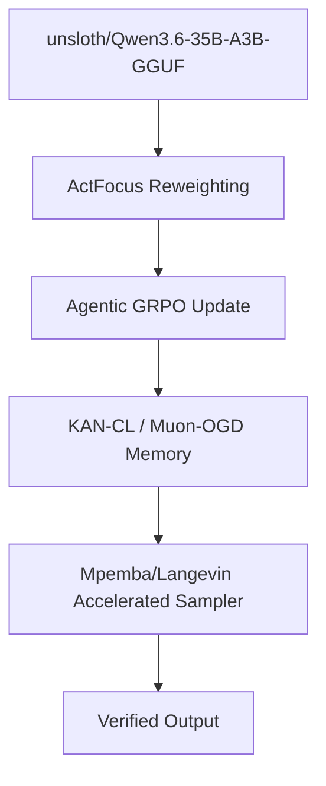

# Carnot Research Roadmap: Milestone 2026.05.191

## ActFocus Agentic RL + KAN-CL Continual Learning + Thermodynamic Langevin Sampler

### Objective
This milestone addresses three major gaps identified in the PRD and recent architectural reviews:
1. **Catastrophic Forgetting in Self-Learning:** Utilizing Per-Knot Importance Regularization for KANs (KAN-CL) and Spectral Orthogonal Gradients (Muon-OGD) to achieve robust, continuous self-learning (FR-11).
2. **Sampler Latency:** Accelerating stochastic samplers through Mpemba-inspired thermodynamic initializations and Langevin clock rescaling.
3. **Agentic Reasoning Bottlenecks:** Replacing uniform GRPO with ActFocus, which leverages token-level energy functions to direct reinforcement learning updates toward critical reasoning tokens.

### Previous Milestone (.190) Summary
Milestone 2026.05.190 successfully codified the Fast-Slow reasoning variant, integrated ODAR routing, and solidified the Phase 4 Canonical Decision framework. These structural advances provided the necessary foundation for advanced continual learning and targeted reinforcement strategies.

### Architecture Update

### Phases

#### Phase 1: Continuous Self-Learning Resilience
Focuses on stopping catastrophic forgetting.
- **Exp 1826:** Implement KAN-CL (Per-Knot Importance Regularization).
- **Exp 1827:** Implement Muon-OGD (Spectral Orthogonal Gradient Projection).
- **Exp 1828:** Evaluate KAN-CL vs Muon-OGD on FR-11 retention tasks.

#### Phase 2: Thermodynamic Sampler Acceleration
Focuses on inference speed for Phase 3/4 continuous EBMs.
- **Exp 1829 & 1830:** Implement Mpemba-inspired initialization and Langevin clock rescaling.
- **Exp 1831:** Benchmark the accelerated samplers.

#### Phase 3: Energy-Informed Agentic RL
Targets the optimization of the LLM via energy functions.
- **Exp 1832 & 1833:** Implement ActFocus Token-Level Energy Reweighting for GRPO and train models on reasoning trajectories.
- **Exp 1834:** Evaluate ActFocus vs Baseline GRPO.

#### Phase 4: Synthesis, Documentation, and Scaling
Tying it all together.
- **Exp 1835:** Author theoretical connections (EBM-RLVR equivalence).
- **Exp 1836 & 1837:** E2E Integration and Benchmark with flagship MoE models.
- **Exp 1838:** Retrospective.

### Hardware Requirements
- **LLM Inference:** RTX 3090/4090 for running `unsloth/Qwen3.6-35B-A3B-GGUF` and `unsloth/gemma-4-31B-it-GGUF`.
- **Continual Learning:** Standard GPU memory constraints apply.

### Models
Mandated SOTA local GGUF models applied:
- `unsloth/Qwen3.6-35B-A3B-GGUF`
- `unsloth/gemma-4-31B-it-GGUF`
- `unsloth/gemma-4-26B-A4B-it-GGUF`
