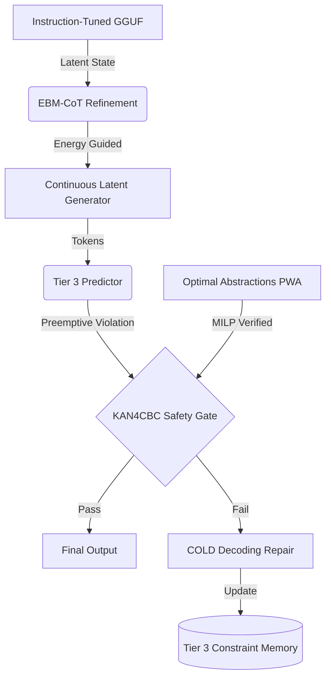

# Research Roadmap: Milestone 2026.05.157

**Date:** 2026-05-13
**Status:** PROPOSED
**Author:** Carnot Autonomous Planning Agent

## 1. Context and Previous Milestone Findings

Milestone `2026.05.156` successfully achieved initial implementations of the NSVIF/Z3 SMT Extractor, LLM-as-extractor, COLD Decoding, RUN-CSP, DeepSaDe guaranteed domain constraints, and Tier 2 Constraint Memory. However, the operational retrospective for `.156` showed that extraction and verification remain compute-bound bottlenecks. We must now formalize these implementations with mathematical guarantees (MILP verification for KANs) and push the boundary towards latent-space reasoning (EBM-CoT) and preemptive violation prediction (Tier 3 FR-11).

### The Three Biggest Gaps
1. **Lack of Formal Verification for Spline Topologies:** While KANs provide constraint flexibility, we lack verifiable safety guarantees for their topologies.
2. **Latent Space Separation:** Constraint extraction currently operates on discrete tokens. We need to shift towards latent-space refinement (EBM-CoT) for true continuous reasoning.
3. **Reactive vs. Preemptive Learning:** Tier 2 memory is reactive. FR-11 requires transitioning to Tier 3: JEPA-style predictive verification to catch violations before they manifest in discrete tokens.

## 2. Architecture Diagram (Phase-8)

## 3. Phase Descriptions

### Phase 0: Activation and Housekeeping
- Archive `.156` artifacts and initialize `.157`.
- Pre-flight local SOTA GGUFs.

### Phase 1: Latent Reasoning and Continuous Generation
- Implement EBM-CoT latent "thought" calibration (arXiv:2511.07124).
- Scale FAR (Fast Autoregressive) continuous latent sampling.

### Phase 2: Formal Verification of Constraints
- Implement PWA (Piecewise Affine) abstractions for KANs.
- Interface with MILP solvers to guarantee property verification.
- Implement KAN4CBC for safety barrier certificates.

### Phase 3: Preemptive Self-Learning (FR-11 Tier 3)
- Train a JEPA-style predictive verification model.
- Enable preemptive guided decoding based on prediction scores.

### Phase 4: Hardware Parity and Retro
- Hardware-oriented LUT accounting for KANs.
- Milestone retrospective.

## 4. Hardware Requirements
- Dual RTX 3090 (24GB each) for `unsloth/Qwen3.6-35B-A3B-GGUF` and `gemma-4-31B-it-GGUF`.
- CPU inference fallback for MILP solvers.
- KV260 hardware emulation for LUT accounting tasks.