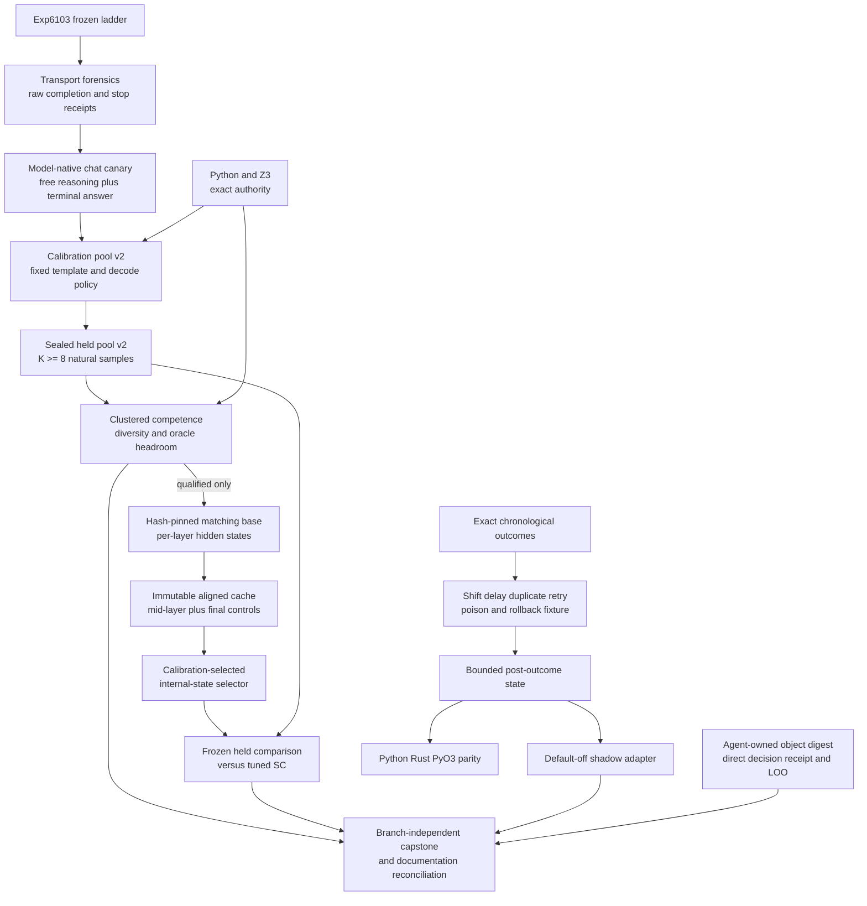

# Research Roadmap vNEXT — Milestone 2026.08.531

**Milestone title:** Model-Native Phase-D Claims, Mid-Layer Verification, and
Idempotent Outcome Learning

**Status:** Planned after terminal milestone `2026.08.530`

**Experiment range:** Exp6124-Exp6137

**Architecture freshness note:** `_bmad/architecture.md` was last reconciled on
2026-07-03 and is stale relative to the terminal `.530` artifacts. It is used
as historical evidence only. Exp6137 must reconcile it against delivered `.531`
surfaces; gate-blocked or proposal-only components must not be documented as
current architecture.

**Primary question:** Can Carnot repair the measured model-native answer
transport failure, produce an authentic same-model Phase-D selection domain,
test a genuinely mid-layer internal verifier without reopening retired scorer
families, and turn outcome-committed memory into an idempotent, resource-matched
continuous-learning substrate?

## What milestone 2026.08.530 proved

| Evidence | Terminal result | Consequence for `.531` |
|---|---|---|
| Exp6112 transition | `complete`; the exact `.529` terminal ledger was archived without treating proposal-only tasks as missing | Reuse the collision-safe transition pattern for `.531` |
| Exp6113 source delta | `complete_null`; no accepted source after the V530 planner marker | Search only after `V531-PLANNER-REFRESH-20260804-END`; zero findings remains valid |
| Exp6114 GPU canary | `complete_ready`; `unsloth/gemma-4-26B-A4B-it-GGUF` ran on a task-owned RTX 3090 lease with real lifecycle receipts | The measured-fit 26B MoE is the Phase-D generator; do not infer that the 31B or 35B families fit one 24 GiB card |
| Exp6115 calibration pool | `complete_null`; per-candidate accuracy `0.020833`, parseability `0.061111`, method-validity `0.011111`, all-wrong `0.877778`, and effective K about `1.7-2.0` | Do not spend the held pool. First isolate and replace the raw-completion/newline-stop transport that emitted empty strings and model channel fragments |
| Exp6115 raw receipts | Raw `Llama(...)` completion omitted the model-native chat template and used `stop=["\n"]`; rare rows that reached `Final answer: D` were parseable | The smallest legitimate recovery is a frozen chat-template and terminal-answer canary, not a new dataset or hidden-label retry loop |
| Exp6116-Exp6119 | Correctly gate-blocked after Exp6115 readiness `0.0` | Preserve the scientific chain: transport, calibration pool, held headroom, per-layer surface, selector |
| Exp6120 outcome commits | `complete_positive` only on equal final utility with smaller state: reduced-order final utility `1.0`, write-through `1.0`, state 24 versus 78 bytes; write-through still led online AUC | Test equal-resource stress, shift, delayed outcomes, duplicate delivery, rollback, and non-forgetting before integration; do not claim reduced-order superiority |
| Exp6121 GateMate | `blocked_physical_action`; hardware state unchanged and `retirement_triggered=true` | No new GateMate task until a physical-state receipt changes |
| Exp6122 ARC | `complete_null`; generic object-centric digest reached 19 games and was downstream-consumed, but lacked direct returned-decision receipts and a disable/LOO causal arm | Allocate exactly one ARC slot to live-path receipt instrumentation and held leave-one-game-out ablation; make no level-solve claim |
| Exp6123 capstone | `complete_with_blocks`; Phase D remained blocked downstream of transport, while continuous learning supplied the only new positive substrate | `.531` must close evidence boundaries honestly and reconcile stale architecture and operations documents |

## The three largest gaps to the PRD vision

### Gap 1 — Phase D has no authentic claim-producing candidate domain

PRD FR12 requires verifiable reasoning where an internal verifier can choose
among plausible model candidates and an exact authority can audit the choice.
The frozen low-chance ladder exists, but Exp6115 never tested that scientific
question: the runtime used raw completion with a newline stop against a
channel-bearing instruction model, so most rows were empty or transport
fragments. Carnot therefore still lacks a competent, diverse, unsaturated
same-model pool with measurable `oracle@K - tuned_SC` headroom.

`.531` first performs artifact-grounded transport forensics, then runs a small
model-native chat canary with a free-reasoning region and one terminal answer
field. Only a pass may generate a new calibration pool; only calibration
qualification may spend the sealed held split. Exact Python/Z3 labels remain
the authority. Syntactic success is necessary but never a semantic result.

### Gap 2 — the learned verifier lacks a reachable mid-layer substrate

Carnot's prior final-token/final-layer hidden-state paths were weak or null, and
the MMLU-Pro lineage is retired. The `.530` per-layer and selector tasks never
ran because the candidate domain failed upstream. Meanwhile, new quantized-LLM
evidence localizes truthfulness signals in intermediate layers rather than the
last layer. The PRD's learned verifier/energy layer still has no qualified
same-corpus test of that distinct surface.

`.531` gates extraction on authentic held headroom, hash-pins a matching-base
transformer, proves token and pre-answer-marker alignment, and preregisters a
small mid-layer band before inspecting labels. Calibration selects one simple
probe or centroid configuration. A separately frozen held comparison then
tests it against tuned self-consistency, final-layer, norm, length,
answer-label, shuffled-label, and oracle-peeking controls. Generated-text and
output-logprob scorer families remain retired.

### Gap 3 — continuous learning is transactional but not stress-qualified

PRD FR11 requires autonomous improvement from verified experience. Exp6120
showed that a 24-byte outcome-committed state could tie the eventual utility of
a 78-byte write-through state, but it trailed write-through during learning and
was not tested under equal state budgets, domain shift, delayed outcomes,
duplicate deliveries, replay retries, rollback, or protected-prefix retention.

`.531` treats idempotence as a first-class property. A deterministic fixture
injects shift, delay, duplicate/reordered delivery, poison, and rollback cases.
The outcome-committed method is then compared with resource-matched
write-through, delayed commit, fixed memory, shuffled retrieval, and no-memory
controls. A default-off shadow adapter is allowed only if future-event utility,
idempotence, safety, ABI parity, and non-forgetting all pass. Model weights stay
immutable.

## Research findings incorporated

| Source | Finding | `.531` use |
|---|---|---|
| IDER, arXiv:2603.00624 | Continual learners should be stable under repeated application of the same experience | Exp6133-Exp6135 require duplicate and retried exact-outcome deliveries to leave bounded state, decisions, audit events, and rollback results unchanged |
| Hallucination Is Linearly Decodable from Mid-Layer Hidden States in Quantized LLMs, arXiv:2606.02628 | The strongest truthfulness signal appears in intermediate layer bands; a linear probe can match more complex heads | Exp6130-Exp6132 test a preregistered mid-layer band on the new Phase-D corpus and retain the negative final-layer lineage as a control |
| Thinking Before Constraining, arXiv:2601.07525 | Free reasoning followed by a terminal structured switch can preserve reasoning while making the final answer reachable | Exp6127 uses this only as a bounded transport canary around the model's native chat serialization; it is not a ConstraintIR or semantic-success claim |
| Solver-Hard, arXiv:2607.17047 | Solver difficulty and model difficulty diverge, and semantics-preserving surface changes expose model brittleness | Exp6128-Exp6129 retain family, relabel, shortcut, and difficulty strata instead of treating exact solver validity as model competence |
| Semantic Scholar citation refresh | Direct API receipts showed 32 visible EBT citations and eight ARM-EBM citations; no new citation displaced the local plan | Citation counts are discovery receipts only; no citation-driven reproduction task is added |
| Extropic official hardware page | Z1 Stick and Card are now labeled early access 2027 | No TSU experiment, speedup claim, or 2026 availability assumption is eligible |
| Logical Intelligence Kona pages | Public architecture still describes global/non-autoregressive trace scoring beneath LLM coordination, without public weights or a reproducible local API | Retain the generator/verifier boundary as architecture context only |

The full dated evidence and URLs are recorded before this design in
`research-references.md` under `V531 Planner Refresh - 20260804`.

## Target architecture



Load-bearing boundaries:

- Exact Python/Z3 validators label candidates. No learned energy, hidden-state
  selector, model confidence, or LLM judge is an oracle.
- Exp6127 changes only model serialization and terminal-answer reachability on
  a frozen calibration slice. It cannot claim improved reasoning.
- Calibration may choose a decode policy and selector configuration only from
  calibration rows. Held labels cannot affect prompts, generation, retries,
  row inclusion, layer choice, or thresholds.
- Same-model `K` means independent stochastic draws from the same pinned GGUF,
  template, and question. Deterministic builders and hidden-label retries are
  forbidden.
- GGUF generation and matching-base activation extraction are distinct
  substrates. Revisions, hashes, tokenizers, precision, device maps, and token
  alignment are explicit and fail closed.
- The internal selector reads immutable cached hidden features. External
  generated-text/logprob scoring, the retired MMLU final-embedding lineage,
  finite-ID transport, parser repair loops, and stop-token retry families are
  not reopened.
- Continuous learning reads a frozen decision snapshot and mutates bounded
  external state only after exact outcomes. Duplicate delivery is idempotent;
  model weights remain unchanged.
- ARC instrumentation is agent-owned and live-reachable. No game source,
  registry path, hand GameAdapter, exhaustive offline BFS, or solve claim is
  eligible.

## Reservation and majority accounting

| Class | Tasks | Count |
|---|---|---:|
| Infrastructure | Exp6124 transition, Exp6137 capstone | 2 |
| Phase-D evidence ingestion | Exp6125 source delta | 1 |
| Phase-D claim production | Exp6126-Exp6132 | 7 |
| Continuous self-learning | Exp6133-Exp6135 | 3 |
| ARC live-path floor | Exp6136 | 1 |
| **Total** | Exp6124-Exp6137 | **14** |

Eight of fourteen tasks are allocated to Phase-D evidence or execution. After
transition, capstone, and the single ARC floor are removed, eight of eleven
remaining slots are Phase D. The ARC induction line remains closed.

## Phase A — exact boundary and transport diagnosis

### Exp6124 — exact transition into `.531`

Archive exactly the twelve activated `.530` identities and declared
deliverables. Preserve readiness, gate-block, physical-action, and retirement
states without laundering them into missing or successful evidence. Append
`.530` once if absent and prove Exp6124-Exp6137 collision-free.

**Deliverable:** `results/experiment_6124_transition_v531.json`

### Exp6125 — post-V531 source-delta ingestion

Search only after `V531-PLANNER-REFRESH-20260804-END`. Recheck the mandated
primary and secondary sources. Record URLs, dates, applicability, duplicates,
and rejection reasons. Zero accepted deltas is an honest complete-null result
and cannot change experiment identities or preregistered gates.

**Deliverable:** `results/experiment_6125_v531_source_delta_ingestion.json`

### Exp6126 — Exp6115 transport forensics

Recompute Exp6115's non-empty, channel-fragment, terminal-field, parseability,
method-validity, truncation, and stop-reason rates directly from its immutable
raw rows. Pin the GGUF metadata and inspect the local tokenizer/chat-template
surface without running a new model. Produce a minimal, falsifiable v2
serialization specification and state whether a new canary is justified.

**Deliverable:** `results/experiment_6126_phase_d_exp6115_transport_forensics.json`

## Phase B — model-native Phase-D candidate domain

### Exp6127 — gated model-native chat fidelity canary

On a frozen, family-balanced calibration slice, compare the exact Exp6115
transport with one pinned model-native chat serialization using
`unsloth/gemma-4-26B-A4B-it-GGUF`. Permit natural reasoning and require one
terminal answer field. Use a non-truncating budget and task-owned GPU receipts.
Pass only on preregistered non-empty, terminal-field, parseability,
channel-leakage, and method-validity deltas; report exact accuracy separately.

**Gate:** Exp6126 `model_native_chat_change_justified_score == 1.0`

**Deliverable:** `results/experiment_6127_phase_d_native_chat_transport_canary.json`

### Exp6128 — gated calibration candidate pool v2

Freeze the passing template and decode policy from Exp6127. On at least 90
calibration questions balanced across the three families and preregistered
difficulty strata, collect `K >= 8` natural independent draws from the 26B MoE.
Persist raw prompts, chat serialization, completions, seeds, stop reasons,
token counts, exact labels, and compute receipts. Qualification measures
competence, method validity, parseability, all-wrong, duplicate rate, and
effective K separately.

**Gate:** Exp6127 `model_native_transport_ready_score == 1.0`

**Deliverable:** `results/experiment_6128_phase_d_calibration_pool_v2.json`

### Exp6129 — gated held pool and clustered headroom audit v2

Using the frozen Exp6128 policy, generate at least eight draws for every sealed
held question and audit at the independent-question unit. Require parseability
`>= 0.95`, effective `K >= 7.5`, per-candidate accuracy in `[0.40, 0.70]`, a
question-clustered lower interval above the enumerated `0.25` floor, all-wrong
rate `<= 0.10`, and `oracle@K - tuned_SC >= 0.10` with a clustered lower
interval above zero. Report method-validity, relabel, shortcut, difficulty,
answer-cluster, and family strata. Best-of-K is diagnostic only.

**Gate:** Exp6128 `phase_d_calibration_ready_score == 1.0`

**Deliverable:** `results/experiment_6129_phase_d_held_pool_v2.json`

## Phase C — authenticated mid-layer verifier

### Exp6130 — gated matching-base per-layer surface v2

Resolve and hash-pin the base transformer corresponding to the GGUF generator.
Prove tokenizer and pre-answer-marker alignment, establish
`output_hidden_states=True`, and cache immutable calibration and held candidate
features with explicit revision, precision, device-map, layer, token-position,
and row-hash provenance. Preregister a small intermediate layer band before
reading correctness labels, while retaining final-layer features as a control.
Fail closed on mismatch, memory pressure, or ambiguous alignment.

**Gate:** Exp6129 `phase_d_headroom_ready_score == 1.0`

**Deliverable:** `results/experiment_6130_phase_d_per_layer_surface_v2.json`

### Exp6131 — gated mid-layer selector calibration

Use calibration questions only to choose one simple linear probe or
non-parametric centroid configuration, one layer/anchor, and one frozen
threshold. Compare with tuned self-consistency, final-layer, norm, length,
answer-label, shuffled-label, and oracle-peeking positive controls. Require
question-grouped resampling and persist the selected immutable configuration;
do not inspect or report held selector accuracy.

**Gate:** Exp6130 `per_layer_surface_ready_score == 1.0`

**Deliverable:** `results/experiment_6131_phase_d_mid_layer_selector_calibration.json`

### Exp6132 — gated frozen held hidden-state evaluation

Apply the frozen Exp6131 selector once to the sealed held candidates. Compare
paired question-level accuracy, exact utility, abstention, latency, and compute
against tuned self-consistency and all preregistered controls. Headline only if
the paired lower confidence bound for accuracy delta is above zero, exact
utility does not regress, shortcut controls fail as expected, and no held-data
selection or leakage is detected. Otherwise record the honest null or negative.

**Gate:** Exp6131 `selector_calibration_ready_score == 1.0`

**Deliverable:** `results/experiment_6132_phase_d_hidden_state_held_eval.json`

## Phase D — idempotent learning, ARC causality, and reconciliation

### Exp6133 — deterministic CSL shift/delay/idempotence fixture

Build a test-first chronological fixture that contains clean pre-shift events,
post-shift events, delayed exact outcomes, exact duplicate deliveries,
reordered retries, poison events, rollback checkpoints, and protected-prefix
sentinels. Establish Python/Rust/PyO3 fixed-width serialization parity and
reference invariants before comparing learners.

**Deliverable:** `results/experiment_6133_csl_shift_delay_idempotence_fixture.json`

### Exp6134 — gated resource-matched outcome-committed CSL stress A/B

Run the Exp6120 outcome-committed method against resource-matched
write-through, delayed commit, fixed memory, shuffled retrieval, and no-memory
controls across chronological seeds. Equalize state bytes and retrieval budget.
Report pre/post-shift online AUC, future-event exact utility, recovery time,
duplicate-delivery state delta, replay idempotence, contamination, rollback,
protected-prefix retention, state size, and paired confidence intervals.

**Gate:** Exp6133 `csl_stress_fixture_ready_score == 1.0`

**Deliverable:** `results/experiment_6134_outcome_committed_csl_stress_ab.json`

### Exp6135 — gated default-off outcome-learning shadow adapter

If and only if Exp6134 passes every scientific and safety gate, add a
default-off adapter that consumes exact post-outcome events through the
transactional store and emits shadow-only decisions and audit receipts. It may
not alter production selection, verifier authority, or model weights. Test
replay, duplicate delivery, rollback, poison quarantine, disabled-mode parity,
and Python/Rust/PyO3 behavior.

**Gate:** Exp6134 `outcome_csl_stress_ready_score == 1.0`

**Deliverable:** `results/experiment_6135_outcome_csl_shadow_adapter.json`

### Exp6136 — ARC object-digest direct receipt and held LOO ablation

Use the already live-reachable generic object-centric digest; do not add a
per-game solver and do not claim a level solve. Add an agent-owned direct
returned-decision receipt and a generic default-off feature-disable hook. On
the frozen development/held game split, compare digest enabled versus disabled
with leave-one-game-out fitting, identical budgets, and attempt-level paired
receipts. Report discoverability, direct decision consumption, regression,
leakage, and solve provenance even though no solve claim is eligible.

**Deliverable:** `results/experiment_6136_arc_object_digest_receipt_loo.json`

### Exp6137 — branch-independent `.531` capstone and reconciliation

Inventory every activated identity and artifact regardless of upstream gate
outcomes. Re-run adversarial verification, unit/lint/spec coverage, and the
applicable end-to-end checks from `ops/e2e-test-plan.md`. Reconcile delivered
behavior only across `openspec/`, `_bmad/traceability.md`,
`_bmad/architecture.md`, `ops/status.md`, `ops/changelog.md`,
`research-complete.yaml`, `ops/known-issues.md`, and hardware documentation.
Mark every proposal-only or gate-blocked component explicitly.

**Deliverable:** `results/experiment_6137_v531_capstone_reconciliation.json`

## Dependency graph

```text
Exp6124  exact transition ---------------------------------------------\
Exp6125  source delta --------------------------------------------------+--> Exp6137
                                                                       |
Exp6126  transport forensics                                           |
   `--> Exp6127  native chat canary                                    |
          `--> Exp6128  calibration pool v2                            |
                 `--> Exp6129  held pool + headroom -------------------+
                        `--> Exp6130  per-layer surface v2              |
                               `--> Exp6131  selector calibration      |
                                      `--> Exp6132 held evaluation ----+
                                                                       |
Exp6133  CSL stress fixture                                            |
   `--> Exp6134  resource-matched stress A/B                           |
          `--> Exp6135  default-off shadow adapter --------------------+
                                                                       |
Exp6136  one ARC receipt/LOO slot -------------------------------------/
```

Exp6137 is intentionally ungated. It must reconcile skipped and failed branches
as carefully as successful ones.

## Hardware and model requirements

| Tasks | Requirement | Expected use | Fail-closed condition |
|---|---|---|---|
| Exp6124-Exp6126, Exp6131, Exp6133-Exp6137 | CPU, normal host RAM, existing artifacts | Ledger, diagnostics, cached-feature analysis, deterministic fixtures, ARC, and reconciliation | Missing immutable upstream artifacts or provenance |
| Exp6127-Exp6129 | One RTX 3090 with task-owned lease; pinned `unsloth/gemma-4-26B-A4B-it-GGUF`; sufficient model/cache disk | Small canary, calibration pool, then held pool | Free VRAM below the measured fit, missing model hash/chat template, absent GPU lifecycle receipt, or thermal/lifecycle violation |
| Exp6130 and Exp6132 | Dual RTX 3090 host or an explicitly measured equivalent; at least 64 GiB host RAM; sufficient disk for pinned base weights and immutable feature cache | Matching-base hidden-state extraction and frozen held evaluation | Base/GGUF provenance mismatch, ambiguous token alignment, OOM, unpinned weights, or missing cache hashes |

Any new task that invokes an LLM includes at least one mandated local SOTA GGUF
in `MODEL_SPECS`. The Phase-D generator is
`unsloth/gemma-4-26B-A4B-it-GGUF`, selected from the `.529` measured capacity
receipt. The matching base is additional provenance, not a substitute for that
required generator declaration. Legacy Qwen3.5-0.8B or Gemma E4B models may be
used only for explicitly labeled CPU smoke tests and cannot support headline
results.

No FPGA task is planned. GateMate remains retired pending a changed physical
receipt, KV260 is terminal, PolarFire is opportunistic, and Extropic's Z1
schedule is now 2027 with no authenticated local access. Hardware availability
is reported without speedup or power claims.

## Preregistered gates and kill rules

| Gate | Required artifact field | Pass condition |
|---|---|---|
| Transport diagnosis | Exp6126 `model_native_chat_change_justified_score` | `== 1.0` |
| Native transport | Exp6127 `model_native_transport_ready_score` | `== 1.0` after all transport and method-validity thresholds pass |
| Calibration pool | Exp6128 `phase_d_calibration_ready_score` | `== 1.0` on the frozen calibration policy |
| Held headroom | Exp6129 `phase_d_headroom_ready_score` | `== 1.0` after all clustered competence, diversity, all-wrong, and oracle-headroom gates pass |
| Per-layer surface | Exp6130 `per_layer_surface_ready_score` | `== 1.0` with matching provenance and aligned immutable cache |
| Selector calibration | Exp6131 `selector_calibration_ready_score` | `== 1.0` with a frozen calibration-only configuration |
| CSL fixture | Exp6133 `csl_stress_fixture_ready_score` | `== 1.0` after deterministic invariants and ABI parity pass |
| CSL stress | Exp6134 `outcome_csl_stress_ready_score` | `== 1.0` only with positive future-event evidence plus idempotence, rollback, safety, parity, and non-forgetting |

Kill rules:

- If Exp6127 does not beat the immutable Exp6115 transport on every
  preregistered transport threshold, retire this transport attempt and do not
  generate another pool.
- If Exp6128 fails semantic competence, method validity, diversity, or
  all-wrong gates, stop Phase D. Parseability alone cannot qualify it.
- If Exp6129 lacks clustered oracle headroom over tuned self-consistency, stop
  hidden-state extraction; a selector has no legitimate target.
- If Exp6130 cannot prove matching-base provenance and token alignment, do not
  approximate hidden states from another model.
- If Exp6132's held interval includes zero, record a null. Do not tune on held
  rows or reopen external text/logprob scoring.
- If duplicate delivery changes state or decisions, rollback/parity fails, or
  future-event utility is non-positive, do not build the shadow adapter.
- If the ARC digest cannot be tied directly to returned live decisions, report
  a null. Do not substitute outer-loop reverse engineering or claim a solve.

## Explicitly deferred or excluded

- GateMate, KV260, PolarFire, and Extropic execution while physical/access state
  is unchanged.
- Any ARC induction-line revival, repeated registered solve, hand GameAdapter,
  game-source inspection, exhaustive offline BFS, or outer-loop solve claim.
- Another raw-completion newline-stop pool, finite-ID/grammar transport retry,
  parser-only repair loop, or full ConstraintIR rerun.
- External generated-text/logprob scorer families and the retired MMLU-Pro
  final-token/final-layer hidden-state scope.
- Model-weight fine-tuning, self-authored labels, same-decision writes, or
  non-transactional memory mutation.
- Speedup, energy-efficiency, thermodynamic-compute, or hardware-parity claims
  without measured executable access.

## Success criteria

The milestone is successful even if scientific branches terminate honestly.
Operational completion requires:

1. Every activated Exp6124-Exp6137 identity emits its declared artifact or a
   conductor-authenticated gate skip.
2. Phase D either produces an authentic held pool with clustered headroom and a
   frozen mid-layer held comparison, or terminates at the first failed gate
   without spending downstream compute.
3. Continuous learning produces an equal-resource, chronological stress result
   with explicit duplicate-delivery idempotence; integration remains default
   off and is built only after all gates pass.
4. The single ARC task emits direct live decision and feature-disable receipts
   without claiming a solve.
5. Exp6137 reconciles specs, architecture, traceability, status, changelog,
   research ledger, known issues, and hardware records with the actual terminal
   evidence and applicable end-to-end checks.

## Conductor execution order

```text
Exp6124 -> Exp6125 -> Exp6126 -> Exp6127 -> Exp6128 -> Exp6129 ->
Exp6130 -> Exp6131 -> Exp6132 -> Exp6133 -> Exp6134 -> Exp6135 ->
Exp6136 -> Exp6137
```

Do not modify `research-roadmap.yaml` or
`scripts/research_conductor.py`. Do not push.
