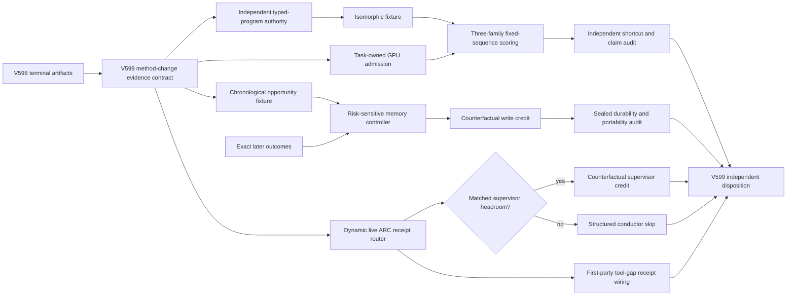

# Research Roadmap V599: Evidence-Qualified Compatibility, Selective Self-Learning, and Live Credit

**Milestone:** 2026.09.599
**Planned:** 2026-09-01
**Experiments:** Exp6848-Exp6860
**North star:** A live agent learns useful constraints from its own outcomes. Exact external checks remain truth authority. Learned energy selects, routes, and abstains without becoming its own oracle.

## Executive Summary

V598 completed all planned work and returned a useful null. The typed obligation program and the continuous-learning transaction kernel both ran. Neither branch earned a scientific claim. The independent capstone found that the typed fixture's producer readiness scores did not survive fresh reduction. The three-family compatibility run then blocked before a live canary because it could not obtain an exclusive GPU lease. The residual-memory rule was harmful on held-future rows. The ARC evidence path transported supervisor receipts, but no matched row had intervention headroom. The tool-gap branch found no first-party gap obligation.

V599 changes each failed mechanism. It rebuilds typed-program authority with unique identities and isomorphic perturbation tests. It separates GPU admission from scientific scoring. Only then does it measure fixed-sequence compatibility on all three mandated local GGUF families.

The self-learning phase retires the nonselective residual rule. It implements a risk-sensitive contextual controller with verified-memory, no-memory, and abstain actions. Exact later outcomes supply reward. False-positive memory injection costs more than missed reuse. A counterfactual audit measures whether any write caused later benefit or harm.

The ARC phase discovers evidence by provenance-qualified manifests at execution time. It does not pin an audit to Exp6681. Supervisor credit runs only if matched nonzero-headroom receipts exist. Tool-gap work moves one layer earlier and wires a first-party receipt contract at the canonical live seam. No task claims a game solve.

## What V598 Proved

1. **The typed program is mechanically implementable, but its authority is disputed.** Exp6836 compiled energy, predicate, memory guard, ARC guard, and diagnostics. Its producer marked compile parity ready. Exp6847 independently found duplicated candidate identities and recomputed compile parity as false. A new scoring task cannot trust the producer readiness bit.

2. **The local model path is available, but resource admission was not.** Exp6837 resolved all three mandated GGUF model files and found CUDA support. It never reached a live forced-sequence row because exclusive GPU leases and canaries failed. This is a scheduling and ownership result, not a model result.

3. **The transaction kernel works.** Exp6839 exercised propose, commit, persist, restart, and rollback. Exp6840 and Exp6841 produced their chronological shards. V598 therefore closed the execution question for bounded external memory.

4. **The residual-memory learning rule is harmful.** Exp6842 found five held-future wins and 69 losses, with mean effect `-0.118519`. Durability passed, but calibrated dose and family portability failed. The same residual-dose mechanism should retire.

5. **Live ARC transport is no longer the main blocker.** Exp6843 found terminal live evidence. Exp6844 reported zero eligible supervisor-effect rows because the frozen source had no nonzero headroom. Exp6845 found zero first-party tool-gap obligations. Exp6846 shipped a default-off shadow monitor but made no solve or utility claim.

6. **Static source paths are too brittle.** The capstone found source-hash drift and noted that a new headroom-bearing receipt would not help an audit hard-coded to an older artifact. Future audits need a frozen contract plus execution-time provenance discovery.

## Three Biggest Gaps to the PRD Vision

### Gap 1: Model compatibility lacks independent authority and live rows

FR12 requires a verifier that maps rules to checkable structure. Carnot has exact atoms and fixed candidates, but the fixture authority is not clean and the local scoring path has no completed three-family row. A model score cannot be interpreted until unique identities, compile parity, and isomorphic invariance pass under an independent reducer.

V599 first repairs authority. It then qualifies resource admission in its own task. Scientific scoring opens only after both conditions pass.

### Gap 2: Continuous self-learning is operational but unsafe

FR11 requires online learning with bounded updates, persistence, validation, and rollback. V598 proved the mechanics and disproved the current policy. The next gap is selection: the system must learn when memory is safe, when no memory is better, and when it should abstain.

V599 uses a risk-sensitive contextual bandit over a chronological exact-outcome stream. It keeps weights frozen. It penalizes false-positive memory injection more than missed reuse. Counterfactual removal and sealed portability tests decide whether any learning claim survives.

### Gap 3: Live ARC mechanisms still lack causal, reachable effect evidence

The live agent has supervisor, tool, and shadow mechanisms. Current evidence shows transport and reachability, not useful action effect. The supervisor branch lacks matched headroom. The tool-gap branch lacks a first-party obligation at the live seam. Static audit paths also miss newer terminal receipts.

V599 adds dynamic provenance routing, gates supervisor credit on real headroom, and wires a first-party tool-gap receipt contract. It improves the live evidence path rather than solving a game for the agent.

## Research Findings That Change the Design

The full source notes are in `research-references.md`, section **V599 Planner Refresh - 2026-09-01**.

- [Learning When to Remember](https://arxiv.org/abs/2604.27283) treats memory retrieval as a risk-sensitive action choice with no-memory and abstention arms. This directly changes the continuous-learning mechanism.
- [LLMs Gaming Verifiers](https://arxiv.org/abs/2604.15149) introduces Isomorphic Perturbation Testing. V599 uses it to reject extensional shortcuts and duplicated candidate identities before scoring.
- [Counterfactual Shapley Credit Assignment](https://arxiv.org/abs/2607.16999) separates policy contribution from environmental luck. V599 uses bounded counterfactual coalitions only on exact-outcome rows with real headroom.
- [Claim-Level Reliability Assessment](https://arxiv.org/abs/2608.11994) supports verification at decision-critical units. V599 keeps typed atoms and executable actions as the unit of evidence.
- [Selective Verification for Budget-Aware Reasoning](https://arxiv.org/abs/2606.19808) shows that always-on intervention can waste compute or cause harmful flips. V599 includes preserve and abstain controls in learning and ARC audits.
- [On-Policy Self-Improvement](https://arxiv.org/abs/2608.31046) warns that a teacher-derived gain may instead be tail suppression. V599 keeps GGUF weights frozen and treats model-derived update signals as controls, not truth.

The secondary sweep found no execution-ready hardware or model dependency. Semantic Scholar returned eight visible ARM-EBM citations and throttled the EBT endpoint. OpenReview supplied the isomorphic verifier test. Hugging Face supplied claim-level and selective-verification leads. GitHub trending supplied no dependency worth adding. Extropic's Z1 path still targets 2027 access. Logical Intelligence still exposes no Kona weights or local runner.

## Target Architecture



Exact checkers and exact later outcomes remain outside the learned mechanisms. They label results and authorize commits. Model margins, contextual policies, and Shapley values are tested signals. None can validate itself.

## Model Contract

Exp6850 and Exp6851 need local LLM inference. Both declare all three mandated models:

- `unsloth/Qwen3.6-35B-A3B-GGUF`
- `unsloth/gemma-4-31B-it-GGUF`
- `unsloth/gemma-4-26B-A4B-it-GGUF`

They use `cached_sota_pair()` and the local `llama.cpp` CUDA path. They run one model process at a time, record model and tokenizer hashes, and tear down only task-owned processes. Legacy small models may run CPU smoke tests only. They cannot support a headline claim.

## Phase 1: Evidence-Qualified Typed Compatibility

### Exp6848: V599 method-change and evidence contract

Freeze the terminal V598 artifacts and conductor skips. Recompute the disputed readiness fields. Declare which mechanisms retire, which fields are dynamic, and which sources can support V599 claims. Validate the new literature links and method differences without adding a novelty dependency.

### Exp6849: Independent typed-program isomorphic authority audit

Build a fresh reducer and a sanitized fixture with unique candidate identities. Recompile all typed views. Run permutation, label-swap, duplicate-removal, atom-renaming, and surface-form attacks. Emit readiness only if exact semantics and isomorphic invariance agree.

### Exp6850: Three-family scoring admission canary

Qualify cached artifacts, CUDA support, task-owned GPU leases, free ports, one forced-sequence canary per model, checkpoints, and clean teardown. This task emits no scientific margin claim. It separates resource readiness from Exp6851.

### Exp6851: Three-family isomorphic compatibility stream

After both authority and admission pass, score the sanitized fixed sequences on all three mandated GGUF families. Store every token score and one row per candidate pair, model, and isomorphic transform. Do not generate answers or fit a learned probe.

### Exp6852: Independent compatibility shortcut and claim audit

Run even when Exp6851 is blocked. Recompute every available row with fresh code. Test identity, length, order, normalization, label, and isomorphic controls. State whether a compatibility claim is positive, null, blocked, partial, or disqualified.

## Phase 2: Risk-Sensitive Continuous Self-Learning

### Exp6853: Risk-sensitive memory opportunity fixture

Build a chronological fixture with verified-memory, no-memory, and abstain actions. Include only decisions with exact later outcomes. Measure decision headroom before learning. The fixture must contain both useful and harmful memory opportunities.

### Exp6854: Abstention-aware online memory controller

Run a small contextual bandit prospectively over the frozen stream. Freeze each action before revealing its later exact outcome. Use asymmetric loss for false-positive injection. Bound state, updates, latency, and storage. Persist and restore controller state.

### Exp6855: Counterfactual memory-write credit audit

Recompute outcomes after valid write deletion, substitution, and bounded coalitions. Separate selection skill from stream luck. Test placebo context, random admission, always-memory, no-memory, and abstain controls. Credit no row whose counterfactual is invalid or lacks headroom.

### Exp6856: Sealed self-learning durability and portability audit

Use a fresh reducer. Test restart, rollback, delayed correction, poison, capacity pressure, leave-one-family-out transfer, and held-future benefit. A positive class requires nonzero benefit, bounded false-positive injection, durability, and no leakage.

This phase directly implements the research program's **Continuous Self-Learning** priority. It changes the policy, not merely the experiment wrapper.

## Phase 3: Live ARC Evidence and Causal Credit

### Exp6857: Dynamic live ARC receipt router

Discover terminal ARC artifacts through a provenance-qualified manifest at execution time. Do not hard-code Exp6681. Keep game, model, generator, budget, supervisor, tool-loop, and policy strata separate. Report whether matched supervisor headroom and first-party tool-gap receipts exist. Make no solve claim.

### Exp6858: Supervisor counterfactual credit, gated on Exp6857 headroom

Run only when `supervisor_headroom_ready_score == 1`. Compare valid action coalitions or matched removal cells. Exact later transition and level outcomes supply direction. Report action credit separately from trajectory luck. Do not pool games or changed policies.

### Exp6859: First-party tool-gap receipt wiring

Add a default-off receipt contract at the canonical live tool-gap seam. Record gap detection, request, tool response, agent-visible delivery, next action, and later exact outcome under one identity. Replay fixtures and terminal receipts. Do not launch a new game run or claim utility from transport.

## Phase 4: Ungated Independent Disposition

### Exp6860: V599 adversarial capstone

Read every terminal artifact and conductor skip that exists. Recompute branch dispositions. Preserve blocked, null, harmful, partial, and disqualified outcomes. Retire unchanged failures and name one mechanism-changing next action per open branch.

## Conductor Execution Order

| Order | Experiment | Phase | GPU | Headline question |
|---:|---|---:|:---:|---|
| 1 | Exp6848 | 1 | No | Which V598 evidence and mechanisms are admissible? |
| 2 | Exp6849 | 1 | No | Does typed-program authority survive isomorphic attacks? |
| 3 | Exp6850 | 1 | Yes | Can all three local models complete a task-owned scoring canary? |
| 4 | Exp6851 | 1 | Yes | Do the models prefer exact-compatible fixed sequences? |
| 5 | Exp6852 | 1 | No | Is any margin shortcut-resistant and identifiable? |
| 6 | Exp6853 | 2 | No | Does the stream contain safe memory-selection headroom? |
| 7 | Exp6854 | 2 | No | Can an online controller learn when to remember or abstain? |
| 8 | Exp6855 | 2 | No | Did a memory action cause benefit or harm? |
| 9 | Exp6856 | 2 | No | Is learning durable, safe, and portable? |
| 10 | Exp6857 | 3 | No | Which live ARC rows are provenance-qualified and comparable? |
| 11 | Exp6858 | 3 | No | Do supervisor actions cause exact later progress? |
| 12 | Exp6859 | 3 | No | Can the live seam emit a complete first-party tool-gap chain? |
| 13 | Exp6860 | 4 | No | Which V599 branches advance or retire? |

## Dependency Graph

```text
Exp6848 -> Exp6849 ---------+
    |                       +-> Exp6851 -> Exp6852
    +------> Exp6850 -------+
    |
    +------> Exp6853 -> Exp6854 -> Exp6855 -> Exp6856
    |
    +------> Exp6857 -> Exp6858  [effect-gated on supervisor headroom]
                       \-> Exp6859

Exp6848..Exp6859 -------------------------------> Exp6860
```

Exp6852 and Exp6860 are deliberately ungated. They must preserve blocked or missing upstream evidence. Exp6851 gates only on authority and resource readiness. Exp6854 through Exp6856 gate on stream or reducer completeness, not on a positive scientific effect. Exp6858 is the only effect-gated task because counterfactual supervisor credit is undefined without nonzero headroom.

## Hardware Requirements

### Required

- CPU, RAM, and local storage for fixtures, chronological replay, audits, and tests.
- Cached GGUF files for all three mandated model families.
- Local `llama.cpp` with CUDA and forced-sequence token scoring.
- One available RTX 3090 at a time for Exp6850 and Exp6851. The second RTX 3090 provides scheduling flexibility, not a required tensor-parallel claim.

### Scheduling and Ownership

- Exp6850 inspects GPU UUIDs, active processes, free VRAM, ports, model hashes, and orphan task-owned servers.
- It never interrupts unrelated work. A failed lease produces a terminal blocked artifact with the failed check and observed value.
- Exp6851 starts only after admission succeeds. It checkpoints bounded batches and verifies row hashes on restart.
- Every GPU task records process start, PID, device, port, first useful output, final output, and owned teardown.
- CPU tasks do not acquire a GPU lease.

### Explicitly Outside the Blocking Path

- No FPGA bitstream or board bring-up is planned. KV260, GateMate, and PolarFire remain terminal or opportunistic.
- No Extropic execution is claimed. Z1 access remains a future path.
- No Kona weights or runner are assumed.
- No dual-GPU speedup or hardware-energy claim is planned.
- No task launches a new live ARC game run.

## Evidence and Safety Rules

1. Every artifact declares `verdict_class` from the closed enum.
2. Every comparative task emits per-unit rows with the metric for each arm, model, seed, or condition.
3. Every blocked verdict names the failed check and observed value in `gate_check_summary`.
4. Every gate field is declared verbatim in its upstream task's required artifact fields.
5. Exact checkers and exact later outcomes define truth. A tested verifier is never its own oracle.
6. Isomorphic invariance is required before an extensional compatibility claim.
7. Continuous-learning decisions are chronological. Later outcomes cannot affect earlier actions.
8. Memory actions include no-memory and abstain. Writes are bounded, attributed, persistent, and reversible.
9. ARC evidence remains separated by game, model, generator, budget, policy, supervisor, and tool configuration.
10. No task reads game source, runs offline ground-truth BFS, builds a per-game adapter, or claims a level solve.
11. Existing processes are observed but never interrupted.
12. Every task runs focused tests, lint, OpenSpec coverage, adversarial verification, artifact audits, verdict-row consistency checks, and root-clutter checks.

## Milestone Completion Contract

V599 is complete when all 13 tasks have terminal artifacts or explicit conductor skip records and Exp6860 has issued an evidence-preserving disposition.

A positive milestone does not require every branch to win. The strongest valid outcomes are:

- a shortcut-resistant three-family compatibility result after independent authority and live admission;
- a held-future risk-sensitive memory benefit with low false-positive injection and sealed portability;
- a matched supervisor action effect with exact later outcome support; or
- a complete first-party tool-gap receipt contract at the reachable live seam.

A null or blocked result is complete when it names the failed precondition, preserves per-unit evidence, and retires an unchanged mechanism. The milestone must not convert resource readiness, transport, correlation, circular verification, reconstructed traces, or development-proxy evidence into a causal or solve claim.
