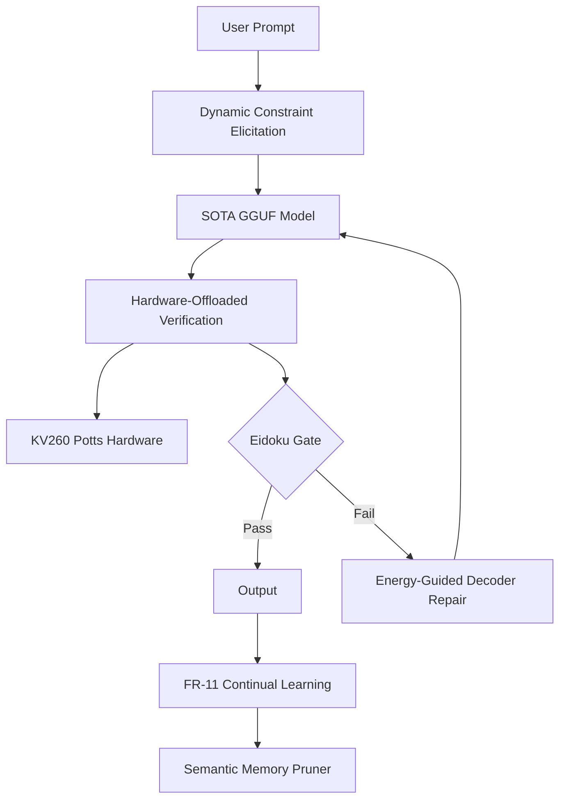

# Milestone 2026.05.132: Phase-9 Dynamic Constraint Elicitation, FR-11 Consolidation, and Hardware-Offloaded Verification

**Status:** Proposed  
**Author:** Carnot Research Planning Agent  
**Date:** 2026-05-13  

## What Milestone .131 Proved
Milestone .131 successfully implemented provable robustness for KANs (GloroKAN), established the Eidoku structural constraint satisfaction gate, and proved that a Potts q=3 model can be synthesized and executed on KV260 hardware. FR-11 continual learning replay buffers were integrated, and energy-guided decoding for factuality was evaluated. However, the system still relies on static, pre-defined constraints, the replay buffer faces eventual scaling limitations (catastrophic saturation), and the KV260 hardware execution was isolated from the live SOTA inference loop.

## The 3 Biggest Gaps (PRD Alignment)
1. **Dynamic / Open-World Constraint Elicitation**: To escape hard-coded verification, Carnot must extract verifiable rules on-the-fly from unstructured user prompts (ROCE).
2. **Continual Learning Memory Decay**: The FR-11 loop lacks a consolidation/pruning mechanism, threatening scalability. 
3. **Hardware Speed vs Live Inference**: KV260 hardware executes constraints, but it is not yet "in-the-loop" during token generation (HILED).

## Architecture Diagram

## Phase Descriptions

### Phase 1: Hardware-Offloaded Verification
Connecting the KV260 Potts execution layer to the Python verification pipeline via PyO3, allowing hardware to participate in live gating.

### Phase 2: Continual Learning Memory Consolidation
Implementing semantic pruning (arXiv:2604.19882) to discard redundant constraints in FR-11's replay buffer, ensuring nonforgetting rates remain high without unbounded memory growth.

### Phase 3: Dynamic Constraint Elicitation
Extracting formal constraint representations from natural language user prompts on the fly, bridging the gap to open-world verifiable reasoning.

### Phase 4: Energy-Guided Decoding Integration
Tying the dynamic gates and hardware feedback into the local SOTA GGUF decoding loops to mitigate factual distortion.

### Phase 5: Pipeline & Retrospective
A full E2E run evaluating zero-shot constrained generation over 100 cases with hardware-in-the-loop, followed by a formal retrospective.

## Dependency Graph
- Exp 1709 -> [Exp 1710, Exp 1712, Exp 1714]
- Exp 1710 -> Exp 1711
- Exp 1712 -> Exp 1713
- Exp 1714 -> Exp 1715
- Exp 1715 -> Exp 1716
- [Exp 1711, Exp 1716] -> Exp 1717
- Exp 1717 -> Exp 1718
- Exp 1718 -> Exp 1719
- [Exp 1713, Exp 1719] -> Exp 1720
- Exp 1720 -> Exp 1721

## Hardware Requirements
- **Local SOTA inference:** Dual RTX 3090 (CUDA) running `unsloth/Qwen3.6-35B-A3B-GGUF` and `unsloth/gemma-4-31B-it-GGUF`.
- **FPGA execution:** AMD/Xilinx Kria KV260 (required for Phase 1).
- **CPU:** Standard host required for PyO3 bridging and compiling constraints.
