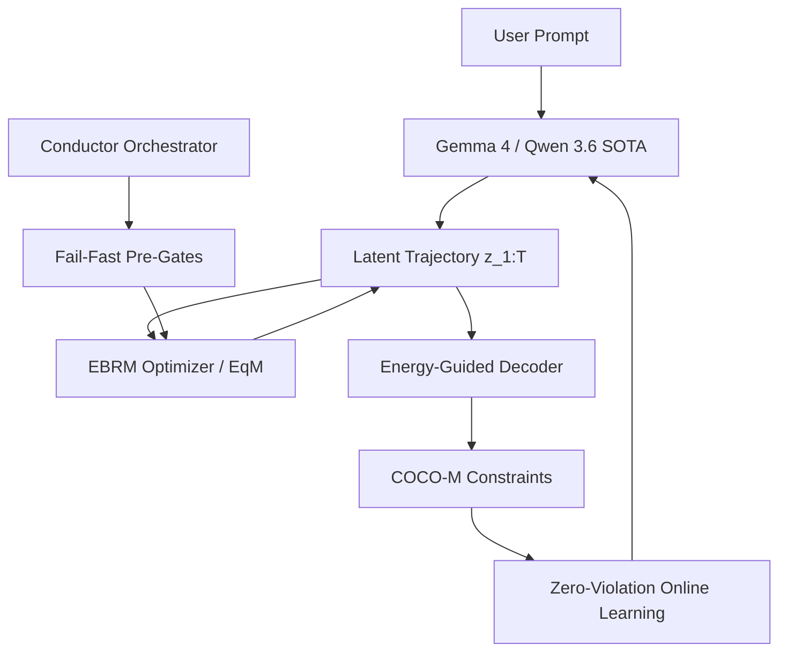

# Milestone 2026.05.142: Energy-Based Latent Planning, Zero-Violation Online Learning, and Fail-Fast Pipeline Orchestration

**Milestone ID:** `2026.05.142`  
**Status:** Active  
**Sequence:** 142  

## 1. What the Previous Milestone Proved (.141)
Milestone .141 ("Phase-18: KAN-Guided EBM Generation, Dual-GPU Scaling, and MoE Distillation") verified the scaling capabilities of the Verify-Repair pipelines for 3B models utilizing Dual RTX 3090 architecture. It proved KAN decoding efficacy and integrated continuous online distillation of constraints into MoE routers.

## 2. Milestone .142 Objectives
This milestone addresses three foundational gaps from recent retrospectives and latest research:
1. **Energy-Based Latent Planning:** Shifting from step-level to multi-step structured latent trajectories using the EBRM (arXiv:2603.04948) and DCAReasoner algorithms.
2. **Zero-Violation Online Learning (FR-11 Mandate):** Ensuring our continuous self-learning system achieves rigorous safety thresholds via Constrained Online Convex Optimization with Memory (COCO-M, arXiv:2603.21375) and zero-constraint violation policies.
3. **Fail-Fast Pipeline Orchestration:** Addressing the severe 40-55% time waste identified in prior retrospectives by introducing pre-gate failure terminalization within the conductor.

## 3. Architecture Diagram



## 4. Phase Descriptions

### Phase 1: Fail-Fast Orchestration & SOTA Baselines
Resolve the dominant operational bottleneck by preventing redundant re-evaluations of known gate failures, then instantiate the latest SOTA GGUFs.
- **Tasks:** Exp 1825 (Archive/Activation), Exp 1826 (Conductor Fail-Fast Pre-Gates).

### Phase 2: Energy-Based Latent Planning
Implementation of structured latent reasoning. We will build an EBRM optimizer to plan multi-step trajectories over continuous energy landscapes, enhanced by DCAReasoner difference-of-convex speedups.
- **Tasks:** Exp 1827 (EBRM), Exp 1828 (DCAReasoner), Exp 1829 (EqM Compute Calibration), Exp 1830 (Energy-Guided Vision-Language Decoding).

### Phase 3: Zero-Violation Continuous Self-Learning
Fulfilling the FR-11 mandate. We apply COCO-M and robust online learning policies to ensure zero-constraint violations as the model updates in non-stationary environments.
- **Tasks:** Exp 1831 (COCO-M), Exp 1832 (Zero-Violation FR-11 Continuous Learning), Exp 1833 (Unknown Constraints Online Learning).

### Phase 4: Full Pipeline Scale-out & Validation
Applying the complete EBRM and Zero-Violation continuous loop onto our SOTA LLM targets over Dual-GPUs.
- **Tasks:** Exp 1834 (THRML Turnover Constraints), Exp 1835 (Qwen3.6-35B-A3B-GGUF Capstone), Exp 1836 (Gemma4-31B-it-GGUF Capstone), Exp 1837 (Gemma4-26B Capstone), Exp 1838 (Retro).

## 5. Dependency Graph

```text
Exp 1825 (Activation) ---> Exp 1826 (Fail-Fast)
     |                     |
     v                     v
Exp 1827 (EBRM) ---------> Exp 1828 (DCAReasoner) ---> Exp 1829 (EqM)
     |                     |
     v                     v
Exp 1831 (COCO-M) -------> Exp 1832 (Zero-Violation FR-11) ---> Exp 1833 (Unknown Constraints)
     |
     v
Exp 1835, 1836, 1837 (SOTA Capstones) ---> Exp 1838 (Retro)
```

## 6. Hardware Requirements
- **Local SOTA Node:** Minimum 64GB RAM for running Qwen3.6-35B-A3B-GGUF and Gemma-4-31B-it-GGUF.
- **Dual GPU Track:** Dual RTX 3090s via CUDA for the continuous self-learning pipeline and parallel EBM evaluations.
