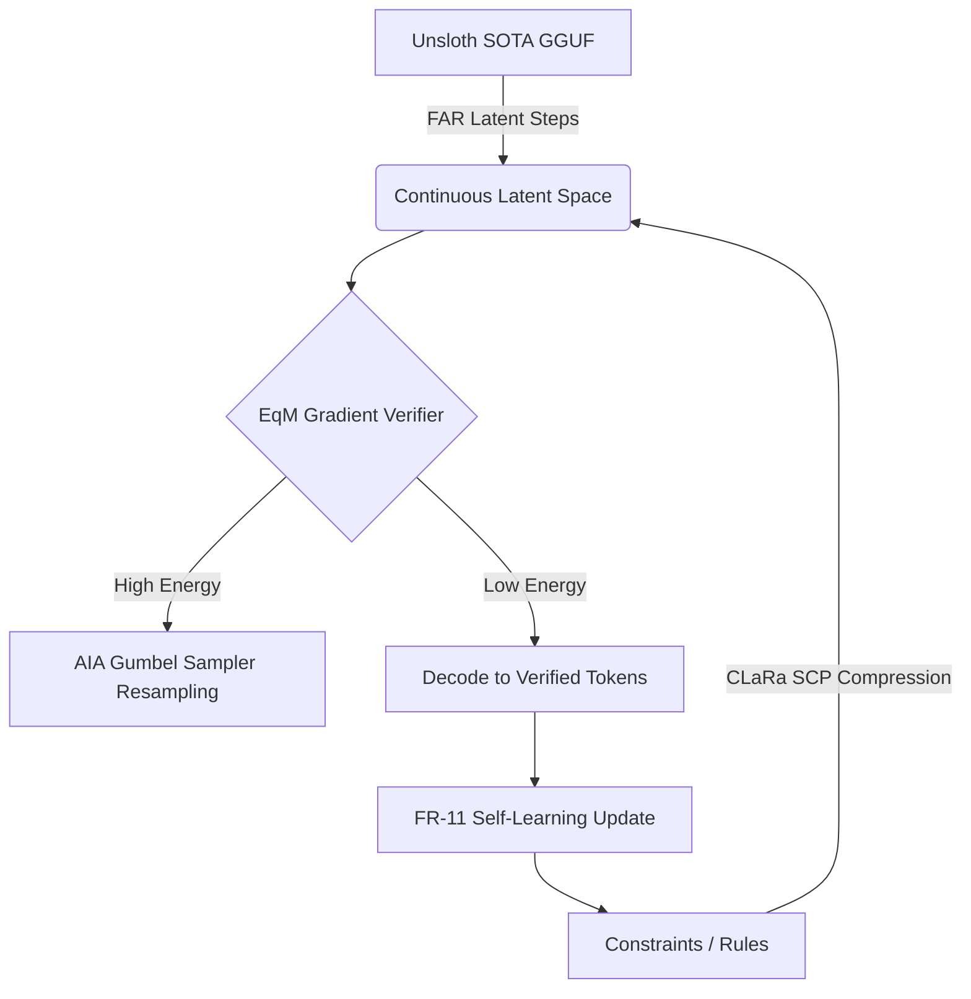

# Change Proposal: Research Roadmap v160
**Date:** 2026-05-13
**Milestone:** 2026.05.160
**Status:** PROPOSED

## 1. Context & Motivation

Milestone 159 successfully proved the capabilities of continuous latent EBRMs, formal KAN verification, and Gradient-Guided Epsilon Constraint (GEC) for continual learning. However, three critical gaps remain between our current state and the PRD vision:

1. **Bridging the Continuous Latent Space with Deterministic Execution**: While continuous latent generation is fast, its integration with Carnot's core deterministic energy layers remains incomplete. Recent literature (CLaRa, FAR) demonstrates that moving completely into a shared continuous latent space for retrieval, planning, and generation is highly efficient, but we must prove this without sacrificing verifiable constraints.
2. **Hardware Sampling Parity for Continuous Models**: The project holds strong simulator and RTL evidence for discrete Ising/Potts machines (KV260). With the shift towards continuous representations, we need equivalent simulation and accounting (BOP/NABS) for probabilistic hardware targeting continuous variables—specifically Knuth-Yao and Gumbel sampling derived from the AIA (Approximate Inference Accelerator) architecture.
3. **Continuous Self-Learning without Forgetting**: The PRD (FR-11) mandates autonomous directed self-learning. While GEC laid the groundwork, we must close the loop by allowing the system to update its verifier policies using Equilibrium Matching (EqM) gradients, ensuring positive utility and zero soundness mistakes.

This milestone addresses these gaps directly, moving Carnot into a fully continuous, verifiable, and self-improving latent reasoning state.

## 2. Milestone Objectives

- **Phase 1: Continuous Latent Constraint Generation (FAR + EqM)**
  Establish the base continuous latent space. Replace token-level generation with Fast Autoregressive (FAR) continuous latent generation using mandated local SOTA GGUF models. Map these states to implicit energy landscapes using Equilibrium Matching (EqM) and ARM-EBM bijections.
- **Phase 2: Hardware-Accelerated Sampling Abstractions (AIA)**
  Develop software simulators for AIA-style Knuth-Yao and Gumbel samplers tailored for continuous categorical constraints. Perform analytical hardware resource accounting (no-synthesis) to validate future FPGA feasibility.
- **Phase 3: Continuous Latent Reasoning & Verification (CLaRa-style)**
  Integrate Semantic Compression with Paraphrasing (SCP) to compress reasoning rules into the latent space. Construct a continuous verifier that uses InEx-style introspection to reject high-energy latent steps before decoding.
- **Phase 4: Continuous Self-Learning and Milestone Closure**
  Execute the FR-11 autonomous self-learning loop. Use EqM gradients to update the verifier policy, measuring utility growth and ensuring zero soundness mistakes across the 20-case CCTU tool-use benchmark.

## 3. Architecture Diagram

## 4. Hardware Requirements

This milestone rigorously respects the 20260507 scope reduction:
- **Dual RTX 3090 CUDA Local SOTA Runtime**: Used heavily for the FAR latent generation and CLaRa SCP compression (via `unsloth/Qwen3.6-35B-A3B-GGUF` and `unsloth/gemma-4-31B-it-GGUF`).
- **AIA Simulation**: Software simulation only.
- **Hardware Execution Boundary**: The AIA hardware accounting task will explicitly emit `hardware_execution_claim=false`. No Vivado bitstream synthesis or board execution is required.

## 5. Dependency Graph

- `exp2040-far-latent-smoke` -> `exp2041-eqm-gradient-landscape` -> `exp2047-continuous-verifier-integration`
- `exp2043-aia-knuth-yao-sim` -> `exp2044-gumbel-sampler-sim` -> `exp2048-inex-introspection`
- `exp2047-continuous-verifier-integration` -> `exp2048-inex-introspection` -> `exp2049-self-learning-latent-loop`
- `exp2049-self-learning-latent-loop` -> `exp2050-self-learning-validation` (GATED on `utility_delta > 0`)

## 6. Success Criteria

1. Continuous latent generation smoke tests run successfully on mandated SOTA GGUFs.
2. EqM gradient optimization demonstrates constraint convergence.
3. AIA sampler simulators match standard RNG parity and output exact BOP/NABS metrics without FPGA claims.
4. CLaRa semantic compression is functional and integrated with the EqM continuous verifier.
5. InEx introspection correctly rejects high-energy continuous configurations.
6. The FR-11 self-learning loop executes and shows a positive `utility_delta` on the CCTU benchmark with exactly 0 `soundness_mistakes`.
