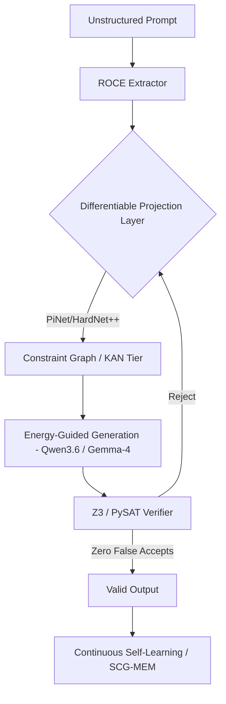

# Carnot Research Roadmap: Milestone 2026.05.167 (vNEXT)

**Milestone:** 2026.05.167
**Theme:** Differentiable Constraint Projection, KAN Hardware Prep, and Continuous Self-Learning

## 1. What the Previous Milestone Proved (.166)
Milestone `.166` completed its core objectives but identified **synthesis tasks as the primary bottleneck** for optimization. The hardware tracks (dual RTX 3090 SOTA runtime, KV260 Discrete SB RTL, and THRML compatibility) were stabilized but deferred aggressive expansion to avoid out-of-scope hardware claims. Continuous self-learning requires a structural integrity update to ensure zero soundness mistakes and avoid recursive drift during policy promotion.

## 2. Milestone Objectives
1. **Bridge the Synthesis Bottleneck:** Implement HardNet++ and PiNet-style differentiable projection layers to enforce constraints within the neural forward pass, falling back to Z3/PySAT only for final formal verification.
2. **KAN Hardware Preparedness:** Apply the new hardware-oriented inference complexity metrics (RM, BOP, NABS) and PWA MILP abstraction to KAN units to provide definitive KV260 accounting without requiring full Vivado synthesis.
3. **Advanced Continuous Self-Learning (FR-11):** Implement Schema-Constrained Generation (SCG-MEM) for memory traces and Energy-Guided Test-Time Scaling (ETS) using the mandated local SOTA GGUFs to ensure safe, scalable self-improvement.

## 3. Architecture Overview

## 4. Phase Descriptions

### Phase 1: Differentiable Constraint Projection
Targets the symbolic synthesis bottleneck by moving constraint satisfaction into continuous neural layers. 
- **Experiments 1670-1673:** Prototype PiNet (Douglas-Rachford splitting) and HardNet++ (damped local linearization) on CPU. Validate that continuous projections exactly match PySAT boundaries for linear constraints. 

### Phase 2: Hardware-Oriented Inference & KAN Deployment Prep
Moves KAN infrastructure from theory towards actionable hardware translation by adhering to the established bounds (no new unauthenticated hardware execution claims).
- **Experiments 1674-1677:** Implements RM, BOP, NABS accounting; tests piecewise affine abstractions (MILP); and prototypes KANELÉ LUT-based logic for the S2KAN tier.

### Phase 3: Energy-Guided Generation & Trace Constraints
Links the energy functions directly to the decoding process of local SOTA GGUF models. 
- **Experiments 1678-1681:** Probes FAR (Continuous Latent Generation) for rapid inference, then applies Energy-Guided Decoding to `unsloth/Qwen3.6-35B-A3B-GGUF` and `unsloth/gemma-4-31B-it-GGUF`.

### Phase 4: Continuous Self-Learning Integration
Ensures FR-11 is stable by structurally constraining memory and scaling test-time search.
- **Experiments 1682-1683:** Enforces Schema-Constrained Generation (SCG-MEM) during policy trace collection. Concludes with a rigorous soundness-mistake audit.

## 5. Hardware Requirements
- **Local CPU/RAM:** Standard computation for PySAT, JAX PiNet simulations, and KAN accounting.
- **GPU (Dual RTX 3090):** Required for executing the mandated SOTA GGUF models in Phase 3 and Phase 4 (`unsloth/Qwen3.6-35B-A3B-GGUF`, `unsloth/gemma-4-31B-it-GGUF`).
- **FPGA:** No active board claims allowed. KAN LUT translations will remain strictly at the software simulation and synthesis-accounting level (RM/BOP/NABS).
