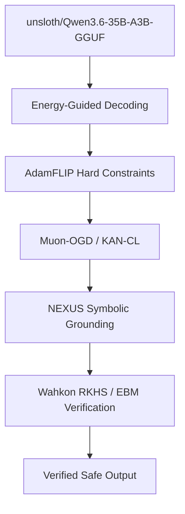

# Carnot Research Roadmap: Milestone 2026.05.193

## NEXUS Continuous Grounding + AdamFLIP + Wahkon RKHS

### Objective
This milestone addresses three major gaps identified in the PRD and recent architectural reviews:
1. **Continuous Self-Learning Resilience:** Overcoming catastrophic forgetting through spectral-norm projection (Muon-OGD) and localized spline regularization (KAN-CL), culminating in the NEXUS framework for safe continual learning of symbolic constraints.
2. **Constraint Satisfaction Bottlenecks:** Moving beyond soft penalties to hard constrained optimization using AdamFLIP and Energy-Guided Decoding.
3. **Architecture Scaling & Uncertainty:** Evaluating Wahkon (Deep RKHS Superposition Networks) as a rigorous statistical alternative to standard KANs for calibrated uncertainty in high dimensions.

### Previous Milestone (.192) Summary
Milestone 2026.05.192 successfully completed the Fast-Slow Variant ADVERSARIAL CONFIRMATION, proving sample efficiency and KL drift stability. It codified the Phase 4 Canonical Decision framework, providing the bedrock for continuous constraint-grounded learning without hallucination degradation.

### Architecture Update

### Phases

#### Phase 1: Continuous Self-Learning Resilience
Focuses on resolving catastrophic forgetting via recent arXiv advances.
- **Exp 1901:** Implement Muon-OGD spectral-norm-aware orthogonal projection.
- **Exp 1902:** Implement KAN-CL per-knot importance regularization.
- **Exp 1903:** Benchmark KAN-CL and Muon-OGD on FR-11 forgetting metrics.

#### Phase 2: Hard Constraint Optimization & Decoding
Moving from soft penalties to deterministic constraint satisfaction.
- **Exp 1904:** Implement Energy-Guided Decoding to dynamically select minimal energy hidden states.
- **Exp 1905:** Implement AdamFLIP adaptive momentum feedback linearization.
- **Exp 1906:** Evaluate AdamFLIP constraint satisfaction vs soft PINN baselines.
- **Exp 1907:** Integrate Energy-Guided Decoding into the Fast-Slow inference path.

#### Phase 3: Symbolic Continual Learning & Uncertainty
Focuses on safety constraints and calibrated uncertainty.
- **Exp 1908:** Implement NEXUS framework decoupling physical feasibility from safety specifications.
- **Exp 1909:** Implement Wahkon Deep RKHS Superposition Networks for finite-sample guarantees.
- **Exp 1910:** Benchmark Wahkon vs KANs on calibration.

#### Phase 4: Synthesis, Documentation, and Scaling
- **Exp 1911:** E2E Integration: NEXUS + Muon-OGD + Fast-Slow variant.
- **Exp 1912:** Full Benchmark using `unsloth/gemma-4-31B-it-GGUF`.
- **Exp 1913:** Architecture updates and position paper.
- **Exp 1914:** Milestone Retrospective.

### Hardware Requirements
- **LLM Inference:** Local discrete GPUs (e.g. 2x RTX 3090) or CPU execution for `unsloth/Qwen3.6-35B-A3B-GGUF`, `unsloth/gemma-4-31B-it-GGUF`, and `unsloth/gemma-4-26B-A4B-it-GGUF`.
- **Continual Learning:** Standard local constraints apply.
