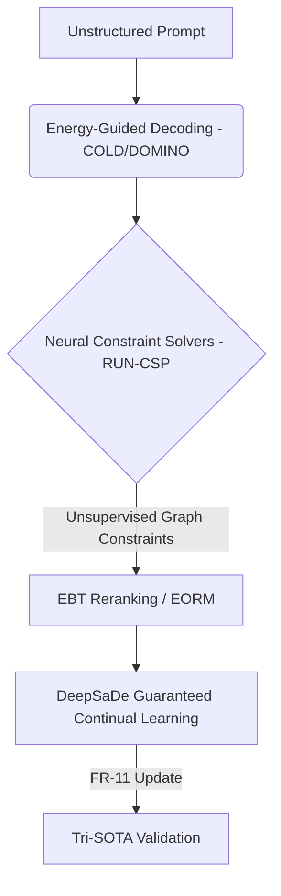

# Carnot Research Roadmap: Milestone 2026.05.154

## 1. Context and Retrospective
Milestone `.153` proved the viability of Negative Constraint Decoding, Flow Sampling, and Continual Routing. With these foundational elements verified, the three biggest gaps between the current state and the PRD vision are:
1. **Dynamic Energy-Guided Decoding:** Moving from static constraint verification to dynamic, continuous energy-guided reasoning and decoding.
2. **Provable Neural Constraint Solving:** Scaling continual online learning (FR-11) beyond simple routing, ensuring sound updates with zero catastrophic forgetting via hybrid training (MaxSMT+SGD).
3. **Energy-Based Verification at Scale:** Bridging unstructured natural language instructions to deterministic, graph-based constraints with unsupervised extraction.

The literature sweep revealed promising advances to close these gaps: Energy-Based Transformers (EBTs), COLD Decoding via Langevin Dynamics, DOMINO for strict grammar bounds, and RUN-CSP/DeepSaDe for guaranteed neural constraints.

## 2. Architecture Diagram (Phase 3 -> Phase 4 Bridge)

## 3. Phase Descriptions

### Phase 1: Energy-Guided and Constrained Decoding Optimization
Integrate continuous latent energy optimizations into the decoding loop. COLD Decoding treats constraints directly as energy landscapes optimized via Langevin dynamics, while DOMINO ensures zero-overhead formal grammar bounds. 

### Phase 2: Neural and Unsupervised Constraint Solvers
Introduce advanced unsupervised network architectures to solve constraints (RUN-CSP) and guarantee zero-false-accept bounds using hybrid Maximum Satisfiability Modulo Theories (DeepSaDe).

### Phase 3: Energy-Based Verification and Reward Models
Implement explicit Energy Outcome Reward Models (EORM) and Energy-Based Transformer (EBT) prototypes to rank reasoning traces and assess compatibility between inputs and candidate outputs without autoregressive dependency.

### Phase 4: Provable Continuous Self-Learning & E2E
Deploy the DeepSaDe framework to guarantee that the continuous self-learning pipeline never violates established rules (zero forgetting, zero soundness mistakes). Ensure all developments pass the Tri-SOTA integration tests before standard retrospective workflows.

## 4. Hardware Requirements
- **Local SOTA Testing:** Dual RTX 3090 setup for unsloth GGUF inference (Qwen3.6-35B, gemma-4-31B, gemma-4-26B).
- **FPGA Accounting:** No-synthesis logical accounting for RUN-CSP graph algorithms targeted at KV260 architecture.
- **CPU Overheads:** Continual self-learning evaluations constrained by deterministic CPU bound checks.
