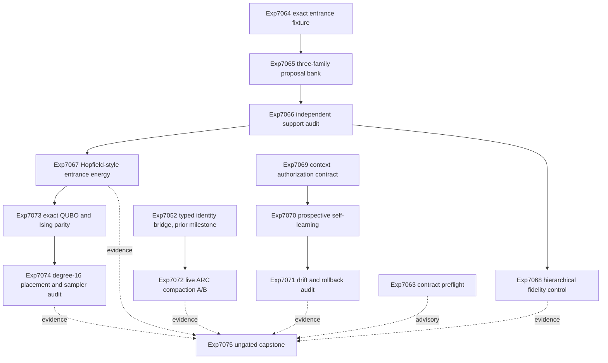

# Research Roadmap V619: Exact Entrance Selection, Context-Bound Learning, and Live Compaction

**Milestone:** `2026.09.619`

**Execution file:** `research-roadmap-next.yaml`

**Task contract:** exactly 13 tasks, `exp7063` through `exp7075`, in the order
listed below. The Markdown and YAML IDs, titles, deliverables, and gates are
one contract.

## What Milestone 2026.09.618 Proved

V618 executed three tasks.

- Exp7050 proved that the active YAML and the design document disagreed. The
  document promised 13 tasks, but the YAML held three. Its verdict was
  `complete_disqualified_v618_markdown_yaml_contract_mismatch`.
- Exp7051 requalified the official-live model report. It produced a valid
  100.6-second CUDA llama.cpp receipt with a terminal checksum and set
  `model_report_evidence_ready_score=1`.
- Exp7052 completed the typed model-identity bridge and a fresh-process attack
  audit. It set `typed_identity_attack_audit_ready_score=1`.

V618 did not execute an entrance fixture, a three-family proposal bank, an
entrance-energy comparison, a context-bound learning stream, or an Ising
translation. Those items existed only in the stale document. They are untested.

## The Three Biggest Gaps to the PRD Vision

### Gap 1: Energy has not shown oracle-distinct decision value

Carnot has exact solvers and many energy components. It still lacks a clean
case where a learned, prompt-visible energy chooses a better candidate than
strong non-oracle controls. The next test must freeze proposal support first,
hide held labels, and separate support, selection, and exact execution.

### Gap 2: Continuous self-learning is safe but not useful

Transactional memory, bounded ledgers, and rollback exist. Recent prospective
tests were null. Reuse was too context-free. The PRD needs a learner that can
use prior exact outcomes under drift without harmful transfer or forgetting.

### Gap 3: Live ARC state controls remain unpromoted

Mechanical tool-loop compaction exists and has a 13-cell pilot. The pilot had
no quality delta, failed its wall and memory gates, and predated the current
evidence boundary. A claim-grade live-path decision still needs enough paired
cells, a verified treatment fire, a current model receipt, and an explicit
retirement outcome.

## Research Findings Used in This Plan

- SymStep (`arXiv:2607.23055`) motivates atomic constraint propagation and MRV
  as deterministic entrance-selection controls.
- Energy-guided Recursive Model (`arXiv:2607.10128`) motivates an explicit
  Hopfield-style energy over a fixed candidate bank. Carnot will compare it
  with MRV, target logits, frequency, uniform choice, and shuffled energy.
- FrOGS (`arXiv:2609.02948`) motivates common-scale and exact finite-Ising
  checks before sampler claims. Carnot will not implement the alloy model.
- SWE-Gate (`arXiv:2609.04167`) motivates separate science, schema, and task-
  contract verdicts at the capstone.
- BCIT (`arXiv:2608.26730`) remains the basis for context-bound experience
  authorization.
- Entrance locking (`arXiv:2608.29188`) remains the reason to intervene at the
  first computational branch instead of reranking whole traces.
- Hierarchical Speculative Decoding (`arXiv:2601.05724`) remains the lossless
  distribution-fidelity control.

The full dated source receipts are in `research-references.md` under
"V619 Planner Refresh".

## Architecture



The exact executor labels outcomes only after selection. It is never a learned
feature or a model-visible input. The live ARC branch uses only
`E3AgentPolicy` and `make_carnot_agent`. Offline adapters cannot earn solve
credit.

## Phase 0: Contract Integrity

### Exp7063 - V619 Markdown and YAML task-contract preflight

Parse this document and the staged YAML independently. Check exact count,
order, full IDs, titles, deliverables, gates, producer fields, prior-failure
records, model policy, prompt tails, and the ungated capstone. This task is
advisory. No science task gates on it.

This is a disciplined rerun of Exp7050. It changes the input contract: both
files now contain the same 13 rows before activation.

**Deliverable:** `results/experiment_7063_v619_contract_preflight.json`

## Phase 1: Exact Entrance Support and Energy Guidance

### Exp7064 - Exact source-grouped entrance constraint fixture

Build an immutable Countdown-style panel with deterministic exhaustive
enumeration. An entrance family is an unordered first operand pair plus the
first arithmetic operator. Freeze calibration and held source groups before
model output exists. Retained rows must contain reachable and unreachable
legal entrances. A diversity stratum must contain at least two reachable
families.

This task addresses the parse-blocked Exp5708 canary. It moves all label and
witness construction onto a deterministic exact substrate before model output.

**Deliverable:** `results/experiment_7064_v619_exact_entrance_fixture.json`

### Exp7065 - Three-family SOTA entrance proposal bank

Collect short entrance proposals under matched prompts, seeds, contexts, and
completion budgets from:

- `unsloth/Qwen3.6-35B-A3B-GGUF`
- `unsloth/gemma-4-31B-it-GGUF`
- `unsloth/gemma-4-26B-A4B-it-GGUF`

Store raw text and token scores before exact labeling. Run a bounded forced-
prefix continuation panel. Do not train or select an energy in this task.

This task addresses Exp6200's no-ready-family transport result with short
structured outputs, current cached GGUFs, raw-first checkpoints, and exact
post-generation parsing.

**Gate:**
`exp7064-exact-entrance-constraint-fixture.entrance_fixture_ready_score == 1`

**Deliverable:** `results/experiment_7065_v619_three_family_entrance_bank.json`

### Exp7066 - Cold recomputation of entrance-bank support

Re-enumerate labels in a fresh process. Check source isolation, model identity,
prompt parity, raw hashes, first-branch parsing, and solver invisibility.
Separate bank authenticity from selector headroom.

**Gate:**
`exp7065-three-family-entrance-proposal-bank.entrance_proposal_bank_complete_score == 1`

**Deliverable:** `results/experiment_7066_v619_entrance_bank_audit.json`

### Exp7067 - Hopfield-style entrance energy selection comparison

Fit a small explicit structural energy on calibration groups only. Compare it
with MRV, target log probability, proposal frequency, uniform legal choice,
and shuffled energy on held source groups. Use exact outcomes only after each
arm selects. Keep an exact-oracle upper bound diagnostic and non-headline.

This task addresses the gate-blocked Exp1006 energy-selection scope. It first
requires an independently audited proposal bank with measured held headroom and
uses a different Hopfield-style entrance energy with stronger controls.

**Gates:**

- `exp7066-entrance-bank-independent-audit.entrance_support_audit_ready_score == 1`
- `exp7066-entrance-bank-independent-audit.entrance_selector_headroom_ready_score == 1`

**Deliverable:** `results/experiment_7067_v619_entrance_energy_selection.json`

### Exp7068 - Lossless categorical mass-rebalancing evaluation

Implement a bounded categorical hierarchical verifier over the frozen proposal
distributions. Compare token-wise, block-wise, and hierarchical verification.
Measure total variation, accepted mass per verification step, exact-constraint
quality, and wall time. This task tests distribution fidelity. It cannot turn
fidelity into a correctness claim.

**Gate:**
`exp7066-entrance-bank-independent-audit.entrance_support_audit_ready_score == 1`

**Deliverable:** `results/experiment_7068_v619_hierarchical_branch_control.json`

## Phase 2: Context-Bound Continuous Self-Learning

### Exp7069 - BCIT use-validate-reject state machine

Create typed experience records and a `use | validate | reject` state machine.
Bind each effect to parent policy, source group, schema, support interval,
retention result, and named conflicts. Current and future exact outcomes stay
hidden until after the decision. No-op remains a valid action.

**Deliverable:** `results/experiment_7069_v619_context_authorization_contract.json`

### Exp7070 - Prospective context-bound continuous self-learning comparison

Run a chronological read-only-then-commit comparison with context-bound reuse,
flat reuse, validate-all, and no reuse. Exact current outcomes arrive after
the decision and control admission. Use immutable source groups, bounded
capacity, journals, rollback, protected retention cases, and equal budgets.
This is the required continuous self-learning experiment.

This task changes the null Exp6978 and Exp7021 methods by binding experience to
context and requiring bounded validation at transfer boundaries.

**Gate:**
`exp7069-context-bound-experience-contract.context_authorization_contract_ready_score == 1`

**Deliverable:** `results/experiment_7070_v619_bcit_self_learning.json`

### Exp7071 - Fresh-process self-learning drift and rollback audit

Recompute every authorization and aggregate from event rows in a fresh
process. Attack policy, source, schema, and support drift; forged effects;
duplicates; reorderings; checksum changes; interrupted commits; rollback; and
capacity limits.

**Gate:**
`exp7070-bcit-prospective-self-learning.bcit_comparison_complete_score == 1`

**Deliverable:** `results/experiment_7071_v619_bcit_drift_audit.json`

## Phase 3: Live Generalization, Sparse Parity, and Handoff

### Exp7072 - Claim-grade live ARC compaction generalization A/B

Run a claim-grade paired A/B of the existing mechanical compaction flag. Use
the pinned live Qwen3.8 agent and a mandated Gemma 4 26B replication. Require
the tool loop to be reachable and compaction to fire before interpreting the
treatment. Use at least 30 paired Qwen cells and a smaller declared Gemma
replication. Credit only live-agent self-discovery. Registry-known public
levels and per-game adapters are excluded.

This task addresses the 13-cell Exp6473 pilot. It adds claim-grade power, the
current identity contract, explicit treatment-activation gates, a mandated
model-family replication, and mechanical retirement on the same verdict.

**Deliverable:** `results/experiment_7072_v619_live_arc_compaction_ab.json`

### Exp7073 - QUBO translation and finite-distribution equivalence

Compile the frozen Exp7067 energy into QUBO and Ising forms. Verify energy
equality up to one declared affine constant and verify ranking by exhaustive
enumeration. Compare finite exact probabilities with CPU sampler results. This
is software-only and may run even when entrance-energy value is null.

**Gate:**
`exp7067-hopfield-entrance-energy-selection.entrance_energy_comparison_complete_score == 1`

**Deliverable:** `results/experiment_7073_v619_entrance_ising_parity.json`

### Exp7074 - Degree-16 placement and finite-sampler audit

Audit the Exp7073 representation in a fresh process. Embed the bounded graph
into a degree-16 parent graph or report the exact obstruction. Compare exact,
Gibbs, and parallel-tempering distributions on finite cases. No physical Z1 or
FPGA claim is allowed.

**Gate:**
`exp7073-entrance-energy-ising-parity.ising_parity_ready_score == 1`

**Deliverable:** `results/experiment_7074_v619_degree16_sampler_audit.json`

### Exp7075 - V619 evidence matrix

Read every available V619 artifact and recompute the task contract, gate
status, per-unit headlines, evidence classes, and branch decisions. Separate
science, schema, and contract results. Release or retire each branch. This task
is ungated so it still runs after any branch failure.

**Deliverable:** `results/experiment_7075_v619_capstone.json`

## Exact Task Contract

| Order | ID | Title | Deliverable |
|---:|---|---|---|
| 1 | `exp7063-v619-contract-preflight` | V619 Markdown and YAML task-contract preflight | `results/experiment_7063_v619_contract_preflight.json` |
| 2 | `exp7064-exact-entrance-constraint-fixture` | Exact source-grouped entrance constraint fixture | `results/experiment_7064_v619_exact_entrance_fixture.json` |
| 3 | `exp7065-three-family-entrance-proposal-bank` | Three-family SOTA entrance proposal bank | `results/experiment_7065_v619_three_family_entrance_bank.json` |
| 4 | `exp7066-entrance-bank-independent-audit` | Cold recomputation of entrance-bank support | `results/experiment_7066_v619_entrance_bank_audit.json` |
| 5 | `exp7067-hopfield-entrance-energy-selection` | Hopfield-style entrance energy selection comparison | `results/experiment_7067_v619_entrance_energy_selection.json` |
| 6 | `exp7068-hierarchical-branch-fidelity-control` | Lossless categorical mass-rebalancing evaluation | `results/experiment_7068_v619_hierarchical_branch_control.json` |
| 7 | `exp7069-context-bound-experience-contract` | BCIT use-validate-reject state machine | `results/experiment_7069_v619_context_authorization_contract.json` |
| 8 | `exp7070-bcit-prospective-self-learning` | Prospective context-bound continuous self-learning comparison | `results/experiment_7070_v619_bcit_self_learning.json` |
| 9 | `exp7071-bcit-drift-rollback-audit` | Fresh-process self-learning drift and rollback audit | `results/experiment_7071_v619_bcit_drift_audit.json` |
| 10 | `exp7072-live-arc-compaction-ab` | Claim-grade live ARC compaction generalization A/B | `results/experiment_7072_v619_live_arc_compaction_ab.json` |
| 11 | `exp7073-entrance-energy-ising-parity` | QUBO translation and finite-distribution equivalence | `results/experiment_7073_v619_entrance_ising_parity.json` |
| 12 | `exp7074-degree16-placement-sampler-audit` | Degree-16 placement and finite-sampler audit | `results/experiment_7074_v619_degree16_sampler_audit.json` |
| 13 | `exp7075-v619-capstone` | V619 evidence matrix | `results/experiment_7075_v619_capstone.json` |

## Dependency Graph

```text
exp7063                                             [advisory contract]

exp7064 -> exp7065 -> exp7066 -> exp7067 -> exp7073 -> exp7074
                              `-> exp7068            [entrance science]

exp7069 -> exp7070 -> exp7071                        [continuous learning]

exp7072                                             [live ARC]

exp7075                                             [ungated capstone]
```

All structured gates refer to tasks in this roadmap. Every producer field is
required as a bare top-level artifact field in the producer prompt. A valid
complete-null upstream may set a completion field to one. Value and readiness
fields remain separate.

## Hardware Requirements

| Tasks | Requirement | Boundary |
|---|---|---|
| Exp7065 | Two local RTX 3090 GPUs when available, or one leased GPU with sequential shards; all three cached mandated GGUFs; CUDA llama.cpp | Record UUIDs, model hashes, runner build, offload, clocks, retries, and cleanup. Missing headline models block the task. No legacy-small substitution. |
| Exp7072 | Owned local RTX 3090 leases, current typed identity evidence, CUDA llama.cpp/vLLM path as used by the live agent, pinned Qwen3.8 GGUF, and cached Gemma 4 26B MoE GGUF | Do not kill unattributed processes. Require treatment activation. No offline adapter or remote model earns ARC credit. |
| Exp7063-Exp7064, Exp7066-Exp7071, Exp7073-Exp7075 | CPU, local storage, deterministic solver and sampler stack | No remote API is required. |
| Exp7073-Exp7074 | CPU finite-state sampler and software placement model | `hardware_used=false`. No Z1 access, FPGA bitstream, power, latency, or speed claim. |

The dual RTX 3090 host is sufficient for the model tasks. GateMate remains
physically blocked. KV260 and PolarFire have terminal prior receipts and do
not justify another detect-only task. Extropic Z1 is unavailable; only its
public degree-16 graph constrains the software receipt.

## Model Policy

Exp7065 uses all three mandated SOTA GGUF families through
`cached_sota_pair()`. Exp7072 uses the live ARC pin
`unsloth/Qwen3.8-27B-GGUF` and must also execute
`unsloth/gemma-4-26B-A4B-it-GGUF` as a declared replication. GGUF files are
loaded by path through llama.cpp. `AutoTokenizer.from_pretrained()` must not be
used on a GGUF repository. Legacy small models may appear only in explicit CPU
smoke tests and never in headline rows.

## Claim Boundaries

- The exact solver supplies labels and post-selection outcomes. A selector
  that reads held labels at decision time is disqualified.
- `verifier_is_oracle=true` forbids a positive verdict class. Oracle upper
  bounds stay diagnostic.
- Comparative claims require per-unit rows. Aggregates must recompute from
  those rows.
- A blocked artifact names the failed check, expected value, and observed
  value in `gate_check_summary` and uses `verdict_class=blocked`.
- External blocking is terminal `blocked`, not retryable `partial`.
- ARC credit requires `solve_provenance=live_agent_self_discovery`. Development
  proxies and outer-loop reverse engineering cannot headline.
- Exp7073 and Exp7074 are software receipts. They cannot support Z1, FPGA,
  thermodynamic, power, latency, or speed claims.

## Milestone Exit Criteria

1. Markdown and YAML contain exactly the same 13 ordered tasks.
2. The entrance bank is authentic, leak-free, and has measured selector
   headroom, or the energy branch is honestly blocked.
3. The entrance-energy comparison reports an oracle-distinct positive or an
   honest terminal null with all named controls.
4. The continuous learner completes a prospective chronological comparison
   and a fresh-process drift/rollback audit. A repeated null retires the scope.
5. The ARC compaction task records treatment activation and reaches a release
   or retirement decision. A same verdict as Exp6473 retires the rerun.
6. Any Ising handoff preserves exact energy, ranking, and finite-distribution
   semantics before a placement-ready claim.
7. The ungated capstone independently recomputes every headline and emits the
   V620 handoff.

## Operational Verification

Before activation and before reporting completion, run YAML parsing, roadmap
schema validation, gate audit, exclusion-manifest lint, harness-fit lint,
artifact-field checks, prompt-tail checks, and Markdown/YAML contract checks.
Each implementation task must add its named `REQ-*` requirement and RED tests,
then run focused unit tests, artifact validation, adversarial verification,
row-consistency lint when comparative, scoped spec coverage, root-clutter
checks, and the applicable checks from `ops/e2e-test-plan.md`.
