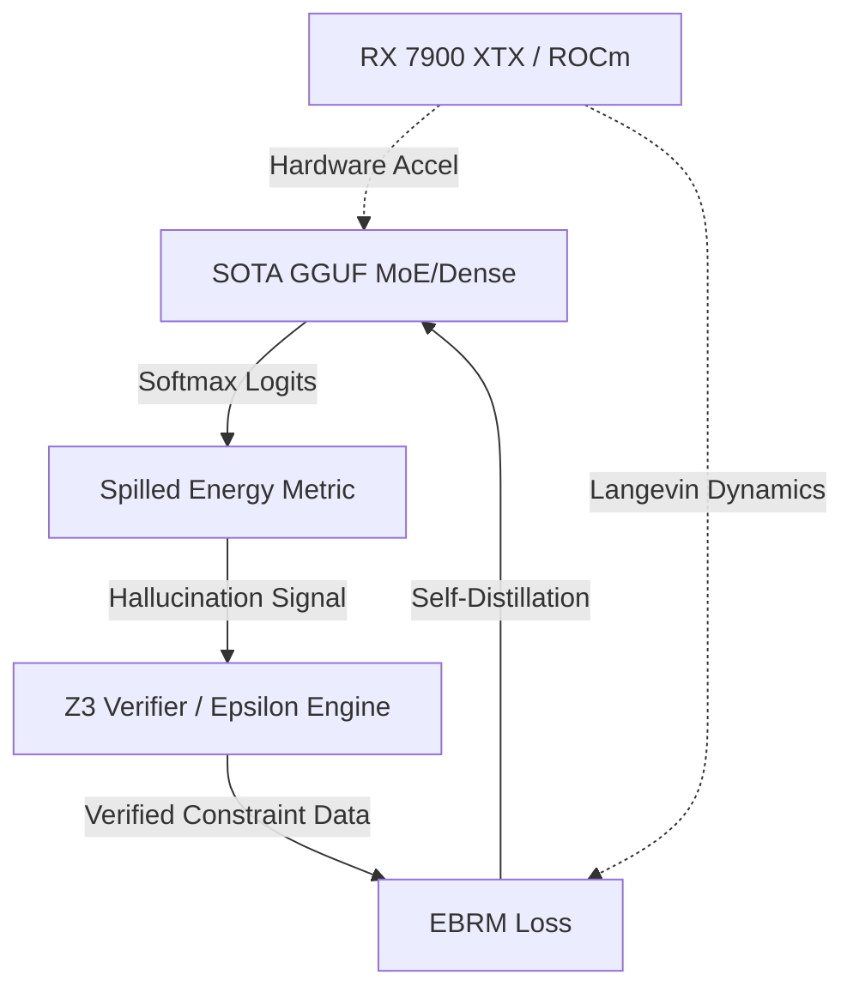

# Research Roadmap: Milestone 2026.05.201

**Milestone Title:** Continuous Self-Learning, Hallucination Detection via Spilled Energy, and ROCm Bring-up
**Date:** {date}

## 1. Context and Outcomes of .200
The previous milestone (.200) was an operational retrospective that audited the `.198` and `.199` executions. It verified the PyPI deployment workflow, checked the ship-track dashboard for Phase 1 components, and handled artifact recoveries. 

With `.200` completing all pending Phase 1 and framework audits, Carnot is now ready to resume core research into EBM reasoning and hardware acceleration. The largest gaps between the current state and the PRD vision are:
1. **Continuous Self-Learning:** The PRD requires Carnot to operate as an autonomous learning system using Z3 and self-play. 
2. **Robust Hallucination Detection:** True "System 2" capabilities rely on exact verification, requiring white-box evaluation of token trajectories. 
3. **Hardware Acceleration:** The long-delayed ROCm and FPGA integration is essential for scaling Langevin dynamics and Gibbs sampling.

## 2. Recent ArXiv Findings (May 2026)
We incorporate three significant findings into this milestone:
1. **Spilled Energy in LLMs (arXiv:2602.18671):** Provides a training-free framework for mapping autoregressive Softmax to EBM Spilled/Marginalized energy, crucial for Phase 1 hallucination detection.
2. **Energy-Based Reward Models (EBRM) (arXiv:2504.12317):** Mitigates reward hacking in the continuous learning pipeline.
3. **REFIND Context Sensitivity Ratio (arXiv:2502.01911):** Enhances constraint satisfaction during energy-guided decoding.

## 3. Architecture Overview

## 4. Phase Descriptions

### Phase 1: ArXiv 2026 Integration (Exp 2001-2003)
Translates the newest ArXiv EBM metrics directly into `carnot.reporting` and `carnot.models.boltzmann`. This establishes our baseline evaluation metrics (Spilled Energy, CSR) and the core EBRM loss function before we begin generation.

### Phase 2: Continuous Self-Learning Pipeline (Exp 2004-2007)
Implements the "Strict Epsilon Engine" that progressively tightens acceptance criteria for generated solutions. We use `codex` to orchestrate Z3 constraint verifications, generating an auto-curated dataset that is fed back into a dummy SFT/DPO pass via self-distillation.

### Phase 3: Hardware Integration (Exp 2008-2011)
Tackles the hardware wishlist by probing for the Thunderbolt RX 7900 XTX eGPU and constructing ROCm-specific memory allocators for dual-model execution (`Qwen3.6-35B` + `gemma-4-31B`). Vectorizes the Langevin dynamic step to leverage the new memory bandwidth.

### Phase 4: Capstone Evaluation & Retrospective (Exp 2012-2014)
Ensures total spec compliance via the mandate from `GEMINI.md`. Runs the full Python-Rust equivalent tests, updates the PRD traceability logs, and conducts the standard operational retrospective.

## 5. Dependency Graph
- Phase 1 (Metrics) must precede Phase 2 (Self-Learning). 
- Exp 2006 (Self-Distillation) is strictly gated on Exp 2005 achieving >10 Z3-verified responses.
- Phase 3 (Hardware) can be executed in parallel but relies on Phase 1's EBRM logic for the Langevin target.

## 6. Hardware Requirements
- **Compute:** Thunderbolt RX 7900 XTX eGPU (Targeted in Phase 3).
- **Mandated Models:** `unsloth/Qwen3.6-35B-A3B-GGUF` (flagship MoE), `unsloth/gemma-4-31B-it-GGUF` (flagship dense), `unsloth/gemma-4-26B-A4B-it-GGUF` (middle MoE).
