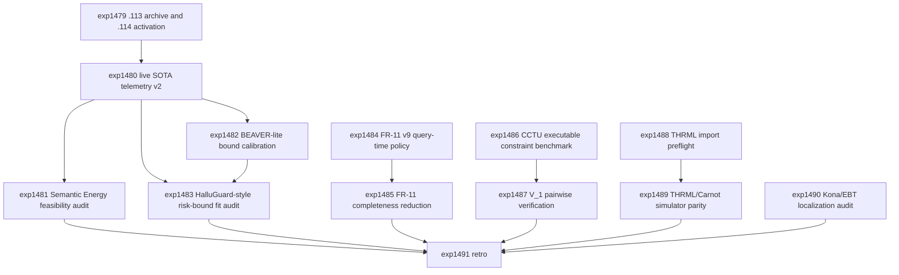

# Research Roadmap vNEXT: Milestone 2026.04.114

Planned: 2026-05-07
Status: Draft for conductor execution
Predecessor: 2026.04.113 live SOTA telemetry, BEAVER-lite bound smoke, FR-11 v8 self-learning pivot, constraint/hardware smokes
Roadmap YAML: `research-roadmap-next.yaml`

## ID Allocation Note

Milestone `.113` used `exp1467` through `exp1478`. The next 13 conductor
tasks are `exp1479` through `exp1491`.

## What Milestone .113 Proved

| Track | Evidence | Finding |
|---|---|---|
| Live local SOTA telemetry | `exp1468` | The mandated local GGUF runtime produced live telemetry from `unsloth/Qwen3.6-35B-A3B-GGUF`; top-k logprobs and logits are available, and all three mandated SOTA model specs were present. |
| Telemetry validity | `exp1469`, `exp1473` | HALT/spilled-energy time-series telemetry was retired for headline claims, and the adversarial audit blocked the telemetry headline because the observed signal was superficial or mechanically gated. |
| Deterministic bounds | `exp1470` | BEAVER-lite produced a sound live-logprob deterministic-bound smoke on bounded prefix constraints. |
| Continuous self-learning | `exp1471`, `exp1472` | FR-11 v8 produced positive verified memory growth (`self_learning_delta_overall=12`, `new_promoted_count=12`, `nonforgetting_rate=1.0`) with zero soundness mistakes, but still had high completeness mistakes (`completeness_mistakes=140`). |
| Linear constraints | `exp1474` | A T-SKM-style projection smoke achieved zero violations and agreed with the CPU-only baseline on the bounded suite. |
| Static constraint automata | `exp1475` | A STATIC-style CSR certificate automaton matched exact acceptance and was faster in the bounded no-generation/no-repair setting. |
| FPGA lane | `exp1476` | KV260/Discrete SB remains source-level RTL lint/simulation evidence only; there is no board bitfile, board execution, or latency claim. |
| THRML/TSU lane | `exp1477` | THRML was unavailable in the active runtime, so TSU evidence remains simulator-intent only with no hardware claim. |
| Milestone governance | `exp1478` | `.113` met all 12 criteria. It preserved the active roadmap and conductor, retired the non-headline telemetry diagnostic, and blocked overclaiming. |

**Critical insight from `.113`:** Carnot now has live local SOTA telemetry and
sound deterministic-bound smoke evidence, but the telemetry is not yet valid
headline evidence. The next milestone should use adversarially balanced
datasets, formal risk-bound language, and executable validators before making
any broader verification claim. The self-learning line has a real positive
signal, but it must now show query-time utility while preserving zero soundness
mistakes.

## Research Signals Added Before Planning

The post-.113 sweep updated `research-references.md` before this roadmap was
finalized. The near-term signals are:

- Semantic Energy (`arXiv:2508.14496`, OpenReview E5mL07Fbq8) motivates a
  semantic-cluster/logit diagnostic that must be tested against superficial
  length, format, and lexical baselines.
- HalluGuard (`arXiv:2601.18753`, OpenReview SsQjVaygrC) motivates a formal
  hallucination-risk decomposition into evidence and reasoning components,
  without claiming full NTK certification.
- V_1 (`arXiv:2603.04304`) motivates pairwise self-verification against
  Carnot energy ranking on bounded candidate sets.
- CCTU (`arXiv:2603.15309`) motivates a local executable constraint tool-use
  micro-benchmark with deterministic validators.
- FSNet (OpenReview mTZ7qA5MDp) is a future learned-projection reference, but
  should not reopen retired HardNet++/DSP scope.
- Physical Analog KANs (`arXiv:2602.07518`) are relevant to future hardware
  planning, but do not change the active `.114` hardware boundary.
- DeepVerifier (`arXiv:2601.15808`) is useful benchmark inspiration for future
  multi-turn research, but too broad for this narrowed milestone.
- THRML public software is visible, but `.113` found no active install/import
  path in the local environment. Kona remains a comparator for partial-trace
  energy and failure localization, not a dependency.

## Three Biggest Gaps

1. **Telemetry validity gap.** `exp1468` proved live local SOTA telemetry, but
   `exp1473.claim_allowed=false` means Carnot cannot use that telemetry as
   headline verification evidence. The gap is not data capture; it is
   adversarial validity and calibration against superficial baselines.

2. **Self-learning utility gap.** `exp1471` and `exp1472` proved verified
   memory growth with zero soundness mistakes, but the policy has not shown
   query-time task benefit and still overrejects. The gap is turning safe
   memory growth into useful verification behavior without introducing false
   accepts.

3. **Substrate and hardware evidence gap.** BEAVER-lite, T-SKM, STATIC, KV260,
   and THRML all have bounded smoke evidence, but there is no integrated
   executable-constraint benchmark, no calibrated risk-bound view, no THRML
   import readiness, no board evidence, and no partial-trace failure-localization
   result comparable to EBT/Kona claims.

## Architecture

```
.114 Milestone Architecture
========================================================================

Phase 0 - Handoff and Guardrails
  exp1479: .113 completion archive + .114 activation manifest ----------.

Phase 1 - Adversarial Telemetry and Formal Bounds
  exp1480: Live SOTA telemetry v2 with balanced labels -----------------+--> balanced telemetry manifest
  exp1481: Semantic Energy feasibility audit (gated on logits) ---------+
  exp1482: BEAVER-lite live-prefix bound calibration -------------------+
  exp1483: HalluGuard-style risk-bound fit audit -----------------------'

Phase 2 - Continuous Self-Learning and Executable Verification
  exp1484: FR-11 v9 query-time memory-policy integration ---------------.
  exp1485: FR-11 completeness-reduction audit (gated) ------------------+
  exp1486: CCTU-style executable constraint benchmark ------------------+
  exp1487: V_1 pairwise verification vs Carnot ranking (gated) ---------'

Phase 3 - Substrate, Hardware Preflight, and Localization
  exp1488: THRML installability/import preflight -----------------------.
  exp1489: THRML/Carnot simulator parity v2 (gated) --------------------+
  exp1490: Kona/EBT partial-trace energy localization micro-audit ------+
  exp1491: Milestone .114 retrospective -------------------------------'
```

## Phase Descriptions

**Phase 0 - handoff and guardrails.** `exp1479` archives `.113` completion
evidence, records the blocked telemetry headline and positive FR-11 result, and
writes a `.114` activation manifest. It also preserves the retired-lineage
rules: no repair-executor rerun, no GRPO/VPRM revival, no WOPR puzzle
cartridge expansion, no HardNet++/DSP reopening, and no hardware claim beyond
evidence already present.

**Phase 1 - adversarial telemetry and formal bounds.** `exp1480` builds a
balanced live local SOTA telemetry manifest using the mandated GGUF models and
explicit superficial baselines. `exp1481` runs only if logits are available and
tests Semantic Energy-style signals against those baselines. `exp1482` expands
the BEAVER-lite deterministic-bound smoke from a tiny proof-of-soundness into a
calibration run over live prefix constraints. `exp1483` maps available Carnot
fields into a HalluGuard-style risk-bound decomposition, while clearly marking
which HalluGuard assumptions are not implemented.

**Phase 2 - continuous self-learning and executable verification.** `exp1484`
is the mandatory continuous self-learning experiment. It moves from verified
memory growth alone to opt-in query-time memory-policy use, with zero
soundness mistakes as the hard gate. `exp1485` attempts to reduce the high
completeness mistake count without allowing false accepts. `exp1486` creates a
small CCTU-style local executable constraint benchmark, giving the verifier
stack deterministic tool-use labels. `exp1487` tests V_1-style pairwise
self-verification against Carnot energy and BEAVER-style ranking on that
benchmark.

**Phase 3 - substrate, hardware preflight, and localization.** `exp1488`
checks whether THRML can be installed/imported in the active environment and
writes an honest terminal artifact if not. `exp1489` runs only when that
preflight passes and compares tiny THRML simulator energies against Carnot CPU
energies. `exp1490` tests whether partial-trace energy can localize injected
failures, providing an EBT/Kona comparator without depending on Kona internals.
`exp1491` closes the milestone, updates ops docs, records carry-forwards and
retirements, and verifies that `research-roadmap.yaml` and
`scripts/research_conductor.py` were not modified.

## Dependency Graph



Structured conductor gates:

- `exp1481` requires `exp1480.logits_available == true`.
- `exp1485` requires `exp1484.policy_integration_ready == true`.
- `exp1487` requires `exp1486.executable_constraint_benchmark_ready == true`.
- `exp1489` requires `exp1488.thrml_import_ready == true`.

All gate-blocked tasks must still be terminal through the conductor's structured
gate skip. Downstream non-gated tasks must write honest artifacts even when
signals are weak.

## Hardware Requirements

| Task | Hardware | Notes |
|---|---|---|
| `exp1479`, `exp1482`, `exp1483`, `exp1484`, `exp1485`, `exp1488`, `exp1489`, `exp1490`, `exp1491` | CPU | Handoff, deterministic bounds, audits, self-learning policy replay, THRML preflight/parity, localization, and retro. `exp1489` may use GPU only if the installed THRML/JAX path already chooses it. |
| `exp1480`, `exp1481`, `exp1486`, `exp1487` | Dual RTX 3090 preferred | New LLM generations or pairwise comparisons must use local SOTA GGUFs. CPU smoke tests may use legacy small models only for setup checks, never headline results. |

Mandated local SOTA GGUF models for every LLM-bearing experiment:

- `unsloth/Qwen3.6-35B-A3B-GGUF`
- `unsloth/gemma-4-31B-it-GGUF`
- `unsloth/gemma-4-26B-A4B-it-GGUF`

Every LLM-bearing prompt in `research-roadmap-next.yaml` must include these
models in `MODEL_SPECS` and should prefer the cached SOTA pattern described in
`scripts/experiment_template.py`. Legacy small models such as Qwen3.5-0.8B or
gemma-4-E4B-it are acceptable only for fast CPU smoke tests.

## Success Criteria

| Criterion | Target |
|---|---|
| Activation | `exp1479.activation_manifest_complete=true` and `.113` completion evidence is summarized. |
| Balanced telemetry | `exp1480.live_sota_model_inference_used=true`, `logits_available=true`, and `superficial_baselines_recorded=true`, or a terminal blocker records why live telemetry could not run. |
| Semantic Energy audit | If gated on, `exp1481.semantic_energy_audit_complete=true` and `claim_allowed` is true only if the signal beats superficial baselines. |
| BEAVER calibration | `exp1482.bound_is_sound=true`, `bound_violations=0`, and live/mock logprob lineage is labeled. |
| HalluGuard fit | `exp1483.risk_decomposition_complete=true` with explicit implemented and missing assumptions. |
| Query-time self-learning | `exp1484.policy_integration_ready=true`, `soundness_mistakes=0`, and task-success delta is reported. |
| Completeness reduction | If gated on, `exp1485.completeness_reduction_audit_complete=true` and no new soundness mistakes are introduced. |
| Executable tool-use benchmark | `exp1486.executable_constraint_benchmark_ready=true`, with deterministic validators and at least 20 cases. |
| Pairwise verification | If gated on, `exp1487.pairwise_verification_complete=true` and improvement is measured against random plus superficial baselines. |
| THRML preflight | `exp1488.thrml_preflight_complete=true` and `hardware_claim_allowed=false`. |
| THRML parity | If gated on, `exp1489.simulator_parity_complete=true` with tiny-case energy agreement reported. |
| Partial-trace localization | `exp1490.localization_audit_complete=true` and no decoded-quality or Kona-internals claim is made. |
| Retro | `exp1491.criteria_total=13`, ops docs are updated, carry-forwards/retirements are recorded, and `research-roadmap.yaml` plus `scripts/research_conductor.py` remain unchanged. |

Milestone threshold: 10 of 13 criteria met is a successful milestone. Honest
gate skips are valid terminal evidence but count as met only when the success
criterion explicitly allows a terminal skip.

## Prior Failure and Retirement Rules

- `exp1469` and `exp1473` retired non-headline HALT/spilled telemetry and
  blocked the telemetry headline. `exp1480` and `exp1481` may continue only as
  adversarially controlled telemetry audits. If Semantic Energy cannot beat
  superficial baselines, retire semantic/logit telemetry as headline evidence.
- `exp1470` proved BEAVER-lite soundness on a small live-logprob smoke.
  `exp1482` may expand calibration, but any bound violation blocks publication
  claims until fixed.
- `exp1471` and `exp1472` showed safe verified memory growth but high
  completeness mistakes. `exp1484` and `exp1485` must preserve zero soundness
  mistakes; any false accept blocks self-learning promotion.
- `exp1430` and related PRM/selector work failed to improve on saturated
  candidate pools. `exp1487` is allowed only because it uses pairwise
  self-verification on deterministic executable labels, not another scalar PRM
  rerun.
- `exp1477` found THRML unavailable. `exp1488` must be an install/import
  preflight and `exp1489` must be gated on that artifact. No THRML, TSU, Z1,
  XTR-0, or Extropic hardware claim is allowed.
- KV260 remains source-level until there is explicit board/bitfile execution
  evidence. This milestone does not include a KV260 board task.
- Retired GRPO/VPRM, WOPR puzzle cartridges, HardNet++/DSP, and
  validation-error-as-context repair remain closed unless a future operator
  explicitly reopens them with a new rationale.

## Decentralization and Local-First Implications

- All headline model evidence must come from local open GGUF models, not closed
  model APIs.
- New LLM-bearing experiments must include the mandated SOTA model specs and
  may use legacy small models only for smoke tests.
- Closed commercial systems may be cited as comparators only. Kona remains a
  boundary reference for partial-trace energy and failure localization, not a
  dependency.
- Hardware claims must be artifact-backed. Simulator parity, RTL lint/sim, and
  package import readiness are useful, but they are not board or TSU execution.

## Expected Outputs

- `results/experiment_1479_113_completion_archive_114_activation.json`
- `results/experiment_1480_live_sota_balanced_telemetry_v2.json`
- `results/experiment_1481_semantic_energy_feasibility_audit.json`
- `results/experiment_1482_beaver_lite_live_prefix_bound_calibration.json`
- `results/experiment_1483_halluguard_risk_bound_fit_audit.json`
- `results/experiment_1484_fr11_v9_query_time_memory_policy.json`
- `results/experiment_1485_fr11_completeness_reduction_audit.json`
- `results/experiment_1486_cctu_executable_constraint_microbenchmark.json`
- `results/experiment_1487_v1_pairwise_self_verification_vs_energy.json`
- `results/experiment_1488_thrml_installability_import_preflight.json`
- `results/experiment_1489_thrml_carnot_simulator_parity_v2.json`
- `results/experiment_1490_kona_ebt_partial_trace_localization_audit.json`
- `results/experiment_1491_milestone_114_retro.json`
