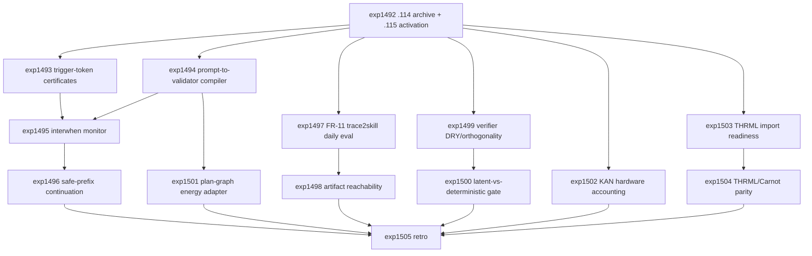

# Research Roadmap vNEXT: Milestone 2026.04.115

**Planned:** 2026-05-07
**Status:** Ready for conductor activation
**Predecessor:** Milestone 2026.04.114 completed 2026-05-07
**Roadmap YAML:** `research-roadmap-next.yaml`

## ID Allocation Note

Milestone `.114` used `exp1479` through `exp1491`. Milestone `.115` therefore
allocates `exp1492` through `exp1505`. The active execution file
`research-roadmap.yaml` is not modified by this plan.

## What Milestone 2026.04.114 Proved

| Finding | Evidence | Impact on .115 |
| --- | --- | --- |
| Balanced live local-SOTA telemetry is available, but Semantic Energy/logit telemetry is not a headline diagnostic. | `exp1480` produced live telemetry; `exp1481` retired Semantic Energy as confounded by superficial baselines; `exp1487` showed pairwise V_1 underperformed deterministic energy ranking. | Do not rerun Semantic Energy/V_1 as headline signals. Use local SOTA only where generation or certificate continuation is genuinely needed, and always compare against deterministic validators. |
| BEAVER-lite deterministic risk bounds are sound on the bounded live-prefix set. | `exp1482` evaluated 18 live-prefix constraints with zero bound violations. | Expand from bounded calibration into executable certificates and runtime monitor surfaces. |
| FR-11 memory has query-time utility in bounded replay. | `exp1484` reported `task_success_delta=0.5`, `soundness_mistakes=0`, and `policy_integration_ready=true`; `exp1485` found a completeness-reduction candidate. | The next self-learning step is not more growth. It is rot detection, artifact reachability, resolver checks, and durable daily evaluation. |
| CCTU-style executable constraints expose a real quality gap. | `exp1486` built a 20-case benchmark with `tool_call_validity_rate=0.55`, `final_answer_validity_rate=0.35`, `verifier_catch_rate=1.0`, and `false_accept_rate=0.0`. | Scale executable constraints through certificate export, validator compilation, and asynchronous monitor intervention. |
| THRML/Carnot parity remains blocked by environment readiness. | `exp1488` reported `thrml_import_ready=false`; `exp1489` was honestly gate-blocked. | Run a terminal import-readiness repair/gate before any parity experiment. |
| Partial-trace localization works only under injected-failure bounds. | `exp1490` reached top-1/top-3 localization 1.0 on injected failures but explicitly rejected decoded-quality and Kona-internals claims. | Convert localization into safe-prefix/monitor experiments, not into broad decoded-quality claims. |

## Research Signals Added Before Planning

The post-.114 literature sweep was appended to `research-references.md` before
this design. Signals that materially shape `.115`:

- **Thinking Before Constraining** (`arXiv:2601.07525`): free reasoning until a
  trigger token, then constrained certificate generation.
- **interwhen** (`arXiv:2602.11202`): asynchronous test-time monitors that poll
  intermediate reasoning state and interrupt only on detected error.
- **ConstrainPrompt** (ICLR 2026 submission): prompt-to-code validators for
  semantics-agnostic executable constraints.
- **HoVer** (ICLR 2026 submission): safe-prefix continuation from the last
  verified prefix rather than full regeneration.
- **GNNVerifier** (`arXiv:2603.14730`): graph-structured verifier for LLM task
  planning and dependency-risk localization.
- **CoEvoSkills / RL Tango / DVI**: generator-verifier co-evolution and online
  verifier feedback, but only if bounded by FR-11 daily evaluation and rot
  checks.
- **KAN hardware complexity and QuantKAN/KAEM accelerators**: useful for
  accounting and feasibility bounds; no synthesis or board claim without
  hardware readiness.
- **Extropic / THRML current docs and hardware status**: simulator/software
  path exists, hardware claims remain future-facing until local imports pass.

## Three Biggest Gaps

1. **Executable verification is still a benchmark, not a generation-time
   contract.** `.114` proved deterministic validators catch failures, but the
   system still lacks trigger-token certificate export, prompt-derived
   validators, asynchronous monitor intervention, and safe-prefix continuation.

2. **Continuous self-learning needs durability discipline.** FR-11 now improves
   bounded query-time utility, but the PRD vision requires autonomous
   self-learning that can detect stale skills, unreachable artifacts, resolver
   drift, and latent-vs-deterministic misuse before promotion.

3. **Hardware/substrate evidence is readiness-gated and fragmented.** THRML is
   blocked at import readiness, KAN hardware work needs no-synthesis resource
   accounting, and graph/trace localization needs to become a substrate-neutral
   adapter before any Kona/TSU/FPGA comparison is meaningful.

## Architecture

```text
                 Milestone 2026.04.115 Research Stack

  local SOTA GGUFs
  Qwen3.6-35B-A3B | gemma-4-31B-it | gemma-4-26B-A4B-it
          |
          v
  free reasoning -> trigger token -> structured certificate
          |                         |
          |                         v
          |                 executable validators
          |                 CCTU + ConstrainPrompt
          |                         |
          v                         v
  trace polling --------------> interwhen monitors
          |                         |
          v                         v
  Carnot energy/localization -> safe-prefix continuation
          |
          v
  FR-11 query-time memory + trace2skill daily eval
          |
          v
  deterministic verifier discipline
  reachability | DRY orthogonality | latent/deterministic gate
          |
          v
  substrate adapters
  plan-graph energy | KAN hardware accounting | THRML import/parity gate
```

## Phase Descriptions

### Phase 0 - Archive and Guardrails

`exp1492` writes the `.114` completion archive and `.115` activation manifest.
It preserves the retirements from `.114`: no Semantic Energy headline reruns,
no pairwise V_1 headline claims, no THRML parity before import readiness, no
decoded-quality claim from injected-failure localization, and no legacy small
model headline results.

### Phase 1 - Executable Contracts at Generation Time

`exp1493` applies trigger-token certificate export to CCTU-style cases using
the mandated local SOTA GGUF models. `exp1494` prototypes a ConstrainPrompt
prompt-to-validator compiler. `exp1495` is gated on both readiness artifacts and
turns certificate/validator surfaces into an interwhen-style asynchronous
monitor. `exp1496` is gated on monitor readiness and tests HoVer-style
safe-prefix continuation with no false-accept regression.

### Phase 2 - Continuous Self-Learning Hygiene

`exp1497` is the mandatory continuous self-learning task. It promotes FR-11 v10
from bounded utility to a daily trace2skill evaluation cadence with rot checks.
`exp1498` audits artifact reachability so learned skills cannot silently point
to dead evidence. `exp1499` audits verifier ensemble redundancy and conditional
orthogonality. `exp1500` is gated on the orthogonality matrix and writes a
latent-vs-deterministic discipline gate.

### Phase 3 - Graph and Hardware/Substrate Gates

`exp1501` converts CCTU tool-use traces into plan graphs and tests a
GNNVerifier-inspired graph-energy adapter against injected dependency faults.
`exp1502` performs no-synthesis KAN hardware accounting for QuantKAN/KAEM-style
accelerators. `exp1503` repairs or terminally classifies THRML import readiness.
`exp1504` is strictly gated on `thrml_import_ready=true` and runs simulator-only
THRML/Carnot parity if the environment is ready.

### Phase 4 - Retrospective and Claim Boundaries

`exp1505` closes the milestone with criteria accounting, explicit retirement
decisions, carry-forward gates, and ops reconciliation.

## Dependency Graph



## Hardware Requirements

| Task range | Hardware | Requirement boundary |
| --- | --- | --- |
| `exp1493`, `exp1494`, `exp1496`, `exp1497` | Dual RTX 3090 local workstation preferred | LLM-bearing tasks must use at least one mandated local SOTA GGUF headline model: `unsloth/Qwen3.6-35B-A3B-GGUF`, `unsloth/gemma-4-31B-it-GGUF`, or `unsloth/gemma-4-26B-A4B-it-GGUF`. Legacy small models are smoke tests only. |
| `exp1495`, `exp1498`, `exp1499`, `exp1500`, `exp1501`, `exp1502`, `exp1505` | CPU acceptable | Deterministic monitor, audit, graph, accounting, and documentation tasks. |
| `exp1503`, `exp1504` | CPU acceptable unless THRML runtime locally requires accelerator libraries | No Extropic TSU hardware claim. `exp1504` must skip via structured gate unless `exp1503.thrml_import_ready == true`. |
| Future hardware tracks | KV260, AMD XDNA, Extropic TSU, larger FPGA, D-Wave | Remain deferred unless readiness artifacts are created in a later milestone. |

## Success Criteria

| Criterion | Acceptance |
| --- | --- |
| Activation | `exp1492.activation_manifest_complete=true` and `.114` outcomes are archived without touching `research-roadmap.yaml`. |
| Trigger certificates | `exp1493.trigger_certificate_ready=true` with parse and validation rates reported against always-constrained baseline. |
| Validator compiler | `exp1494.validator_compiler_ready=true` or an honest terminal blocker with false-accept accounting. |
| Runtime monitors | `exp1495.monitor_intervention_ready=true` only if structured gates pass and zero new false accepts are observed. |
| Safe-prefix continuation | `exp1496.safe_prefix_continuation_ready=true` only if validator pass rate improves or failure is honestly bounded. |
| Continuous self-learning | `exp1497.daily_eval_manifest_ready=true` and the artifact has `continuous_self_learning_task=true`. |
| Artifact reachability | `exp1498.unreachable_artifact_count` is reported with repair/retire decisions. |
| Verifier discipline | `exp1499.orthogonality_matrix_written=true` and `exp1500.discipline_gate_ready=true`. |
| Graph adapter | `exp1501.plan_graph_energy_ready=true` or a terminal no-signal finding against random/length baselines. |
| KAN accounting | `exp1502.kan_hardware_accounting_ready=true` with no synthesis/board claim. |
| THRML readiness | `exp1503.thrml_import_ready` is terminally true or false; `exp1504` only runs if true. |
| Retrospective | `exp1505.criteria_met` and `criteria_total` summarize the milestone with carry-forward decisions. |

Target threshold: at least 11 of 14 tasks complete or honestly terminal
gate-blocked, with no task modifying `research-roadmap.yaml` or
`scripts/research_conductor.py`.

## Prior Failure and Retirement Rules

- Semantic Energy/logit telemetry and V_1 pairwise self-verification are
  retired as headline signals unless a future task explicitly changes the
  confound model and declares that change in `prior_failures`.
- THRML parity is not allowed to consume a generation call unless
  `exp1503.thrml_import_ready == true`.
- Any task that uses local LLMs must list the mandated SOTA GGUF `MODEL_SPECS`
  and must not use `Qwen3.5-0.8B` or `gemma-4-E4B-it` as headline evidence.
- Gated tasks in `research-roadmap-next.yaml` have structured `gated_on`
  entries so the conductor can skip the agent call when prerequisites fail.
- Every artifact must use a terminal `honest_verdict` prefix recognized by the
  conductor: `complete:`, `complete_`, `success:`, `success_`, `passed:`,
  `passed_`, `shipped:`, or `shipped_`.

## Decentralization and Local-First Implications

This milestone keeps Carnot on the PRD path toward local, verifiable,
self-improving reasoning. The headline models are local GGUFs; executable
validators and monitor gates are deterministic and portable; self-learning
promotion depends on local artifacts and rot checks; and hardware claims remain
bounded to software readiness or accounting until real accelerator evidence is
available.

## Expected Outputs

- `results/experiment_1492_114_completion_archive_115_activation.json`
- `ops/milestone_115_activation_manifest.md`
- `results/experiment_1493_trigger_token_certificate_export_v1.json`
- `results/cctu_trigger_certificates_1493.jsonl`
- `results/experiment_1494_constrainprompt_validator_compiler_audit.json`
- `results/constrainprompt_validator_manifest_1494.jsonl`
- `results/experiment_1495_interwhen_monitor_prototype.json`
- `results/interwhen_monitor_events_1495.jsonl`
- `results/experiment_1496_hover_safe_prefix_continuation_audit.json`
- `results/safe_prefix_continuations_1496.jsonl`
- `results/experiment_1497_fr11_trace2skill_daily_eval_v10.json`
- `ops/fr11_trace2skill_daily_eval_1497.md`
- `results/experiment_1498_trace2skill_artifact_reachability_audit.json`
- `results/experiment_1499_verifier_ensemble_dry_orthogonality_v2.json`
- `results/experiment_1500_latent_deterministic_discipline_gate.json`
- `ops/latent_deterministic_discipline_gate_1500.md`
- `results/experiment_1501_gnnverifier_plan_graph_energy_adapter.json`
- `results/experiment_1502_kan_hardware_accounting_quantkan_kaem.json`
- `results/experiment_1503_thrml_import_readiness_repair_gate.json`
- `results/experiment_1504_thrml_carnot_simulator_parity_v3.json`
- `results/experiment_1505_milestone_115_retro.json`
