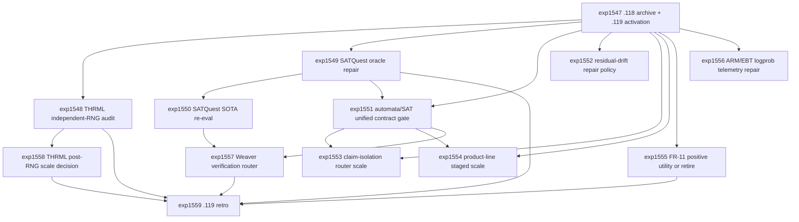

# Research Roadmap vNEXT: Milestone 2026.04.119

**Planned:** 2026-05-08
**Status:** Ready for conductor activation
**Predecessor:** Milestone 2026.04.118 completed 2026-05-08
**Roadmap YAML:** `research-roadmap-next.yaml`

## ID Allocation Note

Milestone `.118` used `exp1533` through `exp1546`. Milestone `.119`
therefore allocates `exp1547` through `exp1559`. The active execution file
`research-roadmap.yaml` and the conductor implementation are not modified by
this plan.

## What Milestone 2026.04.118 Proved

| Finding | Evidence | Impact on .119 |
| --- | --- | --- |
| Automata-guided runtime contracts are now useful. | `exp1535` moved from post-decode repair toward automata/ABS-style generation-time constraints with parse and accept rates at 1.0, false accepts at 0.0, and a negative latency delta. | Use automata masks as the front door for structured generation, then cross-check with SAT/product-line/runtime validators instead of treating syntax as sufficient. |
| SATQuest is not acceptance-ready yet. | `exp1536` produced a SATQuest-style benchmark but the `.118` retro recorded `solver_oracle_false_accepts=3` and `false_accept_rate=0.166667`. | Repair the solver oracle, add proof/witness fields, and require zero false accepts before any SOTA SATQuest re-evaluation. |
| Residual drift is measurable and needs localized repair. | `exp1538` recorded 134 multi-turn cases, 64 satisfiable-drift cases, 2 contradiction cases, and zero false accepts. | Add a repair policy that targets forgotten commitments with minimal edits and deterministic replay. |
| FR-11 is safe but still not useful. | `exp1539` preserved `soundness_mistakes=0` and `no_model_weight_mutation=true`, but `utility_delta=0.0` and `positive_utility_achieved=false`. | `.119` must either demonstrate measurable external utility or retire the positive-utility self-learning claim. |
| Product-line and claim-isolation branches have zero-false-accept signal. | `exp1540` scaled product-line cases with zero false accepts; `exp1541` reduced budget by routing 7 cases with zero false accepts. | Scale both behind the unified automata/SAT contract gate and keep deterministic false accepts as the stop condition. |
| ARM/EBT soft values remain diagnostic. | `exp1542` reported routing AUC and energy-label correlation, but `logprob_available=false` and deterministic validators remained final authority. | Repair telemetry if possible, but do not promote logprob/energy signals to acceptance authority. |
| THRML simulator hookup works but parity evidence has an RNG credibility risk. | `exp1543` and `exp1544` passed simulator-only n=256 and diverse n=64 checks, but `ops/known-issues.md` identified byte-identical Carnot/THRML histograms in earlier scaling artifacts. | Make the independent-RNG audit the first hard correctness task before any further parity headline or Extropic-readiness upgrade. |
| Extropic readiness is a packet, not hardware execution. | `exp1545` produced a readiness packet with no hardware execution claim and explicit access blockers. | Update the packet only after independent-RNG evidence exists; still require authenticated device transcripts before any Z1/XTR-0/TSU claim. |
| The milestone closed honestly. | `exp1546` recorded 13 of 14 criteria met and carried SATQuest, FR-11, THRML RNG, and logprob telemetry limits into `.119`. | Start `.119` with archive/activation fields that expose those carry-forward gates to the conductor. |

## Research Signals Added Before Planning

The 2026-05-08 post-`.118` sweep was appended to `research-references.md`
before this design. Signals that materially shape `.119`:

- **THRML independent-RNG audit** from `ops/known-issues.md`, THRML docs, and
  Extropic's THRML repository requires disjoint stochastic paths before parity
  claims are credible.
- **ConstraintBench, NLCO, and OPF constraint-reasoning papers** show that
  direct LLM answers remain feasibility-limited and solver checks must stay in
  the acceptance path.
- **FALCON hard-constraint generation** motivates grammar-constrained
  decoding, semantic repair, and adaptive Best-of-N as a single contract gate.
- **Context-sensitive constraint learning** suggests mining rejected/accepted
  traces for new constraints, but only under replay and zero-false-accept gates.
- **Weaver verification-compute routing** motivates explicit allocation across
  weak signals and deterministic validators instead of uniform verification
  spend.
- **VERGE and ReLoop** motivate proof/witness fields, semantic routing, and
  perturbation checks for silent solver-oracle failures.
- **Copy-as-Decode** motivates minimal localized repairs for residual drift
  instead of whole-answer regeneration.
- **EBT, NRGPT, and Kona public status** keep energy-native reasoning in scope,
  but `.119` treats local logprob/energy as diagnostic until deterministic
  authority is available.

## Three Biggest Gaps

1. **Correctness evidence has two hard trust breaks.** SATQuest had solver
   false accepts, and THRML parity had suspicious byte-identical stochastic
   outputs. Both must be fixed before their signals can support acceptance,
   scale, or paper claims.

2. **Constraint handling is still split across layers.** `.118` separately
   advanced automata masks, SATQuest, residual drift, product-line checks, and
   claim isolation. The PRD vision needs a coherent cascade: generation-time
   masks, semantic repair, deterministic solvers, runtime contracts, and
   verifier-compute routing.

3. **Self-learning and energy diagnostics remain non-operational.** FR-11 has
   safety but no positive utility, and ARM/EBT diagnostics still lack usable
   local SOTA logprob telemetry. `.119` must either turn these into measurable
   utility/diagnostic infrastructure or retire the corresponding headline
   claims.

## Architecture

```text
                 Milestone 2026.04.119 Research Stack

   .118 archive + .119 activation manifest
       |
       +-------------------------------+
       |                               |
       v                               v
   hard evidence repair            THRML independent-RNG audit
   SATQuest oracle witnesses       disjoint seeds | code-path audit
   zero solver false accepts       non-zero bounded stochastic deltas
       |                               |
       v                               v
   local SOTA SATQuest re-eval      THRML scale/readiness decision
   Qwen3.6-35B-A3B | gemma-4-31B | gemma-4-26B
       |
       v
   unified contract generation cascade
   automata masks -> semantic repair -> SAT/product-line/runtime validators
       |
       +-------------------------------+
       |                               |
       v                               v
   residual-drift repair           product-line + claim-router scale
   minimal localized edits         deterministic zero-false-accept gates
       |
       v
   FR-11 external self-learning gate
   positive utility or retire claim | no model-weight mutation
       |
       v
   ARM/EBT telemetry + Weaver-style verification routing
   soft signals diagnostic below deterministic validators
       |
       v
   Extropic packet update + .119 retrospective/carry-forward gates
```

## Phase Descriptions

### Phase 0 - Activation and Hard Evidence Repair

`exp1547` archives `.118`, records the 13-of-14 closure, and exposes
carry-forward gate fields. `exp1548` performs the mandatory THRML/Carnot
independent-RNG audit from `ops/known-issues.md`. `exp1549` repairs SATQuest
solver-oracle false accepts with proof/witness artifacts. `exp1550` re-runs
SATQuest with mandated local SOTA GGUFs only after the repaired oracle reports
zero false accepts.

### Phase 1 - Unified Runtime-Contract Scale

`exp1551` combines automata masks, semantic repair, SAT checks, and runtime
contracts into one acceptance cascade. `exp1552` adds localized residual-drift
repair. `exp1553` scales claim-isolation routing behind the unified gate.
`exp1554` scales product-line benchmarks with ConstraintBench/FALCON-style
feasibility, objective, and oracle-agreement metrics.

### Phase 2 - Self-Learning and Energy Diagnostics

`exp1555` is the required continuous self-learning experiment: FR-11 must show
positive external utility or retire the positive-utility claim while preserving
zero soundness mistakes and no model-weight mutation. `exp1556` repairs or
honestly blocks local SOTA logprob/top-k telemetry for ARM/EBT diagnostics.
`exp1557` uses Weaver-style verification-compute routing over deterministic
and weak verifier signals without turning soft values into acceptance
authority.

### Phase 3 - Hardware Readiness and Retrospective

`exp1558` updates THRML/Extropic scale readiness only if independent RNG
evidence passes. It remains simulator-only and no-hardware-claim. `exp1559`
closes `.119` with criteria accounting, retirements, carry-forward gates, and
ops reconciliation instructions for `.120`.

## Dependency Graph



## Hardware Requirements

| Task range | Hardware | Requirement boundary |
| --- | --- | --- |
| `exp1550`-`exp1556` | Dual RTX 3090 local workstation preferred for LLM-bearing rows | Every LLM-bearing experiment must include at least one mandated headline GGUF in `MODEL_SPECS`: `unsloth/Qwen3.6-35B-A3B-GGUF`, `unsloth/gemma-4-31B-it-GGUF`, or `unsloth/gemma-4-26B-A4B-it-GGUF`. Legacy small models may appear only as fast CPU smoke tests. |
| `exp1547`, `exp1549`, `exp1557`, `exp1559` | CPU acceptable | Archive, oracle repair, routing over existing artifacts, and retrospective. These tasks must not touch `research-roadmap.yaml` or `scripts/research_conductor.py`. |
| `exp1548`, `exp1558` | CPU acceptable; local JAX/THRML libraries allowed if already installed | THRML/Carnot software or simulator checks only. No Extropic TSU, Z1, XTR-0, FPGA board, synthesis, bitstream, or board-execution claim. |
| Any task using local SOTA GGUFs | Local model cache and llama.cpp/Ollama-compatible runtime if available | If a mandated model is unavailable, the task must write an honest artifact with model availability fields rather than substitute legacy small models as headline results. |

## Success Criteria

| Criterion | Acceptance |
| --- | --- |
| Activation | `exp1547.activation_manifest_complete=true`, `.118` criteria are recorded, and all `.119` carry-forward gates are explicit. |
| THRML RNG | `exp1548.independent_rng_audit_ready=true`, `rng_path_independent=true`, byte-identical stochastic pairs are rejected, and no hardware claim is made. |
| SATQuest repair | `exp1549.satquest_oracle_repair_ready=true`, `satquest_zero_false_accepts=true`, and proof/witness fields are present. |
| SATQuest SOTA | `exp1550.satquest_sota_reeval_ready=true` only if the repaired oracle has zero false accepts and at least one mandated local SOTA GGUF ran or was honestly blocked. |
| Unified contract gate | `exp1551.unified_contract_gate_ready=true` with automata masks, semantic repair, deterministic validators, and zero false accepts. |
| Residual drift | `exp1552.residual_drift_repair_ready=true` with localized repair metrics and zero deterministic false accepts. |
| Claim isolation | `exp1553.claim_isolation_router_scale_ready=true` with routed-case budget metrics and zero false accepts. |
| Product line | `exp1554.product_line_scale_v4_ready=true` or `branch_retired=true`, with parse, feasibility, objective/oracle, and false-accept metrics. |
| Continuous self-learning | `exp1555.continuous_self_learning_task=true`, `no_model_weight_mutation=true`, `soundness_mistakes=0`, and positive-utility claims only if `utility_delta > 0`; otherwise `positive_utility_claim_retired=true`. |
| ARM/EBT telemetry | `exp1556.arm_ebm_logprob_telemetry_ready=true` or an honest telemetry blocker, with deterministic validators final authority. |
| Verification router | `exp1557.verification_compute_router_ready=true` with cost, weak-verifier, deterministic-validator, and false-accept metrics. |
| Hardware readiness | `exp1558.thrml_post_rng_scale_decision_ready=true` only after independent-RNG evidence passes; otherwise scale/readiness claims stay blocked. |
| Retrospective | `exp1559.criteria_met`/`criteria_total` are computed from actual artifacts, and `.120` carry-forward gates are explicit. |

## Prior Failure and Retirement Rules

- `exp1548` directly addresses the `exp1526`-`exp1531` prior-failure class
  `tautological_byte_identical_histograms`. If byte-identical sample summaries
  recur, the task must fail as `rng_path_not_independent` instead of reporting
  a passed parity claim.
- `exp1549` directly addresses `exp1536` SATQuest solver false accepts. No
  downstream SATQuest acceptance or SOTA benchmark may run unless the repaired
  oracle reports zero false accepts.
- `exp1555` must retire the positive-utility FR-11 headline if utility remains
  zero. Safety-only self-learning is useful, but it is not positive utility.
- `exp1556` must keep ARM/EBT/logprob signals diagnostic-only. They cannot
  override deterministic validators.
- `exp1558` must update Extropic readiness only after independent-RNG evidence
  passes and must not imply Z1/XTR-0/TSU hardware execution.

## Local-First and Decentralization Boundary

The milestone remains local-first. Mandated local SOTA GGUFs are the headline
LLM models. Closed APIs may be cited as literature baselines but are not
required for execution. Extropic, THRML, and Kona are used as research signals
and compatibility targets; the only executable hardware track in `.119` is
software/simulator evidence unless authenticated device access and transcript
evidence become available outside the roadmap.
