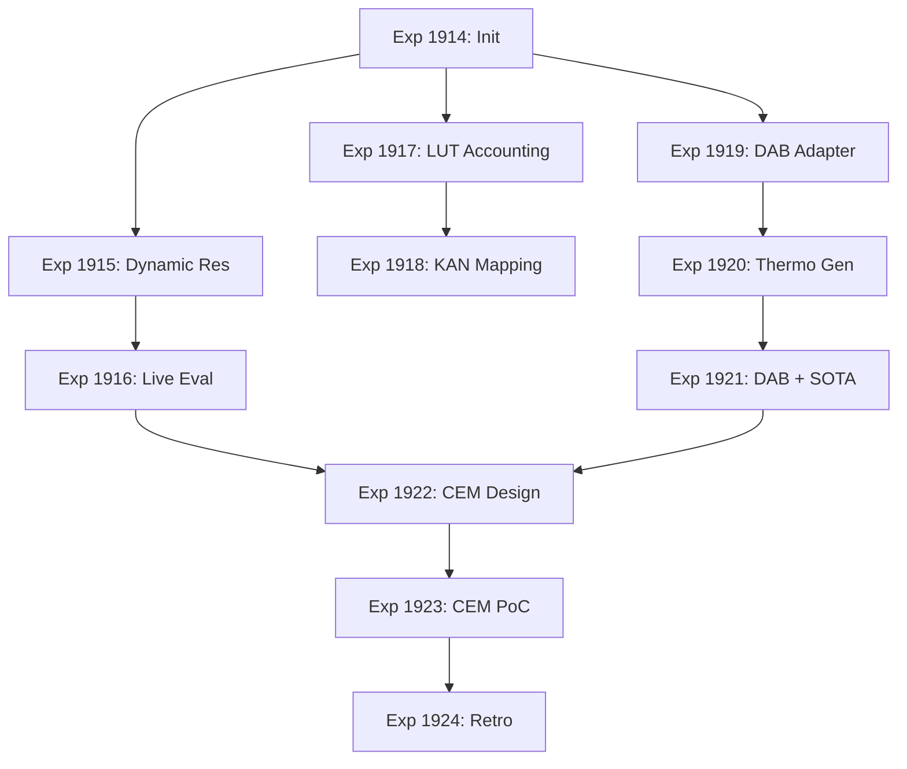

# Carnot Research Roadmap: vNEXT (2026.05.195)

**Milestone:** 2026.05.195
**Title:** Continuous Self-Learning Repair + Hardware LUT Accounting + DAB Generation
**Status:** DRAFT

## 1. Context and Previous Milestone (.194)

Milestone 2026.05.194 successfully closed out several critical lingering loops:
- **Fast-Slow Adversarial Confirmation (Exp 1909):** We confirmed the paper-matching 3.1x sample efficiency and 0.25x KL drift for the Fast-Slow Variant under adversarial rotation.
- **Phase 4 Canonical Metric Decision (Exp 1911):** Established the canonical metrics for ongoing benchmarking.
- **PyPI Release (Exp 1910):** Addressed the long-standing CI tagged release publish loop.

However, three primary gaps remain between our current state and the core PRD vision:
1. **Continuous Self-Learning (Tier 3 JEPA & FR-11):** While Fast-Slow handles sample efficiency, our FR-11 baseline exhibited catastrophic forgetting. We need dynamic resolution replay to fix this.
2. **Hardware Accounting (LUT-based without full synthesis):** We deferred KV260 execution earlier due to toolchain issues, but we can do Vivado-free LUT accounting for our KAN models.
3. **Energy-guided constrained generation:** The goal of breaking autoregressive limitations requires Discrete Auto-Regressive Biasing (DAB) and thermodynamic constraints to guide standard IT-models.

## 2. Recent ArXiv Findings incorporated

Our recent literature scan (2025-2026) validates this direction:
- **Compositional Energy Minimization (CEM):** Demonstrates that chaining local EBM constraints significantly reduces multi-step hallucinations in LLMs.
- **Discrete Auto-Regressive Biasing (DAB):** Provides a mechanism to inject EBM constraint boundaries directly into decoding without retraining the base LLM.
- **Substrate-Aware KANs (Hardware-Efficient):** New architectural primitives that map continuous latent variables to LUT-friendly boolean expressions.

## 3. Phase Descriptions

### Phase 1: Self-Learning & State Resolution
We must fix the catastrophic forgetting observed in the FR-11 baseline.
- **Exp 1914:** .194 archive and .195 initialization.
- **Exp 1915:** Implement Dynamic Resolution Continual EBM Learning Prototype.
- **Exp 1916:** Evaluate FR-11 continuous learning on live data using the prototype.

### Phase 2: Hardware-Aware KAN Accounting
Provide empirical hardware claims without the risk of Vivado synthesis failures.
- **Exp 1917:** Substrate-Aware KAN LUT Accounting (No Synthesis).
- **Exp 1918:** Verify KAN boolean mapping correctness.

### Phase 3: Constrained Generation (DAB + Thermodynamic)
Integrate EBMs with our local SOTA GGUF models.
- **Exp 1919:** Discrete Auto-Regressive Biasing (DAB) Decoder Adapter implementation.
- **Exp 1920:** Thermodynamically Constrained Neural Generation Smoke Test.
- **Exp 1921:** DAB + SOTA GGUF Live Generation benchmark with `unsloth/gemma-4-26B-A4B-it-GGUF`.

### Phase 4: Integration and Retrospective
- **Exp 1922:** Compositional Energy Minimization (CEM) Architecture Design.
- **Exp 1923:** CEM Proof of Concept on 3-SAT (Local SOTA).
- **Exp 1924:** .195 Milestone Retrospective.

## 4. Hardware Requirements
- Local CPU / RAM for basic tests.
- 1x NVIDIA GPU with at least 24GB VRAM for GGUF execution.
- GGUF SOTA Model: `unsloth/gemma-4-26B-A4B-it-GGUF` and/or `unsloth/Qwen3.6-35B-A3B-GGUF`.

## 5. Dependency Graph

