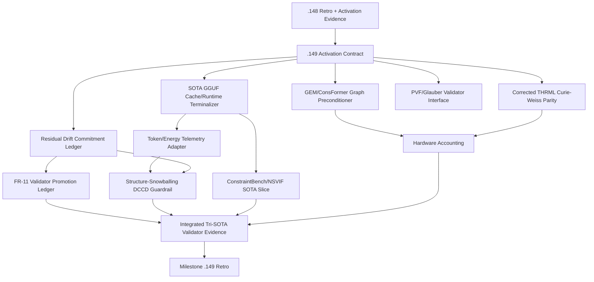
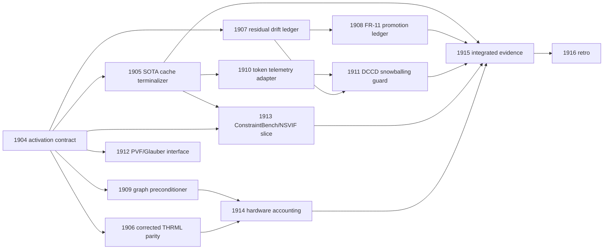

# Carnot Research Roadmap: Milestone 2026.05.149

**Status:** PROPOSED
**Doc Version:** vNEXT
**Target:** terminal artifact recovery, corrected THRML parity, continuous self-learning promotion ledgers, and SOTA advisory telemetry under deterministic validators
**Supersedes:** Milestone 2026.05.148
**Execution queue:** `research-roadmap-next.yaml`

## What Milestone 2026.05.148 Proved

| Area | Experiments | Finding |
|---|---:|---|
| Activation contract | 1890 | The `.147` evidence was archived into a usable `.148` contract. Validator-tree and BEAVER-lite substrate fields were marked ready. |
| SOTA cache/runtime | 1891 | The mandated GGUF cache/runtime terminalizer failed before writing a terminal artifact. Live SOTA evidence remains unproven. |
| Structured gate skip | 1894, 1901 | The conductor can write structured blocked artifacts when upstream gates fail. This should be used deliberately to avoid wasting synthesis calls. |
| Residual drift, FR-11, graph preconditioning | 1895, 1896, 1899 | These tasks failed without artifacts after repeated Codex CLI/bootstrap failures. Their technical claims are still open. |
| Downstream SOTA/hardware integration | 1892, 1893, 1897, 1898, 1900, 1902 | These tasks retired or gate-blocked because the cache/runtime, telemetry, FR-11, and hardware artifacts were missing. |
| Retrospective | 1903 | `.148` ended with 1 completed task, 2 structured blocked artifacts, 6 retired tasks, and 4 failed tasks. The retro explicitly says SOTA speedup and cache readiness were not proven. |

**Operational lesson:** `.148` was not a research failure in the validator math; it was an artifact-production failure. The next milestone must write terminal artifacts even on blocked outcomes, then gate every downstream experiment on fields emitted by the current roadmap rather than inferred from stale prior state.

## Three Biggest Gaps to PRD Vision

1. **Terminal evidence/provenance gap:** PRD FR-12 requires verifiable reasoning over real model outputs. Carnot still lacks a terminal SOTA GGUF cache/runtime artifact, and without it every live-model experiment either retires or burns a synthesis call before blocking.
2. **Validator-to-learning gap:** PRD FR-11 requires autonomous self-learning with no forgetting. Carnot has validator trees and deterministic bounds, but no terminal residual-drift ledger, promotion ledger, replay-retention gate, or rollback plan attached to that substrate.
3. **Hardware and non-AR bridge gap:** The long-term PRD vision needs hardware-portable EBM reasoning and a path beyond left-to-right repair. Carnot has no corrected THRML parity at n=128, no no-synthesis accounting over current validator graphs, and no metadata interface for PVF/Glauber-style non-autoregressive samplers.

## External Findings Incorporated

- **Corrected THRML parity:** `ops/known-issues.md` mandates re-running exp1850 as an inconclusive-methodology correction: Curie-Weiss or equivalent tractable n=128 substrate, analytic ground truth, 10k+ samples or convergence criterion, and gates calibrated to sample-size variance.
- **Token-level telemetry:** Token-Guard, First Token Knows, and Spilled Energy show cheap token/logit signals are useful for hallucination triage. In Carnot they remain advisory telemetry only.
- **Structure snowballing:** arXiv:2604.06066 warns that hard constrained decoding can preserve early semantic errors. DCCD/llguidance repair must measure false accepts and projection tax, not just JSON validity.
- **PVF/Glauber text diffusion:** arXiv:2605.04291 and arXiv:2601.12247 motivate an interface audit where validator trees expose automata and energy metadata for future non-autoregressive samplers.
- **Hard CSP benchmark caution:** arXiv:2602.18419 shows classical heuristics still outperform GNNs on hard CSP benchmarks. Graph preconditioning in `.149` is therefore framed as a measured convergence/accounting experiment, not a broad solver-superiority claim.
- **Hardware status:** Extropic THRML/TSU and Logical Intelligence Kona public materials remain comparator architectures. `.149` makes no KV260, TSU, XTR-0/Z1, or Kona execution claim.

## Architecture

## Phase Plan

### Phase 0: Terminal Recovery and Corrected Parity

Experiments 1904-1906 turn the `.148` retro into a fresh `.149` contract, recover the missing SOTA GGUF cache/runtime terminal artifact, and satisfy the mandatory corrected THRML parity refile. The cache task is intentionally allowed to finish as `blocked:` if models are absent, because the deliverable itself is the gate that prevents downstream waste.

### Phase 1: Validator Ledgers and Continuous Self-Learning

Experiments 1907-1909 reopen the failed `.148` validator work in smaller terminal-artifact slices. They add a residual-drift ledger, an FR-11 promotion ledger with utility/non-forgetting/rollback gates, and a GEM/ConsFormer-style preconditioning check over real validator graphs. This phase contains the required continuous self-learning experiment.

### Phase 2: SOTA Advisory Telemetry and Non-AR Interfaces

Experiments 1910-1913 use the cache artifact only when a mandated local GGUF is available. They wire token/energy telemetry as advisory evidence, test DCCD against structure snowballing, audit a PVF/Glauber metadata interface, and run a small ConstraintBench/NSVIF-style SOTA slice only under deterministic acceptance authority.

### Phase 3: Hardware Accounting, Integrated Evidence, and Retro

Experiments 1914-1916 reconcile graph preconditioning and corrected THRML parity into no-synthesis resource accounting, run an integrated tri-SOTA evidence task only when all upstream gates pass, and write the milestone retrospective. Hardware execution claims remain explicitly false unless a future artifact includes device transcripts.

## Dependency Graph

## Experiment Summary

| Exp | Title | Deliverable | Primary gate |
|---:|---|---|---|
| 1904 | `.148` Completion to `.149` Activation Contract | `results/experiment_1904_148_completion_149_activation_contract.json` | none |
| 1905 | SOTA GGUF Cache/Runtime Terminalizer v3 | `results/experiment_1905_sota_gguf_cache_runtime_terminalizer_v3.json` | 1904 |
| 1906 | THRML Curie-Weiss Parity Correction | `results/experiment_1906_thrml_curie_weiss_parity_correction.json` | 1904 |
| 1907 | Residual Drift Validator Ledger Terminal v2 | `results/experiment_1907_residual_drift_validator_ledger_terminal_v2.json` | 1904 |
| 1908 | FR-11 Validator-Tree Promotion Terminal v3 | `results/experiment_1908_fr11_validator_tree_promotion_terminal_v3.json` | 1907 |
| 1909 | GEM/ConsFormer Graph Preconditioner Terminal v3 | `results/experiment_1909_gem_consformer_graph_preconditioner_terminal_v3.json` | 1904 |
| 1910 | Token-Guard Telemetry Adapter v3 | `results/experiment_1910_token_guard_telemetry_adapter_v3.json` | 1905 |
| 1911 | Structure-Snowballing DCCD Guardrail | `results/experiment_1911_structure_snowballing_dccd_guardrail.json` | 1910, 1907 |
| 1912 | PVF/Glauber Validator Interface Audit | `results/experiment_1912_pvf_glauber_validator_interface_audit.json` | 1904 |
| 1913 | ConstraintBench/NSVIF SOTA Slice v2 | `results/experiment_1913_constraintbench_nsvif_sota_slice_v2.json` | 1905, 1904 |
| 1914 | Hardware Accounting from Preconditioned Validator Graphs | `results/experiment_1914_hardware_accounting_from_preconditioned_validator_graphs.json` | 1909, 1906 |
| 1915 | Integrated Tri-SOTA Validator Evidence v3 | `results/experiment_1915_integrated_trisota_validator_evidence_v3.json` | 1905, 1908, 1911, 1913, 1914 |
| 1916 | Milestone `.149` Retrospective | `results/experiment_1916_milestone_149_retro.json` | none |

## Hardware Requirements

| Requirement | Used by | Boundary |
|---|---|---|
| Dual RTX 3090 local GGUF runtime | 1905, 1910, 1911, 1913, 1915 | Required for headline SOTA rows. If cache/runtime is unavailable, write a blocked terminal artifact and skip downstream tasks through structured gates. |
| CPU/JAX/PySAT/Z3 | 1904, 1906, 1907, 1908, 1909, 1912, 1914, 1916 | Sufficient for activation contracts, corrected parity, ledgers, interface audits, graph fixtures, and no-synthesis accounting. |
| THRML simulator | 1906, 1914 | Optional simulator comparison only. No TSU, Z1, XTR-0, or physical Extropic hardware execution claim. |
| Rust/PyO3/llguidance-compatible runtime | 1910, 1911, 1912 | Useful for telemetry/structured output probes if locally available. Deterministic validators remain the authority. |
| KV260/Vivado/board hardware | none | Not required and not claimed. No bitfile, synthesis, latency, or board transcript is produced in this milestone. |
| Logical Intelligence Kona | reference only | Architecture comparator only. No Kona-equivalent performance claim. |

## Acceptance Gates

- Every artifact used by `gated_on` contains the exact field named by downstream gates in its `REQUIRED ARTIFACT FIELDS`.
- Every LLM-bearing experiment includes at least one mandated local GGUF in `MODEL_SPECS`; the SOTA tasks list all three mandated models:
  `unsloth/Qwen3.6-35B-A3B-GGUF`, `unsloth/gemma-4-31B-it-GGUF`, and `unsloth/gemma-4-26B-A4B-it-GGUF`.
- Legacy small models may appear only as CPU smoke tests and never as headline-result models.
- `honest_verdict` values must start with a terminal prefix such as `complete:`, `success:`, `passed:`, `shipped:`, or `blocked:`.
- Deterministic validators, solvers, and executable checks remain the only acceptance authority. Token-Guard, first-token confidence, and spilled-energy signals are advisory.
- Continuous self-learning is satisfied by Exp 1908 and must report utility delta, replay retention, non-forgetting rate, memory growth, and rollback fields.
- Corrected THRML parity must be reported as a three-way Carnot/THRML/analytic comparison with noise-calibrated gates.
- Hardware work is accounting-only unless a future artifact contains authenticated device, bitfile, command transcript, and latency provenance. This milestone intentionally makes no board-execution claim.

## Decentralization Implications

The milestone preserves Carnot's local-first posture: headline LLM work is restricted to local open-weight GGUFs, deterministic validators run locally, closed providers are not required, and hardware work remains portable accounting over CPU/GPU/FPGA/TSU-style targets rather than a vendor-locked execution path.
