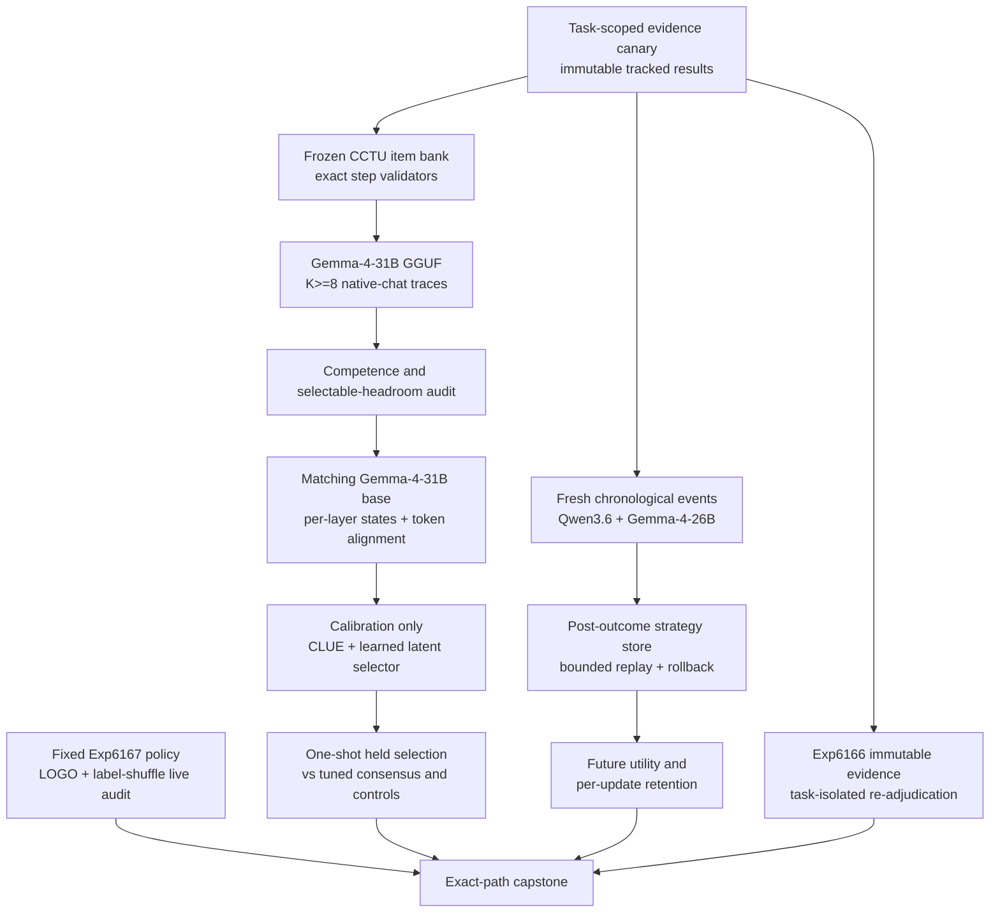

# Research Roadmap vNEXT — Milestone 2026.08.535

**Milestone title:** Executable-Trace Internal Verification, Retention-Safe
Strategy Memory, and Live-Path Robustness

**Status:** Planned after terminal milestone `2026.08.534`

**Experiment range:** Exp6169-Exp6182 (14 tasks, four phases)

**Primary question:** Can Carnot establish an authentic, unsaturated local-SOTA
reasoning pool with exact executable constraints, use matching-base hidden states
to select better traces without oracle leakage or surface shortcuts, and improve
future constraint decisions through bounded external memory without forgetting
earlier families?

## What milestone 2026.08.534 proved

| Evidence | Terminal result | Consequence for `.535` |
|---|---|---|
| Exp6156 transition | `.533` was archived exactly once and `.534` activated with null, block, partial, skip, and quarantine states preserved | Keep the exact-boundary transition and duplicate-history checks; append `.534` at most once |
| Exp6157 isolation closure | Three hard wall-clock failures produced no deliverable | Do not make repository-wide migration a scientific prerequisite. Prove a narrow task-scoped compatibility canary for every new `.535` test and artifact path |
| Exp6158 evidence delta | `complete_null:`; no accepted post-V534 source delta | Advance the evidence marker and accept another dated zero-delta result rather than manufacturing novelty |
| Exp6159-Exp6160 fresh decision corpus | Fresh exact events and a native-chat flagship-GGUF corpus were ready | Local SOTA generation and exact post-generation labels are operational; no small-model headline fallback is needed |
| Exp6161-Exp6162 decision admission | The policy froze with zero held access and both Qwen3.6-35B-A3B and Gemma-4-26B-A4B passed prospective utility/safety gates | Task-aware energy has independent decision value, but both artifacts were historically quarantined by an obsolete duration heuristic. Preserve the immutable flags and issue only a current-rule companion determination |
| Exp6163-Exp6165 strategy memory | Exp6163 was skipped behind Exp6157; mandatory Exp6164 wrote an artifact but self-learning did not execute; Exp6165 skipped | Continuous self-learning remains unproved. The next A/B must own its sealed store and stream, always execute independently, and measure forgetting after every update |
| Exp6166 stochastic composition | Mode jumping improved the deliberately nonzero approximate factor, while the artifact remained `blocked:` because repository tests were nonzero | Re-adjudicate reproducibility with task-owned isolated tests; do not retrain or rewrite Exp6166 |
| Exp6167 ARC generalization | Frozen task-aware admission had positive grouped lower CI `0.038998`, no solve, and zero registry delta | Use the single permitted ARC slot to test leave-one-game-out and task-label shortcut robustness. Add no new induction mechanism |
| Exp6168 capstone | `.534` closed with missing isolation evidence, skips, a mandatory CSL internal block, immutable flags, a software-only stochastic block, and the ARC no-solve positive preserved | `.535` must keep branches independent and preserve exact terminal classes rather than requiring universal success |

## The three largest gaps to the PRD vision

### Gap 1 — no oracle-distinct verifier has selected a better answer from a competent unsaturated local-SOTA pool

PRD FR12 calls for verification that improves reasoning at the point of use.
Carnot's finite-choice Phase-D attempts did not create a valid test: Exp6128
mixed saturated easy families with a below-floor typed-choice family and a
position confound; Exp6140 retired that source-domain recovery. The older
hidden-state pilot Exp5178 was also adverse (`0.000` versus tuned
self-consistency `0.333`) and underpowered at six questions.

`.535` changes the domain rather than transforming the retired options.
CCTU-style executable tool traces have exact step validators and no correct
answer position. A 120-item bank is frozen before model access, the mandatory
dense `unsloth/gemma-4-31B-it-GGUF` produces genuine `K>=8` temperature samples,
and a separate audit must establish parseability, competence, unsaturated
error, and at least 0.10 selectable oracle headroom before hidden-state work can
begin. The host's cached matching `google/gemma-4-31B-it` base then supplies
per-layer states only after exact prompt/completion token alignment. CLUE is the
cheap non-parametric baseline; a lightweight TrajSelector-class probe is the
learned contender. Exact validators remain evaluation oracles, never selector
features.

### Gap 2 — continuous self-learning has safety mechanics but no executed prospective utility or retention result

PRD FR11 requires improvement from verified experience. Exp6164 demonstrated
honest blocking, not learning. Its repository-wide isolation dependency made a
safe scientific question hostage to a broad migration task.

`.535` gives the learner a task-owned sealed store and a fresh chronological
constraint stream. Frozen `unsloth/Qwen3.6-35B-A3B-GGUF` and
`unsloth/gemma-4-26B-A4B-it-GGUF` compare no memory, fixed memory,
post-outcome write-through, post-outcome bounded replay, and shuffled retrieval.
The model weights and decision snapshot remain immutable; commits occur only
after exact outcomes. Following `RL Forgets!` and the self-generated replay
study, every admitted update is followed by prior-family retention measurement,
bounded-state/eviction accounting, poison quarantine, and rollback. Current
utility cannot compensate for forgetting.

### Gap 3 — positive branches still lack determination-stable and shortcut-resistant operational closure

The PRD's trustworthy research loop requires evidence that survives reruns,
test infrastructure, and deployment boundaries. `.534` exposed three distinct
risks: historical quarantine can disagree with today's verifier rules, a
scientifically positive stochastic result can be blocked by unrelated test
commands, and an ARC task-aware policy can exploit task identity instead of a
generalizable constraint signal.

`.535` addresses these without rewriting history: create an immutable
companion determination for Exp6161/Exp6162; reproduce Exp6166 under a
task-scoped isolated test root; and apply leave-one-game-out, unknown-label,
and label-shuffle controls to the fixed Exp6167 live policy. The ARC task is
measurement-only, adapter-disabled, uses the agent's own attempts, claims no
solve, and leaves the registry unchanged.

## Research findings incorporated

| Source | Finding | `.535` use |
|---|---|---|
| RL Forgets!, arXiv:2607.04364 | Current-task KL does not control behavioral drift on prior-task distributions | Exp6179 measures protected/prior-family behavior after every update and rolls back any regression |
| Forgetting in Language Models, arXiv:2605.26097 | Replay can reduce forgetting, while capacity remains a limiting factor | Exp6179 includes a bounded replay arm and reports bytes, capacity, eviction, and retained utility separately |
| CLUE, arXiv:2510.01591 | Hidden-state deltas and clustering provide a non-parametric verification baseline | Exp6177 runs CLUE before the learned selector and does not treat the withdrawn OpenReview submission as authority |
| CCTU, arXiv:2603.15309 | Tool-use traces expose complex exact constraints with executable validators | Exp6173-Exp6175 replace retired finite-choice recovery with an exact, position-free candidate pool |
| TrajSelector, arXiv:2510.16449 | Intermediate latent representations can support best-of-N selection | Exp6176-Exp6178 qualify a matching-base surface, freeze a calibration-only selector, and run one-shot held evaluation |
| Internal States + Structured Reasoning Consistency, arXiv:2510.11529 | Internal and external consistency signals can expose different failure modes | Structured consistency is a diagnostic shortcut control only; it does not reopen the retired external-text scorer family |

The dated arXiv/OpenReview/Hugging Face/Semantic Scholar/GitHub, Extropic,
Logical Intelligence, KAN, and hardware receipts were written first to
`research-references.md` under `V535 Planner Refresh - 20260806`.

## Target architecture



Every scored field names an `inference_substrate`, a principle, and
`field_provenance`. Exact CCTU validators authorize correctness labels only
after generation. GGUF generation and matching-base hidden-state extraction
are distinct execution substrates whose token/revision alignment must be
proved before joining rows.

## Phase 0 — Evidence-safe foundation (Exp6169-Exp6172)

### Exp6169: exact `.534` to `.535` transition

Archive `.534` exactly once, preserve all flags/blocks/skips, prove task-ID and
deliverable collision freedom, activate Exp6169-Exp6182, and leave an exact
transition receipt.

### Exp6170: task-scoped artifact-isolation compatibility canary

Use the canonical artifact resolver, pytest override, attempted-write guard,
and task-owned temporary roots for all new `.535` tests. This is deliberately
not another repository-wide closure claim. It fails if any declared canary
mutates tracked evidence or quarantine fields.

### Exp6171: dated post-V535 evidence delta

Search only after the `V535-PLANNER-REFRESH-20260806-END` marker. Map genuinely
new evidence to planned tasks or record a terminal zero-delta result.

### Exp6172: immutable quarantine/current-rule determination receipt

Re-run the current adversarial verifier against exact immutable Exp6161 and
Exp6162 bytes, record rule-version and field-level differences, and issue a
companion receipt. Historical `flagged_adversarial` fields and capstone
classification remain unchanged; only an operator may reopen them.

## Phase A — Executable-trace Phase D substrate (Exp6173-Exp6176)

### Exp6173: frozen CCTU item bank and preregistration

Construct at least 120 executable tool-use cases spanning resource, behavioral,
toolset, response, ordering, and cross-step constraints. Freeze 60 calibration
and 60 held cases, exact validators, positive/negative controls, hashes, power,
and gates before any candidate generation.

### Exp6174: authentic local-SOTA `K>=8` trace pool

Gated on the item bank. Generate at least eight independent traces per case
with the cached dense `unsloth/gemma-4-31B-it-GGUF`, embedded chat template,
and fixed sampling schedule. There are no correctness-conditioned retries,
model judges, AutoTokenizer-on-GGUF calls, or held-aware parser repairs.

### Exp6175: competence, unsaturation, and headroom audit

Gated on pool integrity. Judge traces once with exact step validators and audit
per-family parseability, per-candidate competence, error diversity, tuned
consensus, oracle@8, clustered intervals, and at least 30
consensus-wrong/oracle-right groups. If the pool is saturated, incompetent, or
unselectable, retire the domain and skip latent verification.

### Exp6176: matching-base per-layer surface qualification

Gated on headroom. Use only the already cached exact
`google/gemma-4-31B-it` revision with hidden-state output across the dual RTX
3090s. Prove GGUF/base prompt and completion token alignment, layer/precision/
device maps, immutable revisions, and no network download. Fail closed on any
alignment ambiguity.

## Phase B — Internal verification and continuous learning (Exp6177-Exp6179)

### Exp6177: calibration-only CLUE and latent selector freeze

Gated on the qualified surface. Compare CLUE nearest-centroid scoring with a
small learned layer-aware selector. Tune layers, aggregation, and thresholds
only on calibration cases. Include tuned consensus, length, logprob, norm,
final-layer, structured-consistency, shuffled-label, and oracle-peeking controls.
The oracle-peeking arm proves detectable signal but is never a contender.

### Exp6178: one-shot held internal-state selection

Gated on a frozen calibration artifact. Open held labels once and compare each
frozen contender with tuned consensus using clustered/paired inference.
Promotion requires a positive held confidence bound, failure of shuffled and
cheap controls to reproduce the gain, no family shortcut, and
`verifier_is_oracle=false`.

### Exp6179: mandatory retention-safe continuous strategy-learning A/B

This task has no conductor gate and must always write an artifact. It owns its
sealed store and fresh event stream, uses both mandated flagship MoE GGUFs, and
commits only exact post-decision certificates. Promotion requires positive
future-event utility for each headline model, zero unsafe-admission regression,
zero protected/prior-family retention regression after every update, bounded
state, successful poison quarantine, and rollback.

## Phase C — Reproducibility, live-path robustness, and closure (Exp6180-Exp6182)

### Exp6180: Exp6166 evidence-preserving reproducibility adjudication

Do not refit the stochastic factor. Recompute metrics and hashes from the
existing code/artifact, run focused tests under the Exp6170 task-owned root,
classify the old full-suite exit 2, and issue a companion determination. Never
rewrite Exp6166 or promote a hardware claim.

### Exp6181: single ARC slot — leave-one-game-out shortcut audit

Registry-precheck first. Freeze the Exp6167 policy and run adapter-disabled
live episodes under known, held-out, shuffled, aliased, and unknown task-label
conditions. Use only `make_carnot_agent`/`E3AgentPolicy` and the agent's own
runtime attempts. This is a robustness measurement, not a new induction line:
no source inspection, offline BFS, per-game model, solver kit, gotcha text, or
level solve.

### Exp6182: branch-independent `.535` capstone

Resolve every declared task by exact path, freshly adversarial-verify present
artifacts, preserve every skip/null/block/retirement/flag, recompute scientific
claims from raw fields, and reconcile OpenSpec, BMAD, ops docs, references, and
completion history only to delivered evidence.

## Dependency graph and fail-closed gates

```text
Exp6169 transition ────────────────────────────────────────────────┐
Exp6170 task isolation ─────┬───────────────┬──────────────────────┤
Exp6171 source delta ───────┤               │                      │
Exp6172 determination ──────┤               │                      │
                            │               │                      │
Exp6173 CCTU bank           │               │                      │
   └─[bank_ready == 1]→ Exp6174 authentic K>=8 pool               │
       └─[pool_integrity == 1]→ Exp6175 headroom audit             │
           └─[headroom_ready == 1]→ Exp6176 per-layer surface      │
               └─[surface_ready == 1]→ Exp6177 selector freeze     │
                   └─[calibration_ready == 1]→ Exp6178 held test ──┤
                                                                    │
Exp6179 mandatory CSL (ungated; task-owned stream/store) ──────────┤
Exp6180 Exp6166 adjudication (uses Exp6170 canary when ready) ─────┤
Exp6181 ARC LOGO audit (one ARC slot; independent) ────────────────┤
                                                                    ▼
                                                          Exp6182 capstone
```

The structured gates are declared in `research-roadmap-next.yaml`; their titles
and predicates agree exactly. Exp6179 deliberately has no `gated_on` field.
Exp6180 performs an internal canary check and still emits a terminal artifact if
Exp6170 is not ready, avoiding disappearance behind a conductor skip.

## Allocation and roadmap-rule compliance

| Category | Tasks | Count |
|---|---|---:|
| Phase-D executable-trace/internal verification science | Exp6173-Exp6178 | 6 |
| Continuous self-learning science | Exp6179 | 1 |
| Stochastic reproducibility science | Exp6180 | 1 |
| ARC live-path measurement | Exp6181 | 1 |
| Transition/evidence/infrastructure/capstone | Exp6169-Exp6172, Exp6182 | 5 |

Phase D holds six of nine scientific slots, a majority after required
reservations. There is exactly one ARC slot and it adds no induction mechanism.
Exp6170 and Exp6172 are the two infrastructure slots. Exp6171 is the single
SOTA-ingestion slot.

## Hardware and model requirements

| Work | Required substrate | Boundary |
|---|---|---|
| Exp6174 trace generation | Dual RTX 3090 host; cached `unsloth/gemma-4-31B-it-GGUF` through llama.cpp | Embedded GGUF tokenizer/chat template; no legacy-small headline rows |
| Exp6176 hidden states | Dual RTX 3090 host; complete cached `google/gemma-4-31B-it` base checkpoint and exact cached GGUF counterpart | No download; exact revision, precision, device map, and token alignment required |
| Exp6179 CSL | Dual RTX 3090 host; cached `unsloth/Qwen3.6-35B-A3B-GGUF` and `unsloth/gemma-4-26B-A4B-it-GGUF` | Immutable weights; task-owned external memory only |
| Other tasks | CPU/RAM/local disk | No hardware speedup, latency, power, or energy claim |

Attached-board continuity is explicit. KV260 and PolarFire already have
terminal execution receipts (including the PolarFire dispatch-hash receipt in
Exp3867/Exp3901), so `.535` does not repeat them. GateMate remains blocked on
the physical DirtyJTAG path; Exp6121 returned the same physical-state block and
is retired. No GateMate task is eligible without a new dated physical receipt.
Extropic has no authenticated local TSU route, and Kona exposes no public local
weights/API or reproducible comparator. Those systems remain references, not
execution substrates.

## Promotion and retirement rules

- No Phase-D result is headline evidence unless Exp6175 qualifies the pool,
  Exp6176 proves matching-base reachability, and Exp6178 beats tuned consensus
  on untouched held cases with shortcut controls.
- A hidden-state null or adverse result retires this exact CCTU/Gemma-4-31B
  selector construction; it does not authorize another finite-choice recovery.
- Continuous learning promotes only if both headline models improve future
  exact utility without unsafe or prior-family regression and within the
  preregistered state bound.
- Exp6172 and Exp6180 are companion determinations. They never alter immutable
  historical artifacts or silently remove quarantine.
- Exp6181 has `solve_claimed=false`, `level_credit_delta=0`, and
  `solve_provenance=live_agent_self_discovery`; the registry remains unchanged.
- Any repeated prior verdict triggers the task's declared
  `retire_if_same_verdict: true` rule and exclusion-manifest update.

## Explicitly deferred

- Weight-mutating hidden-state alignment, RL, LoRA, and internal-model continual
  learning; `.535` uses frozen local GGUFs and external certified memory.
- External generated-text/logprob verifier revival, finite-choice option
  transformations, MMLU source recovery, model judges, and correctness-aware
  retry loops.
- New ARC induction, game-specific adapters, source/BFS solves, or any public
  level re-solve.
- FPGA/TSU/Kona integration without a new physical or authenticated execution
  route.
- KAN experiments absent a new result that clears the recorded retired lanes.
