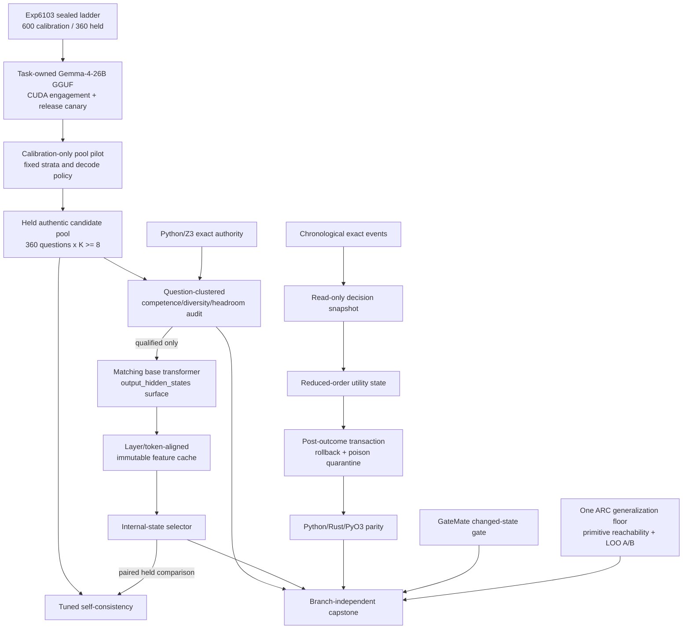

# Research Roadmap vNEXT — Milestone 2026.08.530

**Milestone title:** Authentic Phase-D Headroom, Reachable Internal-State
Verification, and Outcome-Committed Self-Learning

**Status:** Pre-staged after terminal milestone `2026.08.529`

**Experiment range:** Exp6112-Exp6123

**Architecture freshness note:** `_bmad/architecture.md` was last reconciled on
2026-07-03, 32 days before this plan. It is treated as historical architecture
evidence. Exp6123 must reconcile it against the actually implemented `.530`
surfaces; planned or gate-blocked components must not be described as current.

**Primary question:** Can Carnot turn the sealed low-chance constraint ladder
into an authentic, adequately powered same-model candidate pool, prove that a
matching-base per-layer surface is reachable, and test an internal-state
selector against tuned self-consistency—while changing continuous learning from
same-iteration writes to exact-outcome commits and preserving hardware and ARC
obligations?

## What milestone 2026.08.529 proved

The conductor activated four identities, Exp6100-Exp6103. The eight additional
identities described in the old proposal were never activated and are not
reported as completed experiments.

| Evidence | Terminal result | Consequence for `.530` |
|---|---|---|
| Exp6100 transition | `complete`; exact `.528` terminal classes were archived without laundering missing or gate-blocked evidence | Reuse exact `(milestone, task_id, deliverable)` transition semantics |
| Exp6101 source delta | `complete_null`; no accepted post-V529 source delta | The V530 planner marker is the next exact search boundary |
| Exp6102 representation recovery | `blocked: insufficient_free_vram`; readiness `0.0`; the artifact set `retirement_triggered=true` | Do not retry all-family representation acquisition, sequential eviction, or another VRAM-recovery variant |
| Exp6102 capacity receipt | Qwen3.6-35B and Gemma-4-31B each required 24,576 MiB while the best device exposed 23,859 MiB free; Gemma-4-26B-A4B fit at 17,186 MiB | Use the measured-fit 26B MoE alone for a bounded CUDA canary and candidate generation; do not infer that the other families fit |
| Exp6103 difficulty ladder | `complete_ready`; 600 calibration + 360 held questions, three balanced families, exact Python/Z3 parity, semantic-group-disjoint splits, enumerated chance floor `0.25` | The next scientific action is authentic inference on the frozen ladder, not another fixture revision |
| `.529` operational retro | Four experiments completed in 5.6 minutes, but the compute task left both GPUs effectively idle and lacked task-correlated lifecycle telemetry | Establish task-owned GPU engagement and release before spending a held-test run |

The last positive continuous-learning substrate remains Exp5967-Exp5969:
transactional external state, rollback, poison quarantine, chronological exact
events, and Python/Rust/PyO3 parity are ready. Exp5968 also showed that immediate
write-through beat delayed commit. `.530` therefore changes credit state and
commit timing, not the safety envelope or model weights.

## The three largest gaps to the PRD vision

### Gap 1 — no authentic oracle-distinct selection domain exists

FR12 requires deterministic, verifiable reasoning beyond cases where the
verifier simply executes the answer. Phase D still has zero candidate pools
that simultaneously provide a competent generator, authentic same-model
diversity, unsaturated tuned self-consistency, and selectable oracle headroom.
Exp6103 supplies the missing exact, low-chance question distribution, but no
model has yet generated on it.

`.530` uses `unsloth/gemma-4-26B-A4B-it-GGUF`, the only mandated family whose
`.529` capacity receipt fit one 24 GiB 3090. It calibrates only on the frozen
calibration split, then collects `K >= 8` natural samples for all 360 held
questions. Qualification is question-clustered and keeps competence, method
validity, diversity, all-wrong rate, tuned self-consistency, and oracle headroom
separate. Best-of-K is diagnostic; exact labels never steer held generation.

### Gap 2 — internal verification is a paper design, not a reachable substrate

Hidden-state verification remains sanctioned, but prior evidence is weak or
negative: engineered drift features were null, a final-token n=6 pilot was
underpowered, and the MMLU-Pro hidden-state lineage was retired. GGUF inference
does not expose a trustworthy equivalent of matching-base per-layer activations.
The PRD's learned energy/verifier layer therefore has no qualified live surface.

`.530` first proves headroom, then separately resolves and hash-pins the matching
base transformer under `output_hidden_states=True`. It caches pre-answer-marker,
answer-token, prefix, and layerwise summaries with explicit token alignment and
precision/device provenance. Only then may a grouped, held-out selector compare
against tuned self-consistency, cheap text controls, shuffled labels, norms,
length, and an oracle-peeking positive control. External generated-text/logprob
scorers remain retired.

### Gap 3 — continuous learning is safe but its causal credit is still weak

FR11 requires autonomous improvement from verified experience. Carnot can
write, replay, roll back, and cross-language-check external memory, but delayed
commit lost to write-through and no reduced-order utility mechanism has shown a
positive future-event gain. Same-iteration reads and writes also risk circular
credit.

`.530` freezes the memory snapshot for each decision and commits a bounded
task/polarity/dynamics utility state only after an exact external outcome. It
compares post-outcome reduced-order commits against the Exp5968 write-through
winner, delayed commit, fixed memory, shuffled retrieval, and no memory over
chronological seeds. Learning speed, eventual utility, contamination, safety,
state size, and non-forgetting are reported separately. Model weights stay
immutable.

## Research findings incorporated

| Source | Finding | `.530` use |
|---|---|---|
| Explorative Modeling, arXiv:2607.27372 | Candidate exploration is a distinct scaling axis; best-match training gains depend on meaningful diversity | Exp6115-Exp6117 preserve all draws and measure effective K, answer clusters, and oracle gain at fixed compute; no EBT/XM reproduction claim |
| Geometric Algorithms for constrained NCO, arXiv:2510.24039 | Feasibility-preserving decomposition and rounding can separate construction quality from constraint validity | Exp6117 includes an independently exact feasible-constructor positive control, never mixed into the authentic LLM pool |
| Memoir, arXiv:2607.20792 | Writing fast memory during the same pondering loop slowed fixed-budget learning relative to read-only pondering | Exp6120 freezes decision snapshots and commits only after exact outcomes |
| CLUE, arXiv:2510.01591 | Simple hidden-state trajectory summaries can rerank if success/failure geometry is separable | Exp6118-Exp6119 preregister trajectory and centroid controls, but require a new corpus and positive held interval |
| Hidden-Align, arXiv:2606.03234 | Correct rollouts concentrate near a pre-answer-marker anchor; layer and token position are load-bearing | Exp6118 caches anchor, answer-token, prefix, and layer sweeps separately |
| Solver-Hard, arXiv:2607.17047 | Solver conflicts are not model difficulty; proof-preserving relabels reveal surface sensitivity | Exp6115 calibrates observed accuracy, while Exp6117 retains solver/relabel strata as diagnostics |
| SATQuest, OpenReview ICLR 2026 workshop | Instance, problem-type, and question-format factors can be controlled under an exact SAT authority | Supports Exp6103's frozen family/surface controls; no new fixture task |
| Extropic TSU/XTR-0 and Kona 1.0 official pages | Hardware-native sampling and a constraint layer beneath generators remain relevant architecture directions | Diagram/watch items only; no authenticated local execution route or comparator |

## Target architecture



Load-bearing boundaries:

- Exact Python/Z3 validators label candidates; a learned selector is never the
  oracle.
- Exp6102's all-family representation-recovery shape is retired. The canary is
  a one-model generation and telemetry precondition, not a representation
  corpus rerun.
- Calibration may choose a preregistered stratum and decode policy only from
  the 600 calibration rows. Held labels, hidden validators, and later selector
  features cannot affect generation or row inclusion.
- GGUF generation and matching-base activation extraction are different
  substrates with separate file hashes, revisions, tokenizers, precisions, and
  device maps.
- The selector reads immutable cached internal features. It does not score
  generated text, output logprobs, model-authored confidence, or model identity.
- Self-learning reads a frozen snapshot within a decision and writes only
  after exact future evidence. Model weights remain unchanged.
- ARC uses agent-owned observations and live-reachable generic code only. No
  game source, per-game adapter, exhaustive ground-truth BFS, registry path, or
  duplicate solve credit is allowed.

## Reservation and majority accounting

| Class | Tasks | Count |
|---|---|---:|
| Infrastructure reservation | Exp6112 transition, Exp6123 capstone | 2 |
| SOTA ingestion reservation | Exp6113 dated source delta | 1 |
| Attached-board continuity | Exp6121 GateMate | 1 |
| ARC generalization floor | Exp6122 primitive reachability/LOO | 1 |
| Discretionary Phase D | Exp6114-Exp6119 | 6 |
| Other discretionary research | Exp6120 continuous self-learning | 1 |
| **Total** | Exp6112-Exp6123 | **12** |

After the fixed reservations and one ARC floor are removed, seven discretionary
slots remain. Six of seven are Phase D, satisfying the required majority.

## Phase A — exact handoff, source boundary, and compute reachability

### Exp6112 — exact transition into `.530`

Archive exactly the four activated `.529` identities and declared deliverables.
Preserve Exp6102 as a terminal block with its retirement signal, and preserve
proposal-only Exp6104-Exp6111 as unactivated rather than missing experiments.
Append `.529` once if absent and prove Exp6112-Exp6123 collision-free.

**Deliverable:** `results/experiment_6112_transition_v530.json`

### Exp6113 — post-V530 source-delta ingestion

Search only after `V530-PLANNER-REFRESH-20260804-END`. Recheck all mandated
primary and secondary sources. Zero accepted findings is a valid complete-null
result and cannot rewrite milestone identities or gates.

**Deliverable:** `results/experiment_6113_v530_source_delta_ingestion.json`

### Exp6114 — Phase-D task-scoped GPU and ladder canary

Validate Exp6103 readiness, resolve the exact cached
`unsloth/gemma-4-26B-A4B-it-GGUF`, acquire a task-owned single-GPU lease, run a
bounded natural-text generation canary, prove CUDA engagement and release, and
persist task-correlated model/server/PID/VRAM/thermal timestamps. This is not
another all-family representation extraction attempt.

**Deliverable:** `results/experiment_6114_phase_d_gpu_ladder_canary.json`

## Phase B — authentic candidate pool and headroom

### Exp6115 — gated calibration-only candidate pilot

On the frozen 600-row calibration split, collect `K >= 8` samples for at least
90 questions across the three families and preregistered difficulty strata.
Select one stratum and fixed decode policy using observed per-candidate accuracy,
parseability, effective K, method validity, and all-wrong rate. Never inspect
held labels.

**Deliverable:** `results/experiment_6115_phase_d_calibration_pool.json`

### Exp6116 — gated held same-model candidate pool

Using the fixed Exp6115 policy, collect at least eight independent natural
reasoning samples for all 360 held questions. Persist raw prompts, completions,
seeds, generation settings, exact final/method labels, row hashes, and compute
receipts. No JSON grammar, finite-ID answer transport, retries based on hidden
labels, or deterministic candidate builder is allowed.

**Deliverable:** `results/experiment_6116_phase_d_held_candidate_pool.json`

### Exp6117 — gated clustered authenticity and headroom audit

Audit at the independent-question unit. Qualification requires parseability
`>= 0.95`, effective `K >= 7.5`, per-candidate accuracy in `[0.40, 0.70]`, an
accuracy lower interval above the enumerated `0.25` floor, all-wrong rate at
most `0.10` (36/360), and `oracle@K - tuned_SC >= 0.10` with a clustered lower
interval above zero. Report method-validity, relabel, family, shortcut, answer
cluster, and exact-constructor-control strata separately. The observed-p
independence formula is diagnostic only.

**Deliverable:** `results/experiment_6117_phase_d_headroom_audit.json`

## Phase C — internal verifier and continuous self-learning

### Exp6118 — gated matching-base per-layer surface

Resolve the base model associated with the Gemma-4-26B-A4B GGUF, pin its exact
revision, and establish `output_hidden_states=True` under a declared precision
and device map. Teacher-force immutable candidate texts and cache layerwise
pre-answer-marker, answer-token, prefix, and trajectory summaries. Block if
weights, tokenizer alignment, memory, or per-layer access cannot be verified.

**Deliverable:** `results/experiment_6118_phase_d_per_layer_surface.json`

### Exp6119 — gated internal-state selector against tuned SC

Use question-grouped train/calibration/test splits and preregistered simple
probes or non-parametric centroids. Compare against tuned self-consistency,
cheap text statistics, final-layer-only, anchor-only, answer-token, prefix,
norm, length, shuffled-label, and oracle-peeking controls. Promotion requires a
positive paired lower interval over tuned SC, no shuffled-label reproduction,
no cheap-baseline match, and `n >= 30` on the identically-wrong-consensus
stratum.

**Deliverable:** `results/experiment_6119_phase_d_hidden_state_selector.json`

### Exp6120 — outcome-committed reduced-order continuous self-learning

Add a fixed-dimensional task/polarity/dynamics utility state to the ready
transactional store. Freeze the retrieval snapshot during each decision and
commit only after exact future outcomes. Compare against write-through, delayed
commit, fixed memory, shuffled retrieval, and no memory on five chronological
seeds; preserve rollback, poison, retention, state-cap, and ABI gates.

**Deliverable:** `results/experiment_6120_outcome_committed_reduced_order_csl.json`

## Phase D — attached hardware, ARC floor, and reconciliation

### Exp6121 — GateMate changed-physical-state gate

Hash the latest cable/port/power/DirtyJTAG state. Without a newer dated physical
receipt, do not repeat detection; emit the exact operator action packet. With a
changed receipt, permit one non-destructive IDCODE detect and already-built
smoke only if the expected device appears. No flash or speedup claim.

**Deliverable:** `results/experiment_6121_gatemate_changed_state_gate_v530.json`

### Exp6122 — ARC generic primitive reachability and held-out attribution

Registry-precheck all 25 games, then trace which existing game-ID-free
`arc_solver_kit.py` primitives are actually reachable from the live agent on
agent-owned tapes. Select at most one primitive with support on at least three
development games and run leave-one-game-out live-path A/B on held games. This
is an efficiency/generalization audit, not a level-solve task. Any incidental
level outcome records `solve_provenance: live_agent_self_discovery`, receives
no headline credit, and must not duplicate a registered level.

**Deliverable:** `results/experiment_6122_arc_primitive_reachability_loo.json`

### Exp6123 — branch-independent capstone

Resolve all 11 upstream identities by exact declared path. Preserve positive,
ready, null, blocked-precondition, gate-blocked, retired, underpowered, missing,
and adversarial-flagged classes independently. Reconcile specs, traceability,
the stale architecture, status, changelog, and hardware/ARC ledgers without
turning one branch's result into evidence for another.

**Deliverable:** `results/experiment_6123_v530_capstone_reconciliation.json`

## Dependency graph

```text
Exp6112 transition ─────────────────────────────────────────────────────┐
Exp6113 source delta ───────────────────────────────────────────────────┤
                                                                       │
Exp6103 sealed ladder                                                   │
  └─> Exp6114 GPU/ladder canary                                        │
       └─[phase_d_compute_and_ladder_ready_score == 1]─> Exp6115 cal   │
            └─[phase_d_calibration_ready_score == 1]─> Exp6116 pool   │
                 └─[candidate_pool_integrity_score == 1]─> Exp6117    │
                      └─[phase_d_headroom_ready_score == 1]─> Exp6118 │
                           └─[per_layer_surface_ready_score == 1 AND  │
                              phase_d_headroom_ready_score == 1]       │
                              └─> Exp6119 selector ────────────────────┤
                                                                       ├─> Exp6123
Exp5967-Exp5969 ─> Exp6120 outcome-committed CSL ──────────────────────┤
Exp6121 GateMate changed-state gate ───────────────────────────────────┤
ARC registry + live agent tapes ─> Exp6122 reachability/LOO ──────────┘
```

Structured `gated_on` fields are required for Exp6115-Exp6119. Exp6123 is
deliberately ungated so it can preserve failed and blocked branches rather than
skip reconciliation.

## Model policy

- Exp6114-Exp6116 MODEL_SPECS include
  `unsloth/gemma-4-26B-A4B-it-GGUF` with exact local file hash,
  quantization, embedded tokenizer provenance, CUDA offload, seed, and decode
  settings.
- Exp6118-Exp6119 preserve that GGUF generator provenance and separately pin
  the matching base-transformer revision, tokenizer, precision, device map,
  token alignment, and cached-feature hashes.
- `unsloth/Qwen3.6-35B-A3B-GGUF` and
  `unsloth/gemma-4-31B-it-GGUF` remain mandated headline families generally,
  but `.529` proved this specific one-GPU route lacks their declared 24,576 MiB
  capacity. They are not silently substituted, split, or CPU-headlined here.
- Qwen3.5-0.8B and gemma-4-E4B-it may appear only in explicit CPU smoke tests;
  they cannot satisfy any readiness or headline gate.

## Failed-experiment and retirement discipline

- Exp6102's all-family representation corpus and VRAM-recovery shape is retired.
  No `.530` task resumes its row shards or repeats its acquisition technique.
- Exp6114 declares Exp6102 as a prior failure because both touch local SOTA GPU
  readiness, but the deliverable and technique are materially different: one
  measured-fit model, natural generation canary, and task-correlated telemetry;
  no embeddings, all-family residency, or representation corpus.
- Exp6115-Exp6117 declare Exp5786 where their candidate-pool shape overlaps; the
  sealed low-chance ladder, natural reasoning transport, calibration/held split,
  and question-clustered gates are the changed prerequisites.
- Exp6118-Exp6119 declare the retired MMLU-Pro hidden-state lineage and explain
  the changed corpus, token/layer surface, power, and controls.
- Exp6120 declares Exp5895 and retires the new mechanism if it repeats the same
  non-promotion verdict.
- Exp6121 declares Exp5201 and permits no unchanged physical rerun.

Every prior-failure entry in YAML carries `experiment_id`, exact prior
`verdict`, a concrete `addressed_by`, and `retire_if_same_verdict: true`.

## Hardware requirements

| Resource | Use | Fail-closed rule |
|---|---|---|
| RTX 3090 GPU, 24 GiB | Exp6114-Exp6116 GGUF generation | Task-owned lease, measured CUDA engagement, thermals, PID ownership, and verified release; never kill unrelated processes |
| Two RTX 3090s + host RAM | Exp6118 matching-base surface if its declared device map needs sharding/offload | No claim unless the exact revision loads and emits aligned per-layer states; block on memory or access failure |
| GateMate A1-EVB + DirtyJTAG | Exp6121 changed-state continuity | No detect without a newer physical receipt; no flash without explicit authorization |
| CPU + Z3/PySAT | Exact labels, clustered audit, CSL replay, ARC no-LLM controls | Independent exact authority and deterministic checks remain available without GPU |
| KV260 / PolarFire | No active experiment; prior terminal/graduated receipts remain historical evidence | Do not create continuity work or speedup claims without a materially changed requirement |
| Extropic XTR-0/Z1 / Kona | Architecture watch only | No local authenticated route means no execution or comparator claim |

## Success criteria

The milestone is scientifically successful if it produces honest branch evidence,
including a decisive null. The strongest positive path requires all of:

1. Exp6114 proves the measured-fit 26B model actually engages and releases CUDA
   under task ownership.
2. Exp6116 contains 360 independent held questions with at least eight authentic
   same-model draws each and complete raw provenance.
3. Exp6117 qualifies competence, diversity, all-wrong rate, and at least 10 pp
   clustered oracle-over-tuned-SC headroom.
4. Exp6118 proves token-aligned per-layer access on the matching base surface.
5. Exp6119 beats tuned self-consistency with a paired lower interval above zero
   and survives shuffled-label and cheap-feature controls.
6. Exp6120 either improves exact future-event utility over write-through without
   safety/forgetting regression or lands a clean mechanism-level null.
7. GateMate and ARC tasks preserve their changed-state and live-provenance
   boundaries, and Exp6123 reconciles every branch without laundering.

The following are also valid terminal outcomes: the measured-fit canary fails;
the generator is below chance or saturated; the pool lacks oracle headroom; the
matching base surface is unreachable; the selector ties or loses; or
outcome-committed memory does not beat write-through. Each outcome closes or
narrows a real PRD gap without reviving a retired construction.
