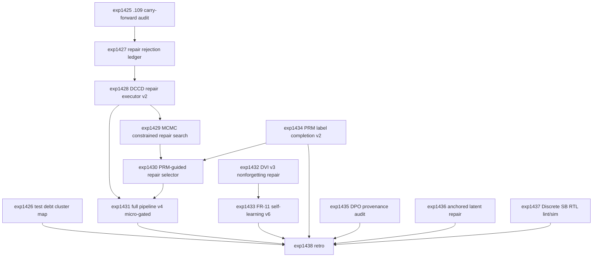

# Research Roadmap vNEXT: Milestone 2026.04.110

Planned: 2026-05-06
Status: Draft for conductor execution
Predecessor: 2026.04.109 local SOTA repair executor + DVI v3 + EBM-CoT calibration + PRM v1 + Discrete SB RTL spec
Roadmap YAML: `research-roadmap-next.yaml`

## ID Allocation Note

This milestone starts at `exp1425` because milestone `.109` used `exp1412`
through `exp1424`. The next 14 conductor tasks are `exp1425` through `exp1438`.

## What Milestone .109 Proved

| Track | Evidence | Finding |
|---|---|---|
| arXiv operator action sheet | `exp1412` | Completed the manual/operator path without another credentialed upload attempt. |
| Repair diagnosis | `exp1413` | Confirmed repair hints are available, but execution rather than localization is the bottleneck. |
| Certificate LLM repair executor v1 | `exp1414` | Local SOTA GGUF path was deployed and models were cached, but `repaired_case_success_rate=0.0` on 20 cases. |
| DVI v3 on 1508 fresh cases | `exp1415` | AUROC improved over DVI v2, but `nonforgetting_rate=0.968604` missed the deployment gate; DVI v3 did not deploy. |
| EBM-CoT temperature calibration | `exp1416` | Temperature scaling fixed the variance issue while preserving AUROC; this track is positive and does not need immediate rerun. |
| EBRM latent drift smoke | `exp1417` | Lower energy coincided with worse decoded accuracy (`accuracy_delta_after_planning=-0.75`), proving dual-path/anchoring is required. |
| FR-11 self-learning v6 | `exp1418` | Gate-blocked because DVI v3 was not deployed; no negative self-learning evidence. |
| Full-scale pipeline v3 | `exp1419` | 200-case run stayed at `full_pipeline_pass_rate=0.305`; 0/100 repair-hint cases were accepted. Exact rerun without nonzero-repair evidence is retired. |
| DPO on verified pairs | `exp1420` | Direct GGUF fine-tune was unsupported; reranker fallback measured a large preference signal but is not a headline training claim. |
| Test execution debt | `exp1421` | Embedding-store cluster fixed, but full suite still has execution failures and 71 spec-coverage misses. |
| Discrete SB KV260 RTL spec | `exp1422` | RTL-level spec was written and budget looked plausible; no bitstream or hardware-execution claim exists. |
| FoVer PRM v1 | `exp1423` | PRM v1 reached `prmv1_auroc=0.832874`, but only 1030/1508 traces had local labels; 478 labels remain missing. |
| Milestone retro | `exp1424` | `.109` met 10/13 criteria. Carry-forward priorities are repair executor v2, DVI nonforgetting, FR-11 v6, DPO provenance, test debt, and PRM label completion. |

**Critical insight from `.109`:** the full pipeline is no longer blocked on
certificate parsing, semantic validation, or repair localization. It is blocked
on turning a valid `REPAIR_HINT` into a verifier-accepted certificate patch. The
next milestone must not burn another 200-case run until a micro-run proves
nonzero repair acceptance.

## Research Signals Added Before Planning

The post-.109 sweep updated `research-references.md` before this roadmap was
finalized. The near-term signals are:

- `arXiv:2506.05754`: constrained generation can be treated as MCMC-style
  sampling under hard constraints. This motivates best-of-N constrained repair
  candidate search after `.109` accepted zero repairs.
- `arXiv:2603.03305`: draft-conditioned constrained decoding is a direct fit
  for tag-first certificate repair from `REPAIR_HINT` rows.
- HuggingFace Papers `2603.17198`: abstraction-augmented training suggests a
  replay-balanced/nonforgetting-preserving update path for DVI v3.
- FoVer and ThinkPRM project signals: Carnot should complete the 478 missing
  local process labels before making PRM v2 or PRM-guided repair claims.
- `arXiv:2604.09482`: process reward agents support using a PRM/PRA selector to
  rank repair candidates before expensive semantic validation.

Extropic TSU and Logical Intelligence/Kona remain strategic hardware/context
signals, not local dependencies for `.110`.

## Three Biggest Gaps

1. **Repair execution accepts zero candidates.** `.109` proved the local SOTA
   model path exists, but free-form repair produced no verifier-clean patches.
   Carnot needs a rejection ledger, constrained repair contract, candidate
   search, and PRM-guided selection before another 200-case scale-up.

2. **Continuous self-learning is gated by DVI nonforgetting.** FR-11 v5 proved
   1508 fresh verified samples are possible, but DVI v3 missed the
   nonforgetting gate. `.110` must make DVI v3 deployment honest before FR-11 v6
   can produce a headline self-learning update.

3. **Process supervision and Phase-3 planning are not yet integrated.** PRM v1
   is promising but label-incomplete; latent energy planning lowers energy while
   hurting decoded accuracy. `.110` should use PRM to guide concrete repair and
   add anchoring/dual-path safeguards before any latent planning scale-up.

## Architecture (4 Phases)

```
.110 Milestone Architecture
========================================================================

Phase 0 - Carry-Forward Activation and Diagnostics (unconditional)
  exp1425: .109 carry-forward activation audit ------------------------.
  exp1426: Test-suite remaining debt cluster map ----------------------+--> Phase 1/2 inputs
  exp1427: Repair executor rejection ledger ---------------------------'

Phase 1 - Repair Execution Breakthrough (gated micro-scale)
  exp1428: DCCD/schema-constrained repair executor v2 (SOTA GGUF) -----.
  exp1429: MCMC constrained repair candidate search (gated) -----------+
  exp1430: PRM-guided repair selector (gated) -------------------------+--> exp1431
  exp1431: Full pipeline v4 micro-gated validation (SOTA GGUF) --------'

Phase 2 - Self-Learning, DVI, PRM, and Training Provenance
  exp1432: DVI v3 nonforgetting replay-balanced repair ----------------.
  exp1433: FR-11 self-learning v6 (gated on DVI v3 deployed) ----------'
  exp1434: FoVer PRM label completion v2 ------------------------------.
  exp1435: DPO headline provenance audit ------------------------------'

Phase 3 - Phase-3 Safeguards, Hardware Honesty, Retro
  exp1436: Anchored dual-path latent repair v1 ------------------------.
  exp1437: Discrete SB KV260 RTL lint/simulation ----------------------+
  exp1438: Milestone .110 retrospective -------------------------------'
```

## Phase Descriptions

**Phase 0 - carry-forward activation and diagnostics.** `exp1425` converts the
`.109` retro into a hard carry-forward manifest and same-verdict retirement
rules. `exp1426` maps the remaining full-suite/spec-coverage debt without
re-opening the already-fixed embedding-store cluster. `exp1427` builds a
rejection ledger for the zero-accepted-repair failures in `exp1414` and
`exp1419`; this ledger is the contract input for repair v2.

**Phase 1 - repair execution breakthrough.** `exp1428` replaces free-form repair
with draft-conditioned, schema-constrained repair using mandated local SOTA GGUF
models. `exp1429` adds constrained candidate search only if repair v2 deploys.
`exp1430` uses PRM/PRA-style scoring to select repair candidates. `exp1431`
runs a 50-case micro validation only after nonzero repair evidence exists, so it
does not repeat the retired `exp1419` 200-case rerun.

**Phase 2 - self-learning, DVI, PRM, and provenance.** `exp1432` repairs DVI v3
with replay/abstraction balancing and an explicit nonforgetting gate. `exp1433`
is the mandatory continuous self-learning experiment and runs only if DVI v3
deploys. `exp1434` fills the 478 missing PRM labels and retrains PRM v2.
`exp1435` decides whether any direct local adapter/fine-tune path can support a
headline DPO claim, or whether the DPO line must remain a reranker benchmark.

**Phase 3 - safeguards, hardware honesty, and retro.** `exp1436` follows up the
`.109` latent drift failure with anchored/dual-path planning safeguards.
`exp1437` turns the Discrete SB RTL spec into lint/simulation evidence while
explicitly avoiding a hardware execution claim unless a real board flow runs.
`exp1438` closes the milestone and records carry-forward decisions.

## Dependency Graph



Structured conductor gates:

- `exp1429` requires `exp1428.repair_executor_v2_deployed == true`.
- `exp1430` requires `exp1429.candidate_search_complete == true`.
- `exp1431` requires `exp1428.repaired_case_success_rate > 0.0` and
  `exp1430.prm_guided_selection_ready == true`.
- `exp1433` requires `exp1432.dvi_v3_deployed == true`.

## Hardware Requirements

| Task | Hardware | Notes |
|---|---|---|
| `exp1425`, `exp1426`, `exp1427` | CPU | Diagnostics and manifests only. |
| `exp1428`, `exp1429`, `exp1431`, `exp1435` | Dual RTX 3090 preferred | LLM-bearing or LLM-runtime/provenance tasks must include mandated local SOTA GGUF `MODEL_SPECS` and may use CPU smoke tests only for legacy models. |
| `exp1430`, `exp1432`, `exp1433`, `exp1434`, `exp1436` | CPU or single GPU optional | Small discriminative/latent experiments should stay bounded and artifact-first. |
| `exp1437` | CPU plus optional FPGA tooling | OSS-CAD-Suite/Yosys/Verilator/Vivado may be used if present. No KV260 board execution claim unless actual board commands run and are logged. |
| `exp1438` | CPU | Retro must use `skip_pre_test=true` and write the terminal artifact. |

Mandated local SOTA GGUF models for LLM-bearing experiments:

- `unsloth/Qwen3.6-35B-A3B-GGUF`
- `unsloth/gemma-4-31B-it-GGUF`
- `unsloth/gemma-4-26B-A4B-it-GGUF`

Legacy small models such as Qwen3.5-0.8B or gemma-4-E4B-it may be used only as
fast CPU smoke tests. They must not be reported as headline models.

## Success Criteria

| Criterion | Target |
|---|---|
| Carry-forward manifest | `exp1425.carryforward_manifest_complete=true` and prior `.109` failures have explicit addressed-by tasks. |
| Test debt map | `exp1426.failure_cluster_map_complete=true` with at least one next fixed cluster recommended. |
| Repair rejection ledger | `exp1427.rejection_ledger_complete=true` and top rejection reasons are quantified. |
| Repair executor v2 | `exp1428.repair_executor_v2_deployed=true` and `repaired_case_success_rate > 0.0`. |
| Candidate search | `exp1429.candidate_search_complete=true` and best-of-N repair success exceeds the `.109` zero baseline. |
| PRM repair selector | `exp1430.prm_guided_selection_ready=true` and selector does not reduce accepted repair rate. |
| Pipeline micro validation | `exp1431.full_pipeline_pass_rate > 0.305` on a new 50-case micro run. |
| DVI nonforgetting | `exp1432.dvi_v3_deployed=true`, `nonforgetting_rate >= 0.99`, and AUROC does not regress below DVI v2. |
| Continuous self-learning | `exp1433.headline_result_allowed=true` or a structured gate-block artifact identifies the unmet DVI condition. |
| PRM label completion | `exp1434.missing_labels_filled >= 478` or an exact residual label-blocker ledger exists; PRM v2 retraining uses all available labels. |
| DPO provenance | `exp1435.headline_provenance_ready=true` or DPO is explicitly relabeled as a reranker-only track. |
| Latent planning safeguard | `exp1436.anchored_repair_viable=true` or records a decisive negative with drift metrics. |
| RTL evidence | `exp1437.rtl_lint_complete=true` or records missing-tool blockers; `hardware_claim_allowed=false` unless hardware actually ran. |
| Retro | `exp1438.criteria_total=14` and honest carry-forward rules are recorded. |

Milestone threshold: 11 of 14 criteria met is a successful milestone. Criteria
that are correctly gate-blocked by upstream negative evidence count as honest
negative evidence, not silent success.

## Prior Failure Summary

| Carry-forward | Prior evidence | `.110` response |
|---|---|---|
| Zero accepted repairs | `exp1414` and `exp1419` accepted 0 repairs | `exp1427` rejection ledger, `exp1428` constrained repair v2, `exp1429` constrained search, `exp1430` PRM selector, and `exp1431` micro-gated validation. |
| DVI v3 nonforgetting failure | `exp1415.nonforgetting_rate=0.968604` | `exp1432` replay-balanced/nonforgetting repair before FR-11 v6. |
| FR-11 v6 gate blocked | `exp1418` gate blocked on DVI v3 | `exp1433` keeps the same structured gate on deployed DVI v3. |
| Direct GGUF DPO unsupported | `exp1420` reranker fallback only | `exp1435` provenance audit decides adapter support or reranker relabeling. |
| Full test/spec debt remains | `exp1421` fixed one cluster but full suite remains red | `exp1426` maps remaining clusters and avoids claiming whole-suite health. |
| PRM labels incomplete | `exp1423` used 1030/1508 traces | `exp1434` fills or ledgers the 478 missing labels. |
| Latent energy false friend | `exp1417` energy down, accuracy down | `exp1436` tests anchoring and dual-path decoder safeguards. |
| Hardware still simulated/spec-only | `exp1422` RTL spec only | `exp1437` attempts lint/sim and keeps hardware claims honest. |

## Decentralization Implications

`.110` remains aligned with Carnot's local-first mandate. The core repair,
verification, DVI, PRM, and self-learning loops run locally and use deterministic
artifacts as the source of truth. External papers and project pages inform
experiment design only; no closed vendor model or hosted API becomes part of the
core system. Hardware work remains portable across CPU/GPU/FPGA paths, with
explicit refusal to claim KV260 execution until a real board flow is logged.

## Codex Default Audit

All `.110` tasks route to `agent_type: codex`, `model: gpt-5.5` by default in
`research-roadmap-next.yaml`. No task requires Claude-specific capabilities.
LLM-bearing tasks include the mandated SOTA GGUF model specs in their prompts.
Retros and diagnostic tasks use lower `max_turns` and `skip_pre_test=true` where
appropriate to avoid pretest cascades and bootstrap-only artifacts.
