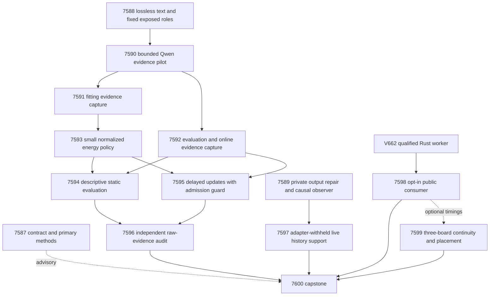

# Carnot Research Roadmap V663: Evidence Before More Calibration

**Created:** 2026-09-24
**Milestone:** 2026.09.663
**Title:** Evidence-linked energy decisions, guarded online learning, and portable verification
**Status:** Planned; not activated. No V663 experiment has run.
**Supersedes:** Completed milestone 2026.09.662. Its design is preserved
byte for byte in `research-roadmap-v662-preserved-20260924.md`.

## What V662 Proved

The active roadmap has fourteen terminal dispositions. Twelve producer
artifacts exist; the two live panel producers do not. The completed ledger
still ends at V661 at planning time. The V662 capstone and conductor log
provide the current record. Conductor completion is not scientific success.

| Evidence | Qualified result | Next action |
|---|---|---|
| Exp7573–7575 | Exact contract, numerical/runner fixtures and exposed-data roles qualified. Fixture positives are circular; role qualification is not benefit. | Reuse these components and their validation scope. |
| Exp7576–7577 | On 80 source groups, the bounded scalar map had Brier 0.146249673 versus raw 0.145635636; decision cost 0.18 versus raw 0.1725. Neither benefit gate passed. | Stop scalar-only recalibration retries; add a different information source. |
| Exp7578–7579 | Delayed learning and independent replay were valid, but registered benefit and retention gates failed. | Add evidence and separate update labels from admission labels. Another direct update of the same forecast is closed. |
| Exp7580 | World-model integrity fixtures passed; no live benefit was measured. | Reuse the integrity guard and measure observational support on the actual agent path. |
| Exp7581–7584 | The canary stopped before model inference. E2E-009/010 and the foreign-CWD smoke wrote under protected `results/`; the CLI correctly rejected them. Both panel producers are absent. | Move experiment scratch output to `/tmp`; keep the production evidence guard and assertions intact. |
| Exp7585 | Python/Rust numerical parity and equal-durability service comparison passed. Warm ratio 33.59, CI95 [31.12, 74.91], on 30 pairs; cold ratio 219.75 on its separate workload. | Test a real consumer and a stronger warm Python comparator. This is host software evidence, not board speed or useful learning. |
| Exp7586 | Preserved every disposition, closed the two unchanged learning constructions, and required a real consumer before PyO3. | Honor those stops and do not recover missing ARC science by relabeling history. |

Separate operator work now reports a rescored think-ON induction pilot mean
masked change fidelity of 0.574 versus 0.128 codeonly, but zero windows pass
the live exact 1.0 gate. The answer-channel fix is merged; Kaggle confirmation
remains an operator action. These are distinct artifacts, not V662 successes.
V663 neither reruns capped induction nor changes that acceptance threshold.

## Three Biggest Gaps Against the PRD

1. **FR-12: verification needs useful evidence, not only a probability map.**
   A qualified scalar calibrator cannot recover distinctions missing from its
   input. Test complete-text sentence-to-source links as added information,
   with raw probability, feature erasure and matched control heads.
2. **FR-11: continual learning needs retained benefit.** Correct chronology
   and durable updates are necessary but did not prevent regression. Test
   bounded evidence-residual updates with permanently held-back admission
   labels and an old-distribution anchor. Evaluate future retention separately.
3. **FR-05/08, NFR-01 and live-agent value: deployment boundaries remain open.**
   The fast Rust worker has no demonstrated public consumer. The live agent's
   observation interface may not support a deterministic next-frame model.
   Measure both boundaries without converting fixtures into efficacy claims.

## Research Basis and Scope Decisions

The dated V663 review in `research-references.md` was saved before experiment
design. It covers all eight arXiv topics and six secondary channels, including
failed Semantic Scholar citation-list access and an OpenReview challenge.
Prior roadmaps and all archive/retirement collections were consulted; older
simulation positives and superseded hardware inventory are not current facts.

| Research | V663 use | Boundary |
|---|---|---|
| [EAEV, September 2026](https://arxiv.org/html/2609.08267v1), [RT4CHART](https://arxiv.org/html/2603.27752v1) | Exp7588/7590–7596 test evidence pointers and local consistency features. | Adaptation, not replication. Pointer integrity is exact; semantic support is predicted. |
| [U-Calibration](https://arxiv.org/html/2606.18527v1), [Proper Calibeating](https://arxiv.org/abs/2605.26703) | Exp7593–7596 separate proper-loss skill, action cost and retained performance. | No imported no-regret guarantee for finite delayed replay; no claim to implement FTPL. |
| [Online KAN locality](https://arxiv.org/html/2602.02056v4) | Small bounded feature updates have a CPU/Rust and eventual fixed-point path. | Locality alone does not establish retention or a local FPGA speedup. |
| [Neural constraint certification](https://arxiv.org/abs/2608.14569), [CRANE](https://arxiv.org/abs/2502.09061), [ETS](https://arxiv.org/abs/2601.21484) | Explicit unknown/censor states and separate syntax/support/usefulness checks. | Valid structure does not prove reasoning correctness; no extra generative search loop. |
| [FPGA–ASIC orchestration](https://arxiv.org/abs/2602.15985), [Extropic Z1T](https://extropic.ai/writing/z1t) | Exp7598/7599 include caller, IPC, persistence and acknowledgement. | External device results are not Carnot hardware evidence. |

EBT and ARM–EBM remain architecture references; Ising learning-to-sample
hardness is a reason to avoid inferring sampler quality from energy fit.
Exact normalization of a binary decision needs no sampler. PHASE D generic
text reranking, unchanged four-expert reweighting, lossy generated spans,
per-game solves, induction-budget increases and new accelerator purchases
remain outside scope. The new policy sees structured verifier evidence and
never updates the mandated generator or enters the ARC action policy.

## Architecture

Solid arrows denote readiness prerequisites, not benefit requirements.
Contract/method ingestion, independent audit, consumer integration, hardware
continuity and capstone run independently of the evidence branch's outcome.
Online learning does not require a positive static evaluation. The two
captures do not depend on each other. Each structured gate also checks the
upstream closed verdict class and `flagged_adversarial=false`.

## Exact Task Contract

**Exactly 14 tasks, exp7587 through exp7600, in this order.**
The table is generated from `research-roadmap-next.yaml`; titles, full IDs,
phases, paths, substrate and conjunctive gates are the execution contract.
After activation the matching active YAML becomes the execution authority.

| Order | Task ID | Exact title | Phase | Deliverable | Substrate class | Structured gate |
|---|---|---|---|---|---|---|
| 1 | exp7587-contract-methods | Bind fourteen tasks and ingest evidence-alignment methods | 1 | results/experiment_7587_v663_contract_methods.json | aggregation | none |
| 2 | exp7588-evidence-protocol | Seal lossless evidence links and fixed source-group roles | 1 | results/experiment_7588_v663_evidence_protocol.json | no_model_load | none |
| 3 | exp7589-arc-output-boundary | Repair private ARC output placement and qualify history telemetry | 1 | results/experiment_7589_v663_arc_output_boundary.json | no_model_load | none |
| 4 | exp7590-evidence-pilot | Qualify bounded Qwen evidence-link extraction and capture cost | 2 | results/experiment_7590_v663_evidence_pilot.json | model_bounded_generation | exp7588-evidence-protocol.evidence_protocol_ready_score == 1; exp7588-evidence-protocol.verdict_class in ["null", "positive"]; exp7588-evidence-protocol.flagged_adversarial == false |
| 5 | exp7591-fit-evidence | Capture sentence-linked evidence for fitting and policy controls | 2 | results/experiment_7591_v663_fit_evidence.json | model_bounded_generation | exp7590-evidence-pilot.evidence_transport_ready_score == 1; exp7590-evidence-pilot.fit_capture_feasible_score == 1; exp7590-evidence-pilot.verdict_class in ["null", "positive"]; exp7590-evidence-pilot.flagged_adversarial == false; exp7588-evidence-protocol.evidence_protocol_ready_score == 1; exp7588-evidence-protocol.verdict_class in ["null", "positive"]; exp7588-evidence-protocol.flagged_adversarial == false |
| 6 | exp7592-test-online-evidence | Capture sentence-linked evidence for evaluation and delayed learning | 2 | results/experiment_7592_v663_test_online_evidence.json | model_bounded_generation | exp7590-evidence-pilot.evidence_transport_ready_score == 1; exp7590-evidence-pilot.eval_capture_feasible_score == 1; exp7590-evidence-pilot.verdict_class in ["null", "positive"]; exp7590-evidence-pilot.flagged_adversarial == false; exp7588-evidence-protocol.evidence_protocol_ready_score == 1; exp7588-evidence-protocol.verdict_class in ["null", "positive"]; exp7588-evidence-protocol.flagged_adversarial == false |
| 7 | exp7593-evidence-energy | Train a bounded evidence-residual energy decision policy | 2 | results/experiment_7593_v663_evidence_energy.json | no_model_load | exp7591-fit-evidence.fit_evidence_ready_score == 1; exp7591-fit-evidence.verdict_class in ["null", "positive"]; exp7591-fit-evidence.flagged_adversarial == false |
| 8 | exp7594-decision-evaluation | Measure incremental evidence value and calibrated decisions | 2 | results/experiment_7594_v663_decision_evaluation.json | no_model_load | exp7593-evidence-energy.evidence_head_ready_score == 1; exp7593-evidence-energy.baseline_ready_score == 1; exp7593-evidence-energy.verdict_class in ["null", "positive"]; exp7593-evidence-energy.flagged_adversarial == false; exp7592-test-online-evidence.test_online_evidence_ready_score == 1; exp7592-test-online-evidence.verdict_class in ["null", "positive"]; exp7592-test-online-evidence.flagged_adversarial == false |
| 9 | exp7595-guarded-learning | Measure delayed evidence learning with held-back update checks | 3 | results/experiment_7595_v663_guarded_learning.json | no_model_load | exp7593-evidence-energy.evidence_head_ready_score == 1; exp7593-evidence-energy.baseline_ready_score == 1; exp7593-evidence-energy.verdict_class in ["null", "positive"]; exp7593-evidence-energy.flagged_adversarial == false; exp7592-test-online-evidence.test_online_evidence_ready_score == 1; exp7592-test-online-evidence.verdict_class in ["null", "positive"]; exp7592-test-online-evidence.flagged_adversarial == false |
| 10 | exp7596-evidence-audit | Independently reduce evidence value and delayed update effects | 3 | results/experiment_7596_v663_evidence_audit.json | aggregation | none |
| 11 | exp7597-arc-history-generalization | Measure causal history support on adapter-withheld live games | 3 | results/experiment_7597_v663_arc_history_generalization.json | no_model_load | exp7589-arc-output-boundary.arc_output_boundary_ready_score == 1; exp7589-arc-output-boundary.history_observer_ready_score == 1; exp7589-arc-output-boundary.verdict_class in ["null", "positive", "circular_positive"]; exp7589-arc-output-boundary.flagged_adversarial == false |
| 12 | exp7598-rust-consumer | Ship an opt-in typed consumer for the durable Rust service | 4 | results/experiment_7598_v663_rust_consumer.json | no_model_load | none |
| 13 | exp7599-board-continuity | Preserve board terminal scopes and size the measured service boundary | 4 | results/experiment_7599_v663_board_continuity.json | aggregation | none |
| 14 | exp7600-capstone | Reconcile fourteen dispositions and decide information-source continuation | 4 | results/experiment_7600_v663_capstone.json | aggregation | none |
