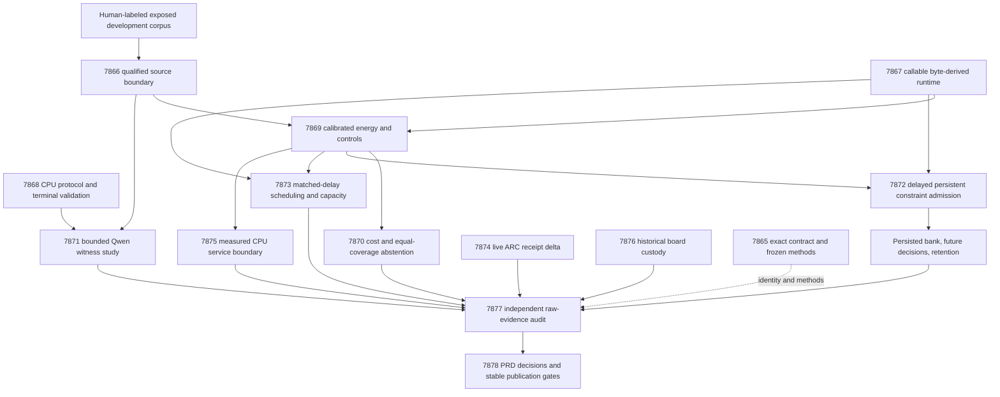

# Carnot Research Roadmap v683: Qualified Source Decisions and Causal Learning

**Created:** 2026-09-29  
**Milestone:** 2026.09.683  
**Status:** Proposed; staged for review, not activated  
**Title:** Qualified source decisions and causal learning under delayed feedback  
**Supersedes:** completed milestone 2026.09.682, experiments 7851–7864  
**Preserved predecessor:** [V682 original design](research-roadmap-v682-preserved-20260929.md)  
**Execution authority:** [research-roadmap-next.yaml](../../research-roadmap-next.yaml)  
**Planning spec:** REQ-REPORT-PLAN-683, SCENARIO-REPORT-PLAN-683-CONTRACT,
SCENARIO-REPORT-PLAN-683-RESEARCH in the research-reporting capability.

This is a continuation of the source-decision and continuous-learning track.
It contains **14 tasks, exp7865 through exp7878, across four phases**. The
primary question is whether qualified source evidence and persistently added
constraints improve calibrated decisions over matched controls. A completed
queue, a fixture pass and a historical hardware receipt cannot answer it.

## What V682 Proved

The operator reports the milestone complete. The active roadmap, terminal
artifacts and conductor log agree on eight producer artifacts and six skipped
scientific tasks. At planning time `research-complete.yaml` ends at V681;
that archive lag is not evidence that the six missing V682 measurements ran.

| Evidence | Terminal outcome | What follows |
|---|---|---|
| Exp7851 contract | `complete_circular_positive_v682_contract_methods`; readiness 1 | Contract mechanics qualified; no scientific gain. |
| Exp7852 source boundary | `complete_disqualified_required_checks`; readiness 0 | Import receipts used aliases; changed-coverage child aborted in native logging initialization. Later code repairs need a new qualified result. |
| Exp7853 natural runtime | `complete_blocked_disqualified_source_boundary`; both readiness scores 0 | Libraries exist, but the CLI's qualified-source path still raises. A blocked receipt did not exercise that path. |
| Exp7854 intervention protocol | `complete_disqualified_required_checks`; flagged, readiness 0 | Coverage passed. Required adversarial validation rejected missing CPU model methodology. The worktree's explicit `target_model=none` repair needs exact terminal replay. |
| Exp7855–7859 and Exp7861 | Six `GATE_BLOCKED` dispatches; no science producers | Energy, decisions, Qwen sensitivity, acquisition, capacity and service cost remain unmeasured in this milestone. |
| Exp7860 ARC delta | `complete_null_no_new_supervisor_outcomes`; readiness 1 | Honest zero-new-outcome continuity; no solve credit. |
| Exp7862 hardware | `complete_null_historical_board_scope`; readiness 1 | Historical board custody completed; no current device speedup. |
| Exp7863/7864 audit/capstone | `complete_blocked_required_v682_science` | Owned accounting completed; science completeness and benefit remain zero. |

The eight artifacts comprise one circular positive, two disqualified, three
blocked and two null results. No new learned-benefit result is established.
The September 28 oracle-distinct corrigendum also remains binding:
exp4245/exp5160/exp5171 do not establish independent learned verification.
GAP-ORACLE-DISTINCT stays open. Repository-health timeouts and existing
spec-traceability debt are not erased by focused validation.

## Three Largest Gaps Against the PRD

1. **Credible source decisions (FR-12).** The stack has source projection,
   latent evidence views and calibrated heads, but no qualified current
   natural comparison after the source/protocol blocks. Qualify the repaired
   boundaries, then measure probability quality, decision cost, abstention
   and source sensitivity separately. These exposed development families
   cannot close the independent-generalization gap.
2. **Continuous constraint addition (FR-11).** Persistence and reweighting
   fixtures do not prove acquisition. Install newly admitted predicates from
   released feedback, test a later causal decision change against no-write,
   and compare future benefit/retention against a complete static bank.
   V683 tests a finite predicate lattice, not open-vocabulary discovery.
3. **Deployable and live-path evidence (FR-05/FR-08, ARC).** Component claims
   do not yet connect decision quality to full service cost or qualified
   accelerators. Measure the owned CPU service boundary, preserve actual
   ARC supervisor deltas and board custody, and retain the physical triggers
   needed for future device execution. Hardware acceleration and unseen ARC
   generalization remain open unless the evidence actually changes.

## Research Ingested Before Design

The dated [V683 source review](../../research-references.md#v683-planning-review--2026-09-29-recorded-before-design)
was written before this design. It records all requested topic searches and
secondary-source access limits. These are method adaptations, not reproductions
of the papers' headline results.

| Source | Adopted experiment | Limit |
|---|---|---|
| [Chavan, 2609.23742](https://arxiv.org/abs/2609.23742), September 2026 | Exp7868/7871 separate syntax, source-byte fidelity and semantic sensitivity | Small-model findings are not evidence of 27B accuracy; no retired grammar retry. |
| [Delayed OCO reduction, 2602.02634](https://arxiv.org/abs/2602.02634), February 2026 | Exp7873 matches total delay while varying peak outstanding feedback | Discrete bank admission has no inherited convex regret guarantee. |
| [Online conformal abstention, 2506.14067 v4](https://arxiv.org/abs/2506.14067), May 2026 revision | Exp7870 equal-coverage controls; Exp7873 equal feedback opportunity | Empirical selective risk, without borrowing the FDR theorem. |
| [Cross-block DBM conditioning, 2609.14934](https://arxiv.org/abs/2609.14934), September 2026 | Exp7867/7869 observed-label invariance and matched conditioning | A tiny source-risk head is not a deep Boltzmann reproduction. |
| [Verification Without Sufficiency, 2608.00585](https://arxiv.org/abs/2608.00585) | Exp7871 witness-only, adjacent-context and matched-filler views | Edited views do not inherit new human correctness labels. |
| [RECAP, 2606.06698](https://arxiv.org/abs/2606.06698), and [retrieval-warmed EBM, 2606.26476](https://arxiv.org/abs/2606.26476) | Exp7872 five controls, causal admission and retention | Memory growth alone is not learning value. |
| [P-computer, 2607.21077](https://arxiv.org/abs/2607.21077), [Extropic Z1T](https://extropic.ai/writing/z1t) | Exp7875/7876 count actual work, memory and evidence authority | No accessible thermodynamic-device benchmark was established. |

The review also checked EBT, ARM–EBM, neural constraint hardness, Ising/KAN,
energy-guided decoding, OpenReview, Semantic Scholar citations, Hugging Face,
GitHub trending and Kona. GitHub returned stale crawls; some OpenReview/HF
pages were inaccessible. Citation counts are returned records, not a census.
No new dependency or hardware purchase follows from discovery. KAN architecture
sweeps, new sampler backends and generator training are deferred until this
existing measurement chain is qualified. Generic external-text reranking,
lossy evidence certificates and repeated unchanged board probes remain retired.

## V683 Architecture

```mermaid
flowchart TD
  D[Human-labeled exposed development corpus] --> S[7866 qualified source boundary]
  R[7867 callable byte-derived runtime] --> E[7869 calibrated energy and controls]
  S --> E
  E --> A[7870 cost and equal-coverage abstention]
  S --> Q[7871 bounded Qwen witness study]
  P[7868 CPU protocol and terminal validation] --> Q
  E --> L[7872 delayed persistent constraint admission]
  R --> L
  L --> B[Persisted bank, future decisions, retention]
  E --> F[7873 matched-delay scheduling and capacity]
  R --> F
  E --> C[7875 measured CPU service boundary]
  AR[7874 live ARC receipt delta] --> AU[7877 independent raw-evidence audit]
  HW[7876 historical board custody] --> AU
  A --> AU
  Q --> AU
  B --> AU
  F --> AU
  C --> AU
  AU --> CAP[7878 PRD decisions and stable publication gates]
  CT[7865 exact contract and frozen methods] -. identity and methods .-> AU
```

An exact evidence-location model produces a risk, not a truth certificate.
The natural adapter uses source/answer bytes; synthetic unit identifiers must
never supply predictive features. Policy costs act on calibrated unsupported
risk. Feedback is separately time-gated before training or constraint admission.
Qualified circular fixtures establish mechanics only. No contract/audit task is
a scientific-benefit gate, and an absent source cannot prevent independent
component tests, ARC accounting, hardware accounting or the terminal audit.
