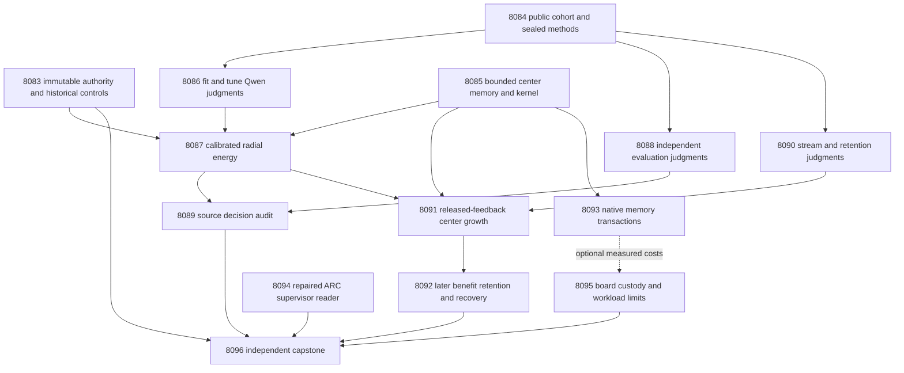

# Carnot Research Roadmap v700 — Fresh source decisions and feedback-grown energy memory

**Created:** 2026-10-04 UTC. **Milestone:** 2026.10.700.
**Status:** Staged plan; no activation or experiment execution in this planning change.
**Supersedes:** scheduling for completed milestone 2026.10.699.
**Informed by:** research-program.md, PRD, architecture, operational history,
completed experiments, prior proposals and the V700 literature scan.

The exact contract contains **14 tasks, Exp8083 through Exp8096**, in that order.
Four phases contain 3, 4, 3 and 4 tasks. The table and full executable contract
below agree with `research-roadmap-next.yaml`, including all prompts and gates.
The prior design is preserved as `research-roadmap-v699-preserved-20261004.md`.
The active `research-roadmap.yaml` and conductor source remain unchanged.

## What v699 proved

Completion means the schedule finished. It does not mean every hypothesis passed.
These findings come from the terminal primaries and Exp8082's independent reduction.

| Experiment | Supported result | Planning consequence |
|---|---|---|
| Exp8070/8072 | Historical custody and methods qualified | Reuse their input readers and preserve recorded exposure |
| Exp8071 | All 64 forwards completed; two current-process duplicate checks failed, at about .006832 and .000681 mean NLL drift | Fresh-process duplicates passed, but the primary failed an owned provenance check; no qualified scoring route follows |
| Exp8073/8074 | Interaction-head cost gain .005263 over 95 complete sources; one beneficial change; H1 failed | Change the representation and require new recorded-history-disjoint evidence |
| Exp8075 | Finite-memory projection passed fixture checks | Numerical feasibility remains distinct from useful learning |
| Exp8076/8077 | Projected-versus-ray later gain 0 over 88 sources; zero beneficial changes; retention passed | Test new feedback-selected basis functions, not another projection setting |
| Exp8078/8079 | Both partitions completed 1,080 measured rows and 180 warmup rows | Preserve qualified six-mode host evidence; no blanket service speedup or NFR-01 closure |
| Exp8080 | Blocked on nonexistent `python/carnot/experiment_8067_v698_arc_supervisor_frontier.py` | Resolve the actual reporting module and CLI from authenticated receipts |
| Exp8081 | Board custody and conditional workload bounds qualified | Reuse board evidence; price the changed memory workload separately |
| Exp8082 | All 13 dispositions reduced; capstone blocked; three PRD gaps open | Preserve failed science and blocked inputs in the successor |

Exp8071's adversarial log names `PRECONDITIONS_UNDECLARED`. Its raw numerical
observations can guide planning, but its primary remains disqualified. V700
uses the already-qualified bounded judgment transport from Exp7995. It does
not repeat the expensive likelihood chain or alter numerical tolerances.
Exp7995 completed 379 bounded calls within a 1,679-second artifact duration.
This is a feasibility reference, not a guarantee of current throughput.

## Three biggest gaps to the PRD vision

1. **Independent useful decisions, FR-06/12.** Existing scalar, additive and
   interaction heads have no qualified useful gain. Fit a small radial energy
   head on new source groups. Compare typed costs and calibration with matched
   scalar, linear, additive and equivalent logistic controls.
2. **Learning that improves later decisions, FR-11.** Projected parameter
   changes did not produce beneficial actions. Add local basis centers from
   released past errors. Compare against equal-size fixed-center learning,
   the frozen head and the earlier projected update mechanism. Audit retention.
3. **Useful complete-service deployment, FR-05/08, NFR-01.** Host cache behavior
   is measured, but useful decisions and full acquisition costs remain open.
   Measure the added memory work through a real Rust binding. Retain each
   device's actual scope and a complete cost boundary.

A learned compatibility energy is an estimate, not ground truth for incomplete
extraction. This milestone can support bounded source-decision evidence and a
conditional learning trajectory. It cannot establish general lifelong learning.
All tasks retain `generalized_learning_benefit_score=0`. Unknown model pretraining
exposure and unknown historical access remain explicit limitations.

## Research recorded before design

The V700 entry in `research-references.md` was appended before this design.
It covers all eight requested primary topics and every secondary channel.
Semantic Scholar citation endpoints failed. OpenReview forum access was
challenged. GitHub Trending was cached. These limits prevent a complete novelty claim.

| Source | Adoption or boundary |
|---|---|
| [KAC](https://arxiv.org/html/2503.21076v1), [author code](https://github.com/Ethanhuhuhu/KAC) | Exp8085/8087/8091 use radial bases and controlled local memory; this is an adaptation |
| [KAN forgetting](https://arxiv.org/abs/2511.12828) | Exp8092 preserves independent retention and recovery checks |
| [Delayed capacity](https://arxiv.org/abs/2606.11711) | Exp8084/8091 bound pending feedback and record any losses; no transferred regret theorem |
| [ARM–EBM](https://arxiv.org/abs/2512.15605), [EBT](https://arxiv.org/abs/2507.02092) | Exp8087 keeps exact logistic equivalence and independent human evaluation |
| [Wrong Key Wins](https://arxiv.org/abs/2609.15106), [HalluTracer](https://arxiv.org/abs/2608.16353) | Deferred signal-design leads; neither justifies unqualified likelihood or hidden-state claims |
| [LagONN](https://arxiv.org/abs/2505.07179), [ETS](https://arxiv.org/abs/2601.21484) | Encoding and verifier utility must precede solver or decoding changes |
| [Thermodynamic scaling](https://arxiv.org/abs/2607.00170), [Extropic Z1T](https://extropic.ai/writing/z1t/) | Exp8095 keeps sampling quality, transfer and service costs separate |

## Architecture

```mermaid
flowchart TD
  C[8083 immutable authority and historical controls] --> F[8087 calibrated radial energy]
  M[8084 public cohort and sealed methods] --> Q[8086 fit and tune Qwen judgments]
  K[8085 bounded center memory and kernel] --> F
  Q --> F
  M --> E[8088 independent evaluation judgments]
  F --> A[8089 source decision audit]
  E --> A
  M --> S[8090 stream and retention judgments]
  S --> L[8091 released-feedback center growth]
  F --> L
  K --> L
  L --> R[8092 later benefit retention and recovery]
  K --> N[8093 native memory transactions]
  N -. optional measured costs .-> H[8095 board custody and workload limits]
  B[8094 repaired ARC supervisor reader] --> Z[8096 independent capstone]
  A --> Z
  R --> Z
  H --> Z
  C --> Z
```

Labels live in evaluator-owned files. Capture sees only complete public source
and answer bytes. Learning receives each eligible update label after its release
slot. Admission labels never train coefficients or select centers. Retention
labels stay sealed until final heads and predictions are committed.

## Phase 1 — Qualify inputs and the new mechanism (Exp8083–8085)

**Exp8083** binds all fourteen tasks and preserves terminal V699 evidence.
It reuses the repaired authority reader. It authenticates historical inputs
without requiring historical scientific success. Private tests cover activation,
missing files, altered prompts, gate types and full-contract digest changes.

**Exp8084** ingests the selected papers and freezes the cohort and methods.
Use official RAGTruth training-split public fields. Exclude all known prior fit,
tune, evaluation, stream and retention sources by IDs and normalized hashes.
Also exclude near-duplicate source clusters using normalized five-token shingles
with Jaccard similarity at least .8. Record the compared inventory and unknown
coverage. Do not promise absence of unknown prior exposure.

Choose the lowest stable response ID per source without inspecting labels.
Sort groups by SHA256 of `V700` plus normalized source bytes. Allocate fit128,
tune64, evaluation192, stream256 and retention128: **768 source groups**.
Freeze selection before annotation access. Never replace a selected source after
seeing class, parsing, quality or model outcomes. Insufficient groups block only
the dependent data branches. Keep kernel, ARC and hardware work independently runnable.

**Exp8085** builds the bounded radial basis and durable center dictionary.
Use 64 seeded numerical fixture systems and independent reference calculations.
Check gradients, probability parity, typed-action parity, source identity, memory
limits and recovery. The acceptance result is fixture-only circular-positive.
Each phase includes a runnable prototype, private CLI validation and adversarial
mutation controls. No new implementation is marked complete by this plan.
