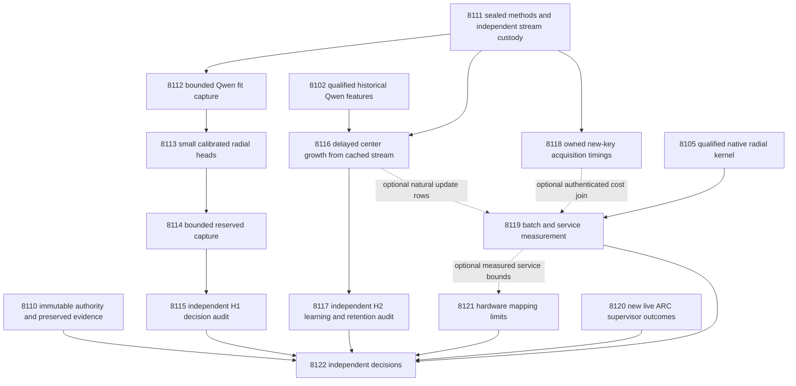

# Carnot Research Roadmap v702 — Source-sensitive decisions and independent online energy memory

**Created:** 2026-10-04 UTC. **Milestone:** 2026.10.702.
**Status:** Proposed; staged for conductor activation.
**Supersedes:** scheduling for completed milestone 2026.10.701.
**Informed by:** the research program, PRD, architecture, complete experiment
archive, operational records, prior proposals, exclusion manifest and current
primary-source research recorded in `research-references.md` before this design.

The exact contract contains **13 tasks, Exp8110 through Exp8122**, in that order.
The four phases contain **3, 3, 4 and 3 tasks**. The visible task table and complete
executable JSON below match `research-roadmap-next.yaml`, including prompts,
gates, model declarations and failure history. The V701 document is preserved
byte-for-byte in `research-roadmap-v701-preserved-20261004.md`.

## What v701 proved

The conductor closed thirteen scheduled tasks. Nine have terminal primaries;
four were gate-skipped. Completion is not a positive scientific result.

| Experiment | Supported finding | Consequence |
|---|---|---|
| 8097 | Contract, historical controls and numerical kernel readiness are 1; the verdict is circular_positive. | Reuse the parameterized authority reader. Do not rebuild governance infrastructure. |
| 8098 | The exposed development cohort qualified: 640 original source-cluster slots. Human-target eligibility is fit127, tune64, evaluation128, stream254, retention64. | Preserve roles and exposure. Do not run another impossible universal-freshness search. |
| 8099 | Disqualified terminal validation; fit readiness0; zero model loads and zero generation calls. The consumer command named absent `tests/python/test_primary_publication.py`. The artifact still declared live bounded generation and was quarantined. | Use the existing `test_primary_publication_7928.py`, validate paths first and derive actual substrate from invocation receipts. Preserve the failed primary. |
| 8100/8101 | Radial fitting and evaluation did not run. Exp8100 has an alternate conductor gate-block artifact; Exp8101 has a skip record. | Radial benefit is untested. A new qualified capture is required for that branch. |
| 8102 | Qualified bounded live capture: 300 completed generation calls; 239/256 stream and61/64 retention slots captured. | Reuse authenticated public features as historical data. No fresh model call is needed to test causal online updates. |
| 8103/8104 | Learning and its audit were skipped behind the failed fitted head. | Initialize learning from a frozen Qwen score and zero residual, independently of batch fitting. |
| 8105 | Real Rust binding qualified512 fixture rows, with zero failed rows; fixture scope is circular_positive. | Reuse the native kernel; do not port it again. |
| 8106 | Host service readiness1, acquisition readiness0;1080 transactions qualified. The overall verdict is blocked on changed-content acquisition. Cold/miss paired ratios were near1, and warm ratios below1. | Native arithmetic has not established complete-service acceleration. Measure new-key acquisition in an explicit model task and test batch crossing separately. |
| 8107 | Actual supervisor reader qualified; no new outcomes. | Inspect only new authenticated redirect outcomes, with a cheap no-firing exit. |
| 8108 | CPU precision and board-boundary assessment qualified. | Preserve per-board limits; no new hardware performance claim exists. |
| 8109 | Capstone execution readiness1, science readiness0; overall blocked. | Keep branch conclusions separate and preserve invalid sources explicitly. |

The current capture code already contains invocation-derived substrate branches.
Exp8112 must exercise them before making further changes; a historical failure
does not imply that the same defect still exists in current source.

## Three biggest gaps against the PRD

1. **Useful, independent verification — FR-06/12.** Calibrated energy decisions
   have not shown reliable advantage over controls with the same information.
   Test local radial geometry, evidence sensitivity and typed decision cost.
   This exposed-development panel cannot close `GAP-ORACLE-DISTINCT`.
2. **Learning that improves later behavior — FR-11.** Valid updates and stored
   states have not established later benefit. Test structural addition of centers
   from released errors, with equal-capacity controls and independent retention.
3. **Deployment value — FR-05/08 and NFR-01.** Fast numerical kernels can lose
   their benefit in feature acquisition, native crossings and durable writes.
   Measure the complete workload and identify the batch crossover, if any.

The energy head estimates support from incomplete evidence. It is not a proof
that arbitrary natural language is correct. Every task keeps
`independent_generalization_score=0` and `generalized_learning_benefit_score=0`.
A later independent corpus is needed for those claims.

## Research incorporated before design

The dated V702 scan in `research-references.md` covers all eight requested
research areas and all secondary channels. Rechecked papers remain prior
knowledge. Semantic Scholar citation endpoints were inaccessible; OpenReview's
forum challenged access; GitHub Trending pages were cached. These limits are
recorded rather than presented as an exhaustive novelty census.

| Source | Experiment use |
|---|---|
| [EAEV, September2026](https://arxiv.org/html/2609.08267v1) | Exp8111/8112 register source perturbations and duplicate variation. This is a narrow diagnostic adaptation, not reproduction of entity verification. |
| [KAC,2025](https://arxiv.org/abs/2503.21076), [author code](https://github.com/Ethanhuhuhu/KAC) | Exp8113/8116 test bounded local radial bases. Carnot uses multivariate distances, unlike KAC's channel-wise construction. |
| [KAN forgetting,2025](https://arxiv.org/abs/2511.12828) | Exp8117 tests retention rather than assuming locality prevents forgetting. |
| [Capacity and delayed feedback,2026](https://arxiv.org/abs/2606.11711) | Exp8116 persists issuing states, pending candidates and delayed labels. Its empirical guards inherit no regret theorem. |
| [On-chip KAN learning,2026](https://arxiv.org/abs/2602.02056) | Exp8119/8121 count updates and memory movement. Spline hardware gains do not transfer unchanged to radial distances. |
| [EBT](https://openreview.net/pdf?id=ZBj3Qp1bYg), [ARM–EBM](https://arxiv.org/abs/2512.15605) | Exp8113 retains an exactly probability-equivalent control. Energy notation adds no information by itself. |
| [FPGA decomposition](https://arxiv.org/abs/2602.15985), [Extropic Z1T](https://extropic.ai/writing/z1t) | Exp8119/8121 charge host work and transfer. Z1T's cited estimates omit final readout and some data movement; they are not Carnot measurements. |
| [LagONN](https://arxiv.org/abs/2505.07179), [ETS](https://arxiv.org/abs/2601.21484) | Defer new solver/decoding branches until a qualified verifier improves decisions. |
| [HalluScoring2026](https://arxiv.org/abs/2609.38355), [Kona1.0](https://logicalintelligence.com/kona) | External-validity lead and architectural context. Neither supplies a drop-in independently labeled local cohort or reproducible Kona implementation. |

## Architecture

```mermaid
flowchart TD
  P[8110 immutable authority and preserved evidence] --> Z[8122 independent decisions]
  M[8111 sealed methods and independent stream custody] --> Q[8112 bounded Qwen fit capture]
  Q --> F[8113 small calibrated radial heads]
  F --> E[8114 bounded reserved capture]
  E --> A[8115 independent H1 decision audit]
  M --> L[8116 delayed center growth from cached stream]
  H[8102 qualified historical Qwen features] --> L
  L --> R[8117 independent H2 learning and retention audit]
  M --> C[8118 owned new-key acquisition timings]
  N[8105 qualified native radial kernel] --> B[8119 batch and service measurement]
  C -. optional authenticated cost join .-> B
  L -. optional natural update rows .-> B
  B -. optional measured service bounds .-> W[8121 hardware mapping limits]
  S[8120 new live ARC supervisor outcomes] --> Z
  A --> Z
  R --> Z
  W --> Z
  B --> Z
```

The capture worker receives complete public source and answer bytes. The evaluator
owns human annotations. Fit/tune labels never enter the reserved-capture worker.
The online learner receives only released feedback; retention labels stay with
the evaluator until all final predictions are sealed. The independent learning
branch does not depend on Exp8112, Exp8113, Exp8114 or Exp8115.
