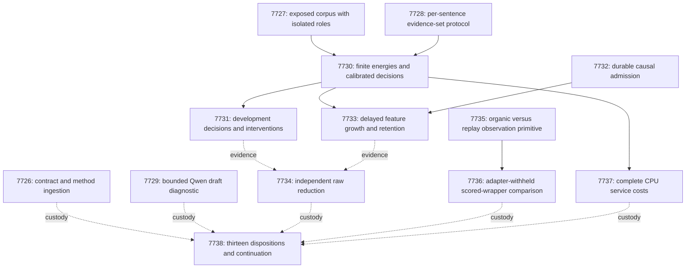

# Carnot Research Roadmap v673: Evidence sets and organic exploration

**Created:** 2026-09-26
**Milestone:** 2026.09.673
**Title:** Evidence-set decisions, causal constraint growth, and organic ARC exploration
**Status:** Proposed; staged for conductor activation
**Supersedes:** 2026.09.672, Exp7713–Exp7725
**Previous design:** `research-roadmap-v672-preserved-20260926.md`, preserved byte for byte
**Execution authority:** `research-roadmap-next.yaml`, then the matching activated roadmap
**Contract:** exactly **13 tasks, exp7726 through exp7738**, in execution order, across **four phases**.

## What v672 proved

Queue completion does not mean every scientific experiment ran. The active
roadmap, terminal artifacts and conductor log provide the following evidence.
The completed archive currently ends at V671; preserve that archive lag.

| Evidence | Observed outcome | Claim limit |
|---|---|---|
| Exp7713 | `complete_blocked_v672_independent_contract`; the design contained neither the expected task table nor machine contract | Administrative qualification failed. This design supplies both sections and validates their exact contents before delivery. |
| Exp7714 | Finite alignment protocol qualified; readiness was 1 | Exact normalization and fixtures do not establish natural-language accuracy. |
| Exp7715 | 2,894 observed families were treated as previously exposed; zero eligible fresh train/test families | The proposed fresh-400 cohort was unavailable. Its blocked verdict remains intact. |
| Exp7716 | 48 Qwen calls on 24 exposed families; 135.29 seconds recorded | Changed-module coverage was 26 percent. The terminal result was disqualified, not a usable positive pilot. |
| Exp7717, Exp7718, Exp7720 | No terminal scientific producers after upstream gate skips | No latent-alignment benefit or retained-learning null was measured. |
| Exp7719 | Five-case acquisition fixtures ran; global Python collection was a required failing gate | The fixture work did not qualify. A new, prospectively complete affected scope is required. |
| Exp7721, Exp7725 | Required scientific evidence remained blocked | Accounting completeness cannot replace missing measurements. |
| Exp7722 | Historical ARC joins and affected checks ran; terminal-reader qualification failed | No new solve or qualified generalization claim. |
| Exp7723, Exp7724 | Native parity reached 136 payloads; validation failed, including missing pytest base-directory parents, coverage and affected Clippy; timing was skipped | No qualified complete-service speedup. Preserve all failed receipts. |

The independent operator-led ARC pilots provide a new mechanism diagnosis.
V7/V8 used `visits - seen` to select an archive cell. Archive replay also
increased `seen`, contaminating the intended exploration signal. V8 gained
no new game and lost the earlier sk48 win. Earlier spacing/cap variants
showed an action tradeoff, including a real cd82 score loss. This milestone
changes observation provenance while holding that selector and replay limits
fixed. It does not repeat inert-click tuning or solve registered routes.

## Three biggest gaps to the PRD vision

1. **FR-12: usable evidence coverage.** Exact constraints cover narrow claim
   forms. The current alignment prototype shares one source location across
   an entire response. A response can need several different passages.
   Test a separate evidence location for each complete answer sentence.
2. **FR-06/FR-11: retained causal improvement.** Persistence and fixture
   mechanics are insufficient. A learned constraint addition must improve
   later decisions against both frozen and complete-static controls.
3. **FR-05/FR-07/FR-08 and NFR-01: useful reachable behavior at measured cost.**
   The live ARC process still loses useful search budget. Native service
   qualification remains incomplete. Test the measured ARC defect and time
   the new CPU consumer before committing to another native or hardware port.

## Research incorporated before design

The V673 review in `research-references.md` precedes this plan. It records
all requested topics and channels, review depth, access limits and deferrals.

| Lead | Local hypothesis or boundary | Tasks |
|---|---|---|
| [SURE-RAG](https://arxiv.org/html/2605.03534v1), 2026; [HalluSpan/EviAlign](https://arxiv.org/html/2608.15804v1), August 2026 | Evidence may be spread across passages. Compare independent sentence locations with a shared location and pooled controls. | 7726, 7728, 7730–7731 |
| [EBT](https://arxiv.org/abs/2507.02092), 2025; [ARM–EBM](https://arxiv.org/abs/2512.15605), revised May 2026 | Use finite normalized decision energy; learned probability is not proof. | 7728, 7730 |
| [DCCD](https://arxiv.org/abs/2603.03305), 2026; [structural/semantic gap](https://arxiv.org/abs/2609.23742), September 2026 | Hold tokens fixed while separating draft conditioning, output structure and semantic decisions. | 7729 |
| [Delayed capacity-constrained learning](https://arxiv.org/abs/2606.11711), 2026; [KAN forgetting](https://arxiv.org/abs/2511.12828), 2025 | Bound feedback, preserve temporal order and test retention. No theorem transfers automatically to discrete feature acquisition. | 7732–7734 |
| [FPGA–ASIC co-design](https://arxiv.org/abs/2602.15985), 2026; [Z1T](https://extropic.ai/writing/z1t) | Include parsing, orchestration, serialization and durable acknowledgement in service cost. | 7737–7738 |

This is a Carnot mechanism study, not a reproduction of a pretrained
entailment encoder. Fixed hash features may still lack semantic information.
The comparison can reject that premise. LagONN, EBD, KAN architecture changes
and new samplers remain research leads, not additional tasks in this contract.
Kona supplies vendor context without a sufficient local reproduction recipe.
Semantic Scholar citation endpoints failed. OpenReview direct pages reached
browser challenges. GitHub trending views were cached. Those gaps are recorded,
not treated as proof that no newer work exists.

## Evidence scope and data decision

V673 uses **exposed development data**. It does not relabel the RAGTruth archive
as fresh. Inventory, evaluator materialization and actual fitting are tracked
separately, but uncertain custody stays exposed. All new artifacts declare
`fresh_generalization_eligible=false`. The fresh-data limitation is unresolved.
SciHal requires registration and includes modified claims; it is not an
already qualified replacement. RAGTruth re-annotation also reuses source families.

Exp7727 freezes 640 distinct source families: fit256, tune64, policy64,
online_update96, online_admission64, evaluation64 and retention32. Evaluation
uses official test; other roles use official train. One label-blind response
per source prevents responses from multiplying independent N. Prior pilot
families and cross-role near-duplicates are excluded. A real shortage blocks
the affected branch. Roles are not shrunk after seeing data.

These roles protect within-run fitting and temporal comparisons. Historical
exposure still limits every result to a development mechanism claim. Positive
results can justify a future fresh-corpus study only. No generator weights,
production defaults, publication gates or live submissions change here.

## Architecture

```mermaid
flowchart TD
    C[7726: contract and method ingestion]
    D[7727: exposed corpus with isolated roles]
    P[7728: per-sentence evidence-set protocol]
    Q[7729: bounded Qwen draft diagnostic]
    F[7730: finite energies and calibrated decisions]
    E[7731: development decisions and interventions]
    B[7732: durable causal admission]
    L[7733: delayed feature growth and retention]
    A[7734: independent raw reduction]
    R[7735: organic versus replay observation primitive]
    G[7736: adapter-withheld scored-wrapper comparison]
    T[7737: complete CPU service costs]
    K[7738: thirteen dispositions and continuation]
    D --> F
    P --> F
    F --> E
    F --> L
    B --> L
    E -. evidence .-> A
    L -. evidence .-> A
    R --> G
    F --> T
    C -. custody .-> K
    Q -. custody .-> K
    A -. custody .-> K
    G -. custody .-> K
    T -. custody .-> K
```

Solid arrows are readiness dependencies. Dotted arrows are evidence reads
that must still report missing or blocked inputs. Administrative and Qwen
pilot results never gate the main science or ARC branch.

## Phase 1 — Establish the contract, roles and evidence-set prototype

**Exp7726–Exp7728.** Exp7726 tests the complete design against staged or
activated authority. It also maps the literature onto these exact methods.
Exp7727 provides role isolation without pretending that the corpus is fresh.
Both are infrastructure work with no benefit claim.

Exp7728 adds a distinct latent source-window index for each complete answer
sentence. Each pair has two normalized support states. Marginalization uses
`logsumexp`, grouped duplicate priors and a null-evidence state. Response
support is the product of sentence-support probabilities, evaluated in log
space. This conditional-independence assumption is tested, not certified.
Missing evidence is not automatically contradiction.

Keep the existing features and limits: at most 128 source windows and 16
answer sentences. Over-budget inputs abstain and remain in all denominators.
The original shared-location energy, pooled logistic and pooled MLP are
same-input controls. Each head has at most 4,096 trainable parameters.
Use 96 fixture groups with 32 reserved. Exact normalization, byte retention,
reordering, duplicate invariance and boundary handling must pass before fit.
Fixtures are `circular_positive`, never independent scientific positives.

## Phase 2 — Measure semantics, calibrated probabilities and decisions

**Exp7729–Exp7731.** The Qwen pilot is an independent diagnostic. Its three
arms use a 256-token ceiling: direct schema; draft128 plus schema128; and
draft128 plus unconstrained128. The 24 exposed families require at most 120
calls and 18,432 output tokens. Report syntax, valid quotes, unknowns and
binary human-label accuracy separately. The dataset does not certify a
three-way support/contradiction/insufficient label. The actual model is
`unsloth/Qwen3.8-27B-GGUF`; this is bounded generation with a 10-second floor.

Exp7730 fits finite energies with five seeds and a fixed four-configuration
budget, at most 200 epochs. Minimize fit NLL, calibrate temperature on tune,
and freeze policy before evaluation. Typed costs are accept=`5*p`,
reject=`1-p`, escalate=`0.25`, where `p` is unsupported probability.
Ties escalate. Freeze an actual complete-static model containing all at
most 16 advisory conjunctions for the later learning comparison.

Exp7731 opens evaluation labels only after model hashes freeze. A development
benefit needs paired cost reduction lower95>0 and estimate>=0.02 against all
three same-input controls, Brier reduction lower95>0 and coverage>=0.20.
Use 10,000 family bootstrap draws, seeds averaged within family, and Holm
correction across the baseline contrasts. Require Brier benefit against the
separately trained source-erased control too. Source permutations and erasure
of evaluation inputs have no inherited labels; report prediction sensitivity,
not invented counterfactual accuracy. N=64 permits a bounded mechanism study.
