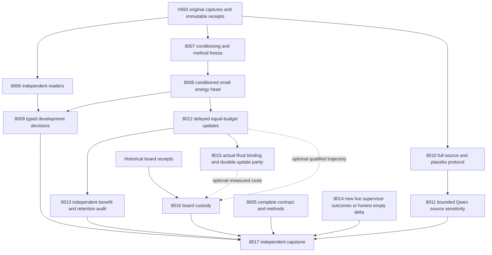

# Carnot Research Roadmap v694 — Decision-sensitive energy learning

**Created:** 2026-10-02. **Milestone:** 2026.10.694.
**Status:** Planned, not activated by this task.
**Supersedes:** completed 2026.10.693; sequence 693 increments to 694.
The original incomplete V693 design is preserved unchanged in
`research-roadmap-v693-preserved-20261002.md`.

The contract contains **13 tasks, Exp8005 through Exp8017**, in the exact
execution order below. The visible task table and embedded full-task JSON agree
with `research-roadmap-next.yaml`. The canonical digest binds prompts and
failure history as well as titles. The active roadmap remains unchanged.

## What v693 proved

The archive still ends at V692 at planning time. The active V693 roadmap,
terminal primaries and conductor log establish completion of scheduling.
A conductor `OK` does not establish scientific success.

| Evidence | Supported finding | Limit |
|---|---|---|
| Exp7992 | Exact failed authority operands are recorded | Design omitted its task table, machine contract and digest; readiness zero |
| Exp7993 | Historical raw capture reconstruction qualified | Current model-call count is zero; original disqualification remains |
| Exp7994/7995 | Source-disjoint development roles and bounded Qwen capture qualified | 62 calibration, 254 stream and 63 retention completions; data are publicly exposed development evidence |
| Exp7996 | Sparse and dense updates agree; small heads fit | No independent decision benefit follows from fitting |
| Exp7997 | Descriptive decision rows and controls exist | Owned exposure-order check failed with `stream_label_custody`; scientific result disqualified |
| Exp7998/7999 | Delayed feedback, durable updates and independent replay ran | Zero selectable typed-action changes; finite-replay benefit zero |
| Exp8000 | Delayed confidence producer reports a null | Capstone reconstruction found `issued_error_drift`; confidence evidence remains disputed |
| Exp8001 | Supervisor reader qualified | No new authenticated redirect outcomes, no generalization gain |
| Exp8002 | Matched historical acquisition plus current CPU timings exist | Missing current generation/load and label-provider costs; not a fully current service benchmark |
| Exp8003 | A 24-bit inference surrogate qualified | No compatible deployed sparse kernel; current-workload ideal acceleration bound 1.0; zero device execution |
| Exp8004 | Three research gaps remain open | Capstone blocked on authority, static custody and confidence reconstruction |

The zero-action-change result is more informative than another learner variant.
It calls for a fit/tune-only conditioning diagnosis and a changed update policy.
The new mechanism chooses **which already revealed examples receive updates**.
V693 chose which labels to acquire. Equal label access and equal update counts
will separate these questions. Lower training loss alone remains insufficient.

## Three biggest gaps to the PRD vision

1. **Useful independently checked decisions — FR-06 and FR-12.** Calibration,
   extraction and typed action selection still lack a qualified advantage over
   controls with identical information. Exp8007–8009 test conditioning and
   decision responsiveness. Exp8010–8011 test whether the mandated Qwen risk
   signal responds to source evidence beyond duplicate-call variation.
2. **Learning that improves later decisions — FR-11.** Durable updates exist,
   but no audited decision benefit followed. Exp8012–8013 test post-release
   update allocation, later loss, retention and actual crash recovery.
3. **Reproducible affordable deployment — FR-05/08/09/10 and NFR-01.** Broken
   authority/custody readers hide valid measurements, and cheap scoring does not
   make an inference-dominated service fast. Exp8005–8006 qualify evidence;
   Exp8015 tests a narrow real Rust binding; Exp8016 tests cumulative numerical
   error and retains each board obligation. Exp8014 keeps the ARC live discovery
   destination visible without inventing supervisor events.

None of these tasks fine-tunes the 27B generator. An energy representation
algebraically equivalent to logistic regression earns no separate verifier moat.

## Research recorded before design

The 2026-10-02 V694 section in `research-references.md` was written before this
plan. It records arXiv work across all requested topics and checks OpenReview,
Extropic, Semantic Scholar, Hugging Face papers, GitHub trending and Kona.
Semantic Scholar citation endpoints failed; OpenReview pages requested browser
verification; GitHub responses were cached. These are search limits, not evidence
that no new work exists.

| Primary source | Local adaptation or decision |
|---|---|
| [ADOWIP, 2606.25068](https://arxiv.org/abs/2606.25068), June 2026 | Exp8007 ingests the method; Exp8012 tests post-release decision-loss scheduling under equal update budgets. Its time-series theorem does not transfer. |
| [Online multicalibration reduction, 2604.19592](https://arxiv.org/abs/2604.19592), April 2026 | Exp8007/8009 preregister group calibration diagnostics. No theorem claim or full reduction implementation. |
| [Spline locality, 2602.02056](https://arxiv.org/abs/2602.02056), 2026 | Exp8008/8012 count local updates; Exp8015/8016 test numerical work and cumulative precision costs. |
| [EBT, 2507.02092](https://arxiv.org/abs/2507.02092); [ARM–EBM, 2512.15605](https://arxiv.org/abs/2512.15605), 2025 | Small conditional energies retain exactly equivalent classifier controls. |
| [NSVIF, 2601.17789](https://arxiv.org/abs/2601.17789); [Verify to Amplify, 2603.03538](https://arxiv.org/abs/2603.03538), 2026 | Preserve semantic uncertainty and false-accept checks; do not treat source consistency as truth. |
| [Sparse FPGA Ising, July 2026](https://doi.org/10.1038/s41467-026-75119-0); [Extropic Z1T, September 2026](https://extropic.ai/writing/z1t) | Exp8016 requires compatible operations and includes transfer/storage. Vendor gains are not local gains. |
| [Delayed ACI, 2609.07251](https://arxiv.org/abs/2609.07251), September 2026 | Exp8006 resolves the issued-error discrepancy; another conformal sweep is deferred. |

Spilled Energy, energy-guided decoding, Ising sampling, continual KAN anchoring
and Kona remain references. No new activation-probe branch, unchanged retired
importance anchoring, sampler sweep or foundation-model training is scheduled.

## Architecture



The predictor receives q and the same eight public features in all matched
arms. The evaluator retains human source-support targets. Online state contains
issued predictions, due timestamps and durable update records; unreleased
labels are inaccessible. Feedback acquisition is identical across learning arms.
The only randomized primary resource is allocation of a fixed update budget.

## Phase 1 — Complete authority and diagnose the decision mechanism

**Exp8005: Complete contract.** Use parameterized readers and immutable snapshots;
exercise missing design components and twelve authority mutations. This task
qualifies administration and is not a universal prerequisite for science.

**Exp8006: Independent replay.** Trace static exposure custody to original raw
seals and recompute delayed confidence errors from issued sets. Maintain separate
reader readiness and historical recovery fields. Missing original evidence stays
blocked. A new fixture cannot manufacture old chronology.

**Exp8007: Conditioning and SOTA ingestion.** Reuse frozen roles and inspect
optimizer gradients, saturation and threshold distances on fit/tune only. Map
three to five primary methods onto the existing implementation. Register costs,
label access, support, inference and update budgets before fitting. Mark any
root-cause diagnosis as provisional until a controlled change tests it.

Phase gate: complete authority, executable readers, and frozen scientific choices.
No downstream task gates on a claimed positive result from this phase.

## Phase 2 — Test useful decisions and source dependence

**Exp8008: Conditioned energy fitting.** Compare the fixed-step residual baseline
with a converged, centered-logit binary energy head. Retain intercept-only,
converged linear, isotonic and identical-sigmoid controls. Base fitting uses
historical fit/tune; post-hoc calibration uses the fixed 62 eligible calibration
groups. Stop after 2,000 steps or 600 fitting seconds. Persist the actual head.

**Exp8009: Typed decisions.** Reissue predictions for all 256 frozen stream slots,
then evaluate through the corrected exposure reader. Require 192 usable source
groups and 20 examples per class for inferential eligibility. Measure cost,
Brier, false accepts and action transitions. Retention targets stay sealed from
this task. Current prediction order is new; historical exposure is disclosed.

**Exp8010: Source intervention protocol.** Freeze 64 source groups, a document
swap derangement and an exact duplicate placebo. Preserve whole source/response
text and qualifiers. Test the existing transport in private CPU fixtures.

**Exp8011: Bounded Qwen measurement.** Run 192 calls, at most 32 output tokens
each, with `unsloth/Qwen3.8-27B-GGUF`. Require 48 complete triplets for paired
inference. Compare swap effects with duplicate variation. A swapped document
has no new human correctness label; source sensitivity cannot be called accuracy.

Phase gate: complete measurements may be null. Only valid natural evidence can
support benefit; a synthetic positive control only proves reducer sensitivity.

## Phase 3 — Make the learning comparison causal

**Exp8012: Budgeted continuous self-learning.** Every arm receives labels at
original slot plus 20. After each complete block of 16 eligible released labels,
spend four updates: highest issued decision loss, highest issued Brier loss,
uniform selection, or fixed periodic indices. Include frozen no-write and an
optional unmatched full-feedback ceiling. Cap each matched arm at 64 updates.
All selection occurs after release and all benefit is measured on later issues.
Twenty algorithm seeds measure schedule variability, not independent datasets.

**Exp8013: Independent causal audit.** Recompute transitions from raw checkpoints,
then evaluate later cost, calibration and 64 retention slots. Use block bootstrap
length 32 with 16/64 sensitivity and disclose finite-trajectory uncertainty.
Crash the actual task-owned learner before and after durable commits; demand
exactly-once IDs and matching next predictions. Generalized learning benefit
remains zero because these are exposed development trajectories.

**Exp8014: ARC generalization evidence.** Inspect authenticated supervisor events
newer than Exp8001's frontier. No new firings is an immediate valid null. When
outcomes exist, propose a bounded change over existing curated arms and document
its reusable runtime mechanism. No new arm, game execution, source-code reverse
engineering, registry re-solve or leaderboard submission is scheduled.

Phase gate: equal labels, update counts, release times and starting state;
retention and later decision loss must survive an independent reconstruction.
No label-acquisition advantage may be presented as an update-allocation gain.

## Phase 4 — Test the deployment path and decide the research gaps

**Exp8015: Native update parity.** Port only the stable numerical update and
serialization to an opt-in Rust/PyO3 prototype. Exercise the real loaded extension
on at least 256 cases and the natural update records. Require float64 probability
error at most 1e-10 and identical decisions/restarts. Benchmark 30 repetitions at
batch sizes 1/16/64, reporting kernel, binding and durable transaction costs.
The NFR-01 10x target is tested, not promised. This is no production promotion.

**Exp8016: Cumulative precision and board continuity.** Preserve one explicit
obligation row each for KV260, PolarFire and GateMate. Independently consume a
qualified learning trajectory when available; compare 24-bit updates and a
32-bit accumulator control with float64 across time. Require probability drift
at most 0.001, no overflow and no natural action disagreement for numerical
qualification. Missing learning inputs block that branch but not board custody.
No physical board or TSU runs occur in this task.

**Exp8017: Independent capstone.** Read all thirteen outcomes, including skips,
and reconstruct scientific claims from primitive records. Preserve stable G1–G4
publication gates independently of current science. Record exact repeated verdict
retirement and specific reopen conditions. External missing science is terminal
`blocked`, never retryable `partial`.

## Dependency graph and exact gate contract

Execution order is the table below. Every structured gate names a task in this
roadmap that appears earlier. Each readiness gate also checks
`flagged_adversarial == false` and `verdict_class in [positive, null,
circular_positive]`. Readiness for natural scientific inputs cannot be established
by a fixture-only circular result; consumers must check the declared claim scope.
The exact readiness field is required in its producer prompt.

| Consumer | Readiness prerequisites |
|---|---|
| 8005 / 8006 / 8007 | None; read authenticated historical evidence inline |
| 8008 | 8007.methods_ready_score |
| 8009 | 8006.static_reader_ready_score; 8008.conditioned_fit_ready_score |
| 8010 | None; reuse the qualified historical transport |
| 8011 | 8010.protocol_ready_score |
| 8012 | 8008.conditioned_fit_ready_score |
| 8013 | 8012.learning_measurement_ready_score |
| 8014 | None; authenticated empty delta is valid |
| 8015 | 8012.learning_measurement_ready_score |
| 8016 | None; board custody is independent; numerical/timing inputs checked per branch |
| 8017 | None; the capstone must report blocked and absent producers |

A present zero is a failed scientific or execution prerequisite. A missing
field/path is a contract failure and must name the failed operand in
`gate_check_summary`. No gate depends on an archived or retired task ID.
No learning task requires the static policy to outperform its control.

## Statistical and decision contract

The binary target is unsupported response=1. Human source annotations are
fallible evaluation targets, never a deterministic guarantee of natural truth.
Actions minimize fixed expected cost: unsupported accept costs 5, supported reject
costs 1, escalate costs 0.5, correct decisions cost 0. Accept for p<0.1,
reject for p>0.5, otherwise escalate; ties escalate. Costs and thresholds are
frozen before evaluating targets, and no post-hoc threshold search is allowed.

Static primary tests compare spline against converged linear and intercept-only;
all other arms remain visible. Learning primary tests compare decision-loss
allocation against uniform, periodic, Brier allocation and frozen no-write.
Use 10,000 paired bootstrap draws and Holm correction within the registered
family. Source groups are the static resampling unit; contiguous time blocks are
the learning unit. Seed variation cannot inflate either denominator.

A decision benefit requires cost-gain CI lower bound above zero,
Brier-degradation CI upper bound at most 0.005, and false-accept difference CI
upper bound at most 0.01. Learning additionally requires stable sign across block
lengths and retention Brier/false-accept upper bounds at most 0.01/0.02.
Incomplete or low-support comparisons report descriptive nulls with limits;
they cannot pass the benefit gate. Count all intended slots, censoring and failed
calls. Probability loss, decision loss, source sensitivity and numerical parity
are separate outcomes. A completed null can qualify measurement readiness.

## Hardware requirements and runtime budgets

| Work | Hardware and budget | Claim boundary |
|---|---|---|
| Readers, fitting, delayed learning | CPU/system RAM; small heads; 25–50 minute tasks | Cached Qwen observations; zero current model loads |
| Exp8011 bounded source panel | Owned CUDA lease on available RTX 3090; cached Qwen3.8-27B GGUF about 16 GB; 192 calls, 32 tokens/call | 120 seconds/call; 2,400 seconds inference; current identity and offload receipts required |
| Exp8015 native parity | Host Rust toolchain and actual PyO3 extension; 55-minute task | Narrow CPU kernel and durable transaction costs |
| KV260 | Historical SSH fabric evidence only; k_max<=5 | Spline updates do not map to the existing Ising fabric by assertion |
| PolarFire | Historical authenticated Linux CPU dispatch | No fabric-acceleration claim |
| GateMate | Preserve 0xffffffff physical/JTAG block | No unchanged reflash/detect loop |
| XDNA NPU / Extropic TSU | No qualified local execution path | Future only; source/vendor efficiency figures are estimates |

Exp8016 explains acquisition relevance for every desired device using operation
compatibility and end-to-end cost bounds. No hardware purchase is recommended
before a useful compatible workload is measured. A 100x arithmetic target cannot
become a 100x service claim when generation, transfer and storage dominate.

`model_bounded_generation` is Exp8011's class even if its total duration exceeds
60 seconds. Its floor is 10 seconds. Real unbounded generation would require
`model_full_generation` (60 seconds); embedding/load-only would require
`model_load_no_generation` (2 seconds). No task in this plan has those scopes.
CPU tasks use `no_model_load` and empty `MODEL_SPECS`; small trained heads have
separate metadata. The mandatory generator remains
`unsloth/Qwen3.8-27B-GGUF`. Legacy small models can only be separate CPU smoke tests.

## Execution, validation and reconciliation

Every prompt has numbered progress and bounded-write requirements: flush before
and after long calls, at phase changes, and at least every 60 seconds inside
loops and while a child runs. Keep output gaps below 600 seconds. The hard cap
is 4,800 seconds; estimates are planning budgets, not extensions. Files over
about 200 lines must be written in chunks of about 150 lines with progress
between calls. Checkpoint partial measurements during work without publishing
an unfinished bootstrap as a successful terminal result.

Reuse working modules and runners; new entrypoints should be thin wrappers.
Spec first, traced tests first, implementation, then required scoped tests,
Ruff, strict mypy, spec coverage and applicable E2E checks. Measure 100% statement
coverage on changed code including direct CLI branches. Test output stays in
private temporary directories. Published raw receipts and checkpoints use
durable paths. After code changes, rerun affected measurements and final readers.

E2E-015/019 cover source/evaluator boundaries; E2E-016 covers intervention
transport; E2E-017 covers ARC supervisor deltas; E2E-018 covers authority.
Exp8012/8013 apply E2E-007 learning guard principles to actual current state.
Exp8015 must execute E2E-003/004 through the real loaded binding. Hardware smoke
checks do not apply when the task performs no device execution.

Each task ends with adversarial verification, strict row consistency and fresh
cold reduction, followed by spec/traceability/status/changelog reconciliation.
Preserve failed historical primaries and mutable producer distinctions. Do not
repair a failed result by rewriting its old hashes. Repository-wide health is a
separate honest diagnostic; it does not replace owned validation.

Routing follows the current request: schema/multiple-reader infrastructure uses
Claude Opus with 100 turns; formulaic protocol/binding code uses Codex
`gpt-6.1-sol`; scientific judgment uses Claude Sonnet with at most 50 turns.
The ARC delta uses 20 turns and a 120-second scan fast path. Runtime operator
routing overrides can still apply. No Gemini or Luna dependency is introduced.

The failure-lineage blocks name actual prior verdicts, concrete changed causes
and `retire_if_same_verdict: true`. No retired ID is reused and no operator
override is invented. The unchanged failed service aggregation, partial-feedback
acquisition, conformal sweep, importance anchor and generic external-text scorer
are not scheduled. The 8005 authority repair directly supplies the components
missing from V693. Capstone retirement is evidence-based and narrow to scope.

## Exact task contract

Canonical full-task SHA-256: `0000000000000000000000000000000000000000000000000000000000000000`

| Order | Task ID | Title | Phase | Deliverable |
|---|---|---|---|---|
| 1 | exp8005-contract-methods | Bind all thirteen tasks to complete immutable planning authority | 1 | results/experiment_8005_v694_contract_methods.json |
| 2 | exp8006-independent-replay | Reconstruct static custody and delayed issued errors from original receipts | 1 | results/experiment_8006_v694_independent_replay.json |
| 3 | exp8007-conditioning-diagnosis | Freeze decision headroom and ingest budgeted online adaptation methods | 1 | results/experiment_8007_v694_conditioning_diagnosis.json |
| 4 | exp8008-conditioned-energy-fit | Train converged energy heads with explicit saturation controls | 2 | results/experiment_8008_v694_conditioned_energy_fit.json |
| 5 | exp8009-development-decisions | Measure whether conditioned energies change useful typed decisions | 2 | results/experiment_8009_v694_development_decisions.json |
| 6 | exp8010-source-intervention-protocol | Seal full-source and placebo interventions before bounded inference | 2 | results/experiment_8010_v694_source_intervention_protocol.json |
| 7 | exp8011-qwen-source-sensitivity | Measure bounded Qwen source dependence against duplicate controls | 2 | results/experiment_8011_v694_qwen_source_sensitivity.json |
| 8 | exp8012-budgeted-online-updates | Test delayed decision-loss update allocation at equal write budgets | 3 | results/experiment_8012_v694_budgeted_online_updates.json |
| 9 | exp8013-learning-benefit-audit | Independently measure later decisions retention and crash recovery | 3 | results/experiment_8013_v694_learning_benefit_audit.json |
| 10 | exp8014-arc-supervisor-delta | Assess new supervisor outcomes for live ARC generalization | 3 | results/experiment_8014_v694_arc_supervisor_delta.json |
| 11 | exp8015-native-update-parity | Test a Rust sparse update kernel through the real Python binding | 4 | results/experiment_8015_v694_native_update_parity.json |
| 12 | exp8016-hardware-update-boundary | Bound cumulative quantization error and preserve each board obligation | 4 | results/experiment_8016_v694_hardware_update_boundary.json |
| 13 | exp8017-capstone | Independently decide all thirteen outcomes and the three PRD gaps | 4 | results/experiment_8017_v694_capstone.json |

The complete machine contract below includes prompts and failure history, so
its task digest can be checked without borrowing executable fields from YAML.

<!-- V694_TASK_CONTRACT_START -->
```json
{
  "milestone": "2026.10.694",
  "tasks": [
    {"id": "exp8005-contract-methods", "title": "Bind all thirteen tasks to complete immutable planning authority", "phase": 1, "track": "infra", "priority": "high", "requires_gpu": false, "max_turns": 100, "estimated_wall_time_min": 25, "per_unit_rows": true, "milestone": "2026.10.694", "deliverable": "results/experiment_8005_v694_contract_methods.json", "inference_substrate_class": "no_model_load", "MODEL_SPECS": [], "gated_on": [], "agent_type": "claude", "model": "opus", "prior_failures": [{"experiment_id": "exp7992-contract-methods", "verdict": "complete_blocked_authority", "addressed_by": "Missing design components are supplied and locally parsed before activation; negative authority tests and a full-task digest replace the incomplete V693 document.", "retire_if_same_verdict": true}, {"experiment_id": "exp7940-contract-methods", "verdict": "complete_blocked_authority", "addressed_by": "Validate complete new V694 table, full JSON and digest; preserve the blocked historical authority without reconstructing it.", "retire_if_same_verdict": true}], "prompt": "CONTEXT:\nWork in {project_root} on {date}. V693 contract readiness was zero because its design omitted the task table, machine contract and digest. This plan supplies all three; the active V693 roadmap remains historical authority until normal conductor activation.\nEXISTING CODE TO READ FIRST:\nCLAUDE.md; CODEX.md; ops/e2e-test-plan.md; openspec/capabilities/research-reporting/spec.md; scripts/experiment_template.py; python/carnot/reporting/current_work_receipt.py; python/carnot/reporting/primary_publication.py; python/carnot/reporting/v690_authority.py; python/carnot/reporting/v686_contract_methods.py; python/carnot/reporting/v685_authority_lifecycle.py; python/carnot/reporting/roadmap_contract.py; scripts/roadmap_schema.py; scripts/exclusion_manifest_lint.py; results/experiment_7992_v693_contract_methods.json; results/experiment_8004_v693_capstone.json\nTASK:\nUse the existing parameterized authority reader to bind V694 count=13, first_id=8005, complete task JSON and full-task digest. Freeze statistical methods and historical failures. This is an administrative qualification, not science. Deliver results/experiment_8005_v694_contract_methods.json and its raw evidence under results/raw/experiment_8005_v694_contract_methods/. Reuse existing implementation and validation helpers; add only a thin runnable entry point scripts/experiments/experiment_8005_v694_contract_methods.py. Persist published raw evidence at durable paths; temporary test paths must not become the only checkpoint references.\nCONCRETE STEPS:\n1. Emit a flushed progress line at each phase boundary and before and after model load, generation, every benchmark and every subprocess. Print elapsed time, unit counts and pending work inside long loops and at least every 60 seconds while children run; keep every output gap below 600 seconds. Use PYTHONUNBUFFERED=1 and print(..., flush=True). Keep tool calls bounded; write any file over about 200 lines in several tool calls of at most about 150 lines, with a progress message between calls. Do not synthesize heartbeat evidence or pad measured durations.\n2. Read the named inputs. Add task-specific REQ-* and SCENARIO-* to the relevant capability spec before implementation, then write failing traced tests. Freeze methods, role hashes, budgets and acceptance gates before exposing evaluation labels. Reuse existing helpers and keep the implementation small.\n3. Read the visible table, embedded JSON and staged or activated YAML independently. Compare exact ordered IDs, titles, phases, deliverables, MODEL_SPECS, substrate classes, all gates, prompts and prior_failures. Run the failure-ledger and exclusion readers. Do not invent staging bytes after activation; bind the active digest and record consumed staging as absent.\n4. Store immutable copies of the V693 design, V693 producer evidence and V694 authority. Preserve V693 blocked verdicts. Exercise all twelve existing authority mutations, missing table/JSON/digest, exact gate-name mutations, direct CLI imports and negative cold replay in private fixtures.\n5. Preregister the fixed cost matrix, source-role exposure, class support, headroom tests, update budgets and multiple-comparison family specified in this design. A passing contract sets contract_ready_score=1 and circular_positive; it does not gate every science branch.\n6. Run scoped unit and consumer tests, Ruff check and format, strict mypy, and scripts/check_spec_coverage.py for each changed Python module; measure 100% changed-code statement coverage including real CLI branches. Use private output and coverage directories outside results/ during tests. Run the applicable E2E checks below. Preserve original failing assertions. Freeze actual command argv, exit codes and log hashes; keep any bounded repository-wide health diagnostic separate from required owned checks. If producer code changes after measurement, rerun affected measurement and terminal readers before publication. Applicable checks: E2E-018 authority lifecycle private CLI and mutation tests.\n7. Cold-reduce raw rows and checkpoints in a fresh process, run scripts/adversarial_verify.py on the exact candidate and scripts/verdict_row_consistency_lint.py --strict, then publish only final bytes through the existing publication helper and recheck the published file. Keep fixture claims circular and separate from natural evidence. Reconcile the relevant openspec spec, _bmad/traceability.md, ops/status.md and ops/changelog.md. Preserve historical primaries and failure logs; record corrections under this new experiment ID.\nREQUIRED ARTIFACT FIELDS:\n- experiment_id, task_id, milestone, run_date={date}, schema, claim_scope: principle: identify this invocation and its limits.\n- honest_verdict: use a terminal complete_* string; verdict_class: positive | circular_positive | null | blocked | disqualified | partial. principle: positive needs all claim gates; partial is only unfinished owned work, never unchanged external blockers.\n- gate_check_summary: list of upstream ID, path/hash, exact artifact_field, expected, observed and check result for every blocked prerequisite. principle: missing fields are contract errors; zero values are failed gates.\n- inference_substrate=aggregation_from_upstream_artifacts, inference_substrate_class=no_model_load, MODEL_SPECS=[], model_specs, model_invocation_counts, trained_head_specs, duration_s, phase_spans: principle: current calls and trained small heads differ from historical citations. Change inference_substrate to verifier_ensemble_against_cached_candidates for actual CPU scoring/training; keep no_model_load for pretrained-model-free work.\n- rows or per_game_results: every intended source/game/seed/condition with ID, arm, metric, numerator, denominator, status, exclusion and censor reason. sample_size_budget: intended, eligible, started, completed, excluded, failed, censored, independent; random_seed and reproducibility_checksum. principle: seeds and duplicated rows do not enlarge independent sample size.\n- verifier_is_oracle, acceptance_gate_results, genuine_headroom, positive_control_results, field_principles: principle: exact-oracle success is circular, and mechanism readiness differs from scientific benefit.\n- cited_upstream_artifacts with imported fields and hashes, raw_shard_hashes, code_config_hashes, checkpoint references, validation_receipts, coverage_statement_counts, terminal_validation_sidecar_path, flagged_adversarial: principle: preserve custody, actual checks and final-byte validation.\n- contract_ready_score: integer 0 or 1. principle: exact consumer field; 1 requires complete valid measurement and owned checks, not a positive scientific result. Blocked or disqualified is 0.\n- contract_rows, authority_snapshots, canonical_tasks_sha256, mutation_rows, method_freeze, lineage_rows: principle: inspect all thirteen executable tasks and preserve exact authority.\nRun command: cd {project_root} && PYTHONUNBUFFERED=1 JAX_PLATFORMS=cpu .venv/bin/python -u scripts/experiments/experiment_8005_v694_contract_methods.py --date {date}\nDo NOT push. Do NOT modify scripts/research_conductor.py.\n"},
    {"id": "exp8006-independent-replay", "title": "Reconstruct static custody and delayed issued errors from original receipts", "phase": 1, "track": "infra", "priority": "high", "requires_gpu": false, "max_turns": 100, "estimated_wall_time_min": 35, "per_unit_rows": true, "milestone": "2026.10.694", "deliverable": "results/experiment_8006_v694_independent_replay.json", "inference_substrate_class": "no_model_load", "MODEL_SPECS": [], "gated_on": [], "agent_type": "claude", "model": "opus", "prior_failures": [{"experiment_id": "exp7997-typed-development-decisions", "verdict": "complete_disqualified_typed_development_decisions", "addressed_by": "Diagnose stream_label_custody from original seals and exposure records; keep irrecoverable history blocked and verify the corrected reader on actual CLI routes.", "retire_if_same_verdict": true}, {"experiment_id": "exp8000-delayed-confidence", "verdict": "complete_null_delayed_confidence", "addressed_by": "Independently reduce issued prediction sets and targets to resolve the capstone issued_error_drift; no unchanged confidence-method rerun.", "retire_if_same_verdict": true}], "prompt": "CONTEXT:\nWork in {project_root} on {date}. Exp7997 failed its owned stream_target_exposure_order check with stream_label_custody. Exp8004 separately found issued_error_drift when independently reading Exp8000. No metadata edit can qualify either historical result.\nEXISTING CODE TO READ FIRST:\nCLAUDE.md; CODEX.md; ops/e2e-test-plan.md; openspec/capabilities/research-reporting/spec.md; scripts/experiment_template.py; python/carnot/reporting/current_work_receipt.py; python/carnot/reporting/primary_publication.py; python/carnot/reporting/typed_evaluation_7997.py; python/carnot/reporting/typed_validation_7997.py; python/carnot/experiment_7997_v693_typed_development_decisions.py; python/carnot/experiment_8000_v693_delayed_confidence.py; python/carnot/reporting/v693_capstone_reduction.py; results/experiment_7997_v693_typed_development_decisions.json; results/experiment_8000_v693_delayed_confidence.json\nTASK:\nBuild two independent read-only reconstructions under a new identity: exposure-order custody for static rows, and issued-state errors for delayed confidence. Report independent branch readiness. Qualify future measurement paths without overwriting historical primaries or adding another confidence sweep. Deliver results/experiment_8006_v694_independent_replay.json and its raw evidence under results/raw/experiment_8006_v694_independent_replay/. Reuse existing implementation and validation helpers; add only a thin runnable entry point scripts/experiments/experiment_8006_v694_independent_replay.py. Persist published raw evidence at durable paths; temporary test paths must not become the only checkpoint references.\nCONCRETE STEPS:\n1. Emit a flushed progress line at each phase boundary and before and after model load, generation, every benchmark and every subprocess. Print elapsed time, unit counts and pending work inside long loops and at least every 60 seconds while children run; keep every output gap below 600 seconds. Use PYTHONUNBUFFERED=1 and print(..., flush=True). Keep tool calls bounded; write any file over about 200 lines in several tool calls of at most about 150 lines, with a progress message between calls. Do not synthesize heartbeat evidence or pad measured durations.\n2. Read the named inputs. Add task-specific REQ-* and SCENARIO-* to the relevant capability spec before implementation, then write failing traced tests. Freeze methods, role hashes, budgets and acceptance gates before exposing evaluation labels. Reuse existing helpers and keep the implementation small.\n3. Trace the failed exposure command to its saved request, seal, original source and evaluator-access records. Distinguish genuine early access from path/hash or role-join defects. If original custody is absent, mark that branch blocked; a fresh synthetic fixture cannot repair missing historical evidence.\n4. Independently recompute each Exp8000 error from the issued prediction set, target and issue timestamp, not from its aggregate. Compare release order and delay+1 indexing to the original producer. Preserve a minimal failing row and the exact discrepancy; use separate valid and corrupted private replay fixtures.\n5. Export only reconstructible source rows with original exposure labels and immutable producer hashes. Historical science stays disqualified unless its original evidence really supports requalification. A functioning new reader may be ready even when historical reconstruction is blocked; expose static_reader_ready_score separately from historical_static_recovered_score and confidence_recovered_score.\n6. Run scoped unit and consumer tests, Ruff check and format, strict mypy, and scripts/check_spec_coverage.py for each changed Python module; measure 100% changed-code statement coverage including real CLI branches. Use private output and coverage directories outside results/ during tests. Run the applicable E2E checks below. Preserve original failing assertions. Freeze actual command argv, exit codes and log hashes; keep any bounded repository-wide health diagnostic separate from required owned checks. If producer code changes after measurement, rerun affected measurement and terminal readers before publication. Applicable checks: E2E-015 source-boundary private CLI, E2E-019 sentence-label direct replay, and new issued-error mutation replay.\n7. Cold-reduce raw rows and checkpoints in a fresh process, run scripts/adversarial_verify.py on the exact candidate and scripts/verdict_row_consistency_lint.py --strict, then publish only final bytes through the existing publication helper and recheck the published file. Keep fixture claims circular and separate from natural evidence. Reconcile the relevant openspec spec, _bmad/traceability.md, ops/status.md and ops/changelog.md. Preserve historical primaries and failure logs; record corrections under this new experiment ID.\nREQUIRED ARTIFACT FIELDS:\n- experiment_id, task_id, milestone, run_date={date}, schema, claim_scope: principle: identify this invocation and its limits.\n- honest_verdict: use a terminal complete_* string; verdict_class: positive | circular_positive | null | blocked | disqualified | partial. principle: positive needs all claim gates; partial is only unfinished owned work, never unchanged external blockers.\n- gate_check_summary: list of upstream ID, path/hash, exact artifact_field, expected, observed and check result for every blocked prerequisite. principle: missing fields are contract errors; zero values are failed gates.\n- inference_substrate=aggregation_from_upstream_artifacts, inference_substrate_class=no_model_load, MODEL_SPECS=[], model_specs, model_invocation_counts, trained_head_specs, duration_s, phase_spans: principle: current calls and trained small heads differ from historical citations. Change inference_substrate to verifier_ensemble_against_cached_candidates for actual CPU scoring/training; keep no_model_load for pretrained-model-free work.\n- rows or per_game_results: every intended source/game/seed/condition with ID, arm, metric, numerator, denominator, status, exclusion and censor reason. sample_size_budget: intended, eligible, started, completed, excluded, failed, censored, independent; random_seed and reproducibility_checksum. principle: seeds and duplicated rows do not enlarge independent sample size.\n- verifier_is_oracle, acceptance_gate_results, genuine_headroom, positive_control_results, field_principles: principle: exact-oracle success is circular, and mechanism readiness differs from scientific benefit.\n- cited_upstream_artifacts with imported fields and hashes, raw_shard_hashes, code_config_hashes, checkpoint references, validation_receipts, coverage_statement_counts, terminal_validation_sidecar_path, flagged_adversarial: principle: preserve custody, actual checks and final-byte validation.\n- replay_reader_ready_score: integer 0 or 1. principle: exact consumer field; 1 requires complete valid measurement and owned checks, not a positive scientific result. Blocked or disqualified is 0.\n- static_reader_ready_score, historical_static_recovered_score, confidence_recovered_score, original_verdicts, failed_operand_rows, independent_reduction_rows, issued_error_rows: principle: reader correctness cannot replace missing historical custody.\nRun command: cd {project_root} && PYTHONUNBUFFERED=1 JAX_PLATFORMS=cpu .venv/bin/python -u scripts/experiments/experiment_8006_v694_independent_replay.py --date {date}\nDo NOT push. Do NOT modify scripts/research_conductor.py.\n"},
    {"id": "exp8007-conditioning-diagnosis", "title": "Freeze decision headroom and ingest budgeted online adaptation methods", "phase": 1, "track": "science", "priority": "high", "requires_gpu": false, "max_turns": 30, "estimated_wall_time_min": 25, "per_unit_rows": true, "milestone": "2026.10.694", "deliverable": "results/experiment_8007_v694_conditioning_diagnosis.json", "inference_substrate_class": "no_model_load", "MODEL_SPECS": [], "gated_on": [], "agent_type": "claude", "model": "sonnet", "prior_failures": [{"experiment_id": "exp7999-learning-causal-audit", "verdict": "complete_null_learning_causal_audit", "addressed_by": "Zero decision transitions now motivate a fit/tune-only conditioning diagnosis and a new post-release update scheduler rather than unchanged acquisition replay.", "retire_if_same_verdict": true}], "prompt": "CONTEXT:\nWork in {project_root} on {date}. Exp7999 measured zero selectable action changes in every V693 learning arm despite durable coefficient updates. Exp7996 uses a fixed raw-Qwen logit offset and only 200 gradient steps. Under-convergence is a hypothesis, not an established root cause.\nEXISTING CODE TO READ FIRST:\nCLAUDE.md; CODEX.md; ops/e2e-test-plan.md; openspec/capabilities/research-reporting/spec.md; scripts/experiment_template.py; python/carnot/reporting/current_work_receipt.py; python/carnot/reporting/primary_publication.py; research-references.md V694 scan; research-studying.md; python/carnot/verify/sparse_energy_7996.py; python/carnot/verify/typed_development_7997.py; python/carnot/verify/qwen_energy_calibration_7972.py; results/experiment_7995_v693_qwen_development_capture.json; results/experiment_7999_v693_learning_causal_audit.json; scripts/sweep_clusters.py; scripts/sweep_semscholar.py\nTASK:\nProduce an evidence-backed conditioning diagnostic and a SOTA-to-method map before new fitting. Freeze the existing development cohort and roles; diagnose saturation, optimizer convergence and decision thresholds without selecting on evaluation outcomes. Deliver results/experiment_8007_v694_conditioning_diagnosis.json and its raw evidence under results/raw/experiment_8007_v694_conditioning_diagnosis/. Reuse existing implementation and validation helpers; add only a thin runnable entry point scripts/experiments/experiment_8007_v694_conditioning_diagnosis.py. Persist published raw evidence at durable paths; temporary test paths must not become the only checkpoint references.\nCONCRETE STEPS:\n1. Emit a flushed progress line at each phase boundary and before and after model load, generation, every benchmark and every subprocess. Print elapsed time, unit counts and pending work inside long loops and at least every 60 seconds while children run; keep every output gap below 600 seconds. Use PYTHONUNBUFFERED=1 and print(..., flush=True). Keep tool calls bounded; write any file over about 200 lines in several tool calls of at most about 150 lines, with a progress message between calls. Do not synthesize heartbeat evidence or pad measured durations.\n2. Read the named inputs. Add task-specific REQ-* and SCENARIO-* to the relevant capability spec before implementation, then write failing traced tests. Freeze methods, role hashes, budgets and acceptance gates before exposing evaluation labels. Reuse existing helpers and keep the implementation small.\n3. Check current primary sources for ADOWIP arXiv:2606.25068, spline locality 2602.02056, multicalibration 2604.19592, EBT 2507.02092 and ARM-EBM 2512.15605. Record accessible sections, dates, implementation changes, limitations and retirement conflicts. Update research-studying.md and research-references.md with deduplicated deltas; no agent fan-out.\n4. Read V693 raw capture/checkpoint references through primary_publication readers and materialize durable verified copies. Preserve historical fit/tune, 64 calibration, 256 stream and 64 retention slot IDs. Known eligible counts are 62/254/63 for the last three roles. All are exposed development data, not untouched validation. Do not reselect slots or impute missing q values.\n5. On fit/tune only, measure gradient norm, loss decrease, raw-logit distribution, target support, coefficient scale and decision-threshold distances. Compare the fixed-step baseline with an intercept-only converged diagnostic and a known responsive synthetic control. Evaluation-label statistics already published may be described, never used to tune an optimizer or roster.\n6. Freeze costs: unsupported accept=5, supported reject=1, escalate=0.5, correct decisions=0. Hence accept for p<0.1, reject for p>0.5 and escalate otherwise, with ties escalated. Freeze Brier plus decision loss as primary outcomes, 10,000 source/block bootstrap draws, Holm correction and minimum class/group support. Determine whether saturation, no signal or inadequate support remains unresolved; do not force a positive diagnosis.\n7. Run scoped unit and consumer tests, Ruff check and format, strict mypy, and scripts/check_spec_coverage.py for each changed Python module; measure 100% changed-code statement coverage including real CLI branches. Use private output and coverage directories outside results/ during tests. Run the applicable E2E checks below. Preserve original failing assertions. Freeze actual command argv, exit codes and log hashes; keep any bounded repository-wide health diagnostic separate from required owned checks. If producer code changes after measurement, rerun affected measurement and terminal readers before publication. Applicable checks: E2E-015 and task-owned role-isolation and threshold fixtures.\n8. Cold-reduce raw rows and checkpoints in a fresh process, run scripts/adversarial_verify.py on the exact candidate and scripts/verdict_row_consistency_lint.py --strict, then publish only final bytes through the existing publication helper and recheck the published file. Keep fixture claims circular and separate from natural evidence. Reconcile the relevant openspec spec, _bmad/traceability.md, ops/status.md and ops/changelog.md. Preserve historical primaries and failure logs; record corrections under this new experiment ID.\nREQUIRED ARTIFACT FIELDS:\n- experiment_id, task_id, milestone, run_date={date}, schema, claim_scope: principle: identify this invocation and its limits.\n- honest_verdict: use a terminal complete_* string; verdict_class: positive | circular_positive | null | blocked | disqualified | partial. principle: positive needs all claim gates; partial is only unfinished owned work, never unchanged external blockers.\n- gate_check_summary: list of upstream ID, path/hash, exact artifact_field, expected, observed and check result for every blocked prerequisite. principle: missing fields are contract errors; zero values are failed gates.\n- inference_substrate=aggregation_from_upstream_artifacts, inference_substrate_class=no_model_load, MODEL_SPECS=[], model_specs, model_invocation_counts, trained_head_specs, duration_s, phase_spans: principle: current calls and trained small heads differ from historical citations. Change inference_substrate to verifier_ensemble_against_cached_candidates for actual CPU scoring/training; keep no_model_load for pretrained-model-free work.\n- rows or per_game_results: every intended source/game/seed/condition with ID, arm, metric, numerator, denominator, status, exclusion and censor reason. sample_size_budget: intended, eligible, started, completed, excluded, failed, censored, independent; random_seed and reproducibility_checksum. principle: seeds and duplicated rows do not enlarge independent sample size.\n- verifier_is_oracle, acceptance_gate_results, genuine_headroom, positive_control_results, field_principles: principle: exact-oracle success is circular, and mechanism readiness differs from scientific benefit.\n- cited_upstream_artifacts with imported fields and hashes, raw_shard_hashes, code_config_hashes, checkpoint references, validation_receipts, coverage_statement_counts, terminal_validation_sidecar_path, flagged_adversarial: principle: preserve custody, actual checks and final-byte validation.\n- methods_ready_score: integer 0 or 1. principle: exact consumer field; 1 requires complete valid measurement and owned checks, not a positive scientific result. Blocked or disqualified is 0.\n- method_map, citations, role_manifests, original_exposure_rows, conditioning_rows, gradient_norms, policy_cost_matrix, statistical_plan, diagnosis, headroom_scope: principle: natural action headroom must be measured separately from synthetic sensitivity.\nRun command: cd {project_root} && PYTHONUNBUFFERED=1 JAX_PLATFORMS=cpu .venv/bin/python -u scripts/experiments/experiment_8007_v694_conditioning_diagnosis.py --date {date}\nDo NOT push. Do NOT modify scripts/research_conductor.py.\n"},
    {"id": "exp8008-conditioned-energy-fit", "title": "Train converged energy heads with explicit saturation controls", "phase": 2, "track": "science", "priority": "high", "requires_gpu": false, "max_turns": 50, "estimated_wall_time_min": 45, "per_unit_rows": true, "milestone": "2026.10.694", "deliverable": "results/experiment_8008_v694_conditioned_energy_fit.json", "inference_substrate_class": "no_model_load", "MODEL_SPECS": [], "gated_on": [{"upstream": "exp8007-conditioning-diagnosis", "artifact_field": "methods_ready_score", "op": "==", "value": 1}, {"upstream": "exp8007-conditioning-diagnosis", "artifact_field": "flagged_adversarial", "op": "==", "value": false}, {"upstream": "exp8007-conditioning-diagnosis", "artifact_field": "verdict_class", "op": "in", "value": ["positive", "null", "circular_positive"]}], "agent_type": "claude", "model": "sonnet", "prior_failures": [{"experiment_id": "exp7996-sparse-energy-training", "verdict": "complete_null_sparse_training", "addressed_by": "Compare bounded converged optimization and centered/calibrated initialization with the fixed raw-logit residual baseline; freeze roles and retain equal-information controls.", "retire_if_same_verdict": true}], "prompt": "CONTEXT:\nWork in {project_root} on {date}. The V693 learner changed coefficients but no audited typed actions. This experiment tests optimizer conditioning and a calibrated initialization on the same information, with no new generator weights or evaluator inputs.\nEXISTING CODE TO READ FIRST:\nCLAUDE.md; CODEX.md; ops/e2e-test-plan.md; openspec/capabilities/research-reporting/spec.md; scripts/experiment_template.py; python/carnot/reporting/current_work_receipt.py; python/carnot/reporting/primary_publication.py; python/carnot/verify/sparse_energy_7996.py; python/carnot/verify/qwen_energy_calibration_7972.py; python/carnot/verify/multivariate_energy_7982.py; python/carnot/models/gibbs/__init__.py; python/carnot/training/nce.py; results/experiment_8007_v694_conditioning_diagnosis.json\nTASK:\nFit a compact binary conditional energy with centered logit input and an explicit calibrated intercept, then local spline residuals. Compare frozen V693, converged linear, intercept-only, isotonic and equal-information spline controls. Trainability alone does not establish benefit. Deliver results/experiment_8008_v694_conditioned_energy_fit.json and its raw evidence under results/raw/experiment_8008_v694_conditioned_energy_fit/. Reuse existing implementation and validation helpers; add only a thin runnable entry point scripts/experiments/experiment_8008_v694_conditioned_energy_fit.py. Persist published raw evidence at durable paths; temporary test paths must not become the only checkpoint references.\nCONCRETE STEPS:\n1. Emit a flushed progress line at each phase boundary and before and after model load, generation, every benchmark and every subprocess. Print elapsed time, unit counts and pending work inside long loops and at least every 60 seconds while children run; keep every output gap below 600 seconds. Use PYTHONUNBUFFERED=1 and print(..., flush=True). Keep tool calls bounded; write any file over about 200 lines in several tool calls of at most about 150 lines, with a progress message between calls. Do not synthesize heartbeat evidence or pad measured durations.\n2. Read the named inputs. Add task-specific REQ-* and SCENARIO-* to the relevant capability spec before implementation, then write failing traced tests. Freeze methods, role hashes, budgets and acceptance gates before exposing evaluation labels. Reuse existing helpers and keep the implementation small.\n3. Reuse the historical fit/tune roles from Exp8007 and keep calibration, stream and retention labels out of base fitting. Set E0=0 and E1=-z with z=b+a*centered_logit(q)+sum_j spline_j(x_j). Fit the intercept and linear coefficients to convergence with damped Newton or bounded backtracking; compare the fixed-step optimizer under the same objective and compute budget. Never claim that adding a bias is itself novel.\n4. Train only the small head on binary log loss with fit-selected scaling, fixed knots and regularization. Use at most 2,000 optimizer steps, five fixed seeds and a 600-second fit budget; emit per-epoch loss and gradient diagnostics. Choose regularization from [0.0001,0.001,0.01] using tune only. Fit post-hoc calibration on the 62 eligible calibration groups with fixed bounds and then freeze it; do not optimize typed thresholds.\n5. Keep all controls on identical q and public features. Record the exact sigmoid reparameterization of the energy head without a separate fit. Verify gradients by finite differences, stable behavior at q=0/1, dense/sparse update equivalence and explicit extrapolation counts. If convergence or identifiability fails, preserve a complete null or disqualified outcome as appropriate.\n6. Persist frozen head, scaler, knots, coefficients, optimizer state and all role hashes before evaluation. Set conditioned_fit_ready_score=1 only after direct CLI replay and owned checks. Report optimization gain separately from decision benefit, which remains unassessed here.\n7. Run scoped unit and consumer tests, Ruff check and format, strict mypy, and scripts/check_spec_coverage.py for each changed Python module; measure 100% changed-code statement coverage including real CLI branches. Use private output and coverage directories outside results/ during tests. Run the applicable E2E checks below. Preserve original failing assertions. Freeze actual command argv, exit codes and log hashes; keep any bounded repository-wide health diagnostic separate from required owned checks. If producer code changes after measurement, rerun affected measurement and terminal readers before publication. Applicable checks: E2E-015 and task-owned train-save-load-predict/update round trip.\n8. Cold-reduce raw rows and checkpoints in a fresh process, run scripts/adversarial_verify.py on the exact candidate and scripts/verdict_row_consistency_lint.py --strict, then publish only final bytes through the existing publication helper and recheck the published file. Keep fixture claims circular and separate from natural evidence. Reconcile the relevant openspec spec, _bmad/traceability.md, ops/status.md and ops/changelog.md. Preserve historical primaries and failure logs; record corrections under this new experiment ID.\nREQUIRED ARTIFACT FIELDS:\n- experiment_id, task_id, milestone, run_date={date}, schema, claim_scope: principle: identify this invocation and its limits.\n- honest_verdict: use a terminal complete_* string; verdict_class: positive | circular_positive | null | blocked | disqualified | partial. principle: positive needs all claim gates; partial is only unfinished owned work, never unchanged external blockers.\n- gate_check_summary: list of upstream ID, path/hash, exact artifact_field, expected, observed and check result for every blocked prerequisite. principle: missing fields are contract errors; zero values are failed gates.\n- inference_substrate=aggregation_from_upstream_artifacts, inference_substrate_class=no_model_load, MODEL_SPECS=[], model_specs, model_invocation_counts, trained_head_specs, duration_s, phase_spans: principle: current calls and trained small heads differ from historical citations. Change inference_substrate to verifier_ensemble_against_cached_candidates for actual CPU scoring/training; keep no_model_load for pretrained-model-free work.\n- rows or per_game_results: every intended source/game/seed/condition with ID, arm, metric, numerator, denominator, status, exclusion and censor reason. sample_size_budget: intended, eligible, started, completed, excluded, failed, censored, independent; random_seed and reproducibility_checksum. principle: seeds and duplicated rows do not enlarge independent sample size.\n- verifier_is_oracle, acceptance_gate_results, genuine_headroom, positive_control_results, field_principles: principle: exact-oracle success is circular, and mechanism readiness differs from scientific benefit.\n- cited_upstream_artifacts with imported fields and hashes, raw_shard_hashes, code_config_hashes, checkpoint references, validation_receipts, coverage_statement_counts, terminal_validation_sidecar_path, flagged_adversarial: principle: preserve custody, actual checks and final-byte validation.\n- conditioned_fit_ready_score: integer 0 or 1. principle: exact consumer field; 1 requires complete valid measurement and owned checks, not a positive scientific result. Blocked or disqualified is 0.\n- conditioned_head_checkpoints, baseline_checkpoints, convergence_rows, gradient_checks, sigmoid_equivalence, calibration_checkpoint, optimizer_work, active_coefficients: principle: isolate conditioning from architectural advantage and count actual fitting work.\nRun command: cd {project_root} && PYTHONUNBUFFERED=1 JAX_PLATFORMS=cpu .venv/bin/python -u scripts/experiments/experiment_8008_v694_conditioned_energy_fit.py --date {date}\nDo NOT push. Do NOT modify scripts/research_conductor.py.\n"},
    {"id": "exp8009-development-decisions", "title": "Measure whether conditioned energies change useful typed decisions", "phase": 2, "track": "science", "priority": "high", "requires_gpu": false, "max_turns": 50, "estimated_wall_time_min": 40, "per_unit_rows": true, "milestone": "2026.10.694", "deliverable": "results/experiment_8009_v694_development_decisions.json", "inference_substrate_class": "no_model_load", "MODEL_SPECS": [], "gated_on": [{"upstream": "exp8006-independent-replay", "artifact_field": "static_reader_ready_score", "op": "==", "value": 1}, {"upstream": "exp8006-independent-replay", "artifact_field": "flagged_adversarial", "op": "==", "value": false}, {"upstream": "exp8006-independent-replay", "artifact_field": "verdict_class", "op": "in", "value": ["positive", "null", "circular_positive"]}, {"upstream": "exp8008-conditioned-energy-fit", "artifact_field": "conditioned_fit_ready_score", "op": "==", "value": 1}, {"upstream": "exp8008-conditioned-energy-fit", "artifact_field": "flagged_adversarial", "op": "==", "value": false}, {"upstream": "exp8008-conditioned-energy-fit", "artifact_field": "verdict_class", "op": "in", "value": ["positive", "null", "circular_positive"]}], "agent_type": "claude", "model": "sonnet", "prior_failures": [{"experiment_id": "exp7997-typed-development-decisions", "verdict": "complete_disqualified_typed_development_decisions", "addressed_by": "Use the independently diagnosed exposure reader and freeze fresh predictions before current evaluator access; preserve historical exposure instead of claiming an untouched stream.", "retire_if_same_verdict": true}], "prompt": "CONTEXT:\nWork in {project_root} on {date}. V693 static decisions failed exposure custody. Exp8006 establishes a corrected reader; new scoring here uses a new invocation and explicitly exposed development targets. This cannot retroactively repair historical ordering or establish deployment generalization.\nEXISTING CODE TO READ FIRST:\nCLAUDE.md; CODEX.md; ops/e2e-test-plan.md; openspec/capabilities/research-reporting/spec.md; scripts/experiment_template.py; python/carnot/reporting/current_work_receipt.py; python/carnot/reporting/primary_publication.py; python/carnot/verify/typed_development_7997.py; python/carnot/reporting/typed_evaluation_7997.py; python/carnot/reporting/typed_validation_7997.py; results/experiment_8006_v694_independent_replay.json; results/experiment_8008_v694_conditioned_energy_fit.json\nTASK:\nScore all 256 frozen stream slots using the new frozen heads and exact fixed decision costs. Test decision benefit and probability calibration against the strongest matched classical controls; independently recheck original source custody. Deliver results/experiment_8009_v694_development_decisions.json and its raw evidence under results/raw/experiment_8009_v694_development_decisions/. Reuse existing implementation and validation helpers; add only a thin runnable entry point scripts/experiments/experiment_8009_v694_development_decisions.py. Persist published raw evidence at durable paths; temporary test paths must not become the only checkpoint references.\nCONCRETE STEPS:\n1. Emit a flushed progress line at each phase boundary and before and after model load, generation, every benchmark and every subprocess. Print elapsed time, unit counts and pending work inside long loops and at least every 60 seconds while children run; keep every output gap below 600 seconds. Use PYTHONUNBUFFERED=1 and print(..., flush=True). Keep tool calls bounded; write any file over about 200 lines in several tool calls of at most about 150 lines, with a progress message between calls. Do not synthesize heartbeat evidence or pad measured durations.\n2. Read the named inputs. Add task-specific REQ-* and SCENARIO-* to the relevant capability spec before implementation, then write failing traced tests. Freeze methods, role hashes, budgets and acceptance gates before exposing evaluation labels. Reuse existing helpers and keep the implementation small.\n3. Write predictions and hashes before the current evaluator reads stream targets. Keep all prior exposure labels explicit. Use the qualified static reader, but do not require historical_static_recovered_score=1 to conduct an honest new development evaluation. Retention labels remain inaccessible to this task.\n4. Compare conditioned spline, converged linear, intercept-only, isotonic, frozen V693 and raw q. Require at least 192 usable independent source groups and 20 of each natural class for benefit eligibility; otherwise give descriptive metrics and a complete null with insufficient-support detail. Preserve all 256 slots in cost bounds and treat missing predictions as escalations, never as confident accepts.\n5. Report paired cost, Brier, false acceptance, automation, action transitions and calibration by preregistered source/length groups. Use 10,000 paired source bootstrap draws and Holm correction across the two primary spline-versus-linear/intercept comparisons. A benefit requires cost-gain CI lower bound >0, Brier-degradation CI upper bound <=0.005 and false-accept difference upper bound <=0.01. Report energy-versus-identical-sigmoid as identity, not a win.\n6. Run synthetic positive, label-permuted and no-headroom controls through the actual reducer. Synthetic oracle controls are circular and cannot satisfy the natural benefit gate. A valid null can set decision_measurement_ready_score=1 while decision_benefit_score=0.\n7. Run scoped unit and consumer tests, Ruff check and format, strict mypy, and scripts/check_spec_coverage.py for each changed Python module; measure 100% changed-code statement coverage including real CLI branches. Use private output and coverage directories outside results/ during tests. Run the applicable E2E checks below. Preserve original failing assertions. Freeze actual command argv, exit codes and log hashes; keep any bounded repository-wide health diagnostic separate from required owned checks. If producer code changes after measurement, rerun affected measurement and terminal readers before publication. Applicable checks: E2E-015, E2E-019 and current prediction-seal/exposure-order CLI tests.\n8. Cold-reduce raw rows and checkpoints in a fresh process, run scripts/adversarial_verify.py on the exact candidate and scripts/verdict_row_consistency_lint.py --strict, then publish only final bytes through the existing publication helper and recheck the published file. Keep fixture claims circular and separate from natural evidence. Reconcile the relevant openspec spec, _bmad/traceability.md, ops/status.md and ops/changelog.md. Preserve historical primaries and failure logs; record corrections under this new experiment ID.\nREQUIRED ARTIFACT FIELDS:\n- experiment_id, task_id, milestone, run_date={date}, schema, claim_scope: principle: identify this invocation and its limits.\n- honest_verdict: use a terminal complete_* string; verdict_class: positive | circular_positive | null | blocked | disqualified | partial. principle: positive needs all claim gates; partial is only unfinished owned work, never unchanged external blockers.\n- gate_check_summary: list of upstream ID, path/hash, exact artifact_field, expected, observed and check result for every blocked prerequisite. principle: missing fields are contract errors; zero values are failed gates.\n- inference_substrate=aggregation_from_upstream_artifacts, inference_substrate_class=no_model_load, MODEL_SPECS=[], model_specs, model_invocation_counts, trained_head_specs, duration_s, phase_spans: principle: current calls and trained small heads differ from historical citations. Change inference_substrate to verifier_ensemble_against_cached_candidates for actual CPU scoring/training; keep no_model_load for pretrained-model-free work.\n- rows or per_game_results: every intended source/game/seed/condition with ID, arm, metric, numerator, denominator, status, exclusion and censor reason. sample_size_budget: intended, eligible, started, completed, excluded, failed, censored, independent; random_seed and reproducibility_checksum. principle: seeds and duplicated rows do not enlarge independent sample size.\n- verifier_is_oracle, acceptance_gate_results, genuine_headroom, positive_control_results, field_principles: principle: exact-oracle success is circular, and mechanism readiness differs from scientific benefit.\n- cited_upstream_artifacts with imported fields and hashes, raw_shard_hashes, code_config_hashes, checkpoint references, validation_receipts, coverage_statement_counts, terminal_validation_sidecar_path, flagged_adversarial: principle: preserve custody, actual checks and final-byte validation.\n- decision_measurement_ready_score: integer 0 or 1. principle: exact consumer field; 1 requires complete valid measurement and owned checks, not a positive scientific result. Blocked or disqualified is 0.\n- decision_benefit_score, action_transition_rows, paired_comparisons, adjusted_p_values, group_calibration, all_intended_bounds, exposure_custody, retention_labels_opened=false: principle: a calibrated probability must earn useful decisions on the declared exposed cohort.\nRun command: cd {project_root} && PYTHONUNBUFFERED=1 JAX_PLATFORMS=cpu .venv/bin/python -u scripts/experiments/experiment_8009_v694_development_decisions.py --date {date}\nDo NOT push. Do NOT modify scripts/research_conductor.py.\n"},
    {"id": "exp8010-source-intervention-protocol", "title": "Seal full-source and placebo interventions before bounded inference", "phase": 2, "track": "infra", "priority": "high", "requires_gpu": false, "max_turns": 30, "estimated_wall_time_min": 30, "per_unit_rows": true, "milestone": "2026.10.694", "deliverable": "results/experiment_8010_v694_source_intervention_protocol.json", "inference_substrate_class": "no_model_load", "MODEL_SPECS": [], "gated_on": [], "agent_type": "codex", "model": "gpt-6.1-sol", "prior_failures": [{"experiment_id": "exp7854-intervention-protocol", "verdict": "complete_disqualified_required_checks", "addressed_by": "Use the qualified Exp7995 transport and natural full-source views, with tested owned CLI branches; no repetition of the failed fixture-only qualification chain.", "retire_if_same_verdict": true}], "prompt": "CONTEXT:\nWork in {project_root} on {date}. Lexical source features did not demonstrate added information in V692. A qualified V693 Qwen capture runner now exists. This task designs a natural source-sensitivity diagnostic independently of selector or learning success.\nEXISTING CODE TO READ FIRST:\nCLAUDE.md; CODEX.md; ops/e2e-test-plan.md; openspec/capabilities/research-reporting/spec.md; scripts/experiment_template.py; python/carnot/reporting/current_work_receipt.py; python/carnot/reporting/primary_publication.py; python/carnot/experiment_7995_v693_qwen_development_capture.py; python/carnot/verify/development_cohort_7994.py; python/carnot/experiment_7994_v693_development_cohort.py; results/experiment_7995_v693_qwen_development_capture.json; python/carnot/reporting/current_work_receipt.py\nTASK:\nPrepare 64 source groups with three label-free input views: original complete source, a deterministic different-source swap and an exact-byte duplicate placebo. Reuse the qualified capture transport. Do not run a model in this protocol task. Deliver results/experiment_8010_v694_source_intervention_protocol.json and its raw evidence under results/raw/experiment_8010_v694_source_intervention_protocol/. Reuse existing implementation and validation helpers; add only a thin runnable entry point scripts/experiments/experiment_8010_v694_source_intervention_protocol.py. Persist published raw evidence at durable paths; temporary test paths must not become the only checkpoint references.\nCONCRETE STEPS:\n1. Emit a flushed progress line at each phase boundary and before and after model load, generation, every benchmark and every subprocess. Print elapsed time, unit counts and pending work inside long loops and at least every 60 seconds while children run; keep every output gap below 600 seconds. Use PYTHONUNBUFFERED=1 and print(..., flush=True). Keep tool calls bounded; write any file over about 200 lines in several tool calls of at most about 150 lines, with a progress message between calls. Do not synthesize heartbeat evidence or pad measured durations.\n2. Read the named inputs. Add task-specific REQ-* and SCENARIO-* to the relevant capability spec before implementation, then write failing traced tests. Freeze methods, role hashes, budgets and acceptance gates before exposing evaluation labels. Reuse existing helpers and keep the implementation small.\n3. Select the first 64 eligible stream groups by frozen source hash, before reading their labels. Freeze a derangement of source documents so no group receives its own source in the swap arm. Keep complete original response and full source text including qualifiers; oversized contexts become explicit exclusions with no replacement.\n4. Use the existing Qwen risk-output schema, with temperature=0, the same prompt and at most 32 output tokens per call. Randomize view order deterministically. Each original and duplicate call is independently executed so transport/cache artifacts cannot masquerade as model sensitivity. Freeze 192 intended calls, seed 69410, timeout=120 seconds/call and a 2,400-second measurement cap.\n5. Drive the real script-path capture transport with a private scripted peer. Test refusal of target-bearing predictor payloads, duplicate request IDs, wrong model identity, timeout, context overrun, code/hash drift and cold replay. Preserve unstarted/censored rows and zero current model counts in this task.\n6. Register primary sensitivity as the paired increase in risk for swapped versus original sources and the duplicate-placebo difference. Original human support labels are not valid truth labels for swapped sources; never assign them to the intervention. Report source conditioning, not hallucination accuracy or causal mitigation, from this panel.\n7. Run scoped unit and consumer tests, Ruff check and format, strict mypy, and scripts/check_spec_coverage.py for each changed Python module; measure 100% changed-code statement coverage including real CLI branches. Use private output and coverage directories outside results/ during tests. Run the applicable E2E checks below. Preserve original failing assertions. Freeze actual command argv, exit codes and log hashes; keep any bounded repository-wide health diagnostic separate from required owned checks. If producer code changes after measurement, rerun affected measurement and terminal readers before publication. Applicable checks: E2E-015, E2E-016 private intervention fixture, and the qualified Exp7995 CPU transport tests.\n8. Cold-reduce raw rows and checkpoints in a fresh process, run scripts/adversarial_verify.py on the exact candidate and scripts/verdict_row_consistency_lint.py --strict, then publish only final bytes through the existing publication helper and recheck the published file. Keep fixture claims circular and separate from natural evidence. Reconcile the relevant openspec spec, _bmad/traceability.md, ops/status.md and ops/changelog.md. Preserve historical primaries and failure logs; record corrections under this new experiment ID.\nREQUIRED ARTIFACT FIELDS:\n- experiment_id, task_id, milestone, run_date={date}, schema, claim_scope: principle: identify this invocation and its limits.\n- honest_verdict: use a terminal complete_* string; verdict_class: positive | circular_positive | null | blocked | disqualified | partial. principle: positive needs all claim gates; partial is only unfinished owned work, never unchanged external blockers.\n- gate_check_summary: list of upstream ID, path/hash, exact artifact_field, expected, observed and check result for every blocked prerequisite. principle: missing fields are contract errors; zero values are failed gates.\n- inference_substrate=aggregation_from_upstream_artifacts, inference_substrate_class=no_model_load, MODEL_SPECS=[], model_specs, model_invocation_counts, trained_head_specs, duration_s, phase_spans: principle: current calls and trained small heads differ from historical citations. Change inference_substrate to verifier_ensemble_against_cached_candidates for actual CPU scoring/training; keep no_model_load for pretrained-model-free work.\n- rows or per_game_results: every intended source/game/seed/condition with ID, arm, metric, numerator, denominator, status, exclusion and censor reason. sample_size_budget: intended, eligible, started, completed, excluded, failed, censored, independent; random_seed and reproducibility_checksum. principle: seeds and duplicated rows do not enlarge independent sample size.\n- verifier_is_oracle, acceptance_gate_results, genuine_headroom, positive_control_results, field_principles: principle: exact-oracle success is circular, and mechanism readiness differs from scientific benefit.\n- cited_upstream_artifacts with imported fields and hashes, raw_shard_hashes, code_config_hashes, checkpoint references, validation_receipts, coverage_statement_counts, terminal_validation_sidecar_path, flagged_adversarial: principle: preserve custody, actual checks and final-byte validation.\n- protocol_ready_score: integer 0 or 1. principle: exact consumer field; 1 requires complete valid measurement and owned checks, not a positive scientific result. Blocked or disqualified is 0.\n- protocol_ready_score, roster, source_view_hashes, derangement, placebo_pairs, request_budget, response_schema, fixture_rows: principle: source perturbations test input use without fabricating new truth labels.\nRun command: cd {project_root} && PYTHONUNBUFFERED=1 JAX_PLATFORMS=cpu .venv/bin/python -u scripts/experiments/experiment_8010_v694_source_intervention_protocol.py --date {date}\nDo NOT push. Do NOT modify scripts/research_conductor.py.\n"},
    {"id": "exp8011-qwen-source-sensitivity", "title": "Measure bounded Qwen source dependence against duplicate controls", "phase": 2, "track": "science", "priority": "high", "requires_gpu": true, "max_turns": 50, "estimated_wall_time_min": 60, "per_unit_rows": true, "milestone": "2026.10.694", "deliverable": "results/experiment_8011_v694_qwen_source_sensitivity.json", "inference_substrate_class": "model_bounded_generation", "MODEL_SPECS": ["unsloth/Qwen3.8-27B-GGUF"], "gated_on": [{"upstream": "exp8010-source-intervention-protocol", "artifact_field": "protocol_ready_score", "op": "==", "value": 1}, {"upstream": "exp8010-source-intervention-protocol", "artifact_field": "flagged_adversarial", "op": "==", "value": false}, {"upstream": "exp8010-source-intervention-protocol", "artifact_field": "verdict_class", "op": "in", "value": ["positive", "null", "circular_positive"]}], "agent_type": "claude", "model": "sonnet", "prior_failures": [{"experiment_id": "exp7981-qwen-stream-capture", "verdict": "complete_disqualified_owned_terminal_provenance", "addressed_by": "Reuse the qualified V693 owned invocation ledger and model receipt path for a changed source-intervention protocol; keep historical and current model counts separate.", "retire_if_same_verdict": true}], "prompt": "CONTEXT:\nWork in {project_root} on {date}. Exp8010 freezes the natural panel independently of decision outcomes. This is fresh bounded inference using unsloth/Qwen3.8-27B-GGUF, not generation of long reasoning traces.\nEXISTING CODE TO READ FIRST:\nCLAUDE.md; CODEX.md; ops/e2e-test-plan.md; openspec/capabilities/research-reporting/spec.md; scripts/experiment_template.py; python/carnot/reporting/current_work_receipt.py; python/carnot/reporting/primary_publication.py; scripts/experiment_template.py; python/carnot/experiment_7995_v693_qwen_development_capture.py; results/experiment_8010_v694_source_intervention_protocol.json; scripts/conductor_gates.py\nTASK:\nExecute the 192 frozen risk judgments and estimate source dependence with duplicate controls. Preserve original raw text, tokens, timings, model identity and owned CUDA offload receipts. Deliver results/experiment_8011_v694_qwen_source_sensitivity.json and its raw evidence under results/raw/experiment_8011_v694_qwen_source_sensitivity/. Reuse existing implementation and validation helpers; add only a thin runnable entry point scripts/experiments/experiment_8011_v694_qwen_source_sensitivity.py. Persist published raw evidence at durable paths; temporary test paths must not become the only checkpoint references.\nCONCRETE STEPS:\n1. Emit a flushed progress line at each phase boundary and before and after model load, generation, every benchmark and every subprocess. Print elapsed time, unit counts and pending work inside long loops and at least every 60 seconds while children run; keep every output gap below 600 seconds. Use PYTHONUNBUFFERED=1 and print(..., flush=True). Keep tool calls bounded; write any file over about 200 lines in several tool calls of at most about 150 lines, with a progress message between calls. Do not synthesize heartbeat evidence or pad measured durations.\n2. Read the named inputs. Add task-specific REQ-* and SCENARIO-* to the relevant capability spec before implementation, then write failing traced tests. Freeze methods, role hashes, budgets and acceptance gates before exposing evaluation labels. Reuse existing helpers and keep the implementation small.\n3. Before loading, check the exact cached GGUF identity/revision/hash, available CUDA offload memory and an owned GPU lease using existing runtime helpers. Record actual checks; an unavailable model or lease produces blocked with zero calls. Do not download or substitute another headline model, stop other jobs or raise decode budgets.\n4. Run the protocol with per-call checkpoints, 120-second request timeout and a 2,400-second inference budget inside the 4,800-second task cap. Keep all 192 intended rows, including nonstarts. Heartbeat every 60 seconds during load and pending requests. Capture current call counts before and after validation; release only owned model processes and the owned lease.\n5. Require at least 48 complete independent triplets for a sensitivity comparison; otherwise report a bounded incomplete-measurement null or blocked precondition, as appropriate. Use source-level paired intervals. Report swap effect minus duplicate effect, parse failures and placebo instability. Do not score swapped sources using original labels, train on the panel, or claim general hallucination mitigation.\n6. Cold-replay from raw responses and verify exact request/model IDs. Declare model_bounded_generation even if total wall time exceeds a minute. Report actual duration without sleep padding. Small CPU smoke models, if used in transport tests, are separate from the headline run.\n7. Run scoped unit and consumer tests, Ruff check and format, strict mypy, and scripts/check_spec_coverage.py for each changed Python module; measure 100% changed-code statement coverage including real CLI branches. Use private output and coverage directories outside results/ during tests. Run the applicable E2E checks below. Preserve original failing assertions. Freeze actual command argv, exit codes and log hashes; keep any bounded repository-wide health diagnostic separate from required owned checks. If producer code changes after measurement, rerun affected measurement and terminal readers before publication. Applicable checks: Exp7995 CPU transport tests plus the real frozen bounded GPU panel and final raw-response cold replay.\n8. Cold-reduce raw rows and checkpoints in a fresh process, run scripts/adversarial_verify.py on the exact candidate and scripts/verdict_row_consistency_lint.py --strict, then publish only final bytes through the existing publication helper and recheck the published file. Keep fixture claims circular and separate from natural evidence. Reconcile the relevant openspec spec, _bmad/traceability.md, ops/status.md and ops/changelog.md. Preserve historical primaries and failure logs; record corrections under this new experiment ID.\nREQUIRED ARTIFACT FIELDS:\n- experiment_id, task_id, milestone, run_date={date}, schema, claim_scope: principle: identify this invocation and its limits.\n- honest_verdict: use a terminal complete_* string; verdict_class: positive | circular_positive | null | blocked | disqualified | partial. principle: positive needs all claim gates; partial is only unfinished owned work, never unchanged external blockers.\n- gate_check_summary: list of upstream ID, path/hash, exact artifact_field, expected, observed and check result for every blocked prerequisite. principle: missing fields are contract errors; zero values are failed gates.\n- inference_substrate=live_llm_inference, inference_substrate_class=model_bounded_generation, MODEL_SPECS=[\"unsloth/Qwen3.8-27B-GGUF\"], model_specs, model_invocation_counts, trained_head_specs, duration_s, phase_spans: principle: current calls and trained small heads differ from historical citations. Change inference_substrate to verifier_ensemble_against_cached_candidates for actual CPU scoring/training; keep no_model_load for pretrained-model-free work.\n- rows or per_game_results: every intended source/game/seed/condition with ID, arm, metric, numerator, denominator, status, exclusion and censor reason. sample_size_budget: intended, eligible, started, completed, excluded, failed, censored, independent; random_seed and reproducibility_checksum. principle: seeds and duplicated rows do not enlarge independent sample size.\n- verifier_is_oracle, acceptance_gate_results, genuine_headroom, positive_control_results, field_principles: principle: exact-oracle success is circular, and mechanism readiness differs from scientific benefit.\n- cited_upstream_artifacts with imported fields and hashes, raw_shard_hashes, code_config_hashes, checkpoint references, validation_receipts, coverage_statement_counts, terminal_validation_sidecar_path, flagged_adversarial: principle: preserve custody, actual checks and final-byte validation.\n- source_sensitivity_ready_score: integer 0 or 1. principle: exact consumer field; 1 requires complete valid measurement and owned checks, not a positive scientific result. Blocked or disqualified is 0.\n- source_sensitivity_ready_score, sensitivity_rows, duplicate_control_rows, paired_confidence_intervals, role_completion_counts, censor_rows: principle: all calls and genuine source groups remain visible; source dependence is not correctness.\n- model_identity_receipt, gguf_sha256, model_revision, protocol_fingerprint, current_invocation_ledger, gpu_lease_receipt, offload_evidence, generated_tokens, request_rows, cleanup: principle: prove owned live CUDA inference using the mandated model; bounded generation has a 10-second authenticity floor, never a sleep target. Full generation is 60 seconds; load-only or embeddings is 2 seconds.\nUse CARNOT_FORCE_LIVE=1. No simulation or small-model fallback for science. A CPU smoke test using cached_sota_pair() must be separate and labelled as such.\nRun command: cd {project_root} && PYTHONUNBUFFERED=1 JAX_PLATFORMS=cpu CARNOT_FORCE_LIVE=1 .venv/bin/python -u scripts/experiments/experiment_8011_v694_qwen_source_sensitivity.py --date {date}\nDo NOT push. Do NOT modify scripts/research_conductor.py.\n"},
    {"id": "exp8012-budgeted-online-updates", "title": "Test delayed decision-loss update allocation at equal write budgets", "phase": 3, "track": "self-learning", "priority": "high", "requires_gpu": false, "max_turns": 50, "estimated_wall_time_min": 50, "per_unit_rows": true, "milestone": "2026.10.694", "deliverable": "results/experiment_8012_v694_budgeted_online_updates.json", "inference_substrate_class": "no_model_load", "MODEL_SPECS": [], "gated_on": [{"upstream": "exp8008-conditioned-energy-fit", "artifact_field": "conditioned_fit_ready_score", "op": "==", "value": 1}, {"upstream": "exp8008-conditioned-energy-fit", "artifact_field": "flagged_adversarial", "op": "==", "value": false}, {"upstream": "exp8008-conditioned-energy-fit", "artifact_field": "verdict_class", "op": "in", "value": ["positive", "null", "circular_positive"]}], "agent_type": "claude", "model": "sonnet", "prior_failures": [{"experiment_id": "exp7998-selective-feedback-learning", "verdict": "complete_null_selective_feedback_learning", "addressed_by": "Replace randomized partial-label acquisition with shared full delayed feedback and exact equal-count post-release update allocation; use the newly conditioned head.", "retire_if_same_verdict": true}, {"experiment_id": "exp7999-learning-causal-audit", "verdict": "complete_null_learning_causal_audit", "addressed_by": "Test whether changed conditioning and decision-loss scheduling create useful future action transitions; retain frozen, uniform, Brier and past-label-shuffle controls.", "retire_if_same_verdict": true}], "prompt": "CONTEXT:\nWork in {project_root} on {date}. V693 selected which labels to acquire and produced no typed action changes. This experiment instead shares all delayed feedback across arms and selects which released cases receive scarce optimizer updates. It adapts ADOWIP to a fixed binary energy head; no published time-series guarantee transfers.\nEXISTING CODE TO READ FIRST:\nCLAUDE.md; CODEX.md; ops/e2e-test-plan.md; openspec/capabilities/research-reporting/spec.md; scripts/experiment_template.py; python/carnot/reporting/current_work_receipt.py; python/carnot/reporting/primary_publication.py; python/carnot/experiment_7998_v693_selective_feedback_learning.py; python/carnot/verify/sparse_energy_7996.py; python/carnot/experiment_7999_v693_learning_causal_audit.py; results/experiment_8007_v694_conditioning_diagnosis.json; results/experiment_8008_v694_conditioned_energy_fit.json; openspec/capabilities/self-learning/spec.md\nTASK:\nRun a continuous self-learning experiment with a frozen generator and a durable small energy head. Compare decision-loss, Brier-loss, uniform and periodic update allocation at exactly matched update counts and release times, plus a frozen no-write control. Deliver results/experiment_8012_v694_budgeted_online_updates.json and its raw evidence under results/raw/experiment_8012_v694_budgeted_online_updates/. Reuse existing implementation and validation helpers; add only a thin runnable entry point scripts/experiments/experiment_8012_v694_budgeted_online_updates.py. Persist published raw evidence at durable paths; temporary test paths must not become the only checkpoint references.\nCONCRETE STEPS:\n1. Emit a flushed progress line at each phase boundary and before and after model load, generation, every benchmark and every subprocess. Print elapsed time, unit counts and pending work inside long loops and at least every 60 seconds while children run; keep every output gap below 600 seconds. Use PYTHONUNBUFFERED=1 and print(..., flush=True). Keep tool calls bounded; write any file over about 200 lines in several tool calls of at most about 150 lines, with a progress message between calls. Do not synthesize heartbeat evidence or pad measured durations.\n2. Read the named inputs. Add task-specific REQ-* and SCENARIO-* to the relevant capability spec before implementation, then write failing traced tests. Freeze methods, role hashes, budgets and acceptance gates before exposing evaluation labels. Reuse existing helpers and keep the implementation small.\n3. Predict the 256 frozen stream slots before releasing each label at original slot+20. Keep missing slots in time. All arms receive the same label stream; use no acquisition weighting. After each complete block of 16 released eligible labels, allow exactly four updates per budgeted arm. Decision-loss selects the largest issued-action losses; Brier-loss selects largest issued squared errors; uniform uses a seeded permutation; periodic selects fixed indices. Break ties by frozen source hash.\n4. Initialize every arm from the identical Exp8008 conditioned head. Freeze step size and gradient clipping using fit/tune/calibration only. Apply each selected update once, capped at 64 updates overall. Persist head, optimizer, pending labels, original issue probabilities/actions, budget counters and RNG state transactionally. Any full-feedback arm is an explicitly unmatched resource ceiling, not a primary comparator.\n5. Use 20 algorithm seeds to assess schedule variability, never as 20 independent corpora. Record predictions before and after updates, decision transitions, coefficient touches, total gradient work, durable bytes, wall time and energy. Run future-label mutation, no-write and shuffled-already-released-label controls. Post-stream flush updates cannot improve earlier predictions and get separate rows.\n6. Do not gate this experiment on a static benefit score. A valid zero-action-change run is a complete null with the natural headroom failure visible. Set learning_measurement_ready_score=1 only after the causal order, equal budgets and actual durable updates pass. Benefit is evaluated by the independent audit, not self-certified here.\n7. Run scoped unit and consumer tests, Ruff check and format, strict mypy, and scripts/check_spec_coverage.py for each changed Python module; measure 100% changed-code statement coverage including real CLI branches. Use private output and coverage directories outside results/ during tests. Run the applicable E2E checks below. Preserve original failing assertions. Freeze actual command argv, exit codes and log hashes; keep any bounded repository-wide health diagnostic separate from required owned checks. If producer code changes after measurement, rerun affected measurement and terminal readers before publication. Applicable checks: E2E-007 learning guard principles through task-owned delayed-label, durable commit and restart CLI fixtures.\n8. Cold-reduce raw rows and checkpoints in a fresh process, run scripts/adversarial_verify.py on the exact candidate and scripts/verdict_row_consistency_lint.py --strict, then publish only final bytes through the existing publication helper and recheck the published file. Keep fixture claims circular and separate from natural evidence. Reconcile the relevant openspec spec, _bmad/traceability.md, ops/status.md and ops/changelog.md. Preserve historical primaries and failure logs; record corrections under this new experiment ID.\nREQUIRED ARTIFACT FIELDS:\n- experiment_id, task_id, milestone, run_date={date}, schema, claim_scope: principle: identify this invocation and its limits.\n- honest_verdict: use a terminal complete_* string; verdict_class: positive | circular_positive | null | blocked | disqualified | partial. principle: positive needs all claim gates; partial is only unfinished owned work, never unchanged external blockers.\n- gate_check_summary: list of upstream ID, path/hash, exact artifact_field, expected, observed and check result for every blocked prerequisite. principle: missing fields are contract errors; zero values are failed gates.\n- inference_substrate=aggregation_from_upstream_artifacts, inference_substrate_class=no_model_load, MODEL_SPECS=[], model_specs, model_invocation_counts, trained_head_specs, duration_s, phase_spans: principle: current calls and trained small heads differ from historical citations. Change inference_substrate to verifier_ensemble_against_cached_candidates for actual CPU scoring/training; keep no_model_load for pretrained-model-free work.\n- rows or per_game_results: every intended source/game/seed/condition with ID, arm, metric, numerator, denominator, status, exclusion and censor reason. sample_size_budget: intended, eligible, started, completed, excluded, failed, censored, independent; random_seed and reproducibility_checksum. principle: seeds and duplicated rows do not enlarge independent sample size.\n- verifier_is_oracle, acceptance_gate_results, genuine_headroom, positive_control_results, field_principles: principle: exact-oracle success is circular, and mechanism readiness differs from scientific benefit.\n- cited_upstream_artifacts with imported fields and hashes, raw_shard_hashes, code_config_hashes, checkpoint references, validation_receipts, coverage_statement_counts, terminal_validation_sidecar_path, flagged_adversarial: principle: preserve custody, actual checks and final-byte validation.\n- learning_measurement_ready_score: integer 0 or 1. principle: exact consumer field; 1 requires complete valid measurement and owned checks, not a positive scientific result. Blocked or disqualified is 0.\n- continuous_self_learning_task=true, learning_measurement_ready_score, issued_predictions, release_rows, selected_update_rows, budget_rows, checkpoint_rows, update_cost_rows, future_label_mutation_rows: principle: spend compute only on already released labels and assess later cases.\n- hardware_path, coefficient_touches, durable_write_bytes, no_generator_weight_mutation=true: principle: sparse CPU updates have a measurable SIMD/Rust and future fixed-point path.\nRun command: cd {project_root} && PYTHONUNBUFFERED=1 JAX_PLATFORMS=cpu .venv/bin/python -u scripts/experiments/experiment_8012_v694_budgeted_online_updates.py --date {date}\nDo NOT push. Do NOT modify scripts/research_conductor.py.\n"},
    {"id": "exp8013-learning-benefit-audit", "title": "Independently measure later decisions retention and crash recovery", "phase": 3, "track": "self-learning", "priority": "high", "requires_gpu": false, "max_turns": 50, "estimated_wall_time_min": 45, "per_unit_rows": true, "milestone": "2026.10.694", "deliverable": "results/experiment_8013_v694_learning_benefit_audit.json", "inference_substrate_class": "no_model_load", "MODEL_SPECS": [], "gated_on": [{"upstream": "exp8012-budgeted-online-updates", "artifact_field": "learning_measurement_ready_score", "op": "==", "value": 1}, {"upstream": "exp8012-budgeted-online-updates", "artifact_field": "flagged_adversarial", "op": "==", "value": false}, {"upstream": "exp8012-budgeted-online-updates", "artifact_field": "verdict_class", "op": "in", "value": ["positive", "null", "circular_positive"]}], "agent_type": "claude", "model": "sonnet", "prior_failures": [{"experiment_id": "exp7999-learning-causal-audit", "verdict": "complete_null_learning_causal_audit", "addressed_by": "Audit new equal-budget issued trajectories and test decision responsiveness after conditioning; no unchanged selective-acquisition rerun.", "retire_if_same_verdict": true}], "prompt": "CONTEXT:\nWork in {project_root} on {date}. Exp7999 proved a causal finite replay and retained updates but no decision benefit. This audit reads a new equal-budget trajectory and does not reuse its producer summaries. Existing retention sources were already exposed in V693; this remains development evidence.\nEXISTING CODE TO READ FIRST:\nCLAUDE.md; CODEX.md; ops/e2e-test-plan.md; openspec/capabilities/research-reporting/spec.md; scripts/experiment_template.py; python/carnot/reporting/current_work_receipt.py; python/carnot/reporting/primary_publication.py; python/carnot/experiment_7999_v693_learning_causal_audit.py; python/carnot/reporting/v693_capstone_reduction.py; results/experiment_8012_v694_budgeted_online_updates.json; results/experiment_7994_v693_development_cohort.json\nTASK:\nIndependently reduce later-prediction benefit and retention from raw update records, then restart the actual learner at interrupted transaction boundaries. Keep finite replay evidence distinct from independent deployment benefit. Deliver results/experiment_8013_v694_learning_benefit_audit.json and its raw evidence under results/raw/experiment_8013_v694_learning_benefit_audit/. Reuse existing implementation and validation helpers; add only a thin runnable entry point scripts/experiments/experiment_8013_v694_learning_benefit_audit.py. Persist published raw evidence at durable paths; temporary test paths must not become the only checkpoint references.\nCONCRETE STEPS:\n1. Emit a flushed progress line at each phase boundary and before and after model load, generation, every benchmark and every subprocess. Print elapsed time, unit counts and pending work inside long loops and at least every 60 seconds while children run; keep every output gap below 600 seconds. Use PYTHONUNBUFFERED=1 and print(..., flush=True). Keep tool calls bounded; write any file over about 200 lines in several tool calls of at most about 150 lines, with a progress message between calls. Do not synthesize heartbeat evidence or pad measured durations.\n2. Read the named inputs. Add task-specific REQ-* and SCENARIO-* to the relevant capability spec before implementation, then write failing traced tests. Freeze methods, role hashes, budgets and acceptance gates before exposing evaluation labels. Reuse existing helpers and keep the implementation small.\n3. Join issued predictions, delayed releases and update commits by immutable IDs. Reject future-label access, budget drift, missing raw checkpoints or regenerated past predictions. Recompute head transitions without importing producer aggregate functions.\n4. Evaluate only post-warmup issued predictions, preserving original time slots. Require at least 192 independent usable sources and 20 of each class before inferential benefit claims. Use paired moving-block bootstrap with primary block length 32 and sensitivity 16/64, 10,000 draws, and Holm correction over decision-loss versus uniform/periodic/Brier/frozen arms. Average algorithm-seed variation within source histories; state the finite-trajectory dependence limit.\n5. A finite replay benefit requires cost-gain CI lower >0 against the best matched updater and frozen head, Brier-degradation upper <=0.005, false-accept difference upper <=0.01, and the sign to survive block sensitivity. Test frozen end states on all 64 retention slots without tuning. Retention Brier-degradation upper must be <=0.01 and false-accept difference upper <=0.02; inadequate support leaves benefit unestablished.\n6. Kill task-owned child processes at pre-commit, post-write and post-commit boundaries and resume. Require exactly-once release/update IDs, identical next 32 predictions and equivalent budget/RNG state. Report a qualified null when scientific gates fail, blocked for missing external trajectory, and partial only for repairable unfinished owned audit work.\n7. Run scoped unit and consumer tests, Ruff check and format, strict mypy, and scripts/check_spec_coverage.py for each changed Python module; measure 100% changed-code statement coverage including real CLI branches. Use private output and coverage directories outside results/ during tests. Run the applicable E2E checks below. Preserve original failing assertions. Freeze actual command argv, exit codes and log hashes; keep any bounded repository-wide health diagnostic separate from required owned checks. If producer code changes after measurement, rerun affected measurement and terminal readers before publication. Applicable checks: E2E-007 guard principles, actual crash/restart task CLI and independent cold reduction.\n8. Cold-reduce raw rows and checkpoints in a fresh process, run scripts/adversarial_verify.py on the exact candidate and scripts/verdict_row_consistency_lint.py --strict, then publish only final bytes through the existing publication helper and recheck the published file. Keep fixture claims circular and separate from natural evidence. Reconcile the relevant openspec spec, _bmad/traceability.md, ops/status.md and ops/changelog.md. Preserve historical primaries and failure logs; record corrections under this new experiment ID.\nREQUIRED ARTIFACT FIELDS:\n- experiment_id, task_id, milestone, run_date={date}, schema, claim_scope: principle: identify this invocation and its limits.\n- honest_verdict: use a terminal complete_* string; verdict_class: positive | circular_positive | null | blocked | disqualified | partial. principle: positive needs all claim gates; partial is only unfinished owned work, never unchanged external blockers.\n- gate_check_summary: list of upstream ID, path/hash, exact artifact_field, expected, observed and check result for every blocked prerequisite. principle: missing fields are contract errors; zero values are failed gates.\n- inference_substrate=aggregation_from_upstream_artifacts, inference_substrate_class=no_model_load, MODEL_SPECS=[], model_specs, model_invocation_counts, trained_head_specs, duration_s, phase_spans: principle: current calls and trained small heads differ from historical citations. Change inference_substrate to verifier_ensemble_against_cached_candidates for actual CPU scoring/training; keep no_model_load for pretrained-model-free work.\n- rows or per_game_results: every intended source/game/seed/condition with ID, arm, metric, numerator, denominator, status, exclusion and censor reason. sample_size_budget: intended, eligible, started, completed, excluded, failed, censored, independent; random_seed and reproducibility_checksum. principle: seeds and duplicated rows do not enlarge independent sample size.\n- verifier_is_oracle, acceptance_gate_results, genuine_headroom, positive_control_results, field_principles: principle: exact-oracle success is circular, and mechanism readiness differs from scientific benefit.\n- cited_upstream_artifacts with imported fields and hashes, raw_shard_hashes, code_config_hashes, checkpoint references, validation_receipts, coverage_statement_counts, terminal_validation_sidecar_path, flagged_adversarial: principle: preserve custody, actual checks and final-byte validation.\n- learning_audit_ready_score: integer 0 or 1. principle: exact consumer field; 1 requires complete valid measurement and owned checks, not a positive scientific result. Blocked or disqualified is 0.\n- finite_replay_benefit_score, generalized_learning_benefit_score=0, independent_reduction_rows, paired_comparisons, retention_rows, crash_recovery_rows, support_by_class, dependence_limits: principle: persistence plus a finite replay never establishes deployment generalization.\nRun command: cd {project_root} && PYTHONUNBUFFERED=1 JAX_PLATFORMS=cpu .venv/bin/python -u scripts/experiments/experiment_8013_v694_learning_benefit_audit.py --date {date}\nDo NOT push. Do NOT modify scripts/research_conductor.py.\n"},
    {"id": "exp8014-arc-supervisor-delta", "title": "Assess new supervisor outcomes for live ARC generalization", "phase": 3, "track": "arc", "priority": "high", "requires_gpu": false, "max_turns": 20, "estimated_wall_time_min": 15, "per_unit_rows": true, "milestone": "2026.10.694", "deliverable": "results/experiment_8014_v694_arc_supervisor_delta.json", "inference_substrate_class": "no_model_load", "MODEL_SPECS": [], "gated_on": [], "agent_type": "claude", "model": "sonnet", "prior_failures": [{"experiment_id": "exp7988-arc-supervisor-delta", "verdict": "complete_disqualified_supervisor_delta_prerequisites", "addressed_by": "Exp8001 now supplies a qualified reader and frozen frontier; inspect only new authenticated outcomes and use the empty-delta fast path.", "retire_if_same_verdict": true}], "prompt": "CONTEXT:\nWork in {project_root} on {date}. Exp8001 qualified the supervisor reader and found no new outcomes. Its empty-ledger result satisfies the standing floor; it does not justify another costly full inventory or a claimed solve.\nEXISTING CODE TO READ FIRST:\nCLAUDE.md; CODEX.md; ops/e2e-test-plan.md; openspec/capabilities/research-reporting/spec.md; scripts/experiment_template.py; python/carnot/reporting/current_work_receipt.py; python/carnot/reporting/primary_publication.py; python/carnot/reporting/arc_supervisor_v692_delta.py; scripts/experiments/experiment_8001_v693_arc_supervisor_qualification.py; results/experiment_8001_v693_arc_supervisor_qualification.json; python/carnot/agentic/arc_competition_agent.py; ops/arc_solve_registry.yaml; ops/known-issues.md\nTASK:\nRead only authenticated trajectory_supervisor outcomes newer than the Exp8001 receipt frontier. Derive a bounded refinement recommendation over existing curated arms if the observations justify it; leave a qualified no-new-outcomes null otherwise. Deliver results/experiment_8014_v694_arc_supervisor_delta.json and its raw evidence under results/raw/experiment_8014_v694_arc_supervisor_delta/. Reuse existing implementation and validation helpers; add only a thin runnable entry point scripts/experiments/experiment_8014_v694_arc_supervisor_delta.py. Persist published raw evidence at durable paths; temporary test paths must not become the only checkpoint references.\nCONCRETE STEPS:\n1. Emit a flushed progress line at each phase boundary and before and after model load, generation, every benchmark and every subprocess. Print elapsed time, unit counts and pending work inside long loops and at least every 60 seconds while children run; keep every output gap below 600 seconds. Use PYTHONUNBUFFERED=1 and print(..., flush=True). Keep tool calls bounded; write any file over about 200 lines in several tool calls of at most about 150 lines, with a progress message between calls. Do not synthesize heartbeat evidence or pad measured durations.\n2. Read the named inputs. Add task-specific REQ-* and SCENARIO-* to the relevant capability spec before implementation, then write failing traced tests. Freeze methods, role hashes, budgets and acceptance gates before exposing evaluation labels. Reuse existing helpers and keep the implementation small.\n3. Registry-precheck levels_reproduced and live-path receipts before any solve statement. Use Exp8001 seen hashes/frontier to scan deltas for at most 120 seconds; no model load, game run or per-game adapter is part of this task. Empty delta is a terminal null and should finish immediately after required small checks.\n4. When new outcomes exist, record per-game/arm fired, helped, resolved_by_levelup, actions_to_levelup and stagnations_unredirected from original scored E3AgentPolicy receipts. Separate chronology-unknown rows. Observational arm associations do not prove a causal gain; recommend a future controlled generalization test rather than automatically changing priorities.\n5. If data expose a reusable method gap, document the exact runtime callsite and eligible existing-arm selection change. New arm creation and public leaderboard submission remain outer-loop/operator work. Do not read game source, solve via offline BFS or give existing registry solves new credit.\n6. Run scoped unit and consumer tests, Ruff check and format, strict mypy, and scripts/check_spec_coverage.py for each changed Python module; measure 100% changed-code statement coverage including real CLI branches. Use private output and coverage directories outside results/ during tests. Run the applicable E2E checks below. Preserve original failing assertions. Freeze actual command argv, exit codes and log hashes; keep any bounded repository-wide health diagnostic separate from required owned checks. If producer code changes after measurement, rerun affected measurement and terminal readers before publication. Applicable checks: E2E-017 supervisor delta private CLI and existing Exp8001 empty-ledger/replay tests.\n7. Cold-reduce raw rows and checkpoints in a fresh process, run scripts/adversarial_verify.py on the exact candidate and scripts/verdict_row_consistency_lint.py --strict, then publish only final bytes through the existing publication helper and recheck the published file. Keep fixture claims circular and separate from natural evidence. Reconcile the relevant openspec spec, _bmad/traceability.md, ops/status.md and ops/changelog.md. Preserve historical primaries and failure logs; record corrections under this new experiment ID.\nREQUIRED ARTIFACT FIELDS:\n- experiment_id, task_id, milestone, run_date={date}, schema, claim_scope: principle: identify this invocation and its limits.\n- honest_verdict: use a terminal complete_* string; verdict_class: positive | circular_positive | null | blocked | disqualified | partial. principle: positive needs all claim gates; partial is only unfinished owned work, never unchanged external blockers.\n- gate_check_summary: list of upstream ID, path/hash, exact artifact_field, expected, observed and check result for every blocked prerequisite. principle: missing fields are contract errors; zero values are failed gates.\n- inference_substrate=aggregation_from_upstream_artifacts, inference_substrate_class=no_model_load, MODEL_SPECS=[], model_specs, model_invocation_counts, trained_head_specs, duration_s, phase_spans: principle: current calls and trained small heads differ from historical citations. Change inference_substrate to verifier_ensemble_against_cached_candidates for actual CPU scoring/training; keep no_model_load for pretrained-model-free work.\n- rows or per_game_results: every intended source/game/seed/condition with ID, arm, metric, numerator, denominator, status, exclusion and censor reason. sample_size_budget: intended, eligible, started, completed, excluded, failed, censored, independent; random_seed and reproducibility_checksum. principle: seeds and duplicated rows do not enlarge independent sample size.\n- verifier_is_oracle, acceptance_gate_results, genuine_headroom, positive_control_results, field_principles: principle: exact-oracle success is circular, and mechanism readiness differs from scientific benefit.\n- cited_upstream_artifacts with imported fields and hashes, raw_shard_hashes, code_config_hashes, checkpoint references, validation_receipts, coverage_statement_counts, terminal_validation_sidecar_path, flagged_adversarial: principle: preserve custody, actual checks and final-byte validation.\n- arc_evidence_ready_score: integer 0 or 1. principle: exact consumer field; 1 requires complete valid measurement and owned checks, not a positive scientific result. Blocked or disqualified is 0.\n- arc_evidence_ready_score, new_event_rows, outcome_hashes, frontier, no_new_outcomes, per_game_results, proposed_generalization_refinement, registry_precheck, new_level_solves_claimed=0: principle: empty authenticated outcomes are valid; invented progress is not.\n- solve_provenance: live_agent_self_discovery | development_proxy | outer_loop_re, with provenance_scope=referenced_receipts_only: principle: any cited solve must identify the actual reachable live path; this task claims no new solve.\nRun command: cd {project_root} && PYTHONUNBUFFERED=1 JAX_PLATFORMS=cpu .venv/bin/python -u scripts/experiments/experiment_8014_v694_arc_supervisor_delta.py --date {date}\nDo NOT push. Do NOT modify scripts/research_conductor.py.\n"},
    {"id": "exp8015-native-update-parity", "title": "Test a Rust sparse update kernel through the real Python binding", "phase": 4, "track": "deployment", "priority": "high", "requires_gpu": false, "max_turns": 50, "estimated_wall_time_min": 55, "per_unit_rows": true, "milestone": "2026.10.694", "deliverable": "results/experiment_8015_v694_native_update_parity.json", "inference_substrate_class": "no_model_load", "MODEL_SPECS": [], "gated_on": [{"upstream": "exp8012-budgeted-online-updates", "artifact_field": "learning_measurement_ready_score", "op": "==", "value": 1}, {"upstream": "exp8012-budgeted-online-updates", "artifact_field": "flagged_adversarial", "op": "==", "value": false}, {"upstream": "exp8012-budgeted-online-updates", "artifact_field": "verdict_class", "op": "in", "value": ["positive", "null", "circular_positive"]}], "agent_type": "codex", "model": "gpt-6.1-sol", "prior_failures": [{"experiment_id": "exp8002-service-cost", "verdict": "complete_null_service_cost", "addressed_by": "Replace historical acquisition-cost aggregation with current loaded-PyO3 execution of the new numerical updater and actual durable transactions; no repeated service-speedup claim.", "retire_if_same_verdict": true}], "prompt": "CONTEXT:\nWork in {project_root} on {date}. The new equal-budget learner has a bounded sparse update kernel. This task tests a narrow Rust/PyO3 research prototype, including state replay. It does not promote an unproven decision policy or repeat historical whole-service cost aggregation.\nEXISTING CODE TO READ FIRST:\nCLAUDE.md; CODEX.md; ops/e2e-test-plan.md; openspec/capabilities/research-reporting/spec.md; scripts/experiment_template.py; python/carnot/reporting/current_work_receipt.py; python/carnot/reporting/primary_publication.py; python/carnot/verify/sparse_energy_7996.py; python/carnot/pipeline/native_record_decision.py; python/carnot/experiment_7710_v671_native_record_contract.py; crates/carnot-constraints/src/lib.rs; crates/carnot-python/src/lib.rs; results/experiment_8012_v694_budgeted_online_updates.json\nTASK:\nImplement only the fixed-basis sparse numerical update and state serialization in Rust, expose it via the existing PyO3 path, and compare it with the Python reference on the exact issued update sequences. Deliver results/experiment_8015_v694_native_update_parity.json and its raw evidence under results/raw/experiment_8015_v694_native_update_parity/. Reuse existing implementation and validation helpers; add only a thin runnable entry point scripts/experiments/experiment_8015_v694_native_update_parity.py. Persist published raw evidence at durable paths; temporary test paths must not become the only checkpoint references.\nCONCRETE STEPS:\n1. Emit a flushed progress line at each phase boundary and before and after model load, generation, every benchmark and every subprocess. Print elapsed time, unit counts and pending work inside long loops and at least every 60 seconds while children run; keep every output gap below 600 seconds. Use PYTHONUNBUFFERED=1 and print(..., flush=True). Keep tool calls bounded; write any file over about 200 lines in several tool calls of at most about 150 lines, with a progress message between calls. Do not synthesize heartbeat evidence or pad measured durations.\n2. Read the named inputs. Add task-specific REQ-* and SCENARIO-* to the relevant capability spec before implementation, then write failing traced tests. Freeze methods, role hashes, budgets and acceptance gates before exposing evaluation labels. Reuse existing helpers and keep the implementation small.\n3. Before Rust edits, add requirements to the relevant constraint/binding capability specs and failing Rust/Python parity tests. Use the exact Exp8012 coefficients, scaling, intercept, temperature, clipping and decay semantics. No unsafe public API or new executor. Build a task-owned extension in a private target directory and record the loaded shared-object path/hash.\n4. Replay at least 256 numerical cases including q endpoints, knot boundaries, out-of-range features and all recorded natural update events. Require max probability error <=1e-10 in float64, identical typed actions, identical accepted update IDs and equivalent serialized state after restart. Do not infer statistical independence from these numerical cases.\n5. Benchmark Python and bound Rust in the same process at batches 1/16/64 over 30 repetitions after warmup. Report kernel, FFI and complete durable update transaction spans separately, including queue writes and fsync. Reuse the same storage medium. NFR-01 target is >=10x kernel throughput; report null if missed and never extrapolate it to total LLM service latency.\n6. Keep the prototype opt-in and preserve production defaults even if numerical parity passes. parity_ready_score may be 1 for a scientifically null learner. A speed finding requires actual loaded binding execution and matching work, not a Rust-source or compilation-only receipt.\n7. Run scoped unit and consumer tests, Ruff check and format, strict mypy, and scripts/check_spec_coverage.py for each changed Python module; measure 100% changed-code statement coverage including real CLI branches. Use private output and coverage directories outside results/ during tests. Run the applicable E2E checks below. Preserve original failing assertions. Freeze actual command argv, exit codes and log hashes; keep any bounded repository-wide health diagnostic separate from required owned checks. If producer code changes after measurement, rerun affected measurement and terminal readers before publication. Applicable checks: E2E-003 real PyO3 call, E2E-004 cross-language serialization, scoped cargo test/fmt/clippy and task-owned restart parity.\n8. Cold-reduce raw rows and checkpoints in a fresh process, run scripts/adversarial_verify.py on the exact candidate and scripts/verdict_row_consistency_lint.py --strict, then publish only final bytes through the existing publication helper and recheck the published file. Keep fixture claims circular and separate from natural evidence. Reconcile the relevant openspec spec, _bmad/traceability.md, ops/status.md and ops/changelog.md. Preserve historical primaries and failure logs; record corrections under this new experiment ID.\nREQUIRED ARTIFACT FIELDS:\n- experiment_id, task_id, milestone, run_date={date}, schema, claim_scope: principle: identify this invocation and its limits.\n- honest_verdict: use a terminal complete_* string; verdict_class: positive | circular_positive | null | blocked | disqualified | partial. principle: positive needs all claim gates; partial is only unfinished owned work, never unchanged external blockers.\n- gate_check_summary: list of upstream ID, path/hash, exact artifact_field, expected, observed and check result for every blocked prerequisite. principle: missing fields are contract errors; zero values are failed gates.\n- inference_substrate=aggregation_from_upstream_artifacts, inference_substrate_class=no_model_load, MODEL_SPECS=[], model_specs, model_invocation_counts, trained_head_specs, duration_s, phase_spans: principle: current calls and trained small heads differ from historical citations. Change inference_substrate to verifier_ensemble_against_cached_candidates for actual CPU scoring/training; keep no_model_load for pretrained-model-free work.\n- rows or per_game_results: every intended source/game/seed/condition with ID, arm, metric, numerator, denominator, status, exclusion and censor reason. sample_size_budget: intended, eligible, started, completed, excluded, failed, censored, independent; random_seed and reproducibility_checksum. principle: seeds and duplicated rows do not enlarge independent sample size.\n- verifier_is_oracle, acceptance_gate_results, genuine_headroom, positive_control_results, field_principles: principle: exact-oracle success is circular, and mechanism readiness differs from scientific benefit.\n- cited_upstream_artifacts with imported fields and hashes, raw_shard_hashes, code_config_hashes, checkpoint references, validation_receipts, coverage_statement_counts, terminal_validation_sidecar_path, flagged_adversarial: principle: preserve custody, actual checks and final-byte validation.\n- parity_ready_score: integer 0 or 1. principle: exact consumer field; 1 requires complete valid measurement and owned checks, not a positive scientific result. Blocked or disqualified is 0.\n- parity_rows, loaded_extension_receipt, native_checkpoint_hashes, timing_rows, kernel_speedup, transaction_speedup, nfr01_met, default_enabled=false: principle: native arithmetic parity and complete transaction timing are separate from useful learning.\nRun command: cd {project_root} && PYTHONUNBUFFERED=1 JAX_PLATFORMS=cpu .venv/bin/python -u scripts/experiments/experiment_8015_v694_native_update_parity.py --date {date}\nDo NOT push. Do NOT modify scripts/research_conductor.py.\n"},
    {"id": "exp8016-hardware-update-boundary", "title": "Bound cumulative quantization error and preserve each board obligation", "phase": 4, "track": "hardware", "priority": "high", "requires_gpu": false, "max_turns": 30, "estimated_wall_time_min": 30, "per_unit_rows": true, "milestone": "2026.10.694", "deliverable": "results/experiment_8016_v694_hardware_update_boundary.json", "inference_substrate_class": "no_model_load", "MODEL_SPECS": [], "gated_on": [], "agent_type": "claude", "model": "sonnet", "prior_failures": [{"experiment_id": "exp8003-hardware-sparse-boundary", "verdict": "complete_null_cpu_sparse_boundary_no_device_execution", "addressed_by": "Test cumulative training-state quantization for a changed update trajectory, not the completed inference-only surrogate; retain board obligations independently of optional numerical inputs.", "retire_if_same_verdict": true}], "prompt": "CONTEXT:\nWork in {project_root} on {date}. Exp8003 found a 24-bit inference surrogate but no compatible deployed spline kernel and an ideal current-workload acceleration bound of 1.0. The next numerical question is error accumulation during updates, not another inference-only format sweep.\nEXISTING CODE TO READ FIRST:\nCLAUDE.md; CODEX.md; ops/e2e-test-plan.md; openspec/capabilities/research-reporting/spec.md; scripts/experiment_template.py; python/carnot/reporting/current_work_receipt.py; python/carnot/reporting/primary_publication.py; python/carnot/experiment_8003_v693_hardware_sparse_boundary.py; results/experiment_8003_v693_hardware_sparse_boundary.json; research-hardware-wishlist.md; ops/hardware-bringup-prep.md; results/experiment_8012_v694_budgeted_online_updates.json; results/experiment_8015_v694_native_update_parity.json\nTASK:\nMaintain explicit KV260, PolarFire and GateMate evidence rows and test a CPU fixed-point emulation of the new update trajectory when qualified inputs exist. Separate evidence custody from optional numerical and device feasibility. Deliver results/experiment_8016_v694_hardware_update_boundary.json and its raw evidence under results/raw/experiment_8016_v694_hardware_update_boundary/. Reuse existing implementation and validation helpers; add only a thin runnable entry point scripts/experiments/experiment_8016_v694_hardware_update_boundary.py. Persist published raw evidence at durable paths; temporary test paths must not become the only checkpoint references.\nCONCRETE STEPS:\n1. Emit a flushed progress line at each phase boundary and before and after model load, generation, every benchmark and every subprocess. Print elapsed time, unit counts and pending work inside long loops and at least every 60 seconds while children run; keep every output gap below 600 seconds. Use PYTHONUNBUFFERED=1 and print(..., flush=True). Keep tool calls bounded; write any file over about 200 lines in several tool calls of at most about 150 lines, with a progress message between calls. Do not synthesize heartbeat evidence or pad measured durations.\n2. Read the named inputs. Add task-specific REQ-* and SCENARIO-* to the relevant capability spec before implementation, then write failing traced tests. Freeze methods, role hashes, budgets and acceptance gates before exposing evaluation labels. Reuse existing helpers and keep the implementation small.\n3. Read authenticated board receipts without contacting or reprogramming devices. Carry KV260 SSH fabric k_max<=5, PolarFire Linux CPU-only scope, GateMate unchanged 0xffffffff physical/JTAG block, and unqualified NPU/TSU access. Report last actual execution date/hash, terminal criterion and next missing prerequisite for each board. Missing historical bytes block only that board custody row.\n4. If the new update trajectory is qualified, replay the exact update sequence using 24-bit fixed point and 32-bit accumulator control against float64. Preserve conversion scales, overflow/saturation counts, probability and action disagreement at every step and after restart. Synthetic near-threshold cases are numerical stress tests, not natural evidence. No qualified trajectory means numerical branch blocked, not fabricated or retried historical science.\n5. Map coefficient reads/writes, nonlinear functions, pending-label storage and durable commits onto CPU/Rust versus hypothetical FPGA/TSU operations. Use current native timing only if available. Calculate Amdahl bounds including host/FFI/storage and distinct historical model-acquisition spans; missing components remain null. No compatible kernel means no current-device acceleration claim.\n6. Set numeric qualification only if max probability drift<=0.001, natural action disagreements=0, no overflow and restart replay agrees. Record why the spline-locality paper and sparse Ising storage paper do or do not match these operations. Preserve all three attached-board obligations; recommend no purchase without a measured compatible bottleneck.\n7. Run scoped unit and consumer tests, Ruff check and format, strict mypy, and scripts/check_spec_coverage.py for each changed Python module; measure 100% changed-code statement coverage including real CLI branches. Use private output and coverage directories outside results/ during tests. Run the applicable E2E checks below. Preserve original failing assertions. Freeze actual command argv, exit codes and log hashes; keep any bounded repository-wide health diagnostic separate from required owned checks. If producer code changes after measurement, rerun affected measurement and terminal readers before publication. Applicable checks: task-owned CPU quantized-update/restart tests, authenticated board receipt mutation tests; hardware_smoke is not applicable without device execution.\n8. Cold-reduce raw rows and checkpoints in a fresh process, run scripts/adversarial_verify.py on the exact candidate and scripts/verdict_row_consistency_lint.py --strict, then publish only final bytes through the existing publication helper and recheck the published file. Keep fixture claims circular and separate from natural evidence. Reconcile the relevant openspec spec, _bmad/traceability.md, ops/status.md and ops/changelog.md. Preserve historical primaries and failure logs; record corrections under this new experiment ID.\nREQUIRED ARTIFACT FIELDS:\n- experiment_id, task_id, milestone, run_date={date}, schema, claim_scope: principle: identify this invocation and its limits.\n- honest_verdict: use a terminal complete_* string; verdict_class: positive | circular_positive | null | blocked | disqualified | partial. principle: positive needs all claim gates; partial is only unfinished owned work, never unchanged external blockers.\n- gate_check_summary: list of upstream ID, path/hash, exact artifact_field, expected, observed and check result for every blocked prerequisite. principle: missing fields are contract errors; zero values are failed gates.\n- inference_substrate=aggregation_from_upstream_artifacts, inference_substrate_class=no_model_load, MODEL_SPECS=[], model_specs, model_invocation_counts, trained_head_specs, duration_s, phase_spans: principle: current calls and trained small heads differ from historical citations. Change inference_substrate to verifier_ensemble_against_cached_candidates for actual CPU scoring/training; keep no_model_load for pretrained-model-free work.\n- rows or per_game_results: every intended source/game/seed/condition with ID, arm, metric, numerator, denominator, status, exclusion and censor reason. sample_size_budget: intended, eligible, started, completed, excluded, failed, censored, independent; random_seed and reproducibility_checksum. principle: seeds and duplicated rows do not enlarge independent sample size.\n- verifier_is_oracle, acceptance_gate_results, genuine_headroom, positive_control_results, field_principles: principle: exact-oracle success is circular, and mechanism readiness differs from scientific benefit.\n- cited_upstream_artifacts with imported fields and hashes, raw_shard_hashes, code_config_hashes, checkpoint references, validation_receipts, coverage_statement_counts, terminal_validation_sidecar_path, flagged_adversarial: principle: preserve custody, actual checks and final-byte validation.\n- hardware_evidence_ready_score: integer 0 or 1. principle: exact consumer field; 1 requires complete valid measurement and owned checks, not a positive scientific result. Blocked or disqualified is 0.\n- board_rows, board_custody_ready_score, quantized_update_ready_score, cumulative_error_rows, overflow_rows, workload_placement_rows, acceleration_bounds, missing_cost_components, current_device_execution_count=0: principle: CPU emulation and retained board history are not device measurements.\nRun command: cd {project_root} && PYTHONUNBUFFERED=1 JAX_PLATFORMS=cpu .venv/bin/python -u scripts/experiments/experiment_8016_v694_hardware_update_boundary.py --date {date}\nDo NOT push. Do NOT modify scripts/research_conductor.py.\n", "hardware_targets": ["KV260", "PolarFire", "GateMate"]},
    {"id": "exp8017-capstone", "title": "Independently decide all thirteen outcomes and the three PRD gaps", "phase": 4, "track": "science", "priority": "high", "requires_gpu": false, "max_turns": 50, "estimated_wall_time_min": 35, "per_unit_rows": true, "milestone": "2026.10.694", "deliverable": "results/experiment_8017_v694_capstone.json", "inference_substrate_class": "no_model_load", "MODEL_SPECS": [], "gated_on": [], "agent_type": "claude", "model": "sonnet", "prior_failures": [{"experiment_id": "exp8004-capstone", "verdict": "complete_blocked_v693_prerequisites", "addressed_by": "The complete V694 authority is supplied before execution, static custody has a dedicated reader and new confidence claims are deferred; independently reduce all terminal branches including scientific nulls.", "retire_if_same_verdict": true}], "prompt": "CONTEXT:\nWork in {project_root} on {date}. V693 capstone was blocked by incomplete authority, disqualified static custody and issued_error_drift. V694 provides a complete design, new scientific comparisons and independent replay boundaries. A completed milestone can still leave all research gaps open.\nEXISTING CODE TO READ FIRST:\nCLAUDE.md; CODEX.md; ops/e2e-test-plan.md; openspec/capabilities/research-reporting/spec.md; scripts/experiment_template.py; python/carnot/reporting/current_work_receipt.py; python/carnot/reporting/primary_publication.py; python/carnot/reporting/v693_capstone.py; python/carnot/reporting/v693_capstone_reduction.py; python/carnot/reporting/v690_authority.py; scripts/publication_gate.py; scripts/failure_ledger.py; ops/exclusion_manifest.yaml; ops/verifier_gaps.md; _bmad/traceability.md\nTASK:\nIndependently reduce the exact thirteen task dispositions, method gates and primitive evidence. Decide useful decisions, durable learning and affordable deployment separately; preserve administrative success and valid nulls without claiming a new verifier moat. Deliver results/experiment_8017_v694_capstone.json and its raw evidence under results/raw/experiment_8017_v694_capstone/. Reuse existing implementation and validation helpers; add only a thin runnable entry point scripts/experiments/experiment_8017_v694_capstone.py. Persist published raw evidence at durable paths; temporary test paths must not become the only checkpoint references.\nCONCRETE STEPS:\n1. Emit a flushed progress line at each phase boundary and before and after model load, generation, every benchmark and every subprocess. Print elapsed time, unit counts and pending work inside long loops and at least every 60 seconds while children run; keep every output gap below 600 seconds. Use PYTHONUNBUFFERED=1 and print(..., flush=True). Keep tool calls bounded; write any file over about 200 lines in several tool calls of at most about 150 lines, with a progress message between calls. Do not synthesize heartbeat evidence or pad measured durations.\n2. Read the named inputs. Add task-specific REQ-* and SCENARIO-* to the relevant capability spec before implementation, then write failing traced tests. Freeze methods, role hashes, budgets and acceptance gates before exposing evaluation labels. Reuse existing helpers and keep the implementation small.\n3. Read the complete V694 table/JSON/YAML contract and immutable activation snapshots. Enumerate all thirteen IDs in order, including this capstone once terminal validation completes. Missing primaries must resolve to actual conductor skip receipts or explicit missing rows. Do not fabricate a successful artifact from a prompt.\n4. Recompute static cost/Brier/action changes from Exp8009 rows, source dependence from Exp8011 original responses, and learning/update/retention claims from Exp8012/8013 primitives. Check the exact gate fields and final validation flags. Compare independent reductions with producer summaries; preserve drift as a failed operand, never silently select the more favorable number.\n5. Use scripts/publication_gate.py --json for stable G1-G4 and paper_ready. Keep historical paper readiness separate from science_ready for this milestone. generalized_learning_benefit_score stays 0 because the source corpus and retention are exposed development evidence. No source-sensitivity or exact-binding win closes the oracle-distinct deployment gap.\n6. For each prior_failure entry, compare actual authenticated terminal verdict and changed scope. Record retire_if_same_verdict decisions with byte hashes in ops/exclusion_manifest.yaml as required, and concrete reopen conditions. Do not use null readiness as a scientific benefit. Stop unchanged no-headroom learning/sensitivity extensions; propose new data or new information only with a falsifiable reason.\n7. Preserve blocked external prerequisites as verdict_class=blocked, not partial. Set capstone_execution_ready_score=1 only if the reducer and all owned checks execute correctly; independently set science_ready from scientific gates. Finish ops/spec/traceability reconciliation and a compact research note at docs/research-notes/v694-outcomes.md.\n8. Run scoped unit and consumer tests, Ruff check and format, strict mypy, and scripts/check_spec_coverage.py for each changed Python module; measure 100% changed-code statement coverage including real CLI branches. Use private output and coverage directories outside results/ during tests. Run the applicable E2E checks below. Preserve original failing assertions. Freeze actual command argv, exit codes and log hashes; keep any bounded repository-wide health diagnostic separate from required owned checks. If producer code changes after measurement, rerun affected measurement and terminal readers before publication. Applicable checks: E2E-018 private authority CLI and task-owned final-byte cold replay including blocked, null and tampered fixtures.\n9. Cold-reduce raw rows and checkpoints in a fresh process, run scripts/adversarial_verify.py on the exact candidate and scripts/verdict_row_consistency_lint.py --strict, then publish only final bytes through the existing publication helper and recheck the published file. Keep fixture claims circular and separate from natural evidence. Reconcile the relevant openspec spec, _bmad/traceability.md, ops/status.md and ops/changelog.md. Preserve historical primaries and failure logs; record corrections under this new experiment ID.\nREQUIRED ARTIFACT FIELDS:\n- experiment_id, task_id, milestone, run_date={date}, schema, claim_scope: principle: identify this invocation and its limits.\n- honest_verdict: use a terminal complete_* string; verdict_class: positive | circular_positive | null | blocked | disqualified | partial. principle: positive needs all claim gates; partial is only unfinished owned work, never unchanged external blockers.\n- gate_check_summary: list of upstream ID, path/hash, exact artifact_field, expected, observed and check result for every blocked prerequisite. principle: missing fields are contract errors; zero values are failed gates.\n- inference_substrate=aggregation_from_upstream_artifacts, inference_substrate_class=no_model_load, MODEL_SPECS=[], model_specs, model_invocation_counts, trained_head_specs, duration_s, phase_spans: principle: current calls and trained small heads differ from historical citations. Change inference_substrate to verifier_ensemble_against_cached_candidates for actual CPU scoring/training; keep no_model_load for pretrained-model-free work.\n- rows or per_game_results: every intended source/game/seed/condition with ID, arm, metric, numerator, denominator, status, exclusion and censor reason. sample_size_budget: intended, eligible, started, completed, excluded, failed, censored, independent; random_seed and reproducibility_checksum. principle: seeds and duplicated rows do not enlarge independent sample size.\n- verifier_is_oracle, acceptance_gate_results, genuine_headroom, positive_control_results, field_principles: principle: exact-oracle success is circular, and mechanism readiness differs from scientific benefit.\n- cited_upstream_artifacts with imported fields and hashes, raw_shard_hashes, code_config_hashes, checkpoint references, validation_receipts, coverage_statement_counts, terminal_validation_sidecar_path, flagged_adversarial: principle: preserve custody, actual checks and final-byte validation.\n- capstone_execution_ready_score: integer 0 or 1. principle: exact consumer field; 1 requires complete valid measurement and owned checks, not a positive scientific result. Blocked or disqualified is 0.\n- task_dispositions, independent_reduction_rows, gap_decisions, science_ready, paper_ready, g1, g2, g3, g4, unmet_gates, retirement_rows, reopen_conditions, generalized_learning_benefit_score=0: principle: exact evidence, scientific claims and publication readiness remain independently reconstructible.\nRun command: cd {project_root} && PYTHONUNBUFFERED=1 JAX_PLATFORMS=cpu .venv/bin/python -u scripts/experiments/experiment_8017_v694_capstone.py --date {date}\nDo NOT push. Do NOT modify scripts/research_conductor.py.\n"}
  ]
}
```
<!-- V694_TASK_CONTRACT_END -->
