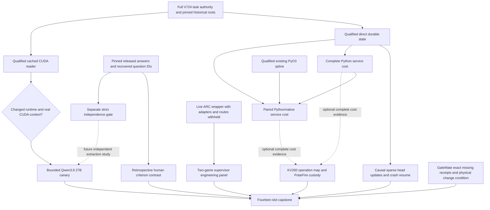
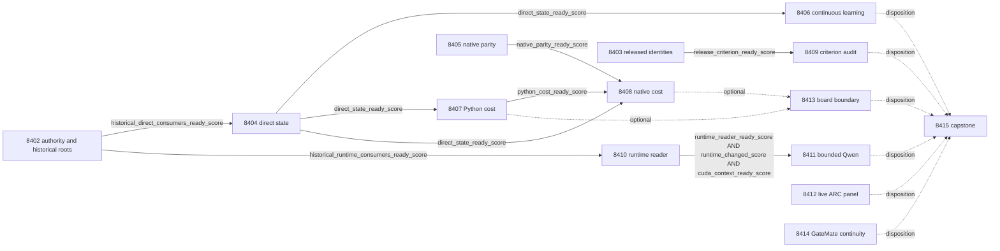

# Carnot Research Roadmap v724: Independent label criteria, recoverable online decisions, and complete native cost

**Created:** 2026-10-10

**Milestone:** 2026.10.724

**Status:** Planned; not activated or executed

**Predecessor:** 2026.10.723, Exp8388–Exp8401

**Contract:** Exactly 14 tasks, Exp8402–Exp8415, in the order below.

**Execution plan:** `research-roadmap-next.yaml`

This milestone addresses three missing links between the PRD and current evidence: independent verification targets, continuous learning that survives deployment, and measured Rust/Python service cost. It repairs specific observed prerequisites, then executes bounded comparisons. It does not reopen the exposed-development utility hypotheses or promise an independent hallucination benchmark from already opened labels.

The V723 design was preserved byte-for-byte at `openspec/change-proposals/research-roadmap-v723-preserved-20261010.md` before replacing this staging document. The active `research-roadmap.yaml` remains V723 until a separate conductor activation. A staged-plan check must compare private V724 activation bytes; it must not falsely require today's V723 active file to equal the next plan.

## What V723 established

V723 completed its fourteen scheduling slots. Its artifacts contain nine producer primaries, four pre-gate receipts and one cascade skip. Five producer primaries were disqualified. Scheduling completion is not scientific success. The completed-history archive still ended at V722 when planning began; current primaries, terminal reports and conductor logs therefore determine the V723 findings.

| Branch | Current evidence | Consequence for V724 |
|---|---|---|
| Contract, Exp8388 | Full current contract and local operands qualified; historical V722 design authority remains incomplete | Preserve that absence; isolate authentic historical fixtures instead of substituting current task objects |
| Label custody, Exp8389 | Pinned public release contains 900 answers across 300 questions; earlier manifests lack question identities; targets already opened | Recover exact source identities; separate retrospective factorial analysis from strict independent evaluation |
| Direct state, Exp8390 | Exact recovery/current authority passed; historical consumers had three failures and fifteen errors; one directory-fsync hook statement was uncovered | Repair fixture roots and exercise the genuine child hook before learning or cost measurement |
| Native parity, Exp8391 | Finite parity, compiled calls and real coverage passed; strict mypy rejected an untyped `summary` | Fix the exact annotation, preserve arithmetic and requalify current bytes |
| Learning and costs, Exp8392–8394 | Two pre-gate receipts and one cascade skip; no new learning or timing evidence | Execute only after qualified direct state, with separate readiness and benefit gates |
| Label criterion, Exp8395 | Pre-gated by the strict independence requirement | A narrower retrospective estimand can run on a complete released factorial panel; independence stays separately blocked |
| CUDA, Exp8396–8397 | Two historical V722 fixture failures; cached `cuInit=999`, cause unproved, no runtime correction or context; canary pre-gated | Qualify the reader, then require an actual changed runtime before any new probe or generation |
| ARC, Exp8398 | Historical wrapper scratch omitted a parent; sixteen errors, three passes, zero episodes | Fix provisioning without weakening assertions; run the unchanged two-game engineering panel |
| Boards, Exp8399–8400 | Board reader qualified; optional cost inputs absent. GateMate obligations recorded with no changed physical evidence | Reuse readers, preserve missing prerequisites and avoid repeated device commands |
| Capstone, Exp8401 | Five historical V721 consumer failures; fresh-worker memory repair already exists | Use isolated fixture authority and existing bounded worker replay |

Qualified Exp8361 H1=-0.00390625 and H2=0 remain closed on exposed development data. Exp8381's dyadic-logit certificate is a separate circular numerical result; it does not replace the direct SciPy policy or establish beneficial learning. Exp8259's PolarFire graduation is board-local Linux CPU dispatch, not FPGA-fabric acceleration.

## The three biggest PRD gaps

1. **Correct energy does not ensure correct extracted truth (FR-12; research-program priority 1).** The system can check encoded constraints, while source identity, label exposure and independent error measurement remain unresolved. Exp8403 recovers actual question custody; Exp8409 measures a fixed published criterion contrast. Exp8411 only tests current-model transport after CUDA changes. None substitutes for independent live extraction validation. Reopening that primary research question requires disjoint, unexposed question clusters, adequate class support and qualified current Qwen generation.
2. **Continuous adaptation is not yet a qualified durable service (FR-11).** Small-head updates exist, but current deployment recovery did not pass all required controls. Exp8402/8404 repair the concrete qualification failures; Exp8406 performs causal sparse updates through interruption and resume. Exact trajectories and honest null learning results are useful progress. Semantic benefit requires new independent evidence beyond this milestone.
3. **Finite native parity is not full service speed (FR-05/08, NFR-01).** The existing spline kernel has finite parity evidence, but copies, delayed release, state writes and fsync are missing from a qualified matched cost comparison. Exp8405/8407/8408 measure those operations. Exp8413 maps only supported work onto actual board capabilities. A 10x result in one stated host/workload cell does not establish universal NFR compliance.

## Research scan and experiment choices

The dated V724 scan was appended to `research-references.md` before these tasks were designed. It records access limits and distinguishes author results from local measurements.

| 2025–2026 source | Useful finding or limitation | Planned use |
|---|---|---|
| [The Labeling Problem in Hallucination Detection](https://arxiv.org/abs/2610.08026) and pinned LPHB release | Separate the judging criterion from prompt structure; all four factorial outputs and human targets are already public/opened here | Exp8403 authenticates joins; Exp8409 reproduces the inherited criterion contrast retrospectively |
| [Online KAN](https://arxiv.org/abs/2602.02056), v4 June 2026 | Local spline updates have a practical online and fixed-point hardware path | Exp8406 measures existing sparse coefficient writes through real durable serving; no new kernel or generator training |
| [Capacity-constrained delayed online optimization](https://arxiv.org/abs/2606.11711) | Pending feedback and release timing belong in the learner's state | Exp8406 and Exp8407/8408 account for delayed, missing, duplicated and lost feedback; no theorem is inherited |
| [FPGA–ASIC co-design for capacity-constrained Ising chips](https://arxiv.org/abs/2602.15985), September revision | Orchestration and transfer boundaries matter alongside a fast kernel | Exp8407/8408 time the full local service; Exp8413 maps measured operations before any device claim |
| [EBT](https://arxiv.org/abs/2507.02092), [ARM–EBM](https://arxiv.org/abs/2512.15605), structured verification and Ising OOD work | Motivation for energy-based reasoning; no new independent local baseline or evidence that reopens retired text lanes | Preserve as context, not a speculative new architecture task |
| [Extropic writing](https://extropic.ai/writing), [Kona](https://logicalintelligence.com/kona), [StreamingKAN repository lead](https://github.com/evilrat420/irithyll) | Product/repository leads, with unverified local capability; Extropic estimates and omitted boundaries are not Carnot measurements | Record the exact future access/kernel conditions in Exp8413; no purchase or dependency adoption |

The scan covered arXiv EBMs, neural constraint satisfaction, Ising ML, hallucination mitigation, KANs, constrained decoding, hardware sampling and continual learning. It also checked OpenReview, Hugging Face papers, GitHub trending and the requested vendors. OpenReview had access challenges; Semantic Scholar citing-paper requests for EBT and ARM–EBM did not return accessible lists. GitHub trending snapshots were stale. These are incomplete searches, not evidence of zero citations or no new work. Full links and limitations are in the references ledger.

## Architecture



The direct service boundary is request validation → feature gathering → Python/native evaluation → typed action → delayed feedback release → sparse coefficient update → serialization/file fsync → pointer publication/directory fsync → response. A prediction is immutable before its feedback can be read. Cold replay reconstructs the primitive operations outside the producer process. Generator weights stay fixed.

## Phases and execution order

### Phase 1 — Qualify independent inputs and deployment primitives (Exp8402–8405)

Exp8402 binds full task objects and freezes the methods and event tape. It repairs historical test-root provisioning using authentic original task objects while retaining every assertion. Missing independent V722 design authority stays explicitly missing. Separate direct-consumer and runtime-consumer readiness fields prevent an unrelated historical absence from being interpreted as a numerical failure.

Exp8403 joins existing raw source IDs and bytes to pinned question records, including cross-dataset identity rules. `release_criterion_ready_score` means a complete permitted 900-answer factorial panel. `disjoint_eval_ready_score` additionally requires all previous exposure/overlap obligations, at least 80 independent clusters and eight per class. Unknown identity is unknown, never zero overlap. Neither recovered identity nor public availability makes a previously opened target unseen.

Exp8404 qualifies the existing direct state through five genuine process-death barriers, seeds 11/22/33 and two pinned readers. It specifically reaches the uncovered directory-fsync hook. All previous no-loss/no-duplication/no-mixed-version assertions remain. Process death is not a power-loss test.

Exp8405 repairs the exact strict-typing defect and reruns the existing 4,174-vector finite native panel with real PyO3 calls and coverage. It does not change the kernel, tolerances or evaluation policy.

### Phase 2 — Measure continuous updates, total cost and criterion effects (Exp8406–8409)

Exp8406 is the mandated continuous self-learning experiment. It executes the existing sparse-local learning rule on three deployment variants: in-memory uninterrupted, durable uninterrupted and durable crash/resume. Each has 96 intended slots at three seeds: 864 rows, including the 22 missing source slots per stream. Genuine exits occur at slots 32 and 64. The five historical scientific control arms remain reference evidence; service variants do not replace them or reopen H2.

Exp8407 measures 27 Python cells: three workloads × batches 1/8/32 × prediction/feedback-schedule ratios 1/8/64. There is one discarded warmup and five measured repetitions per cell. Exp8408 remeasures both arms in five paired repetitions: 270 arm/cell/repeat summaries. The natural, batch-1, ratio-8 cell is primary, selected before timing.

Every cost repeat schedules eight cycles: `8*r` prediction attempts and eight designated feedback attempts. It starts with an empty queue. Each cycle designates its last prediction for feedback, released only after eight logical ticks. Eligible feedback is applied during the tape; a deterministic timed tail advances to the remaining release ticks and drains without artificial sleeps. Missing/invalid sources produce nonapplicable rows, not fabricated labels. Scheduled attempts, applied updates, pending/lost work and drain time are distinct fields. The full scheduling, drain and attempted-work cost enters the denominator.

Exp8409 evaluates the inherited criterion contrast on the four published prompt conditions, with human A1 targets primary and A2 disagreement reported. The estimand is a retrospective paired criterion effect. It is not a newly trained detector, independent evaluation, or evidence about current Qwen generation.

### Phase 3 — Qualify runtime and live supervisor execution (Exp8410–8412)

Exp8410 repairs the two observed historical authority fixture failures and qualifies the cached CUDA reader. A test repair is not a driver/runtime change. A new context/allocation/copy/free probe is permitted only after a dated, hash-bound change to driver/library/boot/namespace/device state or an explicit repair receipt. Without that evidence, report zero new probes and a blocked external branch. No driver install, GPU reset or interference with another process is authorized.

Exp8411 is the only LLM task: at most eight requests, 128 output tokens each, using `unsloth/Qwen3.8-27B-GGUF` Q4_K_M. Four fit-side sources receive two evidence views. The load is bounded at 600 seconds, each request at 180 seconds, with at least 900 seconds reserved for validation. It requires a qualified reader, a changed runtime and proven CUDA context. This is feasibility only, outside the frozen evaluation corpus.

Exp8412 repairs missing private scratch parents, preserves the historical wrapper assertions and executes the unchanged two-game panel through `make_carnot_agent(cascade=True)`. Two seeds × off/on give eight episodes, each at most 256 actions/180 seconds, window 120. No per-game adapter, memorized route, hidden source inspection, offline ground-truth BFS or LLM induction is allowed. All public levels are already registered solved. Incidental own-agent solutions retain `solve_provenance=live_agent_self_discovery`, with zero duplicate headline credit. Two games cannot justify arm-table refinement: that remains gated on at least three overlapping games and five firings per shared arm cell.

### Phase 4 — Reconcile hardware boundaries and terminal evidence (Exp8413–8415)

Exp8413 reuses the qualified board reader and maps optional complete service costs to supported operations. KV260 has quadratic Ising support, `k_max<=5`; it does not implement this spline/calibration/fsync service. PolarFire retains its terminal CPU-dispatch qualification. No device command or borrowed vendor acceleration claim is produced.

Exp8414 is mandatory GateMate continuity only: preserve exact missing source hashes and the original `0xffffffff` IDCODE. Reopening requires dated cable/port/power evidence, the expected `0x20000001`, a real n≥16 flash and a smoke transcript. No repeated `openFPGALoader` call or invented source reconstruction belongs in this task.

Exp8415 always runs. It accounts for fourteen slots, resolves actual pre-gate filenames, replays eligible independent branches and retains every failure. It uses fresh workers with the existing 1,500 MiB peak / 500 MiB growth limits. It reports stable publication gates without turning old paper readiness into new science. Missing external prerequisites use `blocked`, not retryable `partial`.

## Dependency graph and exact gate fields

Solid arrows are conductor pre-gates, all `== 1`. Every gate field is declared verbatim in its producer's REQUIRED ARTIFACT FIELDS. Dotted arrows are optional evidence or unconditional reconciliation, not execution gates.



Exp8402 seals independently qualified direct/runtime family receipts. Validation of its administrative reader checks that it preserves every historical outcome faithfully. A failed historical family remains failed and zeros its own readiness; it is not silently passed or confused with a failing test of the new classification code. Downstream consumers authenticate the family receipt and administrative source. Owned custody/reader validation failure disqualifies the entire source. Missing external historical authority remains blocked and cannot be fabricated to make a gate pass.

The capstone has no `gated_on` condition. Board operation mapping always records unavailable optional costs. CUDA's three gates require a real environment change as well as reader correctness and a successful current context. No gate uses prose verdict equality, an undeclared alias, a future task, or a retired task dependency.

## Frozen measurement and claim rules

- **Continuous learning:** delay 8; learning rate 0.01; gradient `(p-y)/T`; norm cap 1; coefficient bounds [-4,4]; fixed intercept, temperature, knots and holistic slope. Retention checkpoints 0/32/64/96; no future targets or mutable issued predictions. The CPU sparse-write path is available now. FPGA fixed-point learning remains a future supported-kernel requirement.
- **Cost:** complete prediction throughput is total completed prediction decisions divided by total complete-cycle wall time, including delayed release, tail draining, failed attempts, copies and durable writes. Record individual stages and intended/completed/failed/censored units. Five timing repeats are not independent source problems. Bootstrap whole repeat blocks 10,000 times (Python seed 7248407; paired native/Python seed 7248408). Intervals are descriptive on this host. Native readiness can be 1 when its primary 95% lower speed-ratio bound fails to exceed 10 and `nfr01_local_cell_met=0`.
- **Labels:** retain 900 intended answers, 300 question clusters, generator and answer hashes, A1=0 correct / A1=1 hallucination / A1=-1 missing. Use paired eligible answers and preserve all missing cells. Criterion effect is `0.5*((FPR_p1-FPR_p2t)+(FPR_p1s-FPR_p2))` among human-correct answers. Cluster bootstrap 10,000 times with inherited seed 7238388; a lower 95% bound above zero supports the fixed positive contrast. Report null/negative effects, A2 reliability and worst-case missing-output bounds. Audit readiness does not require a positive effect. No post-hoc condition winner becomes the primary contrast.
- **Evidence:** all tasks emit per-unit rows, primitive hashes, exact invocation counts, source paths, current code hashes and typed gate operands. Preserve failed, censored and missing rows. `gate_check_summary` records observed versus expected values and distinguishes absent files from zero scores. `verdict_class` is one of positive, circular_positive, null, blocked, disqualified, partial. Oracle-based positives are circular; `partial` is reserved for retryable unfinished owned work.
- **Publication:** use unchanged primary-publication and adversarial/row-consistency checks; retain all findings. Independently recomputed informational findings can use existing typed consumers. Unresolved warning/critical findings block readiness. No new whitelist, validator weakening, synthetic coverage shard, elapsed-time padding, claimed device execution from mocks, or changed acceptance threshold is permitted.

## Hardware, resources and execution discipline

| Resource | Required use | Gate or limit |
|---|---|---|
| Existing CPU/RAM and disk-backed private scratch | Custody, direct state, sparse online learning, paired cost, ARC and cold replay | Measure free memory/disk first; use fresh bounded children; fsync must reach real disk-backed storage |
| Existing Rust/PyO3 toolchain | Rebuild and qualify the shipped native spline | Actual compiled calls, exact ABI/toolchain/hash and copying cost; no replacement kernel |
| Existing dual RTX 3090 installation and cached Qwen GGUF | Only Exp8410 conditional probe and Exp8411 bounded canary | No current usability inferred from an old hardware inventory; exclusive lease, real runtime delta and measured CUDA context/offload |
| `unsloth/Qwen3.8-27B-GGUF` Q4_K_M | Every current LLM invocation (Exp8411) | Required MODEL_SPECS; `model_bounded_generation`, 10-second floor; no legacy small-model headline |
| KV260 | Existing evidence and exact operation map only | Quadratic Ising, k≤5; no spline/calibration/fsync implementation inferred; zero device commands |
| PolarFire | Preserve qualified Exp8259 workload custody | Board-local Linux CPU scope remains terminal; no new fabric claim |
| GateMate | Preserve supplied physical/source receipts only | Zero device commands; exact change/IDCODE/flash/smoke conditions remain external |
| Extropic/other wishlist substrates | Source review only | No authenticated access, no local execution or speed estimate; no purchase needed |

The other thirteen tasks have `MODEL_SPECS: []` and `no_model_load`. Numeric head updates and cached historical model outputs are not current LLM loads. `model_load_no_generation` has a 2-second floor; `model_full_generation` has a 60-second floor and is reserved for real full-generation tasks. A short canary must never be relabeled full generation. Interrupted canaries retain their actual stage and zero-token counts where appropriate.

Every task includes a numbered requirement for flushed progress at phase boundaries and before/after model loads, generation, benchmarks and subprocesses. Children are polled at least every 60 seconds, and long loops emit counts. Output gaps remain below 600 seconds even during synthesis. Large files are written in several calls of about 150 lines with a progress message between calls. Each call has its own timeout within the 4,800-second task cap. These are execution requirements, not permission to fabricate progress or duration.

Estimated sequential task budgets total **685 minutes** if all branches execute. These are limits/estimates, not measured runtime. Pre-gates avoid the LLM-agent call for unavailable branches. Opus/100-turn routing is limited to historical authority, direct-state coordination, runtime qualification and capstone. Formulaic source joins, typing/native qualification and matched benchmarking use Codex `gpt-6.1-sol`; other tasks retain routine Claude defaults. No Luna task makes experimental claims. Exp8413/8414 have 20-turn budgets.

## Specs, validation and reconciliation

Existing driving capabilities are `openspec/capabilities/research-reporting/spec.md`, `verification/spec.md`, and the relevant learning/native/hardware specifications already referenced by those implementations. Existing REQ-REPORT-7837 and REQ-REPORT-7891-V685 anchor contract and authority validation. Direct recovery maps to REQ-VERIFY-8376 and REQ-REPORT-8390; native qualification to REQ-REPORT-8391; trajectories to REQ-VERIFY-8348; utility guardrails to REQ-VERIFY-8210; ARC to REQ-VERIFY-8398; capstone authority to REQ-REPORT-8401. Each executing task adds or extends its own REQ-* and SCENARIO-* before implementation, writes focused failing tests, and preserves the previous assertions.

Execution requires scoped unit/real-CLI tests, Ruff check/format, strict mypy, traced spec coverage and genuine 100% newly owned statement coverage, including child paths. E2E-018 covers authority lifecycle; E2E-019 covers label joins; E2E-020 covers direct recovery; E2E-021 covers restricted utility; the canary uses E2E-022 recorder/replay controls. ARC uses its actual bounded public wrapper. The same full repository suite is not repeated inside each task; global health is reported separately. Current planning changes no implementation code or runtime specifications.

Prior-failure entries preserve actual historical verdicts, state the concrete changed prerequisite/technique, and set `retire_if_same_verdict: true`. Do not retire an unmeasured scientific hypothesis because an external gate prevented execution. Standing hardware/capstone scope overrides cite the existing operator directives; no fresh authorization is invented. Future retirement appends require exact substantive scope/verdict matching and preserved manifest prefix bytes. The planning pass itself does not change the exclusion manifest.

After each experiment, reconcile `openspec/`, `_bmad/traceability.md`, `ops/status.md` and `ops/changelog.md` with the actual outcome. Preserve all historical primaries and protocols. Deferred priorities are independent live extraction, HumanEval benefit, unexposed continual-learning benefit, FPGA spline acceleration and new TSU access. Each needs changed evidence; none is satisfied by this milestone's engineering readiness.

### Planning validation

Planning checks are in progress. This section will record their actual outcomes before delivery.

## Exact task contract

The visible table, complete machine task objects and staged YAML are one contract: **14 tasks, Exp8402 through Exp8415, in this exact order**. All prompts, metadata, models, gates, prior failures and routing belong to the full-object comparison. Digest serialization is UTF-8 `json.dumps(tasks, sort_keys=True, separators=(",", ":"))`. A planning mutation test must reject a dropped/reordered task, changed field, model, gate, prompt, retirement flag or routing value. Active V723 is not modified to run this check.

Canonical full-task SHA256: `82778c8abdbdbf2a69db3c7382e054515098e71056bb91d4521afe47792b2c34`

| Order | id | title | phase | deliverable |
|---|---|---|---|---|
| 1 | exp8402-historical-consumer-roots | Bind fourteen tasks and repair historical consumer input isolation | 1 | results/experiment_8402_v724_historical_consumer_roots.json |
| 2 | exp8403-released-question-identity | Recover source question identities and qualify the released factorial panel | 1 | results/experiment_8403_v724_released_question_identity.json |
| 3 | exp8404-direct-state-qualification | Qualify direct state after immutable consumer and barrier coverage repairs | 1 | results/experiment_8404_v724_direct_state_qualification.json |
| 4 | exp8405-native-parity-qualification | Qualify the existing native spline binding after the exact typing repair | 1 | results/experiment_8405_v724_native_parity_qualification.json |
| 5 | exp8406-continuous-direct-learning | Measure causal small-head updates through durable direct serving | 2 | results/experiment_8406_v724_continuous_direct_learning.json |
| 6 | exp8407-python-transaction-cost | Measure complete durable Python transactions with fixed work units | 2 | results/experiment_8407_v724_python_transaction_cost.json |
| 7 | exp8408-native-transaction-cost | Compare complete Python and Rust transactions in paired timing blocks | 2 | results/experiment_8408_v724_native_transaction_cost.json |
| 8 | exp8409-retrospective-label-criterion | Reproduce the frozen factuality criterion contrast on released human labels | 2 | results/experiment_8409_v724_retrospective_label_criterion.json |
| 9 | exp8410-cuda-reader-qualification | Qualify cached CUDA causal evidence and admit only a changed runtime probe | 3 | results/experiment_8410_v724_cuda_reader_qualification.json |
| 10 | exp8411-bounded-qwen-canary | Run a bounded Qwen evidence canary after actual CUDA recovery | 3 | results/experiment_8411_v724_bounded_qwen_canary.json |
| 11 | exp8412-arc-panel-qualification | Measure adapter-withheld live-wrapper transfer after scratch isolation repair | 3 | results/experiment_8412_v724_arc_panel_qualification.json |
| 12 | exp8413-board-operation-boundary | Map qualified transaction costs to KV260 and preserve PolarFire terminal scope | 4 | results/experiment_8413_v724_board_operation_boundary.json |
| 13 | exp8414-gatemate-obligation | Preserve the GateMate physical obligation with bounded evidence-only continuity | 4 | results/experiment_8414_v724_gatemate_obligation.json |
| 14 | exp8415-capstone | Reconcile fourteen terminal outcomes with immutable historical consumers | 4 | results/experiment_8415_v724_capstone.json |

The following complete JSON mirrors the YAML tasks, not an aspirational subset.

<!-- V724_TASK_CONTRACT_START -->
```json
{
  "milestone": "2026.10.724",
  "tasks": [
    {"id": "exp8402-historical-consumer-roots", "title": "Bind fourteen tasks and repair historical consumer input isolation", "phase": 1, "track": "infrastructure", "priority": "high", "requires_gpu": false, "max_turns": 100, "estimated_wall_time_min": 65, "per_unit_rows": true, "milestone": "2026.10.724", "deliverable": "results/experiment_8402_v724_historical_consumer_roots.json", "inference_substrate_class": "no_model_load", "MODEL_SPECS": [], "gated_on": [], "model": "opus", "prior_failures": [{"experiment_id": "exp8374-contract-methods", "verdict": "complete_blocked_direct_contract_methods", "addressed_by": "V723 supplies the missing full design/table/digest and tests blocked historical receipts without reconstructing absent V722 authority.", "retire_if_same_verdict": true}, {"experiment_id": "exp8318-contract-replay", "verdict": "complete_disqualified_contract_replay", "addressed_by": "Use bounded immutable source aliases and independently qualify current inputs; no recursive historical success gate.", "retire_if_same_verdict": true}, {"experiment_id": "exp8388-contract-methods", "verdict": "complete_blocked_v723_contract_methods", "addressed_by": "Current V723 contract and historical replay already qualified. Repair the newly identified mutable V721/V722 fixture roots, with unrelated-current-file regressions; missing V722 independent authority stays blocked.", "retire_if_same_verdict": true}], "prompt": "CONTEXT:\nWork in {project_root} on {date}. V723 completed fourteen slots: nine producer primaries, four pre-gate receipts and one cascade skip. Five primaries were disqualified. Historical consumers read changing roadmap files; direct state missed one coverage statement, native qualification failed strict typing, and ARC scratch omitted a parent directory. Human labels exist but question overlap is unknown. Preserve all old receipts and frozen V717/V721/V722/V723 protocols. Qualified exposed-development H1=-0.00390625 and H2=0 remain closed. A new engineering qualification cannot turn those nulls into semantic benefit.\nEXISTING CODE TO READ FIRST:\nCLAUDE.md; CODEX.md; ops/e2e-test-plan.md; ops/exclusion_manifest.yaml; openspec/capabilities/research-reporting/spec.md; openspec/capabilities/verification/spec.md; scripts/experiment_template.py; python/carnot/reporting/primary_publication.py; openspec/change-proposals/research-roadmap-vNEXT.md; python/carnot/reporting/roadmap_contract.py; python/carnot/reporting/v723_contract_methods.py; python/carnot/reporting/v721_capstone_evidence.py; tests/python/test_local_consumer_qualification_8347.py; tests/python/test_threshold_guard_8362.py; tests/python/test_v722_contract_methods_8374.py; results/experiment_8388_v723_contract_methods.json; results/experiment_8390_v723_direct_state_qualification.json; results/experiment_8396_v723_cuda_failure_cause.json; results/experiment_8401_v723_capstone.json; openspec/change-proposals/v723-service-and-label-protocol.json; research-references.md; ops/known-issues.md\nTASK:\nBind fourteen tasks and repair historical consumer input isolation. Deliver results/experiment_8402_v724_historical_consumer_roots.json. Create thin runner scripts/experiments/experiment_8402_v724_historical_consumer_roots.py. Keep primitive evidence in results/raw/experiment_8402_v724_historical_consumer_roots/. Future producer paths are dependencies, not existing inputs.\nCONCRETE STEPS:\n1. PRECONDITIONS: Print a flushed start line. Authenticate this task and the complete current design. Verify exact input hashes, tools, private disk-backed scratch, available memory and deadlines. Name absent external inputs in gate_check_summary before stopping measurement. Never fabricate observations.\n2. Print a flushed progress line at each phase boundary and before and after every model load, generation, benchmark and subprocess. Emit completed/pending counts inside long loops. Poll owned children at least every 60 seconds. Keep every output gap below 600 seconds, including synthesis. Use unbuffered output and bounded calls inside the 4800-second task cap. Write any file over about 200 lines in several tool calls of at most about 150 lines. Send a progress message between calls. Never use one huge write or pad elapsed time.\n3. Spec first: add relevant REQ-* and SCENARIO-* before implementation. Write focused failing tests first. Preserve existing assertions and thresholds. Reuse shipped modules through small adapters. Put runners in scripts/experiments/, tests in tests/python/, and throwaway probes in /tmp. Freeze validation commands before measurement. Do not modify research-roadmap.yaml. Accept {date} in the new runner; preserve historical date contracts.\n4. Declare inference_substrate_class=no_model_load and MODEL_SPECS=[]. Record zero current LLM loads and generation calls. Use aggregation_from_upstream_artifacts for readers, verifier_ensemble_against_cached_candidates for numeric learning, or the named no-LLM ARC runtime substrate. Cached model names belong in historical_model_provenance. Small numeric heads are not LLM loads.\n5. Bind exactly fourteen full task objects, Exp8402 through Exp8415, to the visible table and canonical digest. Freeze current authority separately from preserved historical authority. Publish methods at openspec/change-proposals/v724-qualified-service-protocol.json and docs/research-notes/v724-methods.md before measurements. Preserve all earlier protocols byte-for-byte.\n6. Reproduce the V723 historical failures from actual logs: Exp8390 had three failures and fifteen errors in V721 consumers; Exp8396 failed two V722 authority mutations; Exp8401 failed five V721 consumers. Historical tests read current active/staged/vNEXT files. Build immutable fixture roots from independently pinned preserved designs and original task objects. Never invent the missing V722 design or replace it with V723 authority.\n7. Repair fixture provisioning and explicit root injection while preserving every original assertion. For fixtures that synthesize V722 authority, use authentic V722 task objects rather than current YAML. Mark authentic missing historical authority blocked. Change only dependency access, not validators, historical science, expected verdicts or acceptance thresholds. Avoid recursive replay of every previous milestone.\n8. Run the original historical tests twice in bounded isolated children: first with pinned historical inputs, then with unrelated valid current roadmap/design bytes in the private root. Keep identical test node IDs and assertions. Add rehashed task, source-alias, missing design and wrong-root negative controls. Emit separate historical_direct_consumers_ready_score and historical_runtime_consumers_ready_score; one failed family must not block the other.\n9. Seal separate family receipts for direct and runtime historical consumers, with exact commands, assertions, exits, source hashes and terminal hashes. The administrative reader must faithfully classify passing and failing family outcomes. Its own required_checks_passed covers current contract, custody and classification tests; a measured failed historical family remains a failed branch, never a passed test. A failed family zeros only its family score. Overall class is blocked when an external family is unavailable; owned reader/custody failure disqualifies all scores. Exp8404 and Exp8410 authenticate both the qualified administrative receipt and their independently sealed family receipt. Never suppress a failed assertion or alter validator policy.\n10. Freeze three service variants for the existing sparse_local learner: in_memory_uninterrupted, durable_uninterrupted, durable_crash_resume. This is a deployment axis, not replacement of the five frozen scientific controls. Freeze 864 stream slots, full cost estimand and event tape, and the inherited V723 factorial contrast. Cost repeats schedule 8*r predictions and eight feedback attempts; designate the last prediction in each cycle, release its feedback only after eight logical ticks, and include a deterministic timed tail drain. Missing or invalid sources never yield fabricated updates. Preserve issued/released/applied/missing/pending/lost counts. Label the released panel retrospective because Exp8389 opened targets. Run private E2E-018/E2E-021 and the unchanged historical consumers. Record scope_reduction_compliance and unresolved operator-only priorities.\n11. Run scoped unit and real consumer/CLI checks. Run Ruff check/format, strict mypy and scripts/check_spec_coverage.py --files <owned-test-files>. Require 100 percent newly owned statements, including failure and real child paths. Use pytest -n 0 -o addopts= --no-cov with private disk-backed scratch and genuine Coverage.py child shards. Record exact commands, exits, duration and log hashes. Run the named applicable private E2E checks. Keep global repository health separate; do not launch the full repository suite in every task.\n12. Cold-replay primitive rows in a fresh bounded process. Exercise positive, missing-input, deliberate-error and self-consistently rehashed tamper controls. Use unchanged primary_publication, scripts/adversarial_verify.py --json <private-candidate> and scripts/verdict_row_consistency_lint.py --strict <private-candidate>. Retain every finding. Only an existing typed consumer may resolve independently recomputed informational findings. Unknown, warning and critical findings block readiness. Do not alter validators or exemptions. Publish checked terminal bytes atomically. Owned validation failure is disqualified; unchanged external absence is blocked. Reserve partial for retryable unfinished owned work. Reconcile openspec/, _bmad/traceability.md, ops/status.md and ops/changelog.md. Do not update generator weights or publish externally.\nREQUIRED ARTIFACT FIELDS:\nexperiment_id, task_id, milestone, run_date: principle: Bind the receipt to the actual invocation and task authority.\nhonest_verdict, verdict_class: principle: Use a complete_ terminal verdict. Closed class: positive | circular_positive | null | blocked | disqualified | partial. External absence is blocked, never partial.\ngate_check_summary: principle: For blocked_* or complete_blocked_* verdicts, name the check, upstream, path/hash, field, operator, expected and observed values. Absence differs from zero.\ninference_substrate, inference_substrate_class, MODEL_SPECS, model_invocation_counts, historical_model_provenance: principle: Separate current LLM work, cached signals and numeric heads.\nrows, intended_count, completed_count, failed_count, censored_count, excluded_count, independent_count, sample_size_budget: principle: Preserve every intended unit and arm, its metric and missing reason. Timing repetitions and seeds do not increase independent source counts.\nverifier_is_oracle, exposure_scope, independent_generalization_score, generalized_learning_benefit_score: principle: Oracle-checked positives use circular_positive. Exposed data, feasibility and deployment fidelity keep generalization scores zero.\nrequired_checks_passed, flagged_adversarial, acceptance_gates, validation_receipts, terminal_validation_sidecar_path, adversarial_findings: principle: Passing checks establishes qualification, not scientific benefit.\npreconditions_checked, duration_s, phase_spans, random_seed, reproducibility_checksum, source_artifact_hashes, code_config_hashes, raw_shard_hashes: principle: Recompute measurements from sealed operands.\ncited_upstream_artifacts, field_principles: principle: Name imported fields and producer hashes. Explain every added field.\ncurrent_contract_ready_score, historical_direct_consumers_ready_score, historical_runtime_consumers_ready_score, historical_family_receipts: principle: Readiness names the independently passing family and never requires unavailable V722 authority.\ncanonical_tasks_sha256, historical_fixture_hashes, current_file_substitution_rows, consumer_node_ids, missing_historical_authority, frozen_protocol_path, scope_reduction_compliance: principle: Immutable dependency roots must survive current roadmap rotation without changing historical verdicts.\nRun command: cd {project_root} && PYTHONPATH=python:. PYTHONUNBUFFERED=1 .venv/bin/python -u scripts/experiments/experiment_8402_v724_historical_consumer_roots.py --date {date}\nDo NOT push. Do NOT modify scripts/research_conductor.py.\n"},
    {"id": "exp8403-released-question-identity", "title": "Recover source question identities and qualify the released factorial panel", "phase": 1, "track": "research", "priority": "high", "requires_gpu": false, "max_turns": 50, "estimated_wall_time_min": 45, "per_unit_rows": true, "milestone": "2026.10.724", "deliverable": "results/experiment_8403_v724_released_question_identity.json", "inference_substrate_class": "no_model_load", "MODEL_SPECS": [], "gated_on": [], "agent_type": "codex", "model": "gpt-6.1-sol", "prior_failures": [{"experiment_id": "exp8375-external-evidence-readiness", "verdict": "complete_blocked_external_evidence_readiness", "addressed_by": "Change the corpus to the newly discovered author-released LPHB CSV with human response labels; old OpenHalDet and sufficiency lanes remain blocked.", "retire_if_same_verdict": true}, {"experiment_id": "exp8389-human-label-custody", "verdict": "complete_blocked_human_label_custody", "addressed_by": "Read authenticated raw source IDs and source bytes rather than summary manifests. Separate retrospective factorial readiness from unchanged strict independence requirements; unknown prior exposure remains blocked.", "retire_if_same_verdict": true}], "prompt": "CONTEXT:\nWork in {project_root} on {date}. V723 completed fourteen slots: nine producer primaries, four pre-gate receipts and one cascade skip. Five primaries were disqualified. Historical consumers read changing roadmap files; direct state missed one coverage statement, native qualification failed strict typing, and ARC scratch omitted a parent directory. Human labels exist but question overlap is unknown. Preserve all old receipts and frozen V717/V721/V722/V723 protocols. Qualified exposed-development H1=-0.00390625 and H2=0 remain closed. A new engineering qualification cannot turn those nulls into semantic benefit.\nEXISTING CODE TO READ FIRST:\nCLAUDE.md; CODEX.md; ops/e2e-test-plan.md; ops/exclusion_manifest.yaml; openspec/capabilities/research-reporting/spec.md; openspec/capabilities/verification/spec.md; scripts/experiment_template.py; python/carnot/reporting/primary_publication.py; openspec/change-proposals/research-roadmap-vNEXT.md; python/carnot/reporting/human_label_custody_8389.py; python/carnot/reporting/human_label_custody_runner_8389.py; python/carnot/verify/cached_sentence_custody_8305.py; results/experiment_8389_v723_human_label_custody.json; results/experiment_8305_v717_cached_sentence_custody.json; results/experiment_8375_v722_external_evidence_readiness.json; data/ragtruth/source_info.jsonl; research-references.md\nTASK:\nRecover source question identities and qualify the released factorial panel. Deliver results/experiment_8403_v724_released_question_identity.json. Create thin runner scripts/experiments/experiment_8403_v724_released_question_identity.py. Keep primitive evidence in results/raw/experiment_8403_v724_released_question_identity/. Future producer paths are dependencies, not existing inputs.\nCONCRETE STEPS:\n1. PRECONDITIONS: Print a flushed start line. Authenticate this task and the complete current design. Verify exact input hashes, tools, private disk-backed scratch, available memory and deadlines. Name absent external inputs in gate_check_summary before stopping measurement. Never fabricate observations.\n2. Print a flushed progress line at each phase boundary and before and after every model load, generation, benchmark and subprocess. Emit completed/pending counts inside long loops. Poll owned children at least every 60 seconds. Keep every output gap below 600 seconds, including synthesis. Use unbuffered output and bounded calls inside the 4800-second task cap. Write any file over about 200 lines in several tool calls of at most about 150 lines. Send a progress message between calls. Never use one huge write or pad elapsed time.\n3. Spec first: add relevant REQ-* and SCENARIO-* before implementation. Write focused failing tests first. Preserve existing assertions and thresholds. Reuse shipped modules through small adapters. Put runners in scripts/experiments/, tests in tests/python/, and throwaway probes in /tmp. Freeze validation commands before measurement. Do not modify research-roadmap.yaml. Accept {date} in the new runner; preserve historical date contracts.\n4. Declare inference_substrate_class=no_model_load and MODEL_SPECS=[]. Record zero current LLM loads and generation calls. Use aggregation_from_upstream_artifacts for readers, verifier_ensemble_against_cached_candidates for numeric learning, or the named no-LLM ARC runtime substrate. Cached model names belong in historical_model_provenance. Small numeric heads are not LLM loads.\n5. Reuse the pinned author release already acquired by Exp8389; verify its git blobs and SHA256 before reading. Preserve 900 intended response rows and all 300 question clusters. Do not regenerate labels, call a judge, download models or choose a new corpus. Read the dated V724 literature note and the primary paper methods.\n6. Recover the Exp8305 source IDs and raw source_bytes from its hash-bound measurement.bundle.slots. Join those IDs to the RAGTruth source_info.jsonl pinned by Exp8375. Check source hashes independently before reading source_info.question. Traverse only typed references. Never treat a hash of whole source bytes as a question hash.\n7. Join dataset-qualified original IDs plus NFKC/casefold/whitespace-normalized question hashes. Bare qid matches across datasets are invalid. Preserve missing identities and cross-dataset duplicates. Exp8375 multi_hop_qa with an empty local_corpus_references list remains unknown exposure; do not infer disjointness. Record exact-match coverage separately from semantic or training contamination.\n8. Publish two distinct gates. release_criterion_ready_score=1 requires permitted pinned bytes, all 900 rows accounted for, unique correctly joined item/question/generator/text hashes, factuality target mapping and complete p1/p1s/p2t/p2 outputs. disjoint_eval_ready_score=1 additionally requires every old overlap obligation resolved, at least 80 disjoint question clusters and eight per class. Preserve the old independent gate; the new gate only enables a retrospective within-release audit.\n9. Write docs/research-notes/v724-label-custody.md with source, generator, target and exposure boundaries. Test swapped generators, same qid in different datasets, Unicode aliases, missing identities, changed label columns and rehashed joins. Run private E2E-018/E2E-019. No fitted Carnot model is evaluated by this task.\n10. Run scoped unit and real consumer/CLI checks. Run Ruff check/format, strict mypy and scripts/check_spec_coverage.py --files <owned-test-files>. Require 100 percent newly owned statements, including failure and real child paths. Use pytest -n 0 -o addopts= --no-cov with private disk-backed scratch and genuine Coverage.py child shards. Record exact commands, exits, duration and log hashes. Run the named applicable private E2E checks. Keep global repository health separate; do not launch the full repository suite in every task.\n11. Cold-replay primitive rows in a fresh bounded process. Exercise positive, missing-input, deliberate-error and self-consistently rehashed tamper controls. Use unchanged primary_publication, scripts/adversarial_verify.py --json <private-candidate> and scripts/verdict_row_consistency_lint.py --strict <private-candidate>. Retain every finding. Only an existing typed consumer may resolve independently recomputed informational findings. Unknown, warning and critical findings block readiness. Do not alter validators or exemptions. Publish checked terminal bytes atomically. Owned validation failure is disqualified; unchanged external absence is blocked. Reserve partial for retryable unfinished owned work. Reconcile openspec/, _bmad/traceability.md, ops/status.md and ops/changelog.md. Do not update generator weights or publish externally.\nREQUIRED ARTIFACT FIELDS:\nexperiment_id, task_id, milestone, run_date: principle: Bind the receipt to the actual invocation and task authority.\nhonest_verdict, verdict_class: principle: Use a complete_ terminal verdict. Closed class: positive | circular_positive | null | blocked | disqualified | partial. External absence is blocked, never partial.\ngate_check_summary: principle: For blocked_* or complete_blocked_* verdicts, name the check, upstream, path/hash, field, operator, expected and observed values. Absence differs from zero.\ninference_substrate, inference_substrate_class, MODEL_SPECS, model_invocation_counts, historical_model_provenance: principle: Separate current LLM work, cached signals and numeric heads.\nrows, intended_count, completed_count, failed_count, censored_count, excluded_count, independent_count, sample_size_budget: principle: Preserve every intended unit and arm, its metric and missing reason. Timing repetitions and seeds do not increase independent source counts.\nverifier_is_oracle, exposure_scope, independent_generalization_score, generalized_learning_benefit_score: principle: Oracle-checked positives use circular_positive. Exposed data, feasibility and deployment fidelity keep generalization scores zero.\nrequired_checks_passed, flagged_adversarial, acceptance_gates, validation_receipts, terminal_validation_sidecar_path, adversarial_findings: principle: Passing checks establishes qualification, not scientific benefit.\npreconditions_checked, duration_s, phase_spans, random_seed, reproducibility_checksum, source_artifact_hashes, code_config_hashes, raw_shard_hashes: principle: Recompute measurements from sealed operands.\ncited_upstream_artifacts, field_principles: principle: Name imported fields and producer hashes. Explain every added field.\nrelease_criterion_ready_score, disjoint_eval_ready_score, release_commit, release_blob_hashes, target_mapping, question_identity_rows, overlap_unknown_count, exact_overlap_count, disjoint_cluster_count, class_support: principle: Within-release paired analysis and independent evaluation have different evidence requirements.\nfactorial_join_rows, prior_source_custody, exposure_ledger, human_targets_previously_opened: principle: Recovered identities do not make already opened targets unseen.\nRun command: cd {project_root} && PYTHONPATH=python:. PYTHONUNBUFFERED=1 .venv/bin/python -u scripts/experiments/experiment_8403_v724_released_question_identity.py --date {date}\nDo NOT push. Do NOT modify scripts/research_conductor.py.\n"},
    {"id": "exp8404-direct-state-qualification", "title": "Qualify direct state after immutable consumer and barrier coverage repairs", "phase": 1, "track": "research", "priority": "high", "requires_gpu": false, "max_turns": 100, "estimated_wall_time_min": 60, "per_unit_rows": true, "milestone": "2026.10.724", "deliverable": "results/experiment_8404_v724_direct_state_qualification.json", "inference_substrate_class": "no_model_load", "MODEL_SPECS": [], "gated_on": [{"upstream": "exp8402-historical-consumer-roots", "artifact_field": "historical_direct_consumers_ready_score", "op": "==", "value": 1}], "model": "opus", "prior_failures": [{"experiment_id": "exp8376-direct-atomic-state", "verdict": "complete_blocked_direct_atomic_state", "addressed_by": "The complete V723 authority is present; retain shipped crash controls and requalify state without the historically missing design dependency.", "retire_if_same_verdict": true}, {"experiment_id": "exp8363-atomic-table-state", "verdict": "blocked_gate_check_failed", "addressed_by": "Use shipped direct evaluation without the unproved SciPy table certificate; current authority and exact recovery are explicit prerequisites.", "retire_if_same_verdict": true}, {"experiment_id": "exp8390-direct-state-qualification", "verdict": "complete_disqualified_direct_state_qualification", "addressed_by": "Exp8402 supplies isolated historical consumers; genuine child coverage reaches the exact missing directory-fsync hook without relaxing 100 percent coverage.", "retire_if_same_verdict": true}], "prompt": "CONTEXT:\nWork in {project_root} on {date}. V723 completed fourteen slots: nine producer primaries, four pre-gate receipts and one cascade skip. Five primaries were disqualified. Historical consumers read changing roadmap files; direct state missed one coverage statement, native qualification failed strict typing, and ARC scratch omitted a parent directory. Human labels exist but question overlap is unknown. Preserve all old receipts and frozen V717/V721/V722/V723 protocols. Qualified exposed-development H1=-0.00390625 and H2=0 remain closed. A new engineering qualification cannot turn those nulls into semantic benefit.\nEXISTING CODE TO READ FIRST:\nCLAUDE.md; CODEX.md; ops/e2e-test-plan.md; ops/exclusion_manifest.yaml; openspec/capabilities/research-reporting/spec.md; openspec/capabilities/verification/spec.md; scripts/experiment_template.py; python/carnot/reporting/primary_publication.py; openspec/change-proposals/research-roadmap-vNEXT.md; python/carnot/reporting/direct_state_qualification_8390.py; python/carnot/verify/direct_atomic_state_8376.py; tests/python/test_direct_state_qualification_8390.py; results/experiment_8390_v723_direct_state_qualification.json\nTASK:\nQualify direct state after immutable consumer and barrier coverage repairs. Deliver results/experiment_8404_v724_direct_state_qualification.json. Create thin runner scripts/experiments/experiment_8404_v724_direct_state_qualification.py. Keep primitive evidence in results/raw/experiment_8404_v724_direct_state_qualification/. Future producer paths are dependencies, not existing inputs.\nCONCRETE STEPS:\n1. PRECONDITIONS: Print a flushed start line. Authenticate this task and the complete current design. Verify exact input hashes, tools, private disk-backed scratch, available memory and deadlines. Name absent external inputs in gate_check_summary before stopping measurement. Never fabricate observations.\n2. Print a flushed progress line at each phase boundary and before and after every model load, generation, benchmark and subprocess. Emit completed/pending counts inside long loops. Poll owned children at least every 60 seconds. Keep every output gap below 600 seconds, including synthesis. Use unbuffered output and bounded calls inside the 4800-second task cap. Write any file over about 200 lines in several tool calls of at most about 150 lines. Send a progress message between calls. Never use one huge write or pad elapsed time.\n3. Spec first: add relevant REQ-* and SCENARIO-* before implementation. Write focused failing tests first. Preserve existing assertions and thresholds. Reuse shipped modules through small adapters. Put runners in scripts/experiments/, tests in tests/python/, and throwaway probes in /tmp. Freeze validation commands before measurement. Do not modify research-roadmap.yaml. Accept {date} in the new runner; preserve historical date contracts.\n4. Declare inference_substrate_class=no_model_load and MODEL_SPECS=[]. Record zero current LLM loads and generation calls. Use aggregation_from_upstream_artifacts for readers, verifier_ensemble_against_cached_candidates for numeric learning, or the named no-LLM ARC runtime substrate. Cached model names belong in historical_model_provenance. Small numeric heads are not LLM loads.\n5. Read Exp8390 original failure logs. Exact recovery and current authority passed, but historical consumers failed and the directory_fsync hook at line96 lacked coverage. Require Exp8402 historical_direct_consumers_ready_score=1 from its actual deliverable and its independent historical-family receipt before new qualification.\n6. Keep the shipped DirectStore and five crash barriers: temporary_write, file_fsync, pointer_publication, directory_fsync, acknowledgment. Add a failing genuine child test that reaches the uncovered post-pointer directory fsync hook. Preserve all prior kill and corruption assertions. Use immutable historical fixtures from Exp8402, never the live vNEXT file.\n7. Execute all five barrier kills for seeds11/22/33, plus two pinned concurrent readers. Reopen from disk and compare complete coefficients, issued predictions, pending feedback, applied IDs and cursor against uninterrupted state. Require zero mixed reads, lost acknowledged updates, duplicate updates, issued-prediction changes and recovery mismatches. No power-loss certification follows from process kills.\n8. Cold-replay original controls and fresh primitive crash rows. Run private E2E-018/E2E-020 with unchanged historical assertions. Require genuine 100 percent current owned coverage and complete current contract before direct_state_ready_score=1. Preserve Exp8390 disqualification in place; publish a separate current receipt.\n9. Run scoped unit and real consumer/CLI checks. Run Ruff check/format, strict mypy and scripts/check_spec_coverage.py --files <owned-test-files>. Require 100 percent newly owned statements, including failure and real child paths. Use pytest -n 0 -o addopts= --no-cov with private disk-backed scratch and genuine Coverage.py child shards. Record exact commands, exits, duration and log hashes. Run the named applicable private E2E checks. Keep global repository health separate; do not launch the full repository suite in every task.\n10. Cold-replay primitive rows in a fresh bounded process. Exercise positive, missing-input, deliberate-error and self-consistently rehashed tamper controls. Use unchanged primary_publication, scripts/adversarial_verify.py --json <private-candidate> and scripts/verdict_row_consistency_lint.py --strict <private-candidate>. Retain every finding. Only an existing typed consumer may resolve independently recomputed informational findings. Unknown, warning and critical findings block readiness. Do not alter validators or exemptions. Publish checked terminal bytes atomically. Owned validation failure is disqualified; unchanged external absence is blocked. Reserve partial for retryable unfinished owned work. Reconcile openspec/, _bmad/traceability.md, ops/status.md and ops/changelog.md. Do not update generator weights or publish externally.\nREQUIRED ARTIFACT FIELDS:\nexperiment_id, task_id, milestone, run_date: principle: Bind the receipt to the actual invocation and task authority.\nhonest_verdict, verdict_class: principle: Use a complete_ terminal verdict. Closed class: positive | circular_positive | null | blocked | disqualified | partial. External absence is blocked, never partial.\ngate_check_summary: principle: For blocked_* or complete_blocked_* verdicts, name the check, upstream, path/hash, field, operator, expected and observed values. Absence differs from zero.\ninference_substrate, inference_substrate_class, MODEL_SPECS, model_invocation_counts, historical_model_provenance: principle: Separate current LLM work, cached signals and numeric heads.\nrows, intended_count, completed_count, failed_count, censored_count, excluded_count, independent_count, sample_size_budget: principle: Preserve every intended unit and arm, its metric and missing reason. Timing repetitions and seeds do not increase independent source counts.\nverifier_is_oracle, exposure_scope, independent_generalization_score, generalized_learning_benefit_score: principle: Oracle-checked positives use circular_positive. Exposed data, feasibility and deployment fidelity keep generalization scores zero.\nrequired_checks_passed, flagged_adversarial, acceptance_gates, validation_receipts, terminal_validation_sidecar_path, adversarial_findings: principle: Passing checks establishes qualification, not scientific benefit.\npreconditions_checked, duration_s, phase_spans, random_seed, reproducibility_checksum, source_artifact_hashes, code_config_hashes, raw_shard_hashes: principle: Recompute measurements from sealed operands.\ncited_upstream_artifacts, field_principles: principle: Name imported fields and producer hashes. Explain every added field.\ndirect_state_ready_score, crash_rows, mixed_version_read_count, lost_acknowledged_update_count, duplicate_update_count, recovery_mismatch_count, issued_prediction_mutation_count, power_loss_certified: principle: Actual process death and complete recovered state establish deployment readiness only.\nhistorical_consumer_receipt, owned_coverage, directory_fsync_hook_executed: principle: Both observed causes must be fixed before training or timing.\nRun command: cd {project_root} && PYTHONPATH=python:. PYTHONUNBUFFERED=1 .venv/bin/python -u scripts/experiments/experiment_8404_v724_direct_state_qualification.py --date {date}\nDo NOT push. Do NOT modify scripts/research_conductor.py.\n"},
    {"id": "exp8405-native-parity-qualification", "title": "Qualify the existing native spline binding after the exact typing repair", "phase": 1, "track": "research", "priority": "high", "requires_gpu": false, "max_turns": 50, "estimated_wall_time_min": 55, "per_unit_rows": true, "milestone": "2026.10.724", "deliverable": "results/experiment_8405_v724_native_parity_qualification.json", "inference_substrate_class": "no_model_load", "MODEL_SPECS": [], "gated_on": [], "agent_type": "codex", "model": "gpt-6.1-sol", "prior_failures": [{"experiment_id": "exp8379-native-direct-parity", "verdict": "complete_disqualified_finite_native_direct_parity", "addressed_by": "Replace the empty coverage-combine invocation with measured shard custody and current versus historical consumer isolation; preserve every original failure receipt.", "retire_if_same_verdict": true}, {"experiment_id": "exp8391-native-evidence-qualification", "verdict": "complete_disqualified_native_evidence_qualification", "addressed_by": "Repair the exact untyped coverage summary that failed strict mypy; preserve already passing arithmetic and coverage topology, then requalify current source.", "retire_if_same_verdict": true}], "prompt": "CONTEXT:\nWork in {project_root} on {date}. V723 completed fourteen slots: nine producer primaries, four pre-gate receipts and one cascade skip. Five primaries were disqualified. Historical consumers read changing roadmap files; direct state missed one coverage statement, native qualification failed strict typing, and ARC scratch omitted a parent directory. Human labels exist but question overlap is unknown. Preserve all old receipts and frozen V717/V721/V722/V723 protocols. Qualified exposed-development H1=-0.00390625 and H2=0 remain closed. A new engineering qualification cannot turn those nulls into semantic benefit.\nEXISTING CODE TO READ FIRST:\nCLAUDE.md; CODEX.md; ops/e2e-test-plan.md; ops/exclusion_manifest.yaml; openspec/capabilities/research-reporting/spec.md; openspec/capabilities/verification/spec.md; scripts/experiment_template.py; python/carnot/reporting/primary_publication.py; openspec/change-proposals/research-roadmap-vNEXT.md; python/carnot/reporting/native_evidence_8391.py; tests/python/test_native_evidence_qualification_8391.py; results/experiment_8391_v723_native_evidence_qualification.json; openspec/change-proposals/v723-service-and-label-protocol.json\nTASK:\nQualify the existing native spline binding after the exact typing repair. Deliver results/experiment_8405_v724_native_parity_qualification.json. Create thin runner scripts/experiments/experiment_8405_v724_native_parity_qualification.py. Keep primitive evidence in results/raw/experiment_8405_v724_native_parity_qualification/. Future producer paths are dependencies, not existing inputs.\nCONCRETE STEPS:\n1. PRECONDITIONS: Print a flushed start line. Authenticate this task and the complete current design. Verify exact input hashes, tools, private disk-backed scratch, available memory and deadlines. Name absent external inputs in gate_check_summary before stopping measurement. Never fabricate observations.\n2. Print a flushed progress line at each phase boundary and before and after every model load, generation, benchmark and subprocess. Emit completed/pending counts inside long loops. Poll owned children at least every 60 seconds. Keep every output gap below 600 seconds, including synthesis. Use unbuffered output and bounded calls inside the 4800-second task cap. Write any file over about 200 lines in several tool calls of at most about 150 lines. Send a progress message between calls. Never use one huge write or pad elapsed time.\n3. Spec first: add relevant REQ-* and SCENARIO-* before implementation. Write focused failing tests first. Preserve existing assertions and thresholds. Reuse shipped modules through small adapters. Put runners in scripts/experiments/, tests in tests/python/, and throwaway probes in /tmp. Freeze validation commands before measurement. Do not modify research-roadmap.yaml. Accept {date} in the new runner; preserve historical date contracts.\n4. Declare inference_substrate_class=no_model_load and MODEL_SPECS=[]. Record zero current LLM loads and generation calls. Use aggregation_from_upstream_artifacts for readers, verifier_ensemble_against_cached_candidates for numeric learning, or the named no-LLM ARC runtime substrate. Cached model names belong in historical_model_provenance. Small numeric heads are not LLM loads.\n5. Preserve Exp8391 finite arithmetic, compiled extension and real coverage evidence. Its observed new failure is strict mypy: summary needs an annotation in native_evidence_8391.py:234. Add a focused failing typing/coverage-receipt regression and supply the truthful type. Do not rewrite the kernel, alter arithmetic order or reclassify old results.\n6. Build the actual Rust/PyO3 extension in private scratch with the existing toolchain. Run the same 4174-vector finite panel, all knots, nextafter action boundaries, malformed inputs and update fault seeds. Record actual native calls, extension hash, ABI, copies and ownership. Require unchanged coefficient/probability tolerances and zero typed-action disagreements.\n7. Collect real unit and child coverage shards under one invocation. Verify their database identities before combining. Independently recompute any zero coefficient error from paired operands to resolve only the existing informational finding. Never change adversarial thresholds, coverage exclusions or sidecar acceptance.\n8. Run strict mypy, scoped Ruff and Rust fmt/check/clippy/tests for touched native scope, plus private E2E-018. Require every owned check and source-bound cold replay before native_parity_ready_score=1. This proves finite software parity, not universal floating-point equivalence, speedup or semantic benefit.\n9. Run scoped unit and real consumer/CLI checks. Run Ruff check/format, strict mypy and scripts/check_spec_coverage.py --files <owned-test-files>. Require 100 percent newly owned statements, including failure and real child paths. Use pytest -n 0 -o addopts= --no-cov with private disk-backed scratch and genuine Coverage.py child shards. Record exact commands, exits, duration and log hashes. Run the named applicable private E2E checks. Keep global repository health separate; do not launch the full repository suite in every task.\n10. Cold-replay primitive rows in a fresh bounded process. Exercise positive, missing-input, deliberate-error and self-consistently rehashed tamper controls. Use unchanged primary_publication, scripts/adversarial_verify.py --json <private-candidate> and scripts/verdict_row_consistency_lint.py --strict <private-candidate>. Retain every finding. Only an existing typed consumer may resolve independently recomputed informational findings. Unknown, warning and critical findings block readiness. Do not alter validators or exemptions. Publish checked terminal bytes atomically. Owned validation failure is disqualified; unchanged external absence is blocked. Reserve partial for retryable unfinished owned work. Reconcile openspec/, _bmad/traceability.md, ops/status.md and ops/changelog.md. Do not update generator weights or publish externally.\nREQUIRED ARTIFACT FIELDS:\nexperiment_id, task_id, milestone, run_date: principle: Bind the receipt to the actual invocation and task authority.\nhonest_verdict, verdict_class: principle: Use a complete_ terminal verdict. Closed class: positive | circular_positive | null | blocked | disqualified | partial. External absence is blocked, never partial.\ngate_check_summary: principle: For blocked_* or complete_blocked_* verdicts, name the check, upstream, path/hash, field, operator, expected and observed values. Absence differs from zero.\ninference_substrate, inference_substrate_class, MODEL_SPECS, model_invocation_counts, historical_model_provenance: principle: Separate current LLM work, cached signals and numeric heads.\nrows, intended_count, completed_count, failed_count, censored_count, excluded_count, independent_count, sample_size_budget: principle: Preserve every intended unit and arm, its metric and missing reason. Timing repetitions and seeds do not increase independent source counts.\nverifier_is_oracle, exposure_scope, independent_generalization_score, generalized_learning_benefit_score: principle: Oracle-checked positives use circular_positive. Exposed data, feasibility and deployment fidelity keep generalization scores zero.\nrequired_checks_passed, flagged_adversarial, acceptance_gates, validation_receipts, terminal_validation_sidecar_path, adversarial_findings: principle: Passing checks establishes qualification, not scientific benefit.\npreconditions_checked, duration_s, phase_spans, random_seed, reproducibility_checksum, source_artifact_hashes, code_config_hashes, raw_shard_hashes: principle: Recompute measurements from sealed operands.\ncited_upstream_artifacts, field_principles: principle: Name imported fields and producer hashes. Explain every added field.\nnative_parity_ready_score, native_invocation_count, extension_sha256, extension_abi, extension_toolchain, arithmetic_order, max_coefficient_error, max_probability_error, action_mismatch_count: principle: A compiled call and independently reduced finite operands establish numeric qualification.\ncoverage_file_manifest, owned_coverage, strict_mypy_receipt, binding_copy_bytes, binding_conversion_bytes, finite_domain_only: principle: Preserve the exact observed cause and complete binding boundary.\nRun command: cd {project_root} && PYTHONPATH=python:. PYTHONUNBUFFERED=1 .venv/bin/python -u scripts/experiments/experiment_8405_v724_native_parity_qualification.py --date {date}\nDo NOT push. Do NOT modify scripts/research_conductor.py.\n"},
    {"id": "exp8406-continuous-direct-learning", "title": "Measure causal small-head updates through durable direct serving", "phase": 2, "track": "research", "priority": "high", "requires_gpu": false, "max_turns": 50, "estimated_wall_time_min": 55, "per_unit_rows": true, "milestone": "2026.10.724", "deliverable": "results/experiment_8406_v724_continuous_direct_learning.json", "inference_substrate_class": "no_model_load", "MODEL_SPECS": [], "gated_on": [{"upstream": "exp8404-direct-state-qualification", "artifact_field": "direct_state_ready_score", "op": "==", "value": 1}], "prior_failures": [{"experiment_id": "exp8377-continuous-direct-learning", "verdict": "blocked_gate_check_failed", "addressed_by": "Exp8404 qualifies the shipped direct state after actual historical fixture and fsync-hook coverage repairs. Exp8402 supplies immutable family authority; absent V722 design remains absent.", "retire_if_same_verdict": true}, {"experiment_id": "exp8361-utility-audit-qualification", "verdict": "complete_null_utility_audit_qualification", "addressed_by": "Measure durable causal training fidelity only; preserve the qualified H1/H2 nulls without a new utility or generalization claim.", "retire_if_same_verdict": true}, {"experiment_id": "exp8392-continuous-direct-learning", "verdict": "blocked_gate_check_failed", "addressed_by": "The previous run was pre-gated, not a measured learning null. Exp8404 fixes the exact historical-consumer and fsync-coverage blockers before executing the unchanged service-fidelity question.", "retire_if_same_verdict": true}], "prompt": "CONTEXT:\nWork in {project_root} on {date}. V723 completed fourteen slots: nine producer primaries, four pre-gate receipts and one cascade skip. Five primaries were disqualified. Historical consumers read changing roadmap files; direct state missed one coverage statement, native qualification failed strict typing, and ARC scratch omitted a parent directory. Human labels exist but question overlap is unknown. Preserve all old receipts and frozen V717/V721/V722/V723 protocols. Qualified exposed-development H1=-0.00390625 and H2=0 remain closed. A new engineering qualification cannot turn those nulls into semantic benefit.\nEXISTING CODE TO READ FIRST:\nCLAUDE.md; CODEX.md; ops/e2e-test-plan.md; ops/exclusion_manifest.yaml; openspec/capabilities/research-reporting/spec.md; openspec/capabilities/verification/spec.md; scripts/experiment_template.py; python/carnot/reporting/primary_publication.py; openspec/change-proposals/research-roadmap-vNEXT.md; python/carnot/verify/direct_atomic_state_8376.py; python/carnot/reporting/direct_state_qualification_8390.py; results/experiment_8348_v720_continuous_local_learning.json; results/experiment_8361_v721_utility_audit_qualification.json; openspec/change-proposals/v723-service-and-label-protocol.json; research-program.md; research-references.md\nTASK:\nMeasure causal small-head updates through durable direct serving. Deliver results/experiment_8406_v724_continuous_direct_learning.json. Create thin runner scripts/experiments/experiment_8406_v724_continuous_direct_learning.py. Keep primitive evidence in results/raw/experiment_8406_v724_continuous_direct_learning/. Future producer paths are dependencies, not existing inputs.\nCONCRETE STEPS:\n1. PRECONDITIONS: Print a flushed start line. Authenticate this task and the complete current design. Verify exact input hashes, tools, private disk-backed scratch, available memory and deadlines. Name absent external inputs in gate_check_summary before stopping measurement. Never fabricate observations.\n2. Print a flushed progress line at each phase boundary and before and after every model load, generation, benchmark and subprocess. Emit completed/pending counts inside long loops. Poll owned children at least every 60 seconds. Keep every output gap below 600 seconds, including synthesis. Use unbuffered output and bounded calls inside the 4800-second task cap. Write any file over about 200 lines in several tool calls of at most about 150 lines. Send a progress message between calls. Never use one huge write or pad elapsed time.\n3. Spec first: add relevant REQ-* and SCENARIO-* before implementation. Write focused failing tests first. Preserve existing assertions and thresholds. Reuse shipped modules through small adapters. Put runners in scripts/experiments/, tests in tests/python/, and throwaway probes in /tmp. Freeze validation commands before measurement. Do not modify research-roadmap.yaml. Accept {date} in the new runner; preserve historical date contracts.\n4. Declare inference_substrate_class=no_model_load and MODEL_SPECS=[]. Record zero current LLM loads and generation calls. Use aggregation_from_upstream_artifacts for readers, verifier_ensemble_against_cached_candidates for numeric learning, or the named no-LLM ARC runtime substrate. Cached model names belong in historical_model_provenance. Small numeric heads are not LLM loads.\n5. Use qualified Exp8404 direct state and the frozen spline34 head. Follow the Online KAN locality and delayed-capacity findings in research-references.md. Train small energy-head coefficients continuously after feedback release; no generator weight changes. Hardware path is sparse CPU writes now, fixed-point FPGA arithmetic later only after a supported kernel exists.\n6. Run exactly three service variants of sparse_local: in_memory_uninterrupted, durable_uninterrupted, durable_crash_resume. Each follows96 intended slots for seeds11/22/33:864 rows. These are deployment variants, not the five historical scientific arms. Import frozen/dense/calibration/shuffle historical controls only as labeled reference evidence; do not retune H2 or multiply independent sample size by seeds.\n7. Preserve delay8, learning_rate0.01, gradient(p-y)/T, norm cap1, coordinate bounds[-4,4], and fixed intercept/temperature/knots/holistic slope. Predictions become immutable before feedback is visible. Durable crash_resume uses genuine process exits at slots32/64. Record lost/duplicate/stale feedback, pending capacity and update IDs. Retain all22 missing source slots per variant/seed as missing, not fabricated predictions.\n8. Measure coefficient changes, Brier score, typed accept/reject/escalate, utility, touched coefficients, update latency and retention at0/32/64/96. Require exact durable/uninterrupted trajectory agreement and zero future-label reads or issued-prediction changes. Calibration metrics are descriptive on exposed data. The gate is deployment fidelity, not positive learning benefit; preserve qualified H2 gain zero.\n9. Run a label-access tripwire and deliberately duplicated/stale/reordered feedback controls. Save raw step states so a fresh process reconstructs every reduction. Run private E2E-018/E2E-020/E2E-021. No null scientific hypothesis is retired merely because an external service gate blocked execution.\n10. Run scoped unit and real consumer/CLI checks. Run Ruff check/format, strict mypy and scripts/check_spec_coverage.py --files <owned-test-files>. Require 100 percent newly owned statements, including failure and real child paths. Use pytest -n 0 -o addopts= --no-cov with private disk-backed scratch and genuine Coverage.py child shards. Record exact commands, exits, duration and log hashes. Run the named applicable private E2E checks. Keep global repository health separate; do not launch the full repository suite in every task.\n11. Cold-replay primitive rows in a fresh bounded process. Exercise positive, missing-input, deliberate-error and self-consistently rehashed tamper controls. Use unchanged primary_publication, scripts/adversarial_verify.py --json <private-candidate> and scripts/verdict_row_consistency_lint.py --strict <private-candidate>. Retain every finding. Only an existing typed consumer may resolve independently recomputed informational findings. Unknown, warning and critical findings block readiness. Do not alter validators or exemptions. Publish checked terminal bytes atomically. Owned validation failure is disqualified; unchanged external absence is blocked. Reserve partial for retryable unfinished owned work. Reconcile openspec/, _bmad/traceability.md, ops/status.md and ops/changelog.md. Do not update generator weights or publish externally.\nREQUIRED ARTIFACT FIELDS:\nexperiment_id, task_id, milestone, run_date: principle: Bind the receipt to the actual invocation and task authority.\nhonest_verdict, verdict_class: principle: Use a complete_ terminal verdict. Closed class: positive | circular_positive | null | blocked | disqualified | partial. External absence is blocked, never partial.\ngate_check_summary: principle: For blocked_* or complete_blocked_* verdicts, name the check, upstream, path/hash, field, operator, expected and observed values. Absence differs from zero.\ninference_substrate, inference_substrate_class, MODEL_SPECS, model_invocation_counts, historical_model_provenance: principle: Separate current LLM work, cached signals and numeric heads.\nrows, intended_count, completed_count, failed_count, censored_count, excluded_count, independent_count, sample_size_budget: principle: Preserve every intended unit and arm, its metric and missing reason. Timing repetitions and seeds do not increase independent source counts.\nverifier_is_oracle, exposure_scope, independent_generalization_score, generalized_learning_benefit_score: principle: Oracle-checked positives use circular_positive. Exposed data, feasibility and deployment fidelity keep generalization scores zero.\nrequired_checks_passed, flagged_adversarial, acceptance_gates, validation_receipts, terminal_validation_sidecar_path, adversarial_findings: principle: Passing checks establishes qualification, not scientific benefit.\npreconditions_checked, duration_s, phase_spans, random_seed, reproducibility_checksum, source_artifact_hashes, code_config_hashes, raw_shard_hashes: principle: Recompute measurements from sealed operands.\ncited_upstream_artifacts, field_principles: principle: Name imported fields and producer hashes. Explain every added field.\ncontinuous_service_ready_score, service_variant, learning_arm, rows, trajectory_hashes, coefficient_change_count, touched_coefficients, brier_by_variant, utility_by_variant, retention_rows: principle: Real causal parameter updates and numerical deployment fidelity are distinct from beneficial learning.\nfuture_label_read_count, issued_prediction_mutation_count, pending_feedback_rows, dropped_feedback_count, feedback_ids, exact_resume_score, historical_h2_gain: principle: Delayed feedback and fixed retention prevent replay from becoming hindsight training.\nRun command: cd {project_root} && PYTHONPATH=python:. PYTHONUNBUFFERED=1 .venv/bin/python -u scripts/experiments/experiment_8406_v724_continuous_direct_learning.py --date {date}\nDo NOT push. Do NOT modify scripts/research_conductor.py.\n"},
    {"id": "exp8407-python-transaction-cost", "title": "Measure complete durable Python transactions with fixed work units", "phase": 2, "track": "research", "priority": "high", "requires_gpu": false, "max_turns": 50, "estimated_wall_time_min": 55, "per_unit_rows": true, "milestone": "2026.10.724", "deliverable": "results/experiment_8407_v724_python_transaction_cost.json", "inference_substrate_class": "no_model_load", "MODEL_SPECS": [], "gated_on": [{"upstream": "exp8404-direct-state-qualification", "artifact_field": "direct_state_ready_score", "op": "==", "value": 1}], "prior_failures": [{"experiment_id": "exp8378-python-transaction-cost", "verdict": "blocked_gate_check_failed", "addressed_by": "Use newly qualified direct-state authority; no dependency on the missing historical V722 design or table guard.", "retire_if_same_verdict": true}, {"experiment_id": "exp8393-python-transaction-cost", "verdict": "blocked_gate_check_failed", "addressed_by": "Exp8404 fixes actual consumer/coverage failures before first complete direct-service timing. Exact work units, primitive clocks and separate qualification replace an unexecuted gate chain.", "retire_if_same_verdict": true}], "prompt": "CONTEXT:\nWork in {project_root} on {date}. V723 completed fourteen slots: nine producer primaries, four pre-gate receipts and one cascade skip. Five primaries were disqualified. Historical consumers read changing roadmap files; direct state missed one coverage statement, native qualification failed strict typing, and ARC scratch omitted a parent directory. Human labels exist but question overlap is unknown. Preserve all old receipts and frozen V717/V721/V722/V723 protocols. Qualified exposed-development H1=-0.00390625 and H2=0 remain closed. A new engineering qualification cannot turn those nulls into semantic benefit.\nEXISTING CODE TO READ FIRST:\nCLAUDE.md; CODEX.md; ops/e2e-test-plan.md; ops/exclusion_manifest.yaml; openspec/capabilities/research-reporting/spec.md; openspec/capabilities/verification/spec.md; scripts/experiment_template.py; python/carnot/reporting/primary_publication.py; openspec/change-proposals/research-roadmap-vNEXT.md; python/carnot/verify/direct_atomic_state_8376.py; results/experiment_8390_v723_direct_state_qualification.json; openspec/change-proposals/v723-service-and-label-protocol.json; results/experiment_8356_v720_kv260_workload_cost.json\nTASK:\nMeasure complete durable Python transactions with fixed work units. Deliver results/experiment_8407_v724_python_transaction_cost.json. Create thin runner scripts/experiments/experiment_8407_v724_python_transaction_cost.py. Keep primitive evidence in results/raw/experiment_8407_v724_python_transaction_cost/. Future producer paths are dependencies, not existing inputs.\nCONCRETE STEPS:\n1. PRECONDITIONS: Print a flushed start line. Authenticate this task and the complete current design. Verify exact input hashes, tools, private disk-backed scratch, available memory and deadlines. Name absent external inputs in gate_check_summary before stopping measurement. Never fabricate observations.\n2. Print a flushed progress line at each phase boundary and before and after every model load, generation, benchmark and subprocess. Emit completed/pending counts inside long loops. Poll owned children at least every 60 seconds. Keep every output gap below 600 seconds, including synthesis. Use unbuffered output and bounded calls inside the 4800-second task cap. Write any file over about 200 lines in several tool calls of at most about 150 lines. Send a progress message between calls. Never use one huge write or pad elapsed time.\n3. Spec first: add relevant REQ-* and SCENARIO-* before implementation. Write focused failing tests first. Preserve existing assertions and thresholds. Reuse shipped modules through small adapters. Put runners in scripts/experiments/, tests in tests/python/, and throwaway probes in /tmp. Freeze validation commands before measurement. Do not modify research-roadmap.yaml. Accept {date} in the new runner; preserve historical date contracts.\n4. Declare inference_substrate_class=no_model_load and MODEL_SPECS=[]. Record zero current LLM loads and generation calls. Use aggregation_from_upstream_artifacts for readers, verifier_ensemble_against_cached_candidates for numeric learning, or the named no-LLM ARC runtime substrate. Cached model names belong in historical_model_provenance. Small numeric heads are not LLM loads.\n5. Use Exp8404 qualified direct state. Freeze27 cells: ordinary/boundary/natural workloads, batch1/8/32 and predictions-per-update1/8/64. Use one discarded warmup and five measured repeats per cell. Each repeat schedules eight cycles:8*r prediction attempts and eight designated feedback attempts at ratio r. Start from the same empty pending queue. Associate feedback with the last prediction in each cycle, release only after eight logical ticks, apply eligible releases during the event tape, then advance to remaining release ticks and drain in a timed tail without artificial sleeps. Include scheduling and drain cost in the denominator. Missing/invalid predictions create explicit nonapplicable feedback rows, never fabricated labels or updates. Distinguish scheduled attempts from actual coefficient updates. Preserve all remainder batches, request IDs, initial state, event clocks and ordering.\n6. Time end-to-end input validation, snapshot pinning, direct scoring, delayed release, coefficient update, serialization, file/directory fsync, publication and response. Include Python boundary conversion. Save every attempted transaction with monotonic_ns start/end, stage clocks, bytes, status and input/state hashes. Treat missing-feature escalation as a real completed decision, distinct from a missing timing.\n7. Emit135 cell-repeat summaries and primitive request rows. Report completed-decision throughput=sum(completed prediction decisions)/sum(complete cycle wall seconds), p50/p95 latency, update cost and all failed/censored work. Use 10000 repeat-block bootstrap resamples with seed7248407 for descriptive intervals. Do not pool transactions as independent experiments.\n8. The primary cell is natural,batch1,ratio8. Report all cells without selecting a winner. No LLM acquisition is timed; call this complete local decision service, not complete LLM pipeline. Require five distinct repeats and all intended work accounted for before python_cost_ready_score=1. Exclude no failed repetition from denominator to raise throughput.\n9. Validate clock order, nonnegative stage durations, stage nesting, unique repeat/request IDs, durable writes, eight-tick causality and conservation of issued/released/applied/missing/pending/lost work. A delay tripwire must reject early release, a lost tail and manufactured updates. Reject zero/default clocks and self-consistently rehashed work-count changes. Run private E2E-018/E2E-020 and keep an independent cold cost reduction.\n10. Run scoped unit and real consumer/CLI checks. Run Ruff check/format, strict mypy and scripts/check_spec_coverage.py --files <owned-test-files>. Require 100 percent newly owned statements, including failure and real child paths. Use pytest -n 0 -o addopts= --no-cov with private disk-backed scratch and genuine Coverage.py child shards. Record exact commands, exits, duration and log hashes. Run the named applicable private E2E checks. Keep global repository health separate; do not launch the full repository suite in every task.\n11. Cold-replay primitive rows in a fresh bounded process. Exercise positive, missing-input, deliberate-error and self-consistently rehashed tamper controls. Use unchanged primary_publication, scripts/adversarial_verify.py --json <private-candidate> and scripts/verdict_row_consistency_lint.py --strict <private-candidate>. Retain every finding. Only an existing typed consumer may resolve independently recomputed informational findings. Unknown, warning and critical findings block readiness. Do not alter validators or exemptions. Publish checked terminal bytes atomically. Owned validation failure is disqualified; unchanged external absence is blocked. Reserve partial for retryable unfinished owned work. Reconcile openspec/, _bmad/traceability.md, ops/status.md and ops/changelog.md. Do not update generator weights or publish externally.\nREQUIRED ARTIFACT FIELDS:\nexperiment_id, task_id, milestone, run_date: principle: Bind the receipt to the actual invocation and task authority.\nhonest_verdict, verdict_class: principle: Use a complete_ terminal verdict. Closed class: positive | circular_positive | null | blocked | disqualified | partial. External absence is blocked, never partial.\ngate_check_summary: principle: For blocked_* or complete_blocked_* verdicts, name the check, upstream, path/hash, field, operator, expected and observed values. Absence differs from zero.\ninference_substrate, inference_substrate_class, MODEL_SPECS, model_invocation_counts, historical_model_provenance: principle: Separate current LLM work, cached signals and numeric heads.\nrows, intended_count, completed_count, failed_count, censored_count, excluded_count, independent_count, sample_size_budget: principle: Preserve every intended unit and arm, its metric and missing reason. Timing repetitions and seeds do not increase independent source counts.\nverifier_is_oracle, exposure_scope, independent_generalization_score, generalized_learning_benefit_score: principle: Oracle-checked positives use circular_positive. Exposed data, feasibility and deployment fidelity keep generalization scores zero.\nrequired_checks_passed, flagged_adversarial, acceptance_gates, validation_receipts, terminal_validation_sidecar_path, adversarial_findings: principle: Passing checks establishes qualification, not scientific benefit.\npreconditions_checked, duration_s, phase_spans, random_seed, reproducibility_checksum, source_artifact_hashes, code_config_hashes, raw_shard_hashes: principle: Recompute measurements from sealed operands.\ncited_upstream_artifacts, field_principles: principle: Name imported fields and producer hashes. Explain every added field.\npython_cost_ready_score, workload_cells, transactions_per_repeat, operation_counts, feedback_conservation, tail_drain_seconds, rows, repeat_rows, throughput_estimator, latency_summary, stage_costs, serialized_bytes, fsync_count, failure_work_accounting: principle: Full local service cost includes all declared operations and attempted work.\nprimary_cell, interval_method, timing_unit, timer_resolution_ns, independent_timing_blocks, local_host_scope: principle: Five timing blocks yield descriptive host-specific intervals, not general performance guarantees.\nRun command: cd {project_root} && PYTHONPATH=python:. PYTHONUNBUFFERED=1 .venv/bin/python -u scripts/experiments/experiment_8407_v724_python_transaction_cost.py --date {date}\nDo NOT push. Do NOT modify scripts/research_conductor.py.\n"},
    {"id": "exp8408-native-transaction-cost", "title": "Compare complete Python and Rust transactions in paired timing blocks", "phase": 2, "track": "research", "priority": "high", "requires_gpu": false, "max_turns": 50, "estimated_wall_time_min": 60, "per_unit_rows": true, "milestone": "2026.10.724", "deliverable": "results/experiment_8408_v724_native_transaction_cost.json", "inference_substrate_class": "no_model_load", "MODEL_SPECS": [], "gated_on": [{"upstream": "exp8404-direct-state-qualification", "artifact_field": "direct_state_ready_score", "op": "==", "value": 1}, {"upstream": "exp8405-native-parity-qualification", "artifact_field": "native_parity_ready_score", "op": "==", "value": 1}, {"upstream": "exp8407-python-transaction-cost", "artifact_field": "python_cost_ready_score", "op": "==", "value": 1}], "agent_type": "codex", "model": "gpt-6.1-sol", "prior_failures": [{"experiment_id": "exp8378-python-transaction-cost", "verdict": "blocked_gate_check_failed", "addressed_by": "Both current prerequisites are explicit: real native coverage and an authority-qualified complete Python transaction manifest.", "retire_if_same_verdict": true}, {"experiment_id": "exp8379-native-direct-parity", "verdict": "complete_disqualified_finite_native_direct_parity", "addressed_by": "Exp8405 must qualify real native execution and coverage after the exact strict-typing repair; Exp8407 supplies the full delayed-feedback event tape and matched work counts.", "retire_if_same_verdict": true}], "prompt": "CONTEXT:\nWork in {project_root} on {date}. V723 completed fourteen slots: nine producer primaries, four pre-gate receipts and one cascade skip. Five primaries were disqualified. Historical consumers read changing roadmap files; direct state missed one coverage statement, native qualification failed strict typing, and ARC scratch omitted a parent directory. Human labels exist but question overlap is unknown. Preserve all old receipts and frozen V717/V721/V722/V723 protocols. Qualified exposed-development H1=-0.00390625 and H2=0 remain closed. A new engineering qualification cannot turn those nulls into semantic benefit.\nEXISTING CODE TO READ FIRST:\nCLAUDE.md; CODEX.md; ops/e2e-test-plan.md; ops/exclusion_manifest.yaml; openspec/capabilities/research-reporting/spec.md; openspec/capabilities/verification/spec.md; scripts/experiment_template.py; python/carnot/reporting/primary_publication.py; openspec/change-proposals/research-roadmap-vNEXT.md; python/carnot/reporting/native_evidence_8391.py; python/carnot/verify/direct_atomic_state_8376.py; results/experiment_8391_v723_native_evidence_qualification.json; openspec/change-proposals/v723-service-and-label-protocol.json; research-references.md\nTASK:\nCompare complete Python and Rust transactions in paired timing blocks. Deliver results/experiment_8408_v724_native_transaction_cost.json. Create thin runner scripts/experiments/experiment_8408_v724_native_transaction_cost.py. Keep primitive evidence in results/raw/experiment_8408_v724_native_transaction_cost/. Future producer paths are dependencies, not existing inputs.\nCONCRETE STEPS:\n1. PRECONDITIONS: Print a flushed start line. Authenticate this task and the complete current design. Verify exact input hashes, tools, private disk-backed scratch, available memory and deadlines. Name absent external inputs in gate_check_summary before stopping measurement. Never fabricate observations.\n2. Print a flushed progress line at each phase boundary and before and after every model load, generation, benchmark and subprocess. Emit completed/pending counts inside long loops. Poll owned children at least every 60 seconds. Keep every output gap below 600 seconds, including synthesis. Use unbuffered output and bounded calls inside the 4800-second task cap. Write any file over about 200 lines in several tool calls of at most about 150 lines. Send a progress message between calls. Never use one huge write or pad elapsed time.\n3. Spec first: add relevant REQ-* and SCENARIO-* before implementation. Write focused failing tests first. Preserve existing assertions and thresholds. Reuse shipped modules through small adapters. Put runners in scripts/experiments/, tests in tests/python/, and throwaway probes in /tmp. Freeze validation commands before measurement. Do not modify research-roadmap.yaml. Accept {date} in the new runner; preserve historical date contracts.\n4. Declare inference_substrate_class=no_model_load and MODEL_SPECS=[]. Record zero current LLM loads and generation calls. Use aggregation_from_upstream_artifacts for readers, verifier_ensemble_against_cached_candidates for numeric learning, or the named no-LLM ARC runtime substrate. Cached model names belong in historical_model_provenance. Small numeric heads are not LLM loads.\n5. Require Exp8404 direct_state_ready_score, Exp8405 native_parity_ready_score and Exp8407 python_cost_ready_score, each exactly1. Authenticate their exact fields and paths. Reuse the frozen27-cell work schedule and original direct SciPy policy. Do not substitute the distinct dyadic-logit certificate or table implementation.\n6. Remeasure both Python and native arms in the same invocation, five paired repeats per cell after warmup:270 arm-cell-repeat summaries. Alternate arm order by repeat and reset identical initial state/input. Each repeat replays the identical frozen tape of8*r prediction attempts and eight feedback attempts, eight-tick delayed releases and the full timed tail drain; missing sources may reduce applied updates, never accounting. Include validation, PyO3 copies, delayed release, coefficient updates, serialization, fsync, publication and response in both arms.\n7. Compute each arm throughput as completed predictions divided by total complete-cycle wall time; speed ratio is native throughput/Python throughput. Bootstrap paired repeat IDs together10000 times with seed7248408. Keep failure/censor accounting, all secondary cells and CPU/thread/filesystem details. Do not average per-request speed ratios or import old clocks as matched current measurements.\n8. Gate the primary natural,batch1,ratio8 cell on a descriptive95 percent lower speed-ratio bound above10 plus complete correctness and attempted-work coverage. Report this host/workload condition only, not universal NFR-01 compliance. If speedup is smaller, retain the measured null. native_cost_ready_score=1 depends only on qualified complete matched measurement and may coexist with nfr01_local_cell_met=0. Numerical parity alone never creates a speed result.\n9. Run scope-appropriate Rust fmt/clippy/tests, private E2E-018/E2E-020 and cold primitive reductions. Inject binding-copy omissions, stale extension hashes, mismatched work and duplicate timing repeats. Do not adjust validators, frozen scientific thresholds or historical speed receipts.\n10. Run scoped unit and real consumer/CLI checks. Run Ruff check/format, strict mypy and scripts/check_spec_coverage.py --files <owned-test-files>. Require 100 percent newly owned statements, including failure and real child paths. Use pytest -n 0 -o addopts= --no-cov with private disk-backed scratch and genuine Coverage.py child shards. Record exact commands, exits, duration and log hashes. Run the named applicable private E2E checks. Keep global repository health separate; do not launch the full repository suite in every task.\n11. Cold-replay primitive rows in a fresh bounded process. Exercise positive, missing-input, deliberate-error and self-consistently rehashed tamper controls. Use unchanged primary_publication, scripts/adversarial_verify.py --json <private-candidate> and scripts/verdict_row_consistency_lint.py --strict <private-candidate>. Retain every finding. Only an existing typed consumer may resolve independently recomputed informational findings. Unknown, warning and critical findings block readiness. Do not alter validators or exemptions. Publish checked terminal bytes atomically. Owned validation failure is disqualified; unchanged external absence is blocked. Reserve partial for retryable unfinished owned work. Reconcile openspec/, _bmad/traceability.md, ops/status.md and ops/changelog.md. Do not update generator weights or publish externally.\nREQUIRED ARTIFACT FIELDS:\nexperiment_id, task_id, milestone, run_date: principle: Bind the receipt to the actual invocation and task authority.\nhonest_verdict, verdict_class: principle: Use a complete_ terminal verdict. Closed class: positive | circular_positive | null | blocked | disqualified | partial. External absence is blocked, never partial.\ngate_check_summary: principle: For blocked_* or complete_blocked_* verdicts, name the check, upstream, path/hash, field, operator, expected and observed values. Absence differs from zero.\ninference_substrate, inference_substrate_class, MODEL_SPECS, model_invocation_counts, historical_model_provenance: principle: Separate current LLM work, cached signals and numeric heads.\nrows, intended_count, completed_count, failed_count, censored_count, excluded_count, independent_count, sample_size_budget: principle: Preserve every intended unit and arm, its metric and missing reason. Timing repetitions and seeds do not increase independent source counts.\nverifier_is_oracle, exposure_scope, independent_generalization_score, generalized_learning_benefit_score: principle: Oracle-checked positives use circular_positive. Exposed data, feasibility and deployment fidelity keep generalization scores zero.\nrequired_checks_passed, flagged_adversarial, acceptance_gates, validation_receipts, terminal_validation_sidecar_path, adversarial_findings: principle: Passing checks establishes qualification, not scientific benefit.\npreconditions_checked, duration_s, phase_spans, random_seed, reproducibility_checksum, source_artifact_hashes, code_config_hashes, raw_shard_hashes: principle: Recompute measurements from sealed operands.\ncited_upstream_artifacts, field_principles: principle: Name imported fields and producer hashes. Explain every added field.\nnative_cost_ready_score, primary_speed_ratio, primary_speed_ratio_ci95, nfr01_local_cell_met, paired_repeat_rows, rows, throughput_estimator, interval_method: principle: Paired full-service costs support only the stated host and workload.\nextension_sha256, binding_copy_bytes, binding_conversion_bytes, operation_counts, feedback_conservation, tail_drain_seconds, failed_request_count, censored_request_count, all_cells: principle: Interop overhead and incomplete work remain in the evidence.\nRun command: cd {project_root} && PYTHONPATH=python:. PYTHONUNBUFFERED=1 .venv/bin/python -u scripts/experiments/experiment_8408_v724_native_transaction_cost.py --date {date}\nDo NOT push. Do NOT modify scripts/research_conductor.py.\n"},
    {"id": "exp8409-retrospective-label-criterion", "title": "Reproduce the frozen factuality criterion contrast on released human labels", "phase": 2, "track": "research", "priority": "high", "requires_gpu": false, "max_turns": 50, "estimated_wall_time_min": 45, "per_unit_rows": true, "milestone": "2026.10.724", "deliverable": "results/experiment_8409_v724_retrospective_label_criterion.json", "inference_substrate_class": "no_model_load", "MODEL_SPECS": [], "gated_on": [{"upstream": "exp8403-released-question-identity", "artifact_field": "release_criterion_ready_score", "op": "==", "value": 1}], "prior_failures": [{"experiment_id": "exp8375-external-evidence-readiness", "verdict": "complete_blocked_external_evidence_readiness", "addressed_by": "The new author CSV provides an independent human target and paired prompt labels; execution waits for authenticated released operands.", "retire_if_same_verdict": true}, {"experiment_id": "exp8395-label-criterion-audit", "verdict": "blocked_gate_check_failed", "addressed_by": "Use an explicitly retrospective paired release analysis with no model training; preserve the original independent-evaluation gate separately. The preregistered contrast and target remain unchanged.", "retire_if_same_verdict": true}], "prompt": "CONTEXT:\nWork in {project_root} on {date}. V723 completed fourteen slots: nine producer primaries, four pre-gate receipts and one cascade skip. Five primaries were disqualified. Historical consumers read changing roadmap files; direct state missed one coverage statement, native qualification failed strict typing, and ARC scratch omitted a parent directory. Human labels exist but question overlap is unknown. Preserve all old receipts and frozen V717/V721/V722/V723 protocols. Qualified exposed-development H1=-0.00390625 and H2=0 remain closed. A new engineering qualification cannot turn those nulls into semantic benefit.\nEXISTING CODE TO READ FIRST:\nCLAUDE.md; CODEX.md; ops/e2e-test-plan.md; ops/exclusion_manifest.yaml; openspec/capabilities/research-reporting/spec.md; openspec/capabilities/verification/spec.md; scripts/experiment_template.py; python/carnot/reporting/primary_publication.py; openspec/change-proposals/research-roadmap-vNEXT.md; python/carnot/reporting/human_label_custody_8389.py; results/experiment_8389_v723_human_label_custody.json; openspec/change-proposals/v723-service-and-label-protocol.json; research-references.md\nTASK:\nReproduce the frozen factuality criterion contrast on released human labels. Deliver results/experiment_8409_v724_retrospective_label_criterion.json. Create thin runner scripts/experiments/experiment_8409_v724_retrospective_label_criterion.py. Keep primitive evidence in results/raw/experiment_8409_v724_retrospective_label_criterion/. Future producer paths are dependencies, not existing inputs.\nCONCRETE STEPS:\n1. PRECONDITIONS: Print a flushed start line. Authenticate this task and the complete current design. Verify exact input hashes, tools, private disk-backed scratch, available memory and deadlines. Name absent external inputs in gate_check_summary before stopping measurement. Never fabricate observations.\n2. Print a flushed progress line at each phase boundary and before and after every model load, generation, benchmark and subprocess. Emit completed/pending counts inside long loops. Poll owned children at least every 60 seconds. Keep every output gap below 600 seconds, including synthesis. Use unbuffered output and bounded calls inside the 4800-second task cap. Write any file over about 200 lines in several tool calls of at most about 150 lines. Send a progress message between calls. Never use one huge write or pad elapsed time.\n3. Spec first: add relevant REQ-* and SCENARIO-* before implementation. Write focused failing tests first. Preserve existing assertions and thresholds. Reuse shipped modules through small adapters. Put runners in scripts/experiments/, tests in tests/python/, and throwaway probes in /tmp. Freeze validation commands before measurement. Do not modify research-roadmap.yaml. Accept {date} in the new runner; preserve historical date contracts.\n4. Declare inference_substrate_class=no_model_load and MODEL_SPECS=[]. Record zero current LLM loads and generation calls. Use aggregation_from_upstream_artifacts for readers, verifier_ensemble_against_cached_candidates for numeric learning, or the named no-LLM ARC runtime substrate. Cached model names belong in historical_model_provenance. Small numeric heads are not LLM loads.\n5. Require Exp8403 release_criterion_ready_score=1. This new scope is retrospective within-release measurement; it does not require or assert independent-evaluation readiness. Preserve old disjoint_eval_ready_score and every unknown exposure obligation. All targets were already opened by Exp8389. Do not fit a detector, select a prompt, regenerate labels or claim current Qwen inference.\n6. Use the exact V723 predeclared contrast0.5*((FPR_p1-FPR_p2t)+(FPR_p1s-FPR_p2)). Keep annotator1_label as primary factuality target and annotator2 as reliability sensitivity. Match all four conditions by item_id, dataset-qualified question, generator and answer hash. Keep all900 intended answers; never replace missing factorial data with a confounded p1-versus-p2 comparison.\n7. For each valid factual answer (A1=0), record each arm false-positive indicator. Compute condition FPR over identical paired eligible answers, then the fixed contrast. Bootstrap whole normalized-question clusters10000 times with seed7238388, retaining all generator answers together. Report95 percent intervals. A positive primary contrast needs its lower bound above0; a null or negative is terminal evidence.\n8. Report FP/FN, kappa, annotation disagreement, dataset/generator strata and all missing pairs. Add worst-case bounds for missing condition outputs; do not silently delete them. Never equate agreement with A1 to proof of world truth. Report the criterion result as a replication of released evidence, not independent Carnot detector superiority or generalization.\n9. Cold-recompute from original CSV operands and test swapped conditions, duplicate question clusters, changed human labels and rehashed joins. Run private E2E-018/E2E-019. Update research-references.md and docs/research-notes/v724-label-criterion.md with exact limits and the next evidence needed for a genuinely independent detector study.\n10. Run scoped unit and real consumer/CLI checks. Run Ruff check/format, strict mypy and scripts/check_spec_coverage.py --files <owned-test-files>. Require 100 percent newly owned statements, including failure and real child paths. Use pytest -n 0 -o addopts= --no-cov with private disk-backed scratch and genuine Coverage.py child shards. Record exact commands, exits, duration and log hashes. Run the named applicable private E2E checks. Keep global repository health separate; do not launch the full repository suite in every task.\n11. Cold-replay primitive rows in a fresh bounded process. Exercise positive, missing-input, deliberate-error and self-consistently rehashed tamper controls. Use unchanged primary_publication, scripts/adversarial_verify.py --json <private-candidate> and scripts/verdict_row_consistency_lint.py --strict <private-candidate>. Retain every finding. Only an existing typed consumer may resolve independently recomputed informational findings. Unknown, warning and critical findings block readiness. Do not alter validators or exemptions. Publish checked terminal bytes atomically. Owned validation failure is disqualified; unchanged external absence is blocked. Reserve partial for retryable unfinished owned work. Reconcile openspec/, _bmad/traceability.md, ops/status.md and ops/changelog.md. Do not update generator weights or publish externally.\nREQUIRED ARTIFACT FIELDS:\nexperiment_id, task_id, milestone, run_date: principle: Bind the receipt to the actual invocation and task authority.\nhonest_verdict, verdict_class: principle: Use a complete_ terminal verdict. Closed class: positive | circular_positive | null | blocked | disqualified | partial. External absence is blocked, never partial.\ngate_check_summary: principle: For blocked_* or complete_blocked_* verdicts, name the check, upstream, path/hash, field, operator, expected and observed values. Absence differs from zero.\ninference_substrate, inference_substrate_class, MODEL_SPECS, model_invocation_counts, historical_model_provenance: principle: Separate current LLM work, cached signals and numeric heads.\nrows, intended_count, completed_count, failed_count, censored_count, excluded_count, independent_count, sample_size_budget: principle: Preserve every intended unit and arm, its metric and missing reason. Timing repetitions and seeds do not increase independent source counts.\nverifier_is_oracle, exposure_scope, independent_generalization_score, generalized_learning_benefit_score: principle: Oracle-checked positives use circular_positive. Exposed data, feasibility and deployment fidelity keep generalization scores zero.\nrequired_checks_passed, flagged_adversarial, acceptance_gates, validation_receipts, terminal_validation_sidecar_path, adversarial_findings: principle: Passing checks establishes qualification, not scientific benefit.\npreconditions_checked, duration_s, phase_spans, random_seed, reproducibility_checksum, source_artifact_hashes, code_config_hashes, raw_shard_hashes: principle: Recompute measurements from sealed operands.\ncited_upstream_artifacts, field_principles: principle: Name imported fields and producer hashes. Explain every added field.\ncriterion_audit_ready_score: principle: Set to one for a qualified complete audit, including a null or negative primary effect; scientific effect and readiness are independent.\nprimary_contrast, primary_ci95, false_positive_rates, false_negative_rates, kappa, annotation_disagreement, question_cluster_rows, per_item_condition_rows, missing_pair_bounds: principle: Paired factorial evidence isolates the declared criterion from structure while preserving shared-question dependence.\nretrospective_replication, human_targets_previously_opened, disjoint_eval_ready_score, unknown_exposure_obligations: principle: Successful replication does not create an unseen test or current-model result.\nRun command: cd {project_root} && PYTHONPATH=python:. PYTHONUNBUFFERED=1 .venv/bin/python -u scripts/experiments/experiment_8409_v724_retrospective_label_criterion.py --date {date}\nDo NOT push. Do NOT modify scripts/research_conductor.py.\n"},
    {"id": "exp8410-cuda-reader-qualification", "title": "Qualify cached CUDA causal evidence and admit only a changed runtime probe", "phase": 3, "track": "hardware", "priority": "high", "requires_gpu": true, "max_turns": 100, "estimated_wall_time_min": 40, "per_unit_rows": true, "milestone": "2026.10.724", "deliverable": "results/experiment_8410_v724_cuda_reader_qualification.json", "inference_substrate_class": "no_model_load", "MODEL_SPECS": [], "gated_on": [{"upstream": "exp8402-historical-consumer-roots", "artifact_field": "historical_runtime_consumers_ready_score", "op": "==", "value": 1}], "model": "opus", "prior_failures": [{"experiment_id": "exp8290-runtime-localization", "verdict": "complete_blocked_cuda_runtime", "addressed_by": "Exp8396 already captured causal traces. Repair its two historical fixture failures and qualify the cached reader; permit at most one new probe only for an independently authenticated runtime delta, never repeat unchanged tracing.", "retire_if_same_verdict": true}, {"experiment_id": "exp8382-runtime-evidence-delta", "verdict": "complete_blocked_cuda_environment_unchanged", "addressed_by": "Exp8396 already captured causal traces. Repair its two historical fixture failures and qualify the cached reader; permit at most one new probe only for an independently authenticated runtime delta, never repeat unchanged tracing.", "retire_if_same_verdict": true}, {"experiment_id": "exp8396-cuda-failure-cause", "verdict": "complete_disqualified_cuda_failure_cause", "addressed_by": "Correct the two concrete historical V722 fixture failures and qualify cached causal evidence. New device execution requires an actual hash-bound runtime delta; no unchanged diagnostic sweep.", "retire_if_same_verdict": true}], "prompt": "CONTEXT:\nWork in {project_root} on {date}. V723 completed fourteen slots: nine producer primaries, four pre-gate receipts and one cascade skip. Five primaries were disqualified. Historical consumers read changing roadmap files; direct state missed one coverage statement, native qualification failed strict typing, and ARC scratch omitted a parent directory. Human labels exist but question overlap is unknown. Preserve all old receipts and frozen V717/V721/V722/V723 protocols. Qualified exposed-development H1=-0.00390625 and H2=0 remain closed. A new engineering qualification cannot turn those nulls into semantic benefit.\nEXISTING CODE TO READ FIRST:\nCLAUDE.md; CODEX.md; ops/e2e-test-plan.md; ops/exclusion_manifest.yaml; openspec/capabilities/research-reporting/spec.md; openspec/capabilities/verification/spec.md; scripts/experiment_template.py; python/carnot/reporting/primary_publication.py; openspec/change-proposals/research-roadmap-vNEXT.md; python/carnot/verify/cuda_failure_runner_8396.py; scripts/experiments/experiment_8396_v723_cuda_failure_cause.py; tests/python/test_cuda_failure_cause_8396.py; results/experiment_8396_v723_cuda_failure_cause.json; tests/python/test_v722_contract_methods_8374.py\nTASK:\nQualify cached CUDA causal evidence and admit only a changed runtime probe. Deliver results/experiment_8410_v724_cuda_reader_qualification.json. Create thin runner scripts/experiments/experiment_8410_v724_cuda_reader_qualification.py. Keep primitive evidence in results/raw/experiment_8410_v724_cuda_reader_qualification/. Future producer paths are dependencies, not existing inputs.\nCONCRETE STEPS:\n1. PRECONDITIONS: Print a flushed start line. Authenticate this task and the complete current design. Verify exact input hashes, tools, private disk-backed scratch, available memory and deadlines. Name absent external inputs in gate_check_summary before stopping measurement. Never fabricate observations.\n2. Print a flushed progress line at each phase boundary and before and after every model load, generation, benchmark and subprocess. Emit completed/pending counts inside long loops. Poll owned children at least every 60 seconds. Keep every output gap below 600 seconds, including synthesis. Use unbuffered output and bounded calls inside the 4800-second task cap. Write any file over about 200 lines in several tool calls of at most about 150 lines. Send a progress message between calls. Never use one huge write or pad elapsed time.\n3. Spec first: add relevant REQ-* and SCENARIO-* before implementation. Write focused failing tests first. Preserve existing assertions and thresholds. Reuse shipped modules through small adapters. Put runners in scripts/experiments/, tests in tests/python/, and throwaway probes in /tmp. Freeze validation commands before measurement. Do not modify research-roadmap.yaml. Accept {date} in the new runner; preserve historical date contracts.\n4. Declare inference_substrate_class=no_model_load and MODEL_SPECS=[]. Record zero current LLM loads and generation calls. Use aggregation_from_upstream_artifacts for readers, verifier_ensemble_against_cached_candidates for numeric learning, or the named no-LLM ARC runtime substrate. Cached model names belong in historical_model_provenance. Small numeric heads are not LLM loads.\n5. Require Exp8402 historical_runtime_consumers_ready_score=1. Preserve Exp8396 diagnostic: driver_initialization, cuInit=999, cause_unproved, no correction or intervention. Its qualification failed two historical V722 fixtures. Reuse the cached raw trace and repair fixture dependency access; do not repeat the retired unchanged CUDA inspection as new research.\n6. Authenticate both the Exp8402 administrative receipt and independently sealed runtime-family receipt. Run the original runtime assertions against the immutable V722 task objects supplied by Exp8402. Cold-reduce device-open/ioctl returns, loaded-library hashes, environment and namespace operands from cached primitive bytes. Publish runtime_reader_ready_score independently of runtime_changed_score. Reader qualification does not prove a CUDA remedy.\n7. Compare a bounded typed inventory against the previous bound environment: driver/library content, boot identity, namespace, device visibility and explicit supplied repair receipt. Record whether a real execution-relevant delta exists. No delta means zero new device probes and a terminal blocked runtime branch. A current-code change or repaired test alone is not a runtime delta.\n8. Only after a real delta and exclusive lease, execute one owned driver context/allocation/copy/free child with a120-second deadline. Keep raw before/after evidence and exact cause status; a successful post-reboot probe establishes readiness, not the reboot cause. No model load here. Do not install drivers, change device permissions, reset shared GPUs or kill unrelated processes. Release only owned resources.\n9. Emit runtime_changed_score=1 only for authenticated actual delta and cuda_context_ready_score=1 only for successful current context/copy plus all owned checks. Otherwise record observed errors in gate_check_summary and stop before any canary. Run private E2E-018 and original runtime tamper/lease controls.\n10. Run scoped unit and real consumer/CLI checks. Run Ruff check/format, strict mypy and scripts/check_spec_coverage.py --files <owned-test-files>. Require 100 percent newly owned statements, including failure and real child paths. Use pytest -n 0 -o addopts= --no-cov with private disk-backed scratch and genuine Coverage.py child shards. Record exact commands, exits, duration and log hashes. Run the named applicable private E2E checks. Keep global repository health separate; do not launch the full repository suite in every task.\n11. Cold-replay primitive rows in a fresh bounded process. Exercise positive, missing-input, deliberate-error and self-consistently rehashed tamper controls. Use unchanged primary_publication, scripts/adversarial_verify.py --json <private-candidate> and scripts/verdict_row_consistency_lint.py --strict <private-candidate>. Retain every finding. Only an existing typed consumer may resolve independently recomputed informational findings. Unknown, warning and critical findings block readiness. Do not alter validators or exemptions. Publish checked terminal bytes atomically. Owned validation failure is disqualified; unchanged external absence is blocked. Reserve partial for retryable unfinished owned work. Reconcile openspec/, _bmad/traceability.md, ops/status.md and ops/changelog.md. Do not update generator weights or publish externally.\nREQUIRED ARTIFACT FIELDS:\nexperiment_id, task_id, milestone, run_date: principle: Bind the receipt to the actual invocation and task authority.\nhonest_verdict, verdict_class: principle: Use a complete_ terminal verdict. Closed class: positive | circular_positive | null | blocked | disqualified | partial. External absence is blocked, never partial.\ngate_check_summary: principle: For blocked_* or complete_blocked_* verdicts, name the check, upstream, path/hash, field, operator, expected and observed values. Absence differs from zero.\ninference_substrate, inference_substrate_class, MODEL_SPECS, model_invocation_counts, historical_model_provenance: principle: Separate current LLM work, cached signals and numeric heads.\nrows, intended_count, completed_count, failed_count, censored_count, excluded_count, independent_count, sample_size_budget: principle: Preserve every intended unit and arm, its metric and missing reason. Timing repetitions and seeds do not increase independent source counts.\nverifier_is_oracle, exposure_scope, independent_generalization_score, generalized_learning_benefit_score: principle: Oracle-checked positives use circular_positive. Exposed data, feasibility and deployment fidelity keep generalization scores zero.\nrequired_checks_passed, flagged_adversarial, acceptance_gates, validation_receipts, terminal_validation_sidecar_path, adversarial_findings: principle: Passing checks establishes qualification, not scientific benefit.\npreconditions_checked, duration_s, phase_spans, random_seed, reproducibility_checksum, source_artifact_hashes, code_config_hashes, raw_shard_hashes: principle: Recompute measurements from sealed operands.\ncited_upstream_artifacts, field_principles: principle: Name imported fields and producer hashes. Explain every added field.\nruntime_reader_ready_score, runtime_changed_score, cuda_context_ready_score, failure_layer, root_cause_status, environment_delta_rows, typed_runtime_binding, current_device_probe_count: principle: Reader correctness, execution change and successful CUDA work are independent facts.\ntrace_manifest, context_copy_receipt, lease_receipt, cleanup_receipts, operator_remedy: principle: An unchanged external device condition warrants blocked once, not retryable partial.\nRun command: cd {project_root} && PYTHONPATH=python:. PYTHONUNBUFFERED=1 .venv/bin/python -u scripts/experiments/experiment_8410_v724_cuda_reader_qualification.py --date {date}\nDo NOT push. Do NOT modify scripts/research_conductor.py.\n"},
    {"id": "exp8411-bounded-qwen-canary", "title": "Run a bounded Qwen evidence canary after actual CUDA recovery", "phase": 3, "track": "research", "priority": "high", "requires_gpu": true, "max_turns": 50, "estimated_wall_time_min": 55, "per_unit_rows": true, "milestone": "2026.10.724", "deliverable": "results/experiment_8411_v724_bounded_qwen_canary.json", "inference_substrate_class": "model_bounded_generation", "MODEL_SPECS": [{"repo_id": "unsloth/Qwen3.8-27B-GGUF", "filename": "Qwen3.8-27B-Q4_K_M.gguf", "quantization": "Q4_K_M"}], "gated_on": [{"upstream": "exp8410-cuda-reader-qualification", "artifact_field": "runtime_reader_ready_score", "op": "==", "value": 1}, {"upstream": "exp8410-cuda-reader-qualification", "artifact_field": "runtime_changed_score", "op": "==", "value": 1}, {"upstream": "exp8410-cuda-reader-qualification", "artifact_field": "cuda_context_ready_score", "op": "==", "value": 1}], "prior_failures": [{"experiment_id": "exp8383-changed-runtime-canary", "verdict": "blocked_gate_check_failed", "addressed_by": "Execute only after the new causal diagnosis produces actual changed-runtime and context evidence; no unconditional same-environment load.", "retire_if_same_verdict": true}, {"experiment_id": "exp8397-bounded-qwen-canary", "verdict": "blocked_gate_check_failed", "addressed_by": "The pre-gated predecessor never loaded a model. Exp8410 first fixes historical fixture qualification and requires a real changed environment plus successful CUDA context/copy.", "retire_if_same_verdict": true}], "prompt": "CONTEXT:\nWork in {project_root} on {date}. V723 completed fourteen slots: nine producer primaries, four pre-gate receipts and one cascade skip. Five primaries were disqualified. Historical consumers read changing roadmap files; direct state missed one coverage statement, native qualification failed strict typing, and ARC scratch omitted a parent directory. Human labels exist but question overlap is unknown. Preserve all old receipts and frozen V717/V721/V722/V723 protocols. Qualified exposed-development H1=-0.00390625 and H2=0 remain closed. A new engineering qualification cannot turn those nulls into semantic benefit.\nEXISTING CODE TO READ FIRST:\nCLAUDE.md; CODEX.md; ops/e2e-test-plan.md; ops/exclusion_manifest.yaml; openspec/capabilities/research-reporting/spec.md; openspec/capabilities/verification/spec.md; scripts/experiment_template.py; python/carnot/reporting/primary_publication.py; openspec/change-proposals/research-roadmap-vNEXT.md; results/experiment_8396_v723_cuda_failure_cause.json; python/carnot/reporting/recorder_execution_8213.py; tests/python/test_prospective_request_recorder_8213.py\nTASK:\nRun a bounded Qwen evidence canary after actual CUDA recovery. Deliver results/experiment_8411_v724_bounded_qwen_canary.json. Create thin runner scripts/experiments/experiment_8411_v724_bounded_qwen_canary.py. Keep primitive evidence in results/raw/experiment_8411_v724_bounded_qwen_canary/. Future producer paths are dependencies, not existing inputs.\nCONCRETE STEPS:\n1. PRECONDITIONS: Print a flushed start line. Authenticate this task and the complete current design. Verify exact input hashes, tools, private disk-backed scratch, available memory and deadlines. Name absent external inputs in gate_check_summary before stopping measurement. Never fabricate observations.\n2. Print a flushed progress line at each phase boundary and before and after every model load, generation, benchmark and subprocess. Emit completed/pending counts inside long loops. Poll owned children at least every 60 seconds. Keep every output gap below 600 seconds, including synthesis. Use unbuffered output and bounded calls inside the 4800-second task cap. Write any file over about 200 lines in several tool calls of at most about 150 lines. Send a progress message between calls. Never use one huge write or pad elapsed time.\n3. Spec first: add relevant REQ-* and SCENARIO-* before implementation. Write focused failing tests first. Preserve existing assertions and thresholds. Reuse shipped modules through small adapters. Put runners in scripts/experiments/, tests in tests/python/, and throwaway probes in /tmp. Freeze validation commands before measurement. Do not modify research-roadmap.yaml. Accept {date} in the new runner; preserve historical date contracts.\n4. Declare inference_substrate_class=model_bounded_generation (10-second floor), MODEL_SPECS including unsloth/Qwen3.8-27B-GGUF Q4_K_M, and inference_mode=live_gpu only for proven CUDA execution. Full generation has a 60-second floor; load-only has a 2-second floor. This canary is bounded generation. Never relabel a short run or sleep to meet a floor. Legacy small models are CPU-smoke only; no simulation fallback.\n5. Require all three Exp8410 readiness fields exactly1. Recheck typed runtime hashes and acquire the exclusive device lease. Resolve cached unsloth/Qwen3.8-27B-GGUF Q4_K_M, tokenizer and chat template. Capture actual CUDA offload and device memory changes. Cache absence, changed binding or lease conflict is blocked; do not substitute a small model, CPU generation or a model download.\n6. Freeze four fit-side source IDs and two evidence views before running: eight requests maximum,128 output tokens each. Use a600-second load deadline and180 seconds per request with heartbeat polling throughout. Reserve at least900 seconds for validation within the4800-second cap. Save raw request/response bytes, actual token counts, model hashes and device receipts.\n7. Emit all eight intended request rows, including failures, truncations and timeouts. Measure transport completeness and paired evidence-view differences by source. Four sources establish feasibility only. Keep every generated token outside frozen V717 evaluation and the retrospective external-label audit.\n8. Set canary_ready_score from qualified current CUDA-backed receipts only. A pre-load or load-only failure retains actual stage and zero generation counts, never a full-generation claim. Run private E2E-018/E2E-022 recorder/replay controls; mocks qualify code mechanics only.\n9. Run scoped unit and real consumer/CLI checks. Run Ruff check/format, strict mypy and scripts/check_spec_coverage.py --files <owned-test-files>. Require 100 percent newly owned statements, including failure and real child paths. Use pytest -n 0 -o addopts= --no-cov with private disk-backed scratch and genuine Coverage.py child shards. Record exact commands, exits, duration and log hashes. Run the named applicable private E2E checks. Keep global repository health separate; do not launch the full repository suite in every task.\n10. Cold-replay primitive rows in a fresh bounded process. Exercise positive, missing-input, deliberate-error and self-consistently rehashed tamper controls. Use unchanged primary_publication, scripts/adversarial_verify.py --json <private-candidate> and scripts/verdict_row_consistency_lint.py --strict <private-candidate>. Retain every finding. Only an existing typed consumer may resolve independently recomputed informational findings. Unknown, warning and critical findings block readiness. Do not alter validators or exemptions. Publish checked terminal bytes atomically. Owned validation failure is disqualified; unchanged external absence is blocked. Reserve partial for retryable unfinished owned work. Reconcile openspec/, _bmad/traceability.md, ops/status.md and ops/changelog.md. Do not update generator weights or publish externally.\nREQUIRED ARTIFACT FIELDS:\nexperiment_id, task_id, milestone, run_date: principle: Bind the receipt to the actual invocation and task authority.\nhonest_verdict, verdict_class: principle: Use a complete_ terminal verdict. Closed class: positive | circular_positive | null | blocked | disqualified | partial. External absence is blocked, never partial.\ngate_check_summary: principle: For blocked_* or complete_blocked_* verdicts, name the check, upstream, path/hash, field, operator, expected and observed values. Absence differs from zero.\ninference_substrate, inference_substrate_class, MODEL_SPECS, model_invocation_counts, historical_model_provenance: principle: Separate current LLM work, cached signals and numeric heads.\nrows, intended_count, completed_count, failed_count, censored_count, excluded_count, independent_count, sample_size_budget: principle: Preserve every intended unit and arm, its metric and missing reason. Timing repetitions and seeds do not increase independent source counts.\nverifier_is_oracle, exposure_scope, independent_generalization_score, generalized_learning_benefit_score: principle: Oracle-checked positives use circular_positive. Exposed data, feasibility and deployment fidelity keep generalization scores zero.\nrequired_checks_passed, flagged_adversarial, acceptance_gates, validation_receipts, terminal_validation_sidecar_path, adversarial_findings: principle: Passing checks establishes qualification, not scientific benefit.\npreconditions_checked, duration_s, phase_spans, random_seed, reproducibility_checksum, source_artifact_hashes, code_config_hashes, raw_shard_hashes: principle: Recompute measurements from sealed operands.\ncited_upstream_artifacts, field_principles: principle: Name imported fields and producer hashes. Explain every added field.\ncanary_ready_score, inference_mode, model_path, model_sha256, tokenizer_sha256, chat_template_sha256, cuda_offload_evidence, device_memory_delta, request_rows, generated_token_count, runtime_binding_hash: principle: Only current measured CUDA generation qualifies a bounded local-model canary.\nsource_ids, evidence_views, feasibility_only, failed_stage, lease_receipt, cleanup_receipts: principle: Small token budgets do not support semantic improvement or independent generalization.\nRun command: cd {project_root} && PYTHONPATH=python:. PYTHONUNBUFFERED=1 .venv/bin/python -u scripts/experiments/experiment_8411_v724_bounded_qwen_canary.py --date {date}\nDo NOT push. Do NOT modify scripts/research_conductor.py.\n"},
    {"id": "exp8412-arc-panel-qualification", "title": "Measure adapter-withheld live-wrapper transfer after scratch isolation repair", "phase": 3, "track": "research", "priority": "high", "requires_gpu": false, "max_turns": 50, "estimated_wall_time_min": 55, "per_unit_rows": true, "milestone": "2026.10.724", "deliverable": "results/experiment_8412_v724_arc_panel_qualification.json", "inference_substrate_class": "no_model_load", "MODEL_SPECS": [], "gated_on": [], "prior_failures": [{"experiment_id": "exp8384-arc-supervisor-live-panel", "verdict": "complete_blocked_fresh_public_supervisor_panel", "addressed_by": "Supply complete current design authority and execute the already frozen panel without changing the games or budgets.", "retire_if_same_verdict": true}, {"experiment_id": "exp8370-arc-outcome-delta", "verdict": "complete_null_no_supervisor_outcomes", "addressed_by": "Collect new live-wrapper episodes with adapters withheld rather than rescan the retired unchanged outcome inventory.", "retire_if_same_verdict": true}, {"experiment_id": "exp8398-arc-generalization-panel", "verdict": "complete_disqualified_v723_public_generalization_panel", "addressed_by": "Create the previously absent historical-wrapper scratch parent and bind historical inputs before the unchanged panel runs. Preserve all assertions; no generalization promotion or retired arm-refinement rerun.", "retire_if_same_verdict": true}], "prompt": "CONTEXT:\nWork in {project_root} on {date}. V723 completed fourteen slots: nine producer primaries, four pre-gate receipts and one cascade skip. Five primaries were disqualified. Historical consumers read changing roadmap files; direct state missed one coverage statement, native qualification failed strict typing, and ARC scratch omitted a parent directory. Human labels exist but question overlap is unknown. Preserve all old receipts and frozen V717/V721/V722/V723 protocols. Qualified exposed-development H1=-0.00390625 and H2=0 remain closed. A new engineering qualification cannot turn those nulls into semantic benefit.\nEXISTING CODE TO READ FIRST:\nCLAUDE.md; CODEX.md; ops/e2e-test-plan.md; ops/exclusion_manifest.yaml; openspec/capabilities/research-reporting/spec.md; openspec/capabilities/verification/spec.md; scripts/experiment_template.py; python/carnot/reporting/primary_publication.py; openspec/change-proposals/research-roadmap-vNEXT.md; python/carnot/reporting/arc_generalization_panel_8398.py; python/carnot/reporting/arc_supervisor_live_panel_8384.py; tests/python/test_arc_generalization_panel_8398.py; tests/python/test_arc_supervisor_live_panel_8384.py; python/carnot/agentic/arc_competition_agent.py; ops/arc_solve_registry.yaml; results/experiment_8398_v723_arc_generalization_panel.json\nTASK:\nMeasure adapter-withheld live-wrapper transfer after scratch isolation repair. Deliver results/experiment_8412_v724_arc_panel_qualification.json. Create thin runner scripts/experiments/experiment_8412_v724_arc_panel_qualification.py. Keep primitive evidence in results/raw/experiment_8412_v724_arc_panel_qualification/. Future producer paths are dependencies, not existing inputs.\nCONCRETE STEPS:\n1. PRECONDITIONS: Print a flushed start line. Authenticate this task and the complete current design. Verify exact input hashes, tools, private disk-backed scratch, available memory and deadlines. Name absent external inputs in gate_check_summary before stopping measurement. Never fabricate observations.\n2. Print a flushed progress line at each phase boundary and before and after every model load, generation, benchmark and subprocess. Emit completed/pending counts inside long loops. Poll owned children at least every 60 seconds. Keep every output gap below 600 seconds, including synthesis. Use unbuffered output and bounded calls inside the 4800-second task cap. Write any file over about 200 lines in several tool calls of at most about 150 lines. Send a progress message between calls. Never use one huge write or pad elapsed time.\n3. Spec first: add relevant REQ-* and SCENARIO-* before implementation. Write focused failing tests first. Preserve existing assertions and thresholds. Reuse shipped modules through small adapters. Put runners in scripts/experiments/, tests in tests/python/, and throwaway probes in /tmp. Freeze validation commands before measurement. Do not modify research-roadmap.yaml. Accept {date} in the new runner; preserve historical date contracts.\n4. Declare inference_substrate_class=no_model_load and MODEL_SPECS=[]. Record zero current LLM loads and generation calls. Use aggregation_from_upstream_artifacts for readers, verifier_ensemble_against_cached_candidates for numeric learning, or the named no-LLM ARC runtime substrate. Cached model names belong in historical_model_provenance. Small numeric heads are not LLM loads.\n5. Reproduce Exp8398 historical-wrapper/tests FileNotFoundError before changing code. Create the owned private parent before pytest and bind historical source/authority closures explicitly. Preserve all16 affected wrapper assertions and three passing controls. Add nested-nonexistent-parent and unrelated-current-roadmap regressions. Keep global suite timeout as separate historical health evidence.\n6. Use the same V722 frozen two-game panel, seeds11/22, supervisor-off/on, eight episodes,256 actions and180 seconds per episode, default window120. Precheck ops/arc_solve_registry.yaml for all already reproduced levels. Do not change games, thresholds or action budget to obtain a result. Missing SDK games retain blocked slots.\n7. Invoke the actual make_carnot_agent(cascade=True) choose_action/is_done path. Withhold per-game GameAdapters, stored routes, game-specific learned adapters and cached game memory. Set CARNOT_ARC_DISABLE_INDUCTION=1 and enforce fail-before-load tripwires on every LLM path. No scripted proposers, game-source reading, offline ground-truth BFS or per-game hand models.\n8. Record observations, actions, redirect arms, resolved_by_levelup, actions_to_levelup, stagnations_unredirected and censoring per game/seed/arm. Use offline_arcade_live_agent_runtime_self_discovery_no_llm. This is a two-game exposed engineering transfer panel; hidden-game generalization and headline_solve_credit remain zero.\n9. No supervisor arm change is authorized from this panel. Retired outcome-refinement scopes require new authenticated support from at least three overlapping games and five firings per shared arm cell. Zero firings is a measured null, not a reason for a sweep. Incidental transitions carry solve_provenance=live_agent_self_discovery plus registry/reproduction evidence and zero duplicate solve credit. Run private E2E-011/E2E-017/E2E-018.\n10. Run scoped unit and real consumer/CLI checks. Run Ruff check/format, strict mypy and scripts/check_spec_coverage.py --files <owned-test-files>. Require 100 percent newly owned statements, including failure and real child paths. Use pytest -n 0 -o addopts= --no-cov with private disk-backed scratch and genuine Coverage.py child shards. Record exact commands, exits, duration and log hashes. Run the named applicable private E2E checks. Keep global repository health separate; do not launch the full repository suite in every task.\n11. Cold-replay primitive rows in a fresh bounded process. Exercise positive, missing-input, deliberate-error and self-consistently rehashed tamper controls. Use unchanged primary_publication, scripts/adversarial_verify.py --json <private-candidate> and scripts/verdict_row_consistency_lint.py --strict <private-candidate>. Retain every finding. Only an existing typed consumer may resolve independently recomputed informational findings. Unknown, warning and critical findings block readiness. Do not alter validators or exemptions. Publish checked terminal bytes atomically. Owned validation failure is disqualified; unchanged external absence is blocked. Reserve partial for retryable unfinished owned work. Reconcile openspec/, _bmad/traceability.md, ops/status.md and ops/changelog.md. Do not update generator weights or publish externally.\nREQUIRED ARTIFACT FIELDS:\nexperiment_id, task_id, milestone, run_date: principle: Bind the receipt to the actual invocation and task authority.\nhonest_verdict, verdict_class: principle: Use a complete_ terminal verdict. Closed class: positive | circular_positive | null | blocked | disqualified | partial. External absence is blocked, never partial.\ngate_check_summary: principle: For blocked_* or complete_blocked_* verdicts, name the check, upstream, path/hash, field, operator, expected and observed values. Absence differs from zero.\ninference_substrate, inference_substrate_class, MODEL_SPECS, model_invocation_counts, historical_model_provenance: principle: Separate current LLM work, cached signals and numeric heads.\nrows, intended_count, completed_count, failed_count, censored_count, excluded_count, independent_count, sample_size_budget: principle: Preserve every intended unit and arm, its metric and missing reason. Timing repetitions and seeds do not increase independent source counts.\nverifier_is_oracle, exposure_scope, independent_generalization_score, generalized_learning_benefit_score: principle: Oracle-checked positives use circular_positive. Exposed data, feasibility and deployment fidelity keep generalization scores zero.\nrequired_checks_passed, flagged_adversarial, acceptance_gates, validation_receipts, terminal_validation_sidecar_path, adversarial_findings: principle: Passing checks establishes qualification, not scientific benefit.\npreconditions_checked, duration_s, phase_spans, random_seed, reproducibility_checksum, source_artifact_hashes, code_config_hashes, raw_shard_hashes: principle: Recompute measurements from sealed operands.\ncited_upstream_artifacts, field_principles: principle: Name imported fields and producer hashes. Explain every added field.\narc_panel_ready_score, per_game_results, supervisor_outcome_rows, actual_wrapper_path, adapter_withheld, model_tripwire_passed, emitted_receipt_count, registry_precheck: principle: Only actual live-wrapper transitions support the fixed adapter-withheld panel.\nsolve_provenance, reproduction_evidence, headline_solve_credit, arm_refinement_authorized, overlapping_game_count, firings_per_arm_cell: principle: Use live_agent_self_discovery for incidental transitions. Two exposed games cannot reopen the retired three-game arm-refinement claim.\nRun command: cd {project_root} && PYTHONPATH=python:. PYTHONUNBUFFERED=1 .venv/bin/python -u scripts/experiments/experiment_8412_v724_arc_panel_qualification.py --date {date}\nDo NOT push. Do NOT modify scripts/research_conductor.py.\n"},
    {"id": "exp8413-board-operation-boundary", "title": "Map qualified transaction costs to KV260 and preserve PolarFire terminal scope", "phase": 4, "track": "hardware", "priority": "high", "requires_gpu": false, "max_turns": 20, "estimated_wall_time_min": 20, "per_unit_rows": true, "milestone": "2026.10.724", "deliverable": "results/experiment_8413_v724_board_operation_boundary.json", "inference_substrate_class": "no_model_load", "MODEL_SPECS": [], "gated_on": [], "prior_failures": [{"experiment_id": "exp8385-board-operation-evidence", "verdict": "complete_blocked_board_operation_evidence", "addressed_by": "Bind complete current authority and map newly available optional complete-service clocks; preserve unsupported-kernel and absent-device limits.", "retire_if_same_verdict": true}, {"experiment_id": "exp8371-hardware-operation-boundary", "verdict": "complete_disqualified_hardware_operation_boundary", "addressed_by": "Reuse the V722 reader that qualified the previously uncovered source-drift rejection branch; preserve the original disqualification.", "retire_if_same_verdict": true}, {"experiment_id": "exp8399-board-operation-boundary", "verdict": "complete_blocked_board_operation_boundary", "addressed_by": "Apply the already qualified reader to new complete transaction costs when available. Maintain required KV260 visibility and graduated PolarFire CPU scope without another unchanged board probe.", "retire_if_same_verdict": true}], "prompt": "CONTEXT:\nWork in {project_root} on {date}. V723 completed fourteen slots: nine producer primaries, four pre-gate receipts and one cascade skip. Five primaries were disqualified. Historical consumers read changing roadmap files; direct state missed one coverage statement, native qualification failed strict typing, and ARC scratch omitted a parent directory. Human labels exist but question overlap is unknown. Preserve all old receipts and frozen V717/V721/V722/V723 protocols. Qualified exposed-development H1=-0.00390625 and H2=0 remain closed. A new engineering qualification cannot turn those nulls into semantic benefit.\nEXISTING CODE TO READ FIRST:\nCLAUDE.md; CODEX.md; ops/e2e-test-plan.md; ops/exclusion_manifest.yaml; openspec/capabilities/research-reporting/spec.md; openspec/capabilities/verification/spec.md; scripts/experiment_template.py; python/carnot/reporting/primary_publication.py; openspec/change-proposals/research-roadmap-vNEXT.md; python/carnot/reporting/board_operation_boundary_8399.py; results/experiment_8399_v723_board_operation_boundary.json; results/experiment_8259_v713_polarfire_dispatch_qualification.json; research-hardware-wishlist.md; ops/hardware-bringup-prep.md; research-references.md\nTASK:\nMap qualified transaction costs to KV260 and preserve PolarFire terminal scope. Deliver results/experiment_8413_v724_board_operation_boundary.json. Create thin runner scripts/experiments/experiment_8413_v724_board_operation_boundary.py. Keep primitive evidence in results/raw/experiment_8413_v724_board_operation_boundary/. Future producer paths are dependencies, not existing inputs.\nCONCRETE STEPS:\n1. PRECONDITIONS: Print a flushed start line. Authenticate this task and the complete current design. Verify exact input hashes, tools, private disk-backed scratch, available memory and deadlines. Name absent external inputs in gate_check_summary before stopping measurement. Never fabricate observations.\n2. Print a flushed progress line at each phase boundary and before and after every model load, generation, benchmark and subprocess. Emit completed/pending counts inside long loops. Poll owned children at least every 60 seconds. Keep every output gap below 600 seconds, including synthesis. Use unbuffered output and bounded calls inside the 4800-second task cap. Write any file over about 200 lines in several tool calls of at most about 150 lines. Send a progress message between calls. Never use one huge write or pad elapsed time.\n3. Spec first: add relevant REQ-* and SCENARIO-* before implementation. Write focused failing tests first. Preserve existing assertions and thresholds. Reuse shipped modules through small adapters. Put runners in scripts/experiments/, tests in tests/python/, and throwaway probes in /tmp. Freeze validation commands before measurement. Do not modify research-roadmap.yaml. Accept {date} in the new runner; preserve historical date contracts.\n4. Declare inference_substrate_class=no_model_load and MODEL_SPECS=[]. Record zero current LLM loads and generation calls. Use aggregation_from_upstream_artifacts for readers, verifier_ensemble_against_cached_candidates for numeric learning, or the named no-LLM ARC runtime substrate. Cached model names belong in historical_model_provenance. Small numeric heads are not LLM loads.\n5. Reuse the qualified Exp8399 board reader and authenticate preserved terminal evidence. Inspect Exp8407/8408 only when their primaries exist and pass their own checks. They are optional cost inputs, not gates on this mandated board obligation. Record absent cost as unavailable, never zero.\n6. Map complete measured stages and transferred bytes to supported hardware operations. KV260 provides quadratic Ising operations with k_max<=5; it does not implement the direct spline head, calibration or fsync. Compute eligible cost fraction only from complete clocks and an actual supported-operation mapping. If none match, report zero eligible operations without inventing acceleration.\n7. Preserve PolarFire terminal hash-verified dispatch from Exp8259 as board-local Linux CPU execution. Its graduation does not prove FPGA-fabric acceleration. KV260 future access uses ssh -o ConnectTimeout=5 -o BatchMode=yes kria true, never host block-device checks. Perform zero device commands or timing in this task.\n8. Write docs/research-notes/v724-hardware-operation-boundary.md. Map Online KAN sparse arithmetic and FPGA-ASIC orchestration findings to exact missing kernel/transfer/device evidence. Review the new StreamingKAN repository lead only as a future alternative. Preserve Extropic planned access and vendor-estimate limits. Run original source-drift and tamper controls plus private E2E-018.\n9. Run scoped unit and real consumer/CLI checks. Run Ruff check/format, strict mypy and scripts/check_spec_coverage.py --files <owned-test-files>. Require 100 percent newly owned statements, including failure and real child paths. Use pytest -n 0 -o addopts= --no-cov with private disk-backed scratch and genuine Coverage.py child shards. Record exact commands, exits, duration and log hashes. Run the named applicable private E2E checks. Keep global repository health separate; do not launch the full repository suite in every task.\n10. Cold-replay primitive rows in a fresh bounded process. Exercise positive, missing-input, deliberate-error and self-consistently rehashed tamper controls. Use unchanged primary_publication, scripts/adversarial_verify.py --json <private-candidate> and scripts/verdict_row_consistency_lint.py --strict <private-candidate>. Retain every finding. Only an existing typed consumer may resolve independently recomputed informational findings. Unknown, warning and critical findings block readiness. Do not alter validators or exemptions. Publish checked terminal bytes atomically. Owned validation failure is disqualified; unchanged external absence is blocked. Reserve partial for retryable unfinished owned work. Reconcile openspec/, _bmad/traceability.md, ops/status.md and ops/changelog.md. Do not update generator weights or publish externally.\nREQUIRED ARTIFACT FIELDS:\nexperiment_id, task_id, milestone, run_date: principle: Bind the receipt to the actual invocation and task authority.\nhonest_verdict, verdict_class: principle: Use a complete_ terminal verdict. Closed class: positive | circular_positive | null | blocked | disqualified | partial. External absence is blocked, never partial.\ngate_check_summary: principle: For blocked_* or complete_blocked_* verdicts, name the check, upstream, path/hash, field, operator, expected and observed values. Absence differs from zero.\ninference_substrate, inference_substrate_class, MODEL_SPECS, model_invocation_counts, historical_model_provenance: principle: Separate current LLM work, cached signals and numeric heads.\nrows, intended_count, completed_count, failed_count, censored_count, excluded_count, independent_count, sample_size_budget: principle: Preserve every intended unit and arm, its metric and missing reason. Timing repetitions and seeds do not increase independent source counts.\nverifier_is_oracle, exposure_scope, independent_generalization_score, generalized_learning_benefit_score: principle: Oracle-checked positives use circular_positive. Exposed data, feasibility and deployment fidelity keep generalization scores zero.\nrequired_checks_passed, flagged_adversarial, acceptance_gates, validation_receipts, terminal_validation_sidecar_path, adversarial_findings: principle: Passing checks establishes qualification, not scientific benefit.\npreconditions_checked, duration_s, phase_spans, random_seed, reproducibility_checksum, source_artifact_hashes, code_config_hashes, raw_shard_hashes: principle: Recompute measurements from sealed operands.\ncited_upstream_artifacts, field_principles: principle: Name imported fields and producer hashes. Explain every added field.\nboard_reader_ready_score, board_operation_rows, eligible_cost_fraction, unsupported_operation_rows, optional_cost_dispositions, kv260_k_max, polarfire_workload_validated, polarfire_execution_scope, device_command_count: principle: Terminal hardware custody and supported work differ from borrowed vendor speedups.\nnext_device_evidence, hardware_purchase_required: principle: No purchase is required; future acceleration needs a real compatible kernel and complete transaction evidence.\nRun command: cd {project_root} && PYTHONPATH=python:. PYTHONUNBUFFERED=1 .venv/bin/python -u scripts/experiments/experiment_8413_v724_board_operation_boundary.py --date {date}\nDo NOT push. Do NOT modify scripts/research_conductor.py.\n", "operator_override": "2026-05-29 operator directive (standing): required KV260 continuity and graduated PolarFire custody; new optional complete-service cost mapping, no unchanged device rerun."},
    {"id": "exp8414-gatemate-obligation", "title": "Preserve the GateMate physical obligation with bounded evidence-only continuity", "phase": 4, "track": "hardware", "priority": "high", "requires_gpu": false, "max_turns": 20, "estimated_wall_time_min": 15, "per_unit_rows": true, "milestone": "2026.10.724", "deliverable": "results/experiment_8414_v724_gatemate_obligation.json", "inference_substrate_class": "no_model_load", "MODEL_SPECS": [], "gated_on": [], "prior_failures": [{"experiment_id": "exp8386-gatemate-obligation-delta", "verdict": "complete_blocked_gatemate_obligation_delta", "addressed_by": "Use complete current authority for the mandated continuity record only; source and physical prerequisites remain explicit, with no repeated probe.", "retire_if_same_verdict": true}, {"experiment_id": "exp8372-gatemate-missing-evidence", "verdict": "complete_blocked_gatemate_missing_evidence", "addressed_by": "Retain exact missing historical hashes rather than substitute present source bytes; inspect only supplied changed evidence.", "retire_if_same_verdict": true}, {"experiment_id": "exp8400-gatemate-continuity", "verdict": "complete_blocked_gatemate_continuity", "addressed_by": "Mandatory evidence-only board continuity reuses the qualified reader; no repeated physical probe or unchanged reconstruction. New supplied receipts are the only optional delta.", "retire_if_same_verdict": true}], "prompt": "CONTEXT:\nWork in {project_root} on {date}. V723 completed fourteen slots: nine producer primaries, four pre-gate receipts and one cascade skip. Five primaries were disqualified. Historical consumers read changing roadmap files; direct state missed one coverage statement, native qualification failed strict typing, and ARC scratch omitted a parent directory. Human labels exist but question overlap is unknown. Preserve all old receipts and frozen V717/V721/V722/V723 protocols. Qualified exposed-development H1=-0.00390625 and H2=0 remain closed. A new engineering qualification cannot turn those nulls into semantic benefit.\nEXISTING CODE TO READ FIRST:\nCLAUDE.md; CODEX.md; ops/e2e-test-plan.md; ops/exclusion_manifest.yaml; openspec/capabilities/research-reporting/spec.md; openspec/capabilities/verification/spec.md; scripts/experiment_template.py; python/carnot/reporting/primary_publication.py; openspec/change-proposals/research-roadmap-vNEXT.md; python/carnot/reporting/gatemate_obligation_runner_8386.py; results/experiment_8400_v723_gatemate_continuity.json; results/experiment_8386_v722_gatemate_obligation_delta.json; research-hardware-wishlist.md; ops/hardware-bringup-prep.md\nTASK:\nPreserve the GateMate physical obligation with bounded evidence-only continuity. Deliver results/experiment_8414_v724_gatemate_obligation.json. Create thin runner scripts/experiments/experiment_8414_v724_gatemate_obligation.py. Keep primitive evidence in results/raw/experiment_8414_v724_gatemate_obligation/. Future producer paths are dependencies, not existing inputs.\nCONCRETE STEPS:\n1. PRECONDITIONS: Print a flushed start line. Authenticate this task and the complete current design. Verify exact input hashes, tools, private disk-backed scratch, available memory and deadlines. Name absent external inputs in gate_check_summary before stopping measurement. Never fabricate observations.\n2. Print a flushed progress line at each phase boundary and before and after every model load, generation, benchmark and subprocess. Emit completed/pending counts inside long loops. Poll owned children at least every 60 seconds. Keep every output gap below 600 seconds, including synthesis. Use unbuffered output and bounded calls inside the 4800-second task cap. Write any file over about 200 lines in several tool calls of at most about 150 lines. Send a progress message between calls. Never use one huge write or pad elapsed time.\n3. Spec first: add relevant REQ-* and SCENARIO-* before implementation. Write focused failing tests first. Preserve existing assertions and thresholds. Reuse shipped modules through small adapters. Put runners in scripts/experiments/, tests in tests/python/, and throwaway probes in /tmp. Freeze validation commands before measurement. Do not modify research-roadmap.yaml. Accept {date} in the new runner; preserve historical date contracts.\n4. Declare inference_substrate_class=no_model_load and MODEL_SPECS=[]. Record zero current LLM loads and generation calls. Use aggregation_from_upstream_artifacts for readers, verifier_ensemble_against_cached_candidates for numeric learning, or the named no-LLM ARC runtime substrate. Cached model names belong in historical_model_provenance. Small numeric heads are not LLM loads.\n5. Reuse Exp8400 exact missing-source and physical-change records. This required board-continuity task is a bounded documentation action, not another probe or source reconstruction. Inspect only explicitly supplied new receipt paths for at most60 seconds. Preserve missing external evidence as blocked.\n6. Accept recovered historical source bytes only if they match the recorded expected hashes. Current replacement code is not historical custody. Preserve observed IDCODE0xffffffff and reopening conditions: dated cable/port/power change, correct GM1Ax IDCODE0x20000001, n16 tile flash and device sample/hash smoke.\n7. Perform no openFPGALoader, flash or hardware timing command. Record device_command_count=0 and execution_ready_score=0; obligation_recorded_score only means the board remains accounted for. Write docs/research-notes/v724-gatemate-obligation.md with exact unresolved obligations and supplied evidence delta.\n8. Reuse original missing-receipt/source-hash/tamper controls and private E2E-018. Do not recreate a full detector or historical reconstruction stack. No receipt means no technical intervention and no new hardware result.\n9. Run scoped unit and real consumer/CLI checks. Run Ruff check/format, strict mypy and scripts/check_spec_coverage.py --files <owned-test-files>. Require 100 percent newly owned statements, including failure and real child paths. Use pytest -n 0 -o addopts= --no-cov with private disk-backed scratch and genuine Coverage.py child shards. Record exact commands, exits, duration and log hashes. Run the named applicable private E2E checks. Keep global repository health separate; do not launch the full repository suite in every task.\n10. Cold-replay primitive rows in a fresh bounded process. Exercise positive, missing-input, deliberate-error and self-consistently rehashed tamper controls. Use unchanged primary_publication, scripts/adversarial_verify.py --json <private-candidate> and scripts/verdict_row_consistency_lint.py --strict <private-candidate>. Retain every finding. Only an existing typed consumer may resolve independently recomputed informational findings. Unknown, warning and critical findings block readiness. Do not alter validators or exemptions. Publish checked terminal bytes atomically. Owned validation failure is disqualified; unchanged external absence is blocked. Reserve partial for retryable unfinished owned work. Reconcile openspec/, _bmad/traceability.md, ops/status.md and ops/changelog.md. Do not update generator weights or publish externally.\nREQUIRED ARTIFACT FIELDS:\nexperiment_id, task_id, milestone, run_date: principle: Bind the receipt to the actual invocation and task authority.\nhonest_verdict, verdict_class: principle: Use a complete_ terminal verdict. Closed class: positive | circular_positive | null | blocked | disqualified | partial. External absence is blocked, never partial.\ngate_check_summary: principle: For blocked_* or complete_blocked_* verdicts, name the check, upstream, path/hash, field, operator, expected and observed values. Absence differs from zero.\ninference_substrate, inference_substrate_class, MODEL_SPECS, model_invocation_counts, historical_model_provenance: principle: Separate current LLM work, cached signals and numeric heads.\nrows, intended_count, completed_count, failed_count, censored_count, excluded_count, independent_count, sample_size_budget: principle: Preserve every intended unit and arm, its metric and missing reason. Timing repetitions and seeds do not increase independent source counts.\nverifier_is_oracle, exposure_scope, independent_generalization_score, generalized_learning_benefit_score: principle: Oracle-checked positives use circular_positive. Exposed data, feasibility and deployment fidelity keep generalization scores zero.\nrequired_checks_passed, flagged_adversarial, acceptance_gates, validation_receipts, terminal_validation_sidecar_path, adversarial_findings: principle: Passing checks establishes qualification, not scientific benefit.\npreconditions_checked, duration_s, phase_spans, random_seed, reproducibility_checksum, source_artifact_hashes, code_config_hashes, raw_shard_hashes: principle: Recompute measurements from sealed operands.\ncited_upstream_artifacts, field_principles: principle: Name imported fields and producer hashes. Explain every added field.\nobligation_recorded_score, execution_ready_score, device_command_count, exact_missing_hashes, supplied_evidence_delta, physical_change_receipt, original_idcode, required_idcode, next_evidence_conditions: principle: Continuity records the exact external prerequisite without pretending the device changed.\nRun command: cd {project_root} && PYTHONPATH=python:. PYTHONUNBUFFERED=1 .venv/bin/python -u scripts/experiments/experiment_8414_v724_gatemate_obligation.py --date {date}\nDo NOT push. Do NOT modify scripts/research_conductor.py.\n", "operator_override": "2026-05-29 operator directive (standing): mandated GateMate continuity, false-positive matches to exp8330/exp8357; documentation only, zero repeated device probes."},
    {"id": "exp8415-capstone", "title": "Reconcile fourteen terminal outcomes with immutable historical consumers", "phase": 4, "track": "infrastructure", "priority": "high", "requires_gpu": false, "max_turns": 100, "estimated_wall_time_min": 60, "per_unit_rows": true, "milestone": "2026.10.724", "deliverable": "results/experiment_8415_v724_capstone.json", "inference_substrate_class": "no_model_load", "MODEL_SPECS": [], "gated_on": [], "model": "opus", "prior_failures": [{"experiment_id": "exp8387-capstone", "verdict": "complete_disqualified_v722_capstone", "addressed_by": "V723 supplies full contract authority and a dedicated scoped historical replay repair; fresh bounded workers preserve exact failed historical receipts.", "retire_if_same_verdict": true}, {"experiment_id": "exp8373-capstone", "verdict": "complete_blocked_v721_capstone", "addressed_by": "Reuse shipped worker-memory, immutable source aliases and private scratch fixes while separating new branch outcomes from historical external blocks.", "retire_if_same_verdict": true}, {"experiment_id": "exp8401-capstone", "verdict": "complete_disqualified_v723_capstone", "addressed_by": "Exp8402 fixes the exact mutable V721 consumer dependency that caused five failures. Reuse shipped fresh-worker memory isolation and replay current independent branches without rewriting old outcomes.", "retire_if_same_verdict": true}], "prompt": "CONTEXT:\nWork in {project_root} on {date}. V723 completed fourteen slots: nine producer primaries, four pre-gate receipts and one cascade skip. Five primaries were disqualified. Historical consumers read changing roadmap files; direct state missed one coverage statement, native qualification failed strict typing, and ARC scratch omitted a parent directory. Human labels exist but question overlap is unknown. Preserve all old receipts and frozen V717/V721/V722/V723 protocols. Qualified exposed-development H1=-0.00390625 and H2=0 remain closed. A new engineering qualification cannot turn those nulls into semantic benefit.\nEXISTING CODE TO READ FIRST:\nCLAUDE.md; CODEX.md; ops/e2e-test-plan.md; ops/exclusion_manifest.yaml; openspec/capabilities/research-reporting/spec.md; openspec/capabilities/verification/spec.md; scripts/experiment_template.py; python/carnot/reporting/primary_publication.py; openspec/change-proposals/research-roadmap-vNEXT.md; python/carnot/reporting/v723_capstone.py; python/carnot/reporting/v723_capstone_evidence.py; python/carnot/reporting/v721_capstone_evidence.py; results/experiment_8401_v723_capstone.json; results/experiment_8361_v721_utility_audit_qualification.json; scripts/publication_gate.py; ops/north-star.md; research-complete.yaml; ops/conductor-log.md\nTASK:\nReconcile fourteen terminal outcomes with immutable historical consumers. Deliver results/experiment_8415_v724_capstone.json. Create thin runner scripts/experiments/experiment_8415_v724_capstone.py. Keep primitive evidence in results/raw/experiment_8415_v724_capstone/. Future producer paths are dependencies, not existing inputs.\nCONCRETE STEPS:\n1. PRECONDITIONS: Print a flushed start line. Authenticate this task and the complete current design. Verify exact input hashes, tools, private disk-backed scratch, available memory and deadlines. Name absent external inputs in gate_check_summary before stopping measurement. Never fabricate observations.\n2. Print a flushed progress line at each phase boundary and before and after every model load, generation, benchmark and subprocess. Emit completed/pending counts inside long loops. Poll owned children at least every 60 seconds. Keep every output gap below 600 seconds, including synthesis. Use unbuffered output and bounded calls inside the 4800-second task cap. Write any file over about 200 lines in several tool calls of at most about 150 lines. Send a progress message between calls. Never use one huge write or pad elapsed time.\n3. Spec first: add relevant REQ-* and SCENARIO-* before implementation. Write focused failing tests first. Preserve existing assertions and thresholds. Reuse shipped modules through small adapters. Put runners in scripts/experiments/, tests in tests/python/, and throwaway probes in /tmp. Freeze validation commands before measurement. Do not modify research-roadmap.yaml. Accept {date} in the new runner; preserve historical date contracts.\n4. Declare inference_substrate_class=no_model_load and MODEL_SPECS=[]. Record zero current LLM loads and generation calls. Use aggregation_from_upstream_artifacts for readers, verifier_ensemble_against_cached_candidates for numeric learning, or the named no-LLM ARC runtime substrate. Cached model names belong in historical_model_provenance. Small numeric heads are not LLM loads.\n5. Reconcile exactly14 slots Exp8402 through Exp8415 in contract order. Distinguish executed producer, pre-gate receipt, cascade skip, absent primary and the current capstone. Resolve actual conductor receipt filenames rather than guessing producer paths. Archive scheduling labels are not experiment verdicts.\n6. Reuse repaired historical fixture roots from Exp8402. Preserve all five V723 failed consumer assertions and run them against authentic pinned inputs, then unrelated current design/YAML bytes. If external historical authority is still missing, report blocked for that branch; do not synthesize it or fail a current numerical branch by association.\n7. Cold-replay eligible branch primitives in fresh bounded children. Retain source_path aliases and private disk-backed scratch. Enforce1500 MiB worker peak and500 MiB growth using fresh-child measurements; previous parent watermarks cannot count as worker growth. Do not recursively reconstruct the entire experiment history.\n8. Report the three gaps separately: independent criterion/extraction truth, actual causal adaptation and deployment recovery, full native cost. Keep H1/H2 closed, dyadic-logit certificate separate, retrospective label replication exposed, two-game ARC panel non-headline, and any CUDA canary feasibility-only. Preserve blocked/disqualified evidence with its exact failed field.\n9. Run scripts/publication_gate.py --json and emit stable g1/g2/g3/g4/paper_ready/unmet_gates. Historical paper readiness is not this milestone science. For every branch name one falsifiable continuation condition. Apply retirement only after independently checking exact prior verdict and substantive unchanged scope; blocked nonexecution cannot retire an unmeasured hypothesis. Preserve exclusion-manifest prefix bytes and snapshot aliases before any justified append.\n10. Run private E2E-018/E2E-021, full-task contract mutations and the unchanged qualified historical consumers. Use prior authenticated global-health evidence only with exact source scope, or report global health unknown. Do not repeat the900-second full-suite timeout. Document blocked external branches once with verdict_class=blocked, not partial. No activation or external publication.\n11. Run scoped unit and real consumer/CLI checks. Run Ruff check/format, strict mypy and scripts/check_spec_coverage.py --files <owned-test-files>. Require 100 percent newly owned statements, including failure and real child paths. Use pytest -n 0 -o addopts= --no-cov with private disk-backed scratch and genuine Coverage.py child shards. Record exact commands, exits, duration and log hashes. Run the named applicable private E2E checks. Keep global repository health separate; do not launch the full repository suite in every task.\n12. Cold-replay primitive rows in a fresh bounded process. Exercise positive, missing-input, deliberate-error and self-consistently rehashed tamper controls. Use unchanged primary_publication, scripts/adversarial_verify.py --json <private-candidate> and scripts/verdict_row_consistency_lint.py --strict <private-candidate>. Retain every finding. Only an existing typed consumer may resolve independently recomputed informational findings. Unknown, warning and critical findings block readiness. Do not alter validators or exemptions. Publish checked terminal bytes atomically. Owned validation failure is disqualified; unchanged external absence is blocked. Reserve partial for retryable unfinished owned work. Reconcile openspec/, _bmad/traceability.md, ops/status.md and ops/changelog.md. Do not update generator weights or publish externally.\nREQUIRED ARTIFACT FIELDS:\nexperiment_id, task_id, milestone, run_date: principle: Bind the receipt to the actual invocation and task authority.\nhonest_verdict, verdict_class: principle: Use a complete_ terminal verdict. Closed class: positive | circular_positive | null | blocked | disqualified | partial. External absence is blocked, never partial.\ngate_check_summary: principle: For blocked_* or complete_blocked_* verdicts, name the check, upstream, path/hash, field, operator, expected and observed values. Absence differs from zero.\ninference_substrate, inference_substrate_class, MODEL_SPECS, model_invocation_counts, historical_model_provenance: principle: Separate current LLM work, cached signals and numeric heads.\nrows, intended_count, completed_count, failed_count, censored_count, excluded_count, independent_count, sample_size_budget: principle: Preserve every intended unit and arm, its metric and missing reason. Timing repetitions and seeds do not increase independent source counts.\nverifier_is_oracle, exposure_scope, independent_generalization_score, generalized_learning_benefit_score: principle: Oracle-checked positives use circular_positive. Exposed data, feasibility and deployment fidelity keep generalization scores zero.\nrequired_checks_passed, flagged_adversarial, acceptance_gates, validation_receipts, terminal_validation_sidecar_path, adversarial_findings: principle: Passing checks establishes qualification, not scientific benefit.\npreconditions_checked, duration_s, phase_spans, random_seed, reproducibility_checksum, source_artifact_hashes, code_config_hashes, raw_shard_hashes: principle: Recompute measurements from sealed operands.\ncited_upstream_artifacts, field_principles: principle: Name imported fields and producer hashes. Explain every added field.\ncanonical_tasks_sha256, task_dispositions, actual_executed_task_count, pre_gate_count, cascade_skip_count, missing_output_count: principle: Account for every scheduled slot without turning completion into measured success.\nbranch_replay_receipts, historical_consumer_receipts, memory_measurements, three_prd_gaps, next_evidence_conditions, retirements, scope_reduction_compliance: principle: Continuation needs changed qualified evidence and truthful bounds.\ng1, g2, g3, g4, paper_ready, unmet_gates, repository_health: principle: Stable publication conditions and global health cannot be redefined by the capstone.\nRun command: cd {project_root} && PYTHONPATH=python:. PYTHONUNBUFFERED=1 .venv/bin/python -u scripts/experiments/experiment_8415_v724_capstone.py --date {date}\nDo NOT push. Do NOT modify scripts/research_conductor.py.\n", "operator_override": "2026-05-29 operator directive (standing): routine capstone continuation versus exp8317/exp8331/exp8345/exp8359; immutable historical fixture repair and new branch outcomes."}
  ]
}
```
<!-- V724_TASK_CONTRACT_END -->
